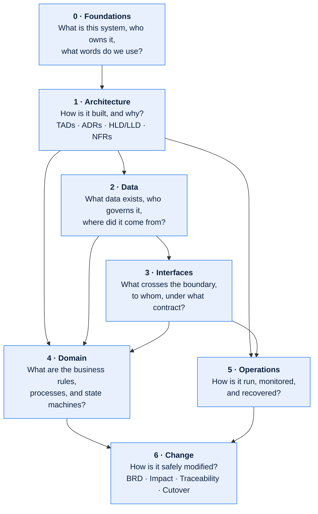
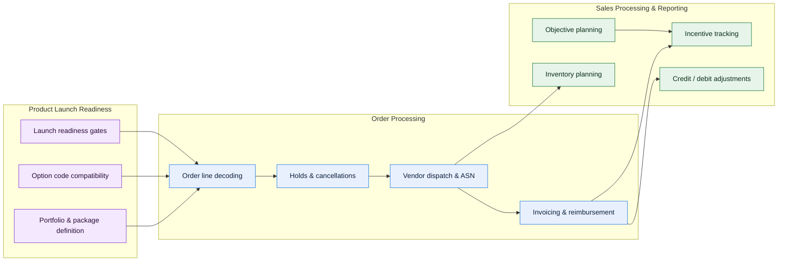

# Technical Documentation Template

A documentation system for **complex, data-intensive, disaggregated platforms** — the kind
with decades of accumulated business rules, dozens of batch jobs, a long tail of external
partners, and three or four business domains sharing one database.

It exists because that class of system defeats ordinary documentation. A wiki page per
subject produces a thousand pages nobody trusts. This repository instead defines a small
number of **document types**, each with a fixed shape, a stated owner, and an explicit place
in a dependency graph — so a reader can start anywhere and navigate to the answer.

---

## What is in here

| Directory | Contents |
| --- | --- |
| [`guides/`](guides/) | How to write, review, diagram, and govern documents in this system. Read [`guides/00-how-to-use-this-repo.md`](guides/00-how-to-use-this-repo.md) first. |
| [`templates/`](templates/) | 58 blank document templates, grouped by layer (foundations → architecture → data → interfaces → domain → operations → change). Copy, don't edit in place. |
| [`examples/meridian/`](examples/meridian/) | A complete worked example: **Meridian**, a fictional 30-year-old order-to-cash and portfolio management platform. 22 documents filled in against it, at the depth real documentation needs. |
| [`CATALOG.md`](CATALOG.md) | Generated inventory of every document, with owners, status, and review dates. |
| [`tools/`](tools/) | Zero-dependency Python validators for front matter, document IDs, links, and diagrams. Wired into CI. |
| [`.github/`](.github/) | PR template, documentation issue forms, and the docs-quality workflow. |

---

## The document model

Documents are organised in seven layers. Each layer answers a different question, and each
layer's documents cite the layer above it. This is what keeps a 300-document corpus
navigable: you never need to read across layers to answer a question that lives in one.



### Template index

<!-- BEGIN GENERATED CATALOG -->

#### 0 · Foundations — [`templates/00-foundations/`](templates/00-foundations/)

| Template | Purpose |
| --- | --- |
| [System Profile](templates/00-foundations/system-profile.md) | The one-page answer to "what is this thing?" Start every new system here. |
| [Capability Model](templates/00-foundations/capability-model.md) | Business capabilities the system provides, independent of how they are implemented. |
| [Domain Map](templates/00-foundations/domain-map.md) | Bounded contexts, their owners, and the seams between them. |
| [Stakeholder & RACI Matrix](templates/00-foundations/stakeholder-and-raci-matrix.md) | Who decides, who is consulted, who gets paged. |
| [Glossary & Taxonomy](templates/00-foundations/glossary-and-taxonomy.md) | Controlled vocabulary. The single highest-leverage document for a multi-domain system. |

#### 1 · Architecture — [`templates/01-architecture/`](templates/01-architecture/)

| Template | Purpose |
| --- | --- |
| [Technical Architecture Document (TAD)](templates/01-architecture/technical-architecture-document.md) | The anchor architecture artefact. 18 sections, C4 levels 1–3, NFR budgets, failure modes. |
| [Architecture Decision Record (ADR)](templates/01-architecture/architecture-decision-record.md) | One decision, its alternatives, and its consequences. Immutable once accepted. |
| [High-Level Design (HLD)](templates/01-architecture/high-level-design.md) | Solution shape for a single initiative or epic. |
| [Low-Level Design (LLD)](templates/01-architecture/low-level-design.md) | Implementation-grade detail: classes, schemas, algorithms, error handling. |
| [Component Specification](templates/01-architecture/component-specification.md) | A deployable/runnable unit and its contract with the rest of the system. |
| [Integration Architecture](templates/01-architecture/integration-architecture.md) | Patterns, middleware, topology, and the integration inventory. |
| [Batch & Scheduling Architecture](templates/01-architecture/batch-and-scheduling-architecture.md) | Job graph, critical path, windows, restart/recovery semantics. |
| [NFRs & Quality Attributes](templates/01-architecture/nfr-and-quality-attributes.md) | Measurable budgets with scenarios, not adjectives. |
| [Security & Privacy Architecture](templates/01-architecture/security-and-privacy-architecture.md) | Trust boundaries, threat model, controls, data protection. |
| [Resilience & Failure Mode Analysis](templates/01-architecture/resilience-and-failure-mode-analysis.md) | FMEA for distributed/batch systems, with blast radius and detection. |
| [Deployment & Environments](templates/01-architecture/deployment-and-environments.md) | Topology, environment parity, promotion path, config management. |
| [Legacy System Archaeology](templates/01-architecture/legacy-system-archaeology.md) | For undocumented code: how to excavate behaviour and record findings with confidence levels. |
| [Modernization Roadmap](templates/01-architecture/modernization-roadmap.md) | Sequenced decomposition of a monolith with seams, strangler slices, and exit criteria. |
| [Architecture Review Checklist](templates/01-architecture/architecture-review-checklist.md) | Gate criteria applied before a TAD or HLD is approved. |

#### 2 · Data — [`templates/02-data/`](templates/02-data/)

| Template | Purpose |
| --- | --- |
| [Data Governance Charter](templates/02-data/data-governance-charter.md) | Operating model: roles, decision rights, forums, policies, and how compliance is measured. |
| [Data Domain Charter](templates/02-data/data-domain-charter.md) | Per-domain scope, stewardship, authoritative sources, and quality targets. |
| [Data Dictionary](templates/02-data/data-dictionary.md) | Attribute-level definitions with types, rules, classification, and lineage pointers. |
| [Canonical Data Model](templates/02-data/canonical-data-model.md) | The shared conceptual/logical model and its mappings to each physical store. |
| [Data Lineage Document](templates/02-data/data-lineage-document.md) | End-to-end field-level lineage with transformation logic and control points. |
| [Reference Data & Code Set Registry](templates/02-data/reference-data-and-code-set-registry.md) | Code sets, their authority, versioning, and effective-dating rules. |
| [Data Quality Rules & Controls](templates/02-data/data-quality-rules-and-controls.md) | Executable rules mapped to dimensions, thresholds, and remediation owners. |
| [Data Contract](templates/02-data/data-contract.md) | A binding producer↔consumer agreement on schema, semantics, SLA, and change process. |
| [Master Data Management](templates/02-data/master-data-management.md) | Golden record policy, survivorship, matching, and stewardship workflow. |
| [Metric & KPI Definition Catalog](templates/02-data/metric-and-kpi-definition-catalog.md) | Unambiguous metric definitions so two reports cannot disagree. |
| [Retention, Classification & Privacy](templates/02-data/data-retention-classification-and-privacy.md) | Classification scheme, retention schedule, subject rights, and disposal evidence. |
| [Data Issue & Remediation Log](templates/02-data/data-issue-and-remediation-log.md) | Standing register of known data defects and their containment. |

#### 3 · Interfaces — [`templates/03-interfaces/`](templates/03-interfaces/)

| Template | Purpose |
| --- | --- |
| [Interface Catalog](templates/03-interfaces/interface-catalog.md) | The register of every boundary crossing. One row per interface. |
| [Interface Control Document (ICD)](templates/03-interfaces/interface-control-document.md) | The definitive contract for one interface: payload, semantics, errors, SLA, versioning. |
| [API Specification](templates/03-interfaces/api-specification.md) | Synchronous request/response interfaces, auth, idempotency, pagination, errors. |
| [File & Batch Interface Specification](templates/03-interfaces/file-and-batch-interface-specification.md) | Fixed-width/delimited/EDI files, transport, control totals, reconciliation. |
| [Event & Message Contract](templates/03-interfaces/event-and-message-contract.md) | Async events: schema, keys, ordering, delivery semantics, replay. |
| [External Dependency Register](templates/03-interfaces/external-dependency-register.md) | Every third party you rely on, with criticality, SLA, and failure posture. |
| [Partner Onboarding & Certification](templates/03-interfaces/partner-onboarding-and-certification.md) | Repeatable path from "new vendor" to "in production". |
| [SLA, OLA & Support Model](templates/03-interfaces/sla-ola-and-support-model.md) | Commitments, measurement method, escalation, and remedies. |

#### 4 · Domain — [`templates/04-domain/`](templates/04-domain/)

A **domain pack** is the six documents below, produced together for one bounded context.

| Template | Purpose |
| --- | --- |
| [Domain Overview](templates/04-domain/domain-overview.md) | Scope, actors, capabilities, and the domain's place in the whole. |
| [Business Process Flow](templates/04-domain/business-process-flow.md) | End-to-end process with swimlanes, decision points, exceptions, and timings. |
| [Business Rules Catalog](templates/04-domain/business-rules-catalog.md) | Atomic, testable, individually-identified rules with source of authority. |
| [State Model & Lifecycle](templates/04-domain/state-model-and-lifecycle.md) | Entity states, legal transitions, guards, and terminal states. |
| [Domain Data Entities](templates/04-domain/domain-data-entities.md) | The entities the domain owns and the ones it merely reads. |
| [Domain Interface Map](templates/04-domain/domain-interface-map.md) | Everything the domain sends and receives, keyed to the interface catalog. |

#### 5 · Operations — [`templates/05-operations/`](templates/05-operations/)

| Template | Purpose |
| --- | --- |
| [Runbook](templates/05-operations/runbook.md) | Procedures an on-call engineer executes at 03:00 without context. |
| [Job Schedule Catalog](templates/05-operations/job-schedule-catalog.md) | Every scheduled job, its dependencies, window, and failure action. |
| [Monitoring & Alerting](templates/05-operations/monitoring-and-alerting.md) | Signals, thresholds, alert routes, and the dashboards that back them. |
| [Incident Response & Postmortem](templates/05-operations/incident-response-and-postmortem.md) | Severity ladder, roles, comms, and a blameless postmortem structure. |
| [Disaster Recovery & Continuity](templates/05-operations/disaster-recovery-and-continuity.md) | RTO/RPO per capability, recovery runbooks, and test evidence. |
| [Release & Change Management](templates/05-operations/release-and-change-management.md) | Change classes, approval gates, deployment and rollback procedures. |
| [Capacity & Performance Plan](templates/05-operations/capacity-and-performance-plan.md) | Demand model, headroom, seasonal peaks, and scaling triggers. |

#### 6 · Change — [`templates/06-change/`](templates/06-change/)

| Template | Purpose |
| --- | --- |
| [Business Requirements Document](templates/06-change/business-requirements-document.md) | Problem, outcomes, scope, and measurable acceptance criteria. |
| [Functional Specification](templates/06-change/functional-specification.md) | Behaviour to build, expressed as rules, screens, interfaces, and data effects. |
| [Impact Assessment](templates/06-change/impact-assessment.md) | Blast radius across components, data, interfaces, reports, and partners. |
| [Requirements Traceability Matrix](templates/06-change/requirements-traceability-matrix.md) | Requirement → design → code → test → evidence, in one grid. |
| [Test Strategy & UAT Plan](templates/06-change/test-strategy-and-uat-plan.md) | Levels, environments, data strategy, entry/exit criteria. |
| [Cutover & Migration Plan](templates/06-change/cutover-and-migration-plan.md) | Minute-by-minute runsheet, reconciliation, rollback, and hypercare. |

<!-- END GENERATED CATALOG -->

---

## The worked example: Meridian

Blank templates teach structure. They do not teach *depth* — how much detail a lineage
document actually needs, or what a business rule looks like when it has survived four
re-platformings.

[`examples/meridian/`](examples/meridian/) documents a fictional platform with exactly the
characteristics this repository targets: 30 years old, three business domains on one shared
database, a decoding engine at its heart, ~200 batch jobs, and 40+ external partners.



Highlights worth reading even if you never use the templates:

- [**TAD — Order Processing**](examples/meridian/01-architecture/tad-order-processing.md) — a complete technical architecture document for a legacy subsystem: C4 levels 1–3, NFRs measured against reality (three of them not met), ten failure modes with a silent-failure analysis, and a technical debt register grounded in incident history.
- [**Data Lineage — Order to Cash**](examples/meridian/02-data/lineage-order-to-cash.md) — field-level lineage across nine hops from order capture to general ledger, with four grain changes called out, the 9.7% exclusion that explains most of the gap between orders placed and orders invoiced, and per-hop reconciliation controls.
- [**Data Lineage — Sales Incentive Payout**](examples/meridian/02-data/lineage-sales-incentive-payout.md) — the harder case: a derived, restated, retroactively adjusted metric, including a reproducibility test that *failed* for 41 of 200 sampled dealers.
- [**Data Governance Charter**](examples/meridian/02-data/data-governance-charter.md) — decision rights with SLAs and an automatic deadlock escalation, column-level ownership of six contested cross-domain columns, and one objective that has not moved in two years, stated as unmet rather than quietly dropped.
- [**ICD — Vendor Dispatch Outbound**](examples/meridian/03-interfaces/icd-vendor-dispatch-outbound.md) — a full EDI 850 contract: field specification, three-level acknowledgement semantics, control totals, error catalog, and 14 certification scenarios.
- [**Legacy System Archaeology — Order Decoder**](examples/meridian/01-architecture/legacy-system-archaeology-order-decoder.md) — how behaviour was recovered from 41,000 lines of undocumented COBOL, with a confidence level and evidence on every finding, including a non-determinism defect that four SMEs and two code readers had missed.
- [**Runbook — Nightly Order Cycle**](examples/meridian/05-operations/runbook-nightly-order-cycle.md) — a 03:00 procedure with scope assessment before action, financial-risk warnings before mutating steps, and an execution log recording where it was found wrong.

---

## Getting started

### Documenting a new system

```bash
git clone <this-repo> && cd technical-documentation-template

# 1. Create a home for your system.
mkdir -p systems/<your-system>/{00-foundations,01-architecture,02-data,03-interfaces,04-domain,05-operations,06-change}

# 2. Start with the profile — it takes an hour and orients everything else.
cp templates/00-foundations/system-profile.md systems/<your-system>/00-foundations/

# 3. Then the glossary. In a multi-domain system this is the highest-value hour you will spend.
cp templates/00-foundations/glossary-and-taxonomy.md systems/<your-system>/00-foundations/

# 4. Validate as you go.
python3 tools/validate_docs.py systems/<your-system>
```

Suggested order of attack for a large legacy system is in
[`guides/06-documenting-legacy-systems.md`](guides/06-documenting-legacy-systems.md). The
short version: **profile → glossary → domain map → interface catalog → domain packs →
TAD → lineage**. Resist starting with the TAD; you will not know enough to write it.

### Documenting a change to an existing system

Start at [`templates/06-change/impact-assessment.md`](templates/06-change/impact-assessment.md)
and let it tell you which existing documents you are obliged to update.

---

## Conventions in one screen

- **Every document carries YAML front matter.** Schema and the document-ID registry are in
  [`guides/03-front-matter-schema.md`](guides/03-front-matter-schema.md). CI rejects
  documents that lack it.
- **Every document has one accountable owner** — a named role, never "the team".
- **Every document states its review cadence** and its last review date. A document past
  its review date is flagged by CI as stale, not silently trusted.
- **Diagrams are Mermaid, in-repo, in the same file as the prose.** No binary diagram
  files, no external drawing tools, no screenshots of whiteboards.
  See [`guides/02-diagram-conventions.md`](guides/02-diagram-conventions.md).
- **Assertions about legacy behaviour carry a confidence level** — `Verified`, `Inferred`,
  or `Assumed` — with the evidence that supports them. This convention is the difference
  between documentation people trust and documentation people re-derive.
- **Templates are copied, never edited in place.** Improvements to a template are a PR
  against `templates/`.

---

## Validation

```bash
python3 tools/validate_docs.py .                      # front matter, IDs, links, diagrams
python3 tools/validate_docs.py . --stale-report       # documents past their review date
python3 tools/validate_docs.py . --impact TAD-OPS-001 # downstream dependency traversal
python3 tools/build_catalog.py .                      # regenerate CATALOG.md
```

Both are standard-library Python 3.9+, no install step. They run on every pull request via
[`.github/workflows/docs-quality.yml`](.github/workflows/docs-quality.yml), which also posts
the downstream impact of each changed document to the PR summary.

Rules enforced, and how to extend them: [`tools/README.md`](tools/README.md).

---

## Contributing

See [`CONTRIBUTING.md`](CONTRIBUTING.md). In brief: templates change by PR with a rationale,
examples must stay internally consistent, and any new document type needs an entry in the
front-matter registry plus a validator rule.
