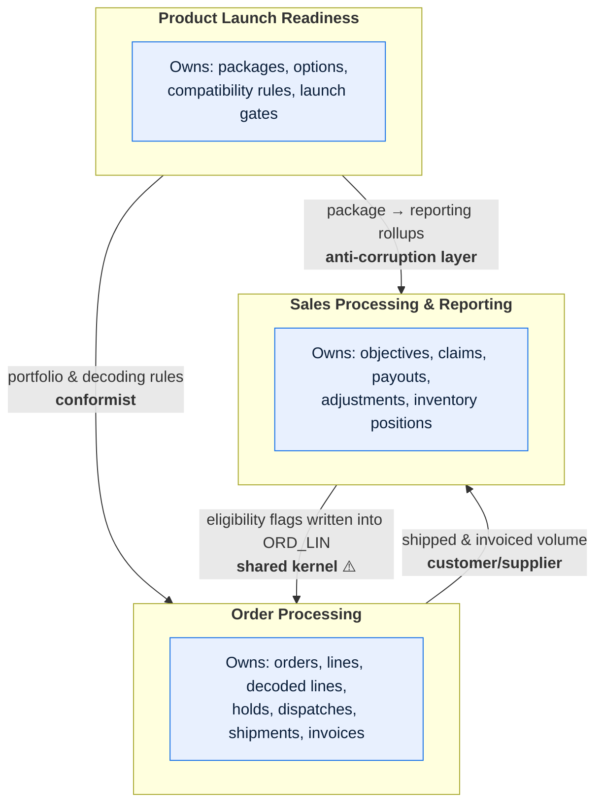
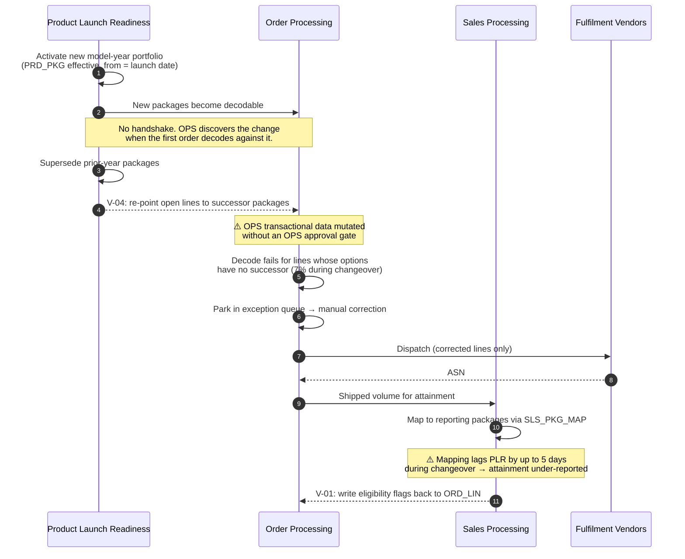

# Meridian — Domain Map

---

## Contents

| Section | Summary |
| --- | --- |
| [1. Domains](#1-domains) | PLR, OPS, and SPR — purpose, owners, and the entities each owns |
| [2. Domain map](#2-domain-map) | Relationships between the three domains, typed and assessed |
| [3. Context boundaries and translation](#3-context-boundaries-and-translation) | Terms whose meaning changes across domains, with translation rules |
| [4. Shared data](#4-shared-data) | Shared tables, including the SPR write into OPS-owned `ORD_LIN` |
| [5. Domain interaction sequence](#5-domain-interaction-sequence) | Model-year changeover traced across all three domains |
| [6. Domain boundary health](#6-domain-boundary-health) | Boundary symptoms assessed against 24 months of change and incident history |
| [7. Domain pack index](#7-domain-pack-index) | Domain-pack document status per domain |
| [Change log](#change-log) | Version, date, author, change |

---

## 1. Domains

| Domain | Code | Purpose | Business owner | Technical owner | Core entities owned |
| --- | --- | --- | --- | --- | --- |
| Product Launch Readiness | `PLR` | Define the sellable portfolio: models, packages, options, compatibility rules, and launch gates | Director, Portfolio Management | Meridian Squad 3 | `PRD_PKG`, `PRD_OPT`, `PRD_PKG_OPT`, `PRD_LNCH` |
| Order Processing | `OPS` | Decode, validate, hold, dispatch, confirm, invoice, and reimburse orders | VP, Order Operations | Meridian Squad 1 | `ORD_HDR`, `ORD_LIN`, `ORD_LIN_DEC`, `ORD_HLD`, `DSP_INS`, `SHP_CNF`, `INV_LIN` |
| Sales Processing & Reporting | `SPR` | Plan objectives, track incentives, plan inventory, and process credits and debits | Director, Sales Operations | Meridian Squad 2 | `SLS_OBJ`, `SLS_ICL`, `SLS_IPY`, `SLS_ADJ`, `INV_POS` |

Finance (`FIN`) and Vendor Integration (`VND`) are **not** separate domains — they are
capability areas within OPS. They have their own scope codes for document IDs because their
documents have different owners and audiences, but they do not own data.

---

## 2. Domain map

> **Caption:** Three of the four relationships are healthy. The fourth — SPR writing
> eligibility flags directly into OPS-owned `ORD_LIN` — is a shared kernel that nobody
> chose, and it is the source of the coupling problems in §4.

| Relationship | Type | Why | Implication |
| --- | --- | --- | --- |
| PLR → OPS | **Conformist** | OPS reads PLR's package model as-is and has no say in its shape | PLR changes propagate to OPS with no insulation. A retired option code breaks decode the same night. |
| OPS → SPR | **Customer/supplier** | SPR depends on OPS output and has negotiating power through the quarterly data contract | Changes are agreed. This relationship works. |
| SPR → OPS | **Shared kernel** ⚠️ | SPR writes `INCTV_ELIG_FL` and `SLS_OBJ_CD` into OPS's `ORD_LIN` | Highest coupling in the system. Neither team can change `ORD_LIN` alone. See §4.1. |
| PLR → SPR | **Anti-corruption layer** | SPR translates PLR packages into its own reporting rollups via `SLS_PKG_MAP` | Insulated, at the cost of maintaining the mapping — which drifts; see §3. |

---

## 3. Context boundaries and translation

> Terms that mean different things in different domains. The bare term is banned from
> Meridian documentation; use the qualified form.

| Term | PLR meaning | OPS meaning | SPR meaning | Translation rule | Implemented in | Confidence |
| --- | --- | --- | --- | --- | --- | --- |
| **Package** | `plr.package` — a marketable bundle of option codes, valid for one model year, identified by `PRD_PKG.PKG_CD` | `ops.decoded_package` — the set of option rows produced on `ORD_LIN_DEC` from a package at decode time | `spr.reporting_package` — a rollup group used for objective attainment, one-to-many with PLR packages | `plr.package` → `ops.decoded_package`: expand via `PRD_PKG_OPT` at the line's decode date. `plr.package` → `spr.reporting_package`: lookup `SLS_PKG_MAP` | `ORDDEC01`, `SLSELG03` | ✅ Verified |
| **Order date** | — | `ops.order_date` — the timestamp the dealer submitted, UTC | `spr.objective_date` — the date the order was *accepted into* an objective period; may differ by up to 5 business days | `spr.objective_date = ops.order_date` unless the order was held at period close, in which case it is the hold release date | `SLSELG03:210-268` | ✅ Verified |
| **Unit** | `plr.unit` — one model/package combination in the catalogue | `ops.unit` — one order line | `spr.unit` — one line counted toward an objective; **excludes** fleet, demo, internal transfer, and cancelled-after-ship | See [MET-SPR-001](../02-data/metric-catalog-sales-reporting.md) for the certified definition | `SLSELG03`, warehouse semantic layer | ✅ Verified |
| **Active** | `plr.active` — within the launch window and not superseded | `ops.active` — order not in a terminal state | `spr.active` — dealer has an objective in the current period | No translation; the term is banned unqualified | — | ✅ Verified |
| **Cancelled** | — | `ops.cancelled` — order line in state `Cancelled`, regardless of whether it shipped | `spr.cancelled` — reversed from attainment, which only applies if cancellation occurred **before** invoicing | A line cancelled after invoicing is `ops.cancelled` but is **not** `spr.cancelled`; it generates a credit adjustment instead | `SLSADJ05` | 🟡 Inferred — consistent with observed data and with Sales Finance's description, but not traced in code |

**Why the differences exist.** *Order date* diverged in 2011 when Sales Operations
successfully argued that orders held through a period boundary for reasons outside the
dealer's control should not count against them. *Unit* diverged progressively as exclusions
were added for fleet (2008), demo (2013), and internal transfer (2019). None of these were
mistakes; they are legitimate domain differences that were simply never written down.

**Defects caused by this ambiguity**

| Incident | Term | What happened |
| --- | --- | --- |
| INC-2024-0891 | *unit* | A new dealer dashboard used `ops.unit` while the incentive statement used `spr.unit`. 340 dealers saw a higher number on the dashboard than they were paid on. 11 formal disputes. |
| INC-2025-0203 | *order date* | A quarter-end report grouped by `ops.order_date`, moving USD 1.9M of attainment into the wrong quarter. Detected at close; 3 days of reconciliation. |
| INC-2026-0117 | *cancelled* | A data-quality rule written by OPS flagged SPR's adjustment records as orphans, generating 2,100 false positives over five weeks before anyone investigated. |

---

## 4. Shared data

| Entity / table | Owning domain | Written by | Read by | Coupling risk | Notes |
| --- | --- | --- | --- | --- | --- |
| `ORD_LIN` | OPS | OPS (order entry, `ORDDEC01`) + **SPR** (`SLS-ELIG-090`) | OPS, SPR, FIN, warehouse | **High** | Two domains write. See §4.1 |
| `PRD_PKG`, `PRD_PKG_OPT` | PLR | PLR only | OPS, SPR | Medium | Read-only elsewhere; writes outside PLR would be a defect and none are known |
| `DLR_MST` | — *(projection of ERP)* | `IF-014` load only | All three | Medium | No Meridian domain owns it; ERP is authoritative |
| `SHP_CNF` | OPS | OPS (`ASN-INGEST-060`) | OPS, SPR | Medium | SPR reads ship dates for incentive eligibility with no contract until 2025 |
| `INV_POS` | SPR | SPR | OPS (expedite decisions) | Low | Read-only in OPS |
| `INV_LIN` | OPS | OPS (`FIN-INVOICE-070`) | SPR, FIN, warehouse | Medium | Financially material; changes need SOX assessment |

### 4.1 Cross-domain write violations

> Places where a domain writes data another domain owns. None of these are hypothetical —
> each was found during the 2026-03 schema audit. This list **is** the coupling backlog.

| # | Writer | Target | Why it happens | Risk | Remediation owner | Confidence |
| --- | --- | --- | --- | --- | --- | --- |
| V-01 | SPR (`SLS-ELIG-090`) | `ORD_LIN.INCTV_ELIG_FL` | Eligibility is computed nightly from SPR rules but stored on the OPS row for query convenience, a 2007 decision | High — an OPS schema change breaks SPR silently; an SPR logic change alters data OPS considers its own | Order Data Steward + Sales Data Steward | ✅ Verified |
| V-02 | SPR (order entry default) | `ORD_LIN.SLS_OBJ_CD` | Objective code is defaulted from the dealer profile at capture, then overwritten by SPR at period close | High — the field means two different things at different times of its life | Sales Data Steward | ✅ Verified |
| V-03 | OPS (`ORDDSP01`) | `INV_POS.PLND_QTY` | Dispatch decrements planned inventory directly rather than emitting an event | Medium — SPR's position can be wrong if dispatch is later reversed | Order Management Architecture Lead | ✅ Verified |
| V-04 | PLR (changeover script) | `ORD_LIN.MDL_PKG_CD` | An annual script re-points open order lines from superseded packages to successors | **High** — mutates OPS transactional data with no OPS approval gate; implicated in INC-2025-0412 | Portfolio Management Lead | ✅ Verified |
| V-05 to V-31 | Various | Various | 27 further paths, mostly reporting-driven reads that also write a "last accessed" marker | Low | Data Governance Lead | 🟡 Inferred — found by static analysis of SQL in 1,840 programs; not all confirmed as still active (see `SYS-MER-001` Q-003) |

**Cross-domain write rule** *(adopted 2026-04, forward-looking)*

> A domain may write only to tables it owns, or to columns explicitly delegated to it in
> [`DGC-MER-001 §3.3`](../02-data/data-governance-charter.md). Existing violations V-01 to
> V-31 are grandfathered with named remediation owners; **no new ones are permitted**, and
> the schema audit is re-run each release to detect them.

---

## 5. Domain interaction sequence

> The model-year changeover scenario, because it crosses all three domains and is where the
> boundaries are under most stress.

**Where this fails:** steps 3–5. PLR's supersession is a one-way broadcast, OPS absorbs the
consequences in its exception queue, and SPR's mapping has not caught up. All three
domains experience it as "the other team's problem", which is exactly what a conformist
relationship with no anti-corruption layer produces.

---

## 6. Domain boundary health

> Symptoms assessed from 24 months of change and incident history.

| Boundary | Symptom | Present | Evidence |
| --- | --- | --- | --- |
| PLR ↔ OPS | Changes in one routinely require changes in the other | **Yes** | 14 of 31 PLR reference-data changes in 2025 required an OPS code or data fix within 5 days |
| PLR ↔ OPS | Incidents in one are first detected by the other | **Yes** | 9 of 11 PLR-caused incidents were reported by Order Operations, not by PLR monitoring |
| OPS ↔ SPR | The same concept stored in both with divergent values | **Yes** | `ops.unit` vs `spr.unit`; INC-2024-0891 |
| OPS ↔ SPR | Neither team can explain the other's use of a shared field | **Partially** | `INCTV_ELIG_FL`: OPS engineers could not state when it is set or by what rule (2026-03 interviews, 4 of 6 asked) |
| OPS ↔ SPR | A single release train is required across both | No | Independent since 2019 |
| PLR ↔ SPR | Concept drift in the mapping | **Yes** | `SLS_PKG_MAP` had 47 unmapped PLR packages at the 2025 changeover peak |

**Assessment.** The PLR ↔ OPS boundary is the weakest. PLR behaves as an upstream authority
with no obligation to its consumer, and OPS has no anti-corruption layer to absorb change.
The recommended remediation — a versioned, effective-dated portfolio contract between PLR
and OPS with a notice period — is the highest-value structural change available, and is
carried in `MOD-MER-001` as slice 1.

---

## 7. Domain pack index

| Domain | Overview | Process | Rules | States | Entities | Interfaces |
| --- | --- | --- | --- | --- | --- | --- |
| PLR | [DOM-PLR-001](../04-domains/product-launch-readiness.md) | Planned Q1 2027 | In `DOM-PLR-001 §8` | Planned | Planned | In `DOM-PLR-001 §9` |
| OPS | [DOM-OPS-001](../04-domains/order-processing.md) | In `DOM-OPS-001 §7` | In `DOM-OPS-001 §8` | In `DOM-OPS-001 §6` | Planned | In `DOM-OPS-001 §9` |
| SPR | [DOM-SPR-001](../04-domains/sales-processing-and-reporting.md) | In `DOM-SPR-001 §6` | In `DOM-SPR-001 §7` | Planned | Planned | In `DOM-SPR-001 §8` |

> Full six-document packs are not yet written for any domain. The overviews carry a
> compressed version of each section. This is the honest state of the corpus, and stating
> it prevents a reader from concluding that an absent document means an absent concern.

---

## Change log

| Version | Date | Author | Change |
| --- | --- | --- | --- |
| 2.1.0 | 2026-06-18 | Platform Architecture | Added §4.1 V-01 to V-31 from the 2026-03 schema audit; added the cross-domain write rule; added §6 boundary health assessment |
| 2.0.0 | 2025-09-04 | Platform Architecture | Added §3 context translation after INC-2024-0891 and INC-2025-0203 |
| 1.0.0 | 2024-05-30 | Documentation Working Group | Initial domain map |
