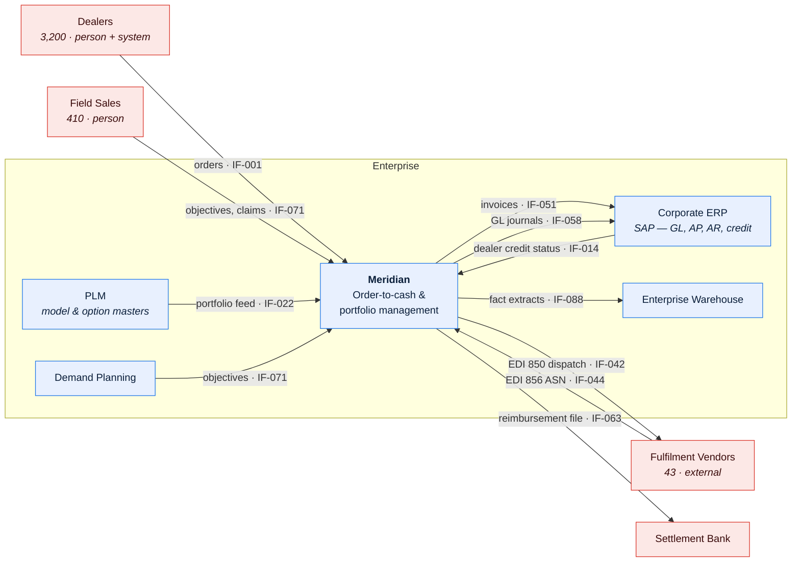
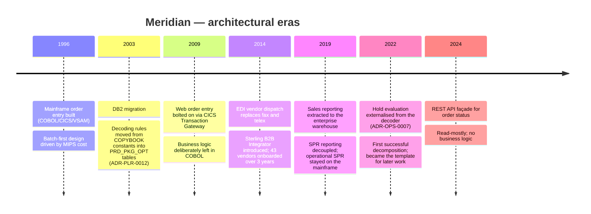

# Meridian — System Profile

## 1. At a glance

| Attribute | Value |
| --- | --- |
| System name | Meridian |
| Short code | `MER` |
| Aliases / former names | OMS-2, "the mainframe", ORDSYS, Project Lighthouse (1994–96 build) |
| Business criticality | **Tier 1** |
| Primary business purpose | Decode dealer orders against the product portfolio, dispatch them to fulfilment vendors, invoice on shipment, and settle sales incentives |
| Domains supported | Product Launch Readiness · Order Processing · Sales Processing & Reporting |
| First in production | 1996-04 |
| Current release train | `R2026.09` (6-weekly) |
| Owning business function | Commercial Operations |
| Owning engineering team | Meridian Platform Engineering (17 engineers across 3 squads) |
| Operating model | Online 06:00–22:00 UTC · batch 22:00–05:00 UTC · vendor gateway 24×7 |
| Annual run cost | ≈ USD 14.2M (mainframe MIPS 51%, distributed 22%, licences 18%, other 9%) |
| Strategic disposition | **Contain** — invest only in decoupling; target-state direction in `MOD-MER-001` |

> Aliases matter. Four names for this system appear in current documents, tickets, and
> firewall rules, and someone searching for "ORDSYS" will otherwise find nothing.

---

## 2. Criticality and business impact

| Outage duration | Business consequence | Financial exposure |
| --- | --- | --- |
| 1 hour (business hours) | Dealers cannot submit orders; field sales cannot see status. Orders queue at the portal. | ≈ USD 90k deferred revenue; no permanent loss |
| 4 hours | Above, plus intra-day expedite requests cannot be actioned. Manual workaround absorbs ~8% of normal volume. | ≈ USD 360k deferred; ~200 expedites missed |
| 1 business day | **Vendor dispatch cutoff at 03:00 UTC missed.** ~18,000 orders slip a full fulfilment day. Contractual lead-time breaches with 11 of 43 vendors. | ≈ USD 2.1M deferred revenue, USD 140k contractual credits |
| 1 week | Order backlog exceeds vendor catch-up capacity. Month-end invoicing and incentive settlement at risk. Dealer confidence impact. | ≈ USD 15M+ deferred; unquantified relationship damage |

**Seasonal sensitivity**

| Period | Driver | Effect |
| --- | --- | --- |
| Model-year changeover (mid-Aug to late Sep) | New portfolio activates; superseded packages retire | Order volume ×2.4; decode failure rate rises from 1.8% to ~7%; PLR reference data changes daily |
| Month-end (last 3 business days) | Dealer ordering to hit objective thresholds | Order volume ×1.9; batch window utilisation peaks |
| Quarter-end (Mar/Jun/Sep/Dec) | Incentive settlement | `SLS-INCENTIVE-100` runtime ×3.1; credit/debit adjustment volume ×6 |
| Year-end (late Dec) | Financial close plus reduced vendor staffing | Both of the above, with a 4-day change freeze |

**Regulatory / audit relevance**

| Obligation | Why Meridian is in scope |
| --- | --- |
| SOX — revenue recognition | Invoice generation (`FIN-INVOICE-070`) and GL posting (`FIN-GL-080`) are key controls; the order-to-cash lineage is walkthrough evidence |
| Sales & use tax | Tax determination inputs originate from decoded order lines |
| Trade compliance — export screening | Dealer and destination screening occurs at hold evaluation (`ORD-HOLD-030`) |
| Dealer franchise regulation (3 jurisdictions) | Order allocation fairness and incentive calculation are auditable by regulators |

---

## 3. Context

> **Caption:** Meridian sits between 3,200 dealers on the demand side and 43 fulfilment
> vendors on the supply side, and is the system of record for order state from submission
> through to GL posting. Nothing else in the estate can answer "where is this order?".

---

## 4. What it does

| # | Capability | Domain | Volume (typical / peak) | Criticality |
| --- | --- | --- | --- | --- |
| C1 | Portfolio and package definition | PLR | 340 packages active / 1,100 during changeover | Tier 1 |
| C2 | Option compatibility validation | PLR | 2,900 rules evaluated per decode | Tier 1 |
| C3 | Launch readiness gating | PLR | ~40 launches/year | Tier 2 |
| C4 | Order capture | OPS | 18,200/day / 62,000/day | Tier 1 |
| C5 | Order line decoding | OPS | 95,000 lines/day / 310,000/day | Tier 1 |
| C6 | Hold evaluation and release | OPS | 11,400 holds applied/day | Tier 1 |
| C7 | Cancellation and amendment | OPS | 2,100/day | Tier 2 |
| C8 | Delivery expediting | OPS | 190/day / 800/day | Tier 2 |
| C9 | Vendor dispatch and ASN reconciliation | OPS | 17,600 dispatches/night | Tier 1 |
| C10 | Invoicing | OPS/FIN | 16,900 invoice lines/night | Tier 1 |
| C11 | Reimbursement processing | OPS/FIN | 4,300 claims/week | Tier 2 |
| C12 | Sales objective planning | SPR | 3,200 dealer objectives/quarter | Tier 2 |
| C13 | Incentive tracking and payout | SPR | USD 41M/quarter settled | Tier 1 |
| C14 | Inventory position and planning | SPR | 1.4M unit-positions recalculated nightly | Tier 2 |
| C15 | Credit / debit adjustment | SPR/FIN | 8,900/quarter | Tier 2 |

### What it explicitly does **not** do

| Commonly assumed capability | Actually provided by |
| --- | --- |
| Pricing and discount calculation | Corporate ERP. Meridian receives net price per line on the portfolio feed and never computes it. |
| Dealer credit limit setting | Corporate ERP credit module. Meridian consumes a status code (`IF-014`) and applies holds. |
| Physical inventory and warehousing | Vendor systems. Meridian holds *planned* positions, not stock on hand. |
| Payment execution | Settlement bank. Meridian produces a payment instruction file (`IF-063`). |
| Tax calculation | Corporate ERP tax engine, on Meridian's invoice extract. |
| Master product data | PLM. Meridian holds a projection with local decoding attributes. |
| Dealer master data | Corporate ERP. Meridian holds a cached subset; see `DGC-MER-001 §3.3`. |

> This table resolves more misunderstandings than any other page in this document. "Why is
> the price wrong in Meridian?" is answered here.

---

## 5. Users and stakeholders

| Group | Size | How they interact | Peak usage pattern |
| --- | --- | --- | --- |
| Dealer order administrators | ~7,400 across 3,200 dealers | Web portal, and B2B API for the 180 largest | Weekday 08:00–17:00 local; heavy spike on the last 3 days of the month |
| Field sales | 410 | Web portal (read-heavy), mobile status lookup | Weekday business hours |
| Order Operations | 46 | Green-screen CICS + web exception queues | Follows the batch cycle: heavy 07:00–11:00 UTC clearing overnight exceptions |
| Portfolio Management | 12 | Package maintenance screens | Concentrated in the 8 weeks before model-year changeover |
| Sales Finance | 28 | Reporting, incentive review, adjustment entry | Month-end and quarter-end |
| Vendor Integration | 9 | Monitoring, EDI exception handling | Overnight on-call plus business hours |
| Fulfilment vendors | 43 organisations | EDI only; 4 use a web portal for low volume | Overnight receipt, daytime ASN return |

Full RACI: [`stakeholder-and-raci-matrix`](../../../templates/00-foundations/stakeholder-and-raci-matrix.md)
(not instantiated for this example).

---

## 6. Scale

| Dimension | Normal | Peak | Peak driver | Growth trend |
| --- | --- | --- | --- | --- |
| Orders/day | 18,200 | 62,000 | Month-end + changeover coincidence | +6%/yr |
| Order lines/day | 95,000 | 310,000 | As above | +9%/yr (lines/order rising) |
| Concurrent portal users | 480 | 1,750 | Month-end afternoon | +4%/yr |
| Database size | 41 TB | — | — | +3.4 TB/yr |
| Batch jobs/night | 210 | 227 | Month-end adds 17 | Flat |
| External file transfers/day | 640 | 1,900 | Changeover | +11%/yr |
| Live interfaces | 187 | — | — | +8/yr net |
| External parties | 43 vendors, 3,200 dealers | — | — | Vendors flat; dealers −2%/yr (consolidation) |
| Peak decode throughput | 1,150 lines/min | 1,480 lines/min | — | Constraint — see `BAT-MER-001 §9` |

---

## 7. Technology summary

| Layer | Technology | Version | Support status | Notes |
| --- | --- | --- | --- | --- |
| Presentation | Java / JSP on WebSphere | 9.0.5 | Supported to 2030 | Bolted on in 2009 via CICS Transaction Gateway |
| Presentation (legacy) | CICS 3270 green screen | — | Supported | Still the only route for 14 Order Operations functions |
| API | Spring Boot REST façade | Java 17 | Supported | Added 2024; read-mostly, 3 write endpoints |
| Application | COBOL (Enterprise COBOL 6.3) under CICS | — | Supported to 2029 | ~2.1M lines across 1,840 programs |
| Integration | IBM MQ 9.3 + Sterling B2B Integrator | — | Supported | Vendor gateway |
| Data | DB2 for z/OS 13 | — | Supported | 1,412 tables |
| Data (legacy) | VSAM | — | — | 31 files retained for reference data; see debt `TD-04` |
| Batch/scheduling | IBM Workload Scheduler | 9.5 | **EOL 2028-06** | Migration not yet funded — see `TD-01` |
| Infrastructure | z/OS 2.5 on z16, two sites | — | Supported | |

**End-of-support exposure**

| Component | EOL | Exposure | Mitigation owner | Status |
| --- | --- | --- | --- | --- |
| IBM Workload Scheduler 9.5 | 2028-06 | Scheduler is a single point of failure for all 210 nightly jobs; no supported upgrade path without re-testing every dependency | Platform Engineering Lead | Assessment funded Q1 2027 |
| WebSphere 9.0.5 | 2030-04 | Portal only | Platform Engineering Lead | On roadmap |
| Sterling B2B Integrator 6.1 | 2027-12 | All 43 vendor integrations | Vendor Integration Lead | **Upgrade in flight, target 2027-06** |

---

## 8. Architectural eras

> Knowing which era a component came from predicts how it behaves. Anything from the 1996
> era assumes a nightly cycle and has no concept of partial failure; anything from 2022
> onward has structured logging and can be called independently.

---

## 9. Known characteristics

| Characteristic | Impact | Confidence |
| --- | --- | --- |
| Business rules are split between COBOL and reference data with no clear principle | A rule change takes either 1 day or 6 weeks depending on which side it lands, and nobody can predict which without reading code | ✅ Verified — rule mechanism audited for all 214 catalogued OPS rules, 2026-03 |
| Decoding is the throughput constraint of the entire nightly chain | Every capacity conversation reduces to `ORD-DECODE-020` | ✅ Verified — `BAT-MER-001 §3.1` |
| Three domains share one DB2 schema with 31 documented cross-domain write paths | Any schema change needs three teams' agreement; single-sided changes have caused 4 Sev-2 incidents since 2024 | ✅ Verified — `DMAP-MER-001 §4` |
| Reference data changes are production behaviour changes made outside change control | A portfolio analyst can alter decoding behaviour for all 3,200 dealers with no release, review, or rollback | ✅ Verified — `RDR-PLR-001 §6`, and the root cause of INC-2025-0412 |
| 23 of 210 nightly jobs have no documented restart procedure | Recovery depends on two individuals' knowledge | ✅ Verified — `JSC-MER-001` |
| Historical order lines before 2014-06 cannot be re-decoded under current rules | Historical reporting is not fully reproducible; see `DLN-OPS-001 §7` | 🟡 Inferred — reference data was not effective-dated before the 2014 change; no reproduction attempt has been made |
| The green-screen path bypasses several validations the web path enforces | Order Operations can create states the web path cannot, including some the state model calls illegal | ✅ Verified — 41 illegal transitions observed in production 2026-01 to 2026-06; `DOM-OPS-001 §6` |

**Top 5 operational pain points** *(from 24 months of incident data, not opinion)*

| # | Pain point | Incidents (24m) | Cost |
| --- | --- | --- | --- |
| 1 | Decode failures during model-year changeover | 31 Sev-2/3 | ~2.5 FTE of manual correction over the 6-week window |
| 2 | Vendor ASN not received; dispatch state unresolved | 26 Sev-3 | ~0.8 FTE ongoing |
| 3 | Batch window overrun missing the 03:00 vendor cutoff | 9 Sev-2 | 4 of 9 caused contractual credits |
| 4 | Incentive restatement after late ASN arrival | 7 Sev-2 | Sales Finance rework; dealer disputes |
| 5 | Reference data change with unintended downstream effect | 6 Sev-2 | Highest single-incident cost: INC-2025-0412, USD 310k |

---

## 10. Document map

| Layer | Documents | Status |
| --- | --- | --- |
| 0 · Foundations | [Domain Map](domain-map.md) · Capability Model *(planned Q1 2027)* · Glossary *(in review)* | Partial |
| 1 · Architecture | [TAD — Order Processing](../01-architecture/tad-order-processing.md) · [ADR-OPS-0007](../01-architecture/adr-0007-externalise-hold-evaluation.md) · [ADR-PLR-0012](../01-architecture/adr-0012-package-decoding-rules-as-data.md) · [Batch Architecture](../01-architecture/batch-and-scheduling-architecture.md) · [Decoder Archaeology](../01-architecture/legacy-system-archaeology-order-decoder.md) | TADs for PLR and SPR not yet written |
| 2 · Data | [Governance Charter](../02-data/data-governance-charter.md) · [Order-to-Cash Lineage](../02-data/lineage-order-to-cash.md) · [Incentive Lineage](../02-data/lineage-sales-incentive-payout.md) · [Order Line Dictionary](../02-data/data-dictionary-order-line.md) · [Option Code Registry](../02-data/reference-data-option-codes.md) · [Vendor ASN Contract](../02-data/data-contract-vendor-shipping-confirmation.md) · [Metric Catalog](../02-data/metric-catalog-sales-reporting.md) | Good coverage for OPS/SPR; PLR dictionary outstanding |
| 3 · Interfaces | [Interface Catalog](../03-interfaces/interface-catalog.md) · [ICD — Vendor Dispatch](../03-interfaces/icd-vendor-dispatch-outbound.md) · [Dependency Register](../03-interfaces/external-dependency-register.md) | 31 of 187 interfaces have a full ICD |
| 4 · Domain | [PLR](../04-domains/product-launch-readiness.md) · [OPS](../04-domains/order-processing.md) · [SPR](../04-domains/sales-processing-and-reporting.md) | Overviews complete; full six-document packs outstanding |
| 5 · Operations | [Job Schedule Catalog](../05-operations/job-schedule-catalog.md) · [Nightly Cycle Runbook](../05-operations/runbook-nightly-order-cycle.md) | 22 runbooks exist; 9 cover the top 10 recurring incidents |
| 6 · Change | Per initiative | — |

---

## 11. Open questions

| ID | Question | Owner | Target date |
| --- | --- | --- | --- |
| Q-001 | Can pre-2014 order lines be re-decoded, and if not, what is the earliest reproducible reporting date? | Order Data Steward | 2026-11-30 |
| Q-002 | What is the actual capacity ceiling of `ORD-DECODE-020`? The 1,480 lines/min peak has never been exceeded, so the limit is unmeasured. | Platform Engineering Lead | 2027-01-31 |
| Q-003 | Are all 31 cross-domain write paths still active, or are some dead? | Data Governance Lead | 2026-12-15 |
| Q-004 | What is the recovery plan if IBM Workload Scheduler fails outright before the 2028 EOL migration? | SRE Lead | 2026-10-31 |

---

## Change log

| Version | Date | Author | Change |
| --- | --- | --- | --- |
| 3.2.0 | 2026-07-14 | Documentation Working Group | Annual review. Added §9 characteristic on the green-screen validation bypass (promoted from 🟡 to ✅ after the 2026-H1 transition audit); refreshed volumes and cost |
| 3.1.0 | 2026-02-03 | Platform Architecture | Added Sterling EOL to §7; added Q-004 |
| 3.0.0 | 2025-08-22 | Documentation Working Group | Restructured to the current template; added §8 eras and §4 "does not do" |
| 2.1.0 | 2024-11-11 | Platform Architecture | Added REST façade to §7 |
| 1.0.0 | 2024-02-19 | Documentation Working Group | Initial profile |
