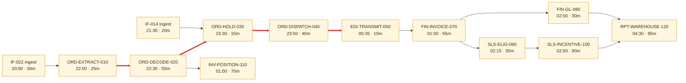
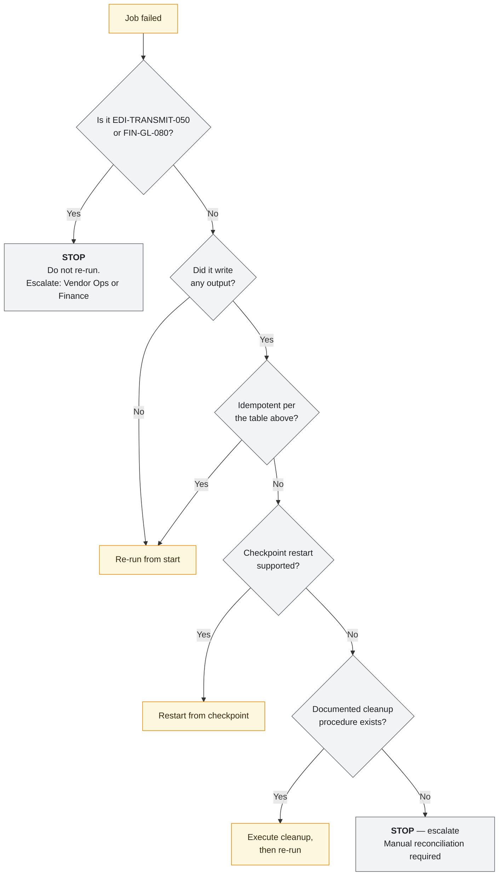

# Meridian — Batch and Scheduling Architecture

> The job graph encodes business sequencing that appears in no other artefact. §3.2 —
> implicit business sequencing — is the section that justifies this document existing
> separately from the TAD.

---

## Contents

| Section | Summary |
| --- | --- |
| [1. Overview](#1-overview) | IBM Workload Scheduler 9.5 (EOL 2028-06), 210 nightly jobs, 5 on the critical path |
| [2. Processing windows](#2-processing-windows) | Pre-load, nightly core, and post-cycle windows against the 03:00 vendor cutoff |
| [3. Job dependency graph](#3-job-dependency-graph) | Critical path from extract to EDI transmission, with slack |
| [4. Job register](#4-job-register) | Summary of the jobs referenced here; full detail in the Job Schedule Catalog |
| [5. Restart, recovery, and re-run semantics](#5-restart-recovery-and-re-run-semantics) | Per-job restart safety, idempotency, and consequence of a double run |
| [6. Failure handling](#6-failure-handling) | Abend, overrun, and upstream-delay handling with escalation |
| [7. Data dependencies](#7-data-dependencies) | Reads, writes, locks, and batch/online contention |
| [8. Scheduling patterns](#8-scheduling-patterns) | Time-, file-, and event-triggered patterns and where each applies |
| [9. Capacity and growth](#9-capacity-and-growth) | Critical-path p95 against cutoff, projecting a changeover breach in 2027 |
| [10. Modernization considerations](#10-modernization-considerations) | Which chains are batch for a genuine constraint versus 1996 MIPS economics |
| [11. Known issues](#11-known-issues) | Standing issues: unversioned scheduler definitions, 23 jobs with no restart procedure |
| [Change log](#change-log) | Version, date, author, change |

---

## 1. Overview

| | |
| --- | --- |
| Scheduler | IBM Workload Scheduler 9.5 — **EOL 2028-06** |
| Total scheduled jobs | 210 (nightly) + 17 (month-end) + 9 (quarter-end) |
| Jobs in the nightly critical path | 5 |
| Longest window | Nightly core, 22:00–03:00 UTC (5h) |
| **Tightest slack** | **1h03m** — nightly core at p95 during model-year changeover |
| Timezone | UTC throughout |
| Daylight saving | **Not observed.** Jobs run at fixed UTC times year-round |
| Calendar source | `MERIDIAN.CALENDAR` — corporate business-day calendar, US + EU holidays merged |
| Schedule definition owner | Platform Engineering Lead |
| Definitions version controlled | ❌ **No** — `TD-11` in `TAD-OPS-001 §17` |

---

## 2. Processing windows

| Window | Opens | Closes | Contents | Hard cutoff | Cutoff driver | Consequence of breach |
| --- | --- | --- | --- | --- | --- | --- |
| Pre-load | 20:00 | 22:00 | PLM portfolio feed, ERP credit feed ingest | 22:00 | Decode needs current reference data | Decode proceeds on yesterday's data; new packages fail (`FM-01`) |
| **Nightly core** | 22:00 | 03:00 | Extract → decode → hold → dispatch → transmit | **03:00** | Vendor master agreement §7.2, all 43 vendors | **Full fulfilment day lost for ~18,000 orders**; contractual credits with 11 vendors |
| Financial | 01:00 | 03:00 | Invoice generation, GL interface | 06:00 | ERP daily close at 06:30 | Invoices slip a day; revenue recognition timing affected at period boundaries |
| Sales | 02:15 | 04:30 | Eligibility, incentive calculation, inventory position | 07:00 | Business day start | Dealer-facing attainment figures stale by one day |
| Reporting | 04:30 | 06:30 | Warehouse fact and dimension extracts | 07:00 | Business day start | Reporting stale by one day |

```mermaid
gantt
    dateFormat HH:mm
    axisFormat %H:%M
    title Nightly processing windows (UTC) — typical durations
    section Pre-load
    PLM portfolio (IF-022)   :p1, 20:00, 30m
    ERP credit (IF-014)      :p2, 21:30, 20m
    section Nightly core
    ORD-EXTRACT-010          :crit, c1, 22:00, 25m
    ORD-DECODE-020           :crit, c2, after c1, 55m
    ORD-HOLD-030             :crit, c3, after c2, 15m
    ORD-DISPATCH-040         :crit, c4, after c3, 40m
    EDI-TRANSMIT-050         :crit, c5, after c4, 10m
    section Financial
    FIN-INVOICE-070          :f1, 01:00, 55m
    FIN-GL-080               :f2, after f1, 30m
    section Sales
    SLS-ELIG-090             :s1, 02:15, 35m
    SLS-INCENTIVE-100        :s2, after s1, 90m
    INV-POSITION-110         :s3, 01:00, 70m
    section Reporting
    RPT-WAREHOUSE-120        :r1, 04:30, 95m
```

**Window contention.** `ORD-DECODE-020` and `INV-POSITION-110` both start at 23:30 and
compete for DB2 buffer pool `BP4`. When nightly volume exceeds ~240,000 lines, decode
elongates by 8–14% because of this contention. The prioritisation rule is that
`ORD-DECODE-020` holds a higher WLM service class; `INV-POSITION-110` is allowed to slip
because its cutoff is 07:00, not 03:00. ✅ Verified — WLM policy `MERIDIAN.BATCH`, and
observed in the 2026-05 month-end.

---

## 3. Job dependency graph

> **Caption:** the critical path (red) is `ORD-EXTRACT-010 → ORD-DECODE-020 → ORD-HOLD-030 →
> ORD-DISPATCH-040 → EDI-TRANSMIT-050`. Everything downstream of `EDI-TRANSMIT-050` has a
> later cutoff and therefore more slack. `ASN-INGEST-060` is absent because it is
> event-triggered throughout the day rather than scheduled.

### 3.1 Critical path analysis

| Step | Job | Typical | p95 | Cumulative (p95) | Notes |
| --- | --- | --- | --- | --- | --- |
| 1 | `ORD-EXTRACT-010` | 25m | 32m | 32m | Scales linearly with order count |
| 2 | `ORD-DECODE-020` | 55m | 72m | 1h44m | **The constraint.** 118m at changeover |
| 3 | `ORD-HOLD-030` | 15m | 22m | 2h06m | Hold Service latency dependent |
| 4 | `ORD-DISPATCH-040` | 40m | 51m | 2h57m | 43 files built serially |
| 5 | `EDI-TRANSMIT-050` | 10m | 14m | 3h11m | Parallel transmission, 43 targets |

| | Value |
| --- | --- |
| Critical path, typical | 2h25m |
| Critical path, p95 | **3h11m** |
| Critical path, changeover p95 | **3h57m** |
| Window available (22:00 → 03:00) | 5h00m |
| Slack, typical | 2h35m |
| Slack, p95 | 1h49m |
| **Slack, changeover p95** | **1h03m** |
| Job most likely to break the window | `ORD-DECODE-020` — 8 of the 9 breaches in 24 months |

> Durations are p95, not averages. The night the window is breached is by definition not an
> average night, and an average-based plan gives false comfort. During changeover the decode
> step alone nearly doubles because option compatibility rules churn and failure rates rise
> from 1.8% to ~7%, each failure costing an exception-routing write.

### 3.2 Implicit business sequencing ⚠️

> The most valuable section in this document. Job ordering encodes business rules that exist
> nowhere else. Each was excavated during the 2025 batch archaeology exercise; each would be
> silently broken by a re-platforming team that treated the graph as a mere dependency list.

| Sequence constraint | Business reason | Consequence if violated | Confidence |
| --- | --- | --- | --- |
| `ORD-HOLD-030` before `ORD-DISPATCH-040` | An order must never be dispatched carrying an unevaluated hold | Trade-compliance (`TC02`) or credit (`CR01`) holds bypassed; goods shipped that should not have been | ✅ Verified — dispatch selects `WHERE hold_eval_ts IS NOT NULL`, `ORDDSP01.CBL:340` |
| `EDI-TRANSMIT-050` before `FIN-INVOICE-070` | **Not** a data dependency — invoicing reads `SHP_CNF`, not the dispatch file. The ordering exists so that a dispatch failure is discovered before any invoice is generated for that cycle. | Invoices generated for a cycle whose dispatch subsequently failed and was rolled back → AR postings for shipments that never happened | 🟡 Inferred — no code enforces it; the dependency is declared in the scheduler only. Confirmed as intentional by the 2003-era operations manual found in the archive |
| `FIN-INVOICE-070` before `SLS-ELIG-090` | Incentive eligibility depends on invoiced status, not shipped status (BR-SPR-014) | Eligibility computed on incomplete data; understated attainment, and a restatement the next night | ✅ Verified — `SLSELG03.CBL:118` reads `INV_LIN` |
| `SLS-ELIG-090` before `SLS-INCENTIVE-100` | Payout is calculated only over eligible lines | Payout over ineligible volume; **financial overpayment** | ✅ Verified |
| `IF-014` credit ingest before `ORD-HOLD-030` | Credit holds must use today's status, not yesterday's | A newly suspended dealer is dispatched to | ✅ Verified |
| `IF-022` portfolio ingest before `ORD-DECODE-020` | Decode must use the current catalogue | New packages fail to decode; superseded packages decode against stale composition | ✅ Verified |
| `FIN-GL-080` after `FIN-INVOICE-070` **on the same calendar date** | GL posting date is derived from the job's run date; splitting them across midnight posts invoice and journal to different accounting periods | Period mismatch between AR and GL; a SOX reconciliation break | ✅ Verified — caused INC-2024-0512 when `FIN-INVOICE-070` overran past 00:00 |
| `INV-POSITION-110` after `ORD-DECODE-020` | Planned positions reflect decoded demand, not raw order lines | Position overstates demand by the decode failure rate (~2%, ~7% at changeover) | ✅ Verified |

> The second row is the instructive one. There is no data dependency between
> `EDI-TRANSMIT-050` and `FIN-INVOICE-070`; a scheduler optimisation that ran them in
> parallel would pass every test and would be correct on every night except the ones where
> dispatch fails. The reasoning survived only in a 2003 operations manual.

---

## 4. Job register

Full operational detail: [JSC-MER-001](../05-operations/job-schedule-catalog.md). Summary of
the jobs referenced here:

| Job ID | Purpose | Trigger | Typical | Predecessors | Criticality |
| --- | --- | --- | --- | --- | --- |
| `ORD-EXTRACT-010` | Snapshot unprocessed order lines | Time 22:00 | 25m | `IF-022` ingest | Tier 1 |
| `ORD-DECODE-020` | Expand packages, validate compatibility, derive attributes | Predecessor | 55m | `ORD-EXTRACT-010` | **Tier 1** |
| `ORD-HOLD-030` | Persist hold evaluation results | Predecessor | 15m | `ORD-DECODE-020`, `IF-014` ingest | Tier 1 |
| `ORD-DISPATCH-040` | Build 43 EDI 850 files with control totals | Predecessor | 40m | `ORD-HOLD-030` | Tier 1 |
| `EDI-TRANSMIT-050` | Transmit to vendor gateway | Predecessor | 10m | `ORD-DISPATCH-040` | Tier 1 |
| `ASN-INGEST-060` | Ingest EDI 856 | **File arrival** | 2–8m | — | Tier 1 |
| `FIN-INVOICE-070` | Generate invoice lines from confirmed shipments | Predecessor | 55m | `EDI-TRANSMIT-050` | Tier 1 |
| `FIN-GL-080` | Post journals to ERP | Predecessor | 30m | `FIN-INVOICE-070` | Tier 1 |
| `SLS-ELIG-090` | Compute incentive eligibility | Predecessor | 35m | `FIN-INVOICE-070` | Tier 2 |
| `SLS-INCENTIVE-100` | Calculate incentive accrual | Predecessor | 90m | `SLS-ELIG-090` | Tier 1 |
| `INV-POSITION-110` | Recalculate planned inventory positions | Predecessor | 70m | `ORD-DECODE-020` | Tier 2 |
| `RPT-WAREHOUSE-120` | Warehouse fact and dimension extracts | Predecessor | 95m | `FIN-GL-080`, `SLS-INCENTIVE-100` | Tier 3 |

---

## 5. Restart, recovery, and re-run semantics

| Job | Re-runnable | Restart point | Idempotent | Pre-restart cleanup | Consequence of a double run | Confidence |
| --- | --- | --- | --- | --- | --- | --- |
| `ORD-EXTRACT-010` | ✅ Safe | From start | ✅ | None | None — the extract is a snapshot into a work table that is truncated on entry | ✅ Verified |
| `ORD-DECODE-020` | ✅ Safe | Last commit group | ✅ | None | None — decoded rows are keyed `(ORD_ID, LIN_NO, OPT_CD)` and upserted | ✅ Verified |
| `ORD-HOLD-030` | ✅ Safe | From start | ✅ | None | None — holds are evaluated to a set and replaced, not appended | ✅ Verified |
| `ORD-DISPATCH-040` | ⚠️ Conditional | From start | ❌ | `DELETE FROM DSP_INS WHERE CYCLE_ID = :cycle` | **Duplicate dispatch instructions → duplicate physical shipments at the vendor.** Recovery is manual and involves contacting the vendor | ✅ Verified |
| `EDI-TRANSMIT-050` | ❌ **Never** | — | ❌ | Vendor must be contacted first | **The file has already been sent and cannot be recalled.** Re-sending creates duplicate orders in the vendor's system | ✅ Verified |
| `ASN-INGEST-060` | ✅ Safe | From start | ✅ | None | None — `SHP_CNF` has a unique key on `(DSP_ID, VND_CD)`; duplicates are rejected at insert | ✅ Verified |
| `FIN-INVOICE-070` | ⚠️ Conditional | From start | ❌ | Reverse `INV_LIN` rows for the cycle via `FINREV01` | **Duplicate invoices → duplicate AR postings.** Requires a Finance-approved reversal | ✅ Verified |
| `FIN-GL-080` | ❌ **Never** | — | ❌ | Finance journal reversal required before any re-run | **Duplicate GL postings in a closed or closing period** | ✅ Verified |
| `SLS-ELIG-090` | ✅ Safe | From start | ✅ | None | None — eligibility flags are computed and replaced | ✅ Verified |
| `SLS-INCENTIVE-100` | ⚠️ Conditional | From start | ❌ | Delete accrual rows for the period | Double accrual → overstated incentive liability | ✅ Verified |
| `INV-POSITION-110` | ✅ Safe | From start | ✅ | None | None — positions are recalculated wholesale | ✅ Verified |
| `RPT-WAREHOUSE-120` | ✅ Safe | From start | ✅ | None | Warehouse load is idempotent on `(cycle_id, grain_key)` | ✅ Verified |

### Restart decision procedure

### Jobs that must never be blindly re-run

| Job | Why | Correct procedure |
| --- | --- | --- |
| `EDI-TRANSMIT-050` | Files are already at 43 vendors | [RUN-OPS-001 §5](../05-operations/runbook-nightly-order-cycle.md) — contact the vendor, agree a cancel-and-replace, then re-transmit under a new interchange control number |
| `FIN-GL-080` | Journals posted to the ERP general ledger | Finance raises a reversal journal; only then may the job re-run |
| `ORD-DISPATCH-040` | Produces the instructions `EDI-TRANSMIT-050` sends | Delete the cycle's `DSP_INS` rows first; safe only if `EDI-TRANSMIT-050` has not run |
| `FIN-INVOICE-070` | AR postings | Run `FINREV01` for the cycle first |
| `SLS-INCENTIVE-100` | Accrues incentive liability | Delete the period's accrual rows first |

> **23 of the 210 nightly jobs have no documented restart procedure** and fall into the
> "STOP — escalate" branch. They are listed in
> [JSC-MER-001 §8](../05-operations/job-schedule-catalog.md) and their documentation is the
> highest-priority operational gap.

---

## 6. Failure handling

| Failure | Detection | Automatic action | Manual action | Escalation | Downstream impact |
| --- | --- | --- | --- | --- | --- |
| Job abend | Return code ≠ 0 | Successors held | Diagnose, follow §5 | Page after 15 min unattended | Chain stalls |
| Job overruns window | Deadline monitor at 02:30 | Alert only; no automatic action | Assess whether to let it finish or abort | Immediate page | Cutoff at risk |
| Input file missing | Expectation deadline | Successor held | Investigate upstream | Page at +15 min | Decode uses stale reference data |
| Input file malformed | Structural validation | File rejected, moved to `.rejected` | Contact provider | Page | As above |
| Input file late but valid | Arrival after expectation | Proceeds if within the grace window | — | Alert only | Window consumed |
| **Zero-record input** | Record count = 0 in trailer | ⚠️ **Proceeds normally** | None automatic | **None** | See below |
| Volume anomaly | ±25% vs. same weekday last week | Alert only | Investigate | Alert | Possible silent partial load |
| Dependency job failed | Scheduler | Successors held | Per §5 | Page | Chain stalls |
| Scheduler unavailable | Heartbeat, 5 min | **None** | **No documented manual run procedure** | Immediate page | **Total** — `FM-10` |
| DB2 unavailable mid-run | SQL code | Job abends | Per §5 | Page | Chain stalls |

> **Zero-record input is a gap.** A valid file with a header, a trailer, and no detail
> records passes every validation and produces an empty downstream result. For `IF-014` this
> would mean no credit status updates and no credit holds applied that night — and nothing
> would alert. A minimum-record-count expectation per interface is proposed; it is 3 days of
> work and is not yet scheduled. 🟡 Inferred to be exploitable; never observed in production.

### Catch-up strategy

| Scenario | Strategy | Constraint |
| --- | --- | --- |
| Single job delayed < 60m | Let it run; slack absorbs it | Only if the 03:00 cutoff is still reachable |
| Critical path delayed past 03:00 | **Transmit nothing.** Partial transmission is prohibited | Fulfilment day is lost; vendors notified by 04:00 |
| Whole night missed | Run the full chain the following night over two days of orders | Decode throughput must absorb ~2× volume; tested to 310k lines, unverified above (`Q-004`) |
| Two consecutive nights missed | **Not supported.** Requires a Finance-approved plan | Invoice and GL cannot post two cycles to one accounting date; `FIN-GL-080` derives the posting date from the run date |

**Can the chain run twice in one day to catch up?** **No.** `FIN-GL-080` derives its GL
posting date from the job's run date, so two runs on one calendar date post both cycles to
the same accounting period — which is wrong for the earlier cycle and breaks AR/GL
reconciliation. This is the same defect that caused INC-2024-0512 from the opposite
direction. ✅ Verified — `FINGL08.CBL:74`.

---

## 7. Data dependencies

| Job | Reads | Writes | Locks held | Conflicts with | Concurrency safe |
| --- | --- | --- | --- | --- | --- |
| `ORD-EXTRACT-010` | `ORD_LIN` | `ORD_WRK` | Share on `ORD_LIN` | Online capture (brief) | ✅ |
| `ORD-DECODE-020` | `ORD_WRK`, `PRD_*` | `ORD_LIN_DEC`, `ORD_LIN` | Exclusive on `ORD_LIN_DEC` partitions | `INV-POSITION-110` (BP4) | ✅ |
| `ORD-HOLD-030` | `ORD_LIN`, `DLR_MST` | `ORD_HLD` | Exclusive on `ORD_HLD` | Order Ops manual holds | ⚠️ Manual holds applied during the run are re-evaluated and may be overwritten — see below |
| `ORD-DISPATCH-040` | `ORD_LIN`, `ORD_HLD` | `DSP_INS`, `INV_POS` | Exclusive on `DSP_INS` | `INV-POSITION-110` (V-03) | ⚠️ |
| `FIN-INVOICE-070` | `SHP_CNF`, `ORD_LIN` | `INV_LIN` | Exclusive on `INV_LIN` | — | ✅ |

> ⚠️ **Manual holds applied during `ORD-HOLD-030`.** Order Operations can apply a hold via
> the green screen while the job is running. The job replaces the hold set for each line it
> processes, so a manual hold applied to an already-processed line survives, and one applied
> to a line the job has not yet reached is overwritten. Operations know this informally and
> avoid working during the window. 🟡 Inferred — behaviour follows from the replace
> semantics and is consistent with two reported incidents, but no controlled test has been
> run. *Owner: Squad 1 Tech Lead. Target 2026-12-31.*

### Online/batch contention

| Aspect | Detail |
| --- | --- |
| Online transactions during the window | Yes — order capture stays available; Order Ops functions stay available |
| Functions disabled | Amendment and cancellation are blocked 23:45–00:45 to protect dispatch consistency |
| Locking behaviour | Row-level; decode takes partition-level exclusive locks on `ORD_LIN_DEC` only |
| Read consistency for extracts | `ORD-EXTRACT-010` snapshots into `ORD_WRK`, so later online activity does not affect the cycle |
| **Cut-off mechanism** | `ORD-EXTRACT-010` selects `WHERE LIN_STS_CD = 'R' AND CRT_TS < :extract_start_ts`. Lines created after `extract_start_ts` are deferred to the next cycle. ✅ Verified — `ORDEXT01.CBL:96` |

> The cut-off predicate is worth stating precisely. It uses the extract start timestamp
> rather than `CURRENT TIMESTAMP`, which is what makes the cycle boundary deterministic and
> the extract re-runnable. Systems that use `CURRENT DATE` here have a permanent
> reconciliation gap for records created during the run.

---

## 8. Scheduling patterns

| Pattern | Where used | Rationale |
| --- | --- | --- |
| Time-triggered | Chain heads (`ORD-EXTRACT-010`, `INV-POSITION-110`) | Fixed window start |
| File-arrival triggered | `ASN-INGEST-060`, `IF-022`/`IF-014` ingest | Vendor and upstream timing is not controllable |
| Predecessor-completion | Everything else in the nightly chain | The default |
| Calendar-conditional | 17 month-end, 9 quarter-end jobs | Period processing |
| Manual/on-request | `FINREV01`, re-decode utilities | Recovery only |

### Calendar rules

| Rule | Definition | Source | Jobs affected |
| --- | --- | --- | --- |
| Business day | Mon–Fri excluding the merged US+EU holiday calendar | `MERIDIAN.CALENDAR` | Dispatch runs 7 days; financial jobs run business days only |
| **Month-end** | **The last business day of the calendar month**, not the last calendar day | `MERIDIAN.CALENDAR` | 17 jobs |
| Quarter-end | The last business day of Mar/Jun/Sep/Dec | As above | 9 jobs |
| Accounting period close | **Distinct from month-end** — set by Finance, typically month-end + 2 business days | ERP calendar | `FIN-GL-080` posting-period derivation |

> "Month-end" is defined differently by Finance (accounting period close), Sales (last
> calendar day, for objective periods), and Operations (last business day, for job
> scheduling). All three are legitimate. The definitions above are the scheduler's; the
> divergence is documented in
> [MET-SPR-001](../02-data/metric-catalog-sales-reporting.md) because it has caused
> reporting disputes.

---

## 9. Capacity and growth

| Metric | Current | 12-month projection | Headroom | Action trigger |
| --- | --- | --- | --- | --- |
| Critical path p95 | 3h11m | 3h29m | 1h31m to cutoff | Alert at 4h00m |
| Critical path p95, changeover | 3h57m | 4h19m | **41m to cutoff** | **Alert at 4h15m — will breach in 2027** |
| Peak-night lines | 310,000 | 338,000 | Untested above 310k | Load test required (`Q-004`) |
| `ORD-DECODE-020` p95 | 72m | 79m | — | — |
| Window utilisation (typical) | 48% | 52% | — | — |
| Window utilisation (changeover p95) | **79%** | **86%** | — | Action needed before the 2027 changeover |

**The binding projection is changeover p95.** At the current growth rate the 2027 model-year
changeover leaves under 45 minutes of slack, and the 2028 changeover breaches the window.
Options — decode parallelism, moving `INV-POSITION-110` out of the contended window, or
negotiating a later vendor cutoff — need a decision by Q2 2027.

### Seasonal peaks

| Period | Volume multiplier | Decode duration impact | Mitigation |
| --- | --- | --- | --- |
| Model-year changeover (6 weeks, Aug–Sep) | ×2.4 orders, ×2.9 lines | 55m → 118m | Extra WLM capacity requested manually each year |
| Month-end (3 days) | ×1.9 | 55m → 88m | None needed; slack absorbs it |
| Quarter-end | ×1.9 orders, ×3.1 on `SLS-INCENTIVE-100` | 90m → 279m | Sales window extended to 06:00 on those nights |
| Year-end | ×1.9 + 4-day change freeze | As above | Freeze planning |

---

## 10. Modernization considerations

| Job / chain | Batch because | Could be event-driven? | Blockers | Value if changed |
| --- | --- | --- | --- | --- |
| `ORD-DECODE-020` | 1996 MIPS economics | **Yes** — decode is per-line and already queue-triggered | Throughput of per-line processing unproven at volume; `ORDDEC01` is not re-entrant | High — removes the constraint and enables intra-day dispatch |
| `ORD-DISPATCH-040` / `EDI-TRANSMIT-050` | **Genuine** — vendors contract for one file per day | No | Vendor master agreement §7.2 | None until contracts change |
| `ASN-INGEST-060` | Already event-driven | — | — | — |
| `FIN-INVOICE-070` | Genuine — ERP accepts one daily batch | Partly | ERP interface design | Low |
| `SLS-ELIG-090` / `SLS-INCENTIVE-100` | 1996 convention | Yes | Nothing technical; the business consumes the output daily | Medium — would enable intra-day attainment visibility |
| `INV-POSITION-110` | 1996 convention | Yes | Position recalculation is currently wholesale, not incremental | Medium — removes BP4 contention with decode |
| `RPT-WAREHOUSE-120` | Genuine — warehouse loads on a daily grain | No | Warehouse model | None |

> Three of the seven are batch for a real, current reason. Four are batch because everything
> was batch in 1996. `INV-POSITION-110` is the cheapest useful change: making it incremental
> removes the buffer-pool contention that costs decode 8–14% at high volume, which directly
> buys back changeover slack.

---

## 11. Known issues

| ID | Issue | Impact | Frequency | Workaround | Remediation | Owner |
| --- | --- | --- | --- | --- | --- | --- |
| BI-01 | Scheduler definitions not version controlled | No rollback, no review, no history of schedule changes | Standing | Manual export weekly | Version the definitions; part of `TD-01` | Platform Engineering Lead |
| BI-02 | 23 jobs have no documented restart procedure | Recovery depends on two individuals | Standing | Escalate to named engineers | Document; 12 done of 35 targeted | SRE Lead |
| BI-03 | No alert when a job fails to *start* | A job that never starts produces no failure event | ~1/year | Noticed downstream | Add start-expectation monitors | SRE Lead |
| BI-04 | Zero-record input accepted silently | Empty downstream result with no alert | Never observed | — | Minimum-record-count expectation per interface | SRE Lead |
| BI-05 | Manual holds during `ORD-HOLD-030` may be overwritten | Silent loss of an operator's action | 🔴 Unknown | Operations avoid the window | Confirm behaviour, then either lock or merge | Squad 1 Tech Lead |
| BI-06 | Changeover capacity is requested manually each year | Depends on one person remembering | Annual | Calendar reminder | Automate the WLM policy switch | Platform Engineering Lead |

---

## Change log

| Version | Date | Author | Change |
| --- | --- | --- | --- |
| 2.4.0 | 2026-07-22 | Platform Architecture | Added §9 changeover-p95 projection showing a 2028 window breach; added BI-06 |
| 2.3.0 | 2026-02-11 | Platform Architecture + SRE | Added §3.2 implicit business sequencing from the 2025 batch archaeology exercise — the single most valuable addition to this document |
| 2.0.0 | 2025-06-30 | Platform Architecture | Added per-job restart semantics and the "never re-run" list after INC-2024-0512 |
| 1.0.0 | 2024-10-03 | Platform Architecture | Initial batch architecture |
