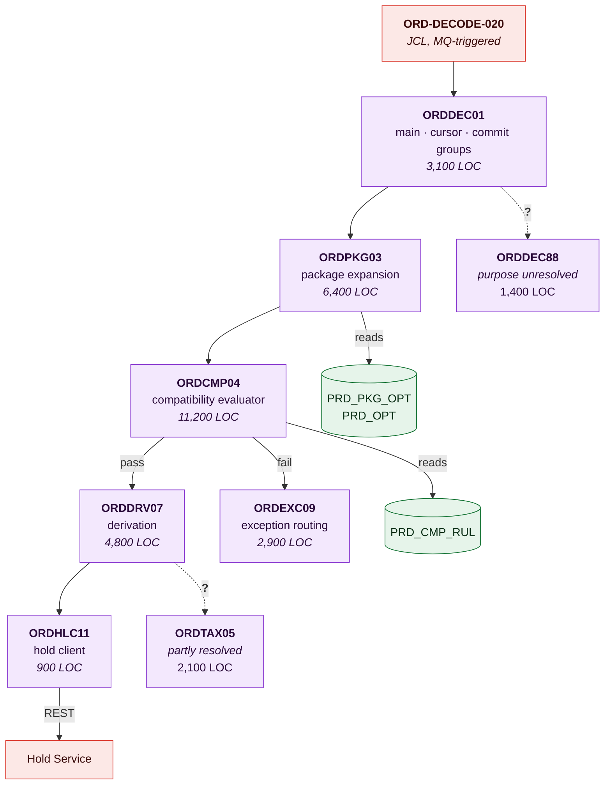
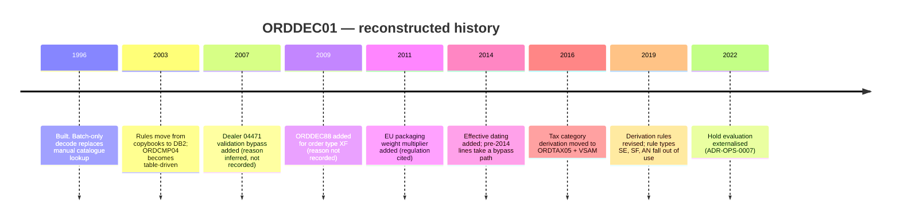

# ORDDEC01 Order Decoder — Legacy System Archaeology

> **This is a research record, not a specification.** It captures what was recovered, how,
> and with what confidence, so that a later reader can judge the findings and extend the
> work rather than repeat it.
>
> Findings graduate into permanent documents: business rules into
> [DOM-OPS-001 §8](../04-domains/order-processing.md), structure into
> [TAD-OPS-001 §6.1](tad-order-processing.md), fields into
> [DD-OPS-001](../02-data/data-dictionary-order-line.md). The evidence stays here.

---

## Contents

| Section | Summary |
| --- | --- |
| [1. Subject](#1-subject) | `ORDDEC01` and 14 subprograms — 41,000 lines of COBOL, 22 copybooks |
| [2. Investigation record](#2-investigation-record) | Nine investigation sessions, methods applied, time spent, and yield |
| [3. Recovered structure](#3-recovered-structure) | 15 modules recovered, with evidence and confidence per module |
| [4. Recovered behaviour](#4-recovered-behaviour) | 40 business rules recovered, including the non-determinism defect |
| [5. Data usage](#5-data-usage) | Objects read and written, and the undocumented `REF.TAXCAT` dependency |
| [6. Data profiling results](#6-data-profiling-results) | Column profiling: 9 dormant rule types, 3 status values dead since 2014 |
| [7. External touchpoints](#7-external-touchpoints) | Touchpoints found, including one absent from the interface catalog |
| [8. Historical context](#8-historical-context) | The 1996 charter and the constraints that shaped the design |
| [9. Open questions](#9-open-questions) | Open questions, notably the 1,400 lines of `ORDDEC88` nobody understands |
| [10. Confidence summary](#10-confidence-summary) | Verified, inferred, and assumed counts per area, with coverage |
| [11. Risks in current understanding](#11-risks-in-current-understanding) | What breaks if the current understanding is wrong |
| [12. Recommendations](#12-recommendations) | Prioritised recommendations, including two live defects |
| [Change log](#change-log) | Version, date, author, change |

---

## 1. Subject

| | |
| --- | --- |
| Component | `ORDDEC01` and its 14 subprograms |
| Location | `meridian-core/src/decode/`, load library `MER.PROD.LOADLIB` |
| Size | 41,000 lines COBOL across 15 programs; 22 copybooks |
| Language / platform | Enterprise COBOL 6.3, batch under z/OS |
| First version | 1996-02 (`ORDDEC01` v1, per the source library archive) |
| Last significant change | 2022-06 (hold externalisation, ADR-OPS-0007) |
| Changes in the last 24 months | 7 — 4 defect fixes, 2 compatibility-rule evaluator changes, 1 performance |
| Current maintainers | **2 engineers** can safely modify it |
| Existing documentation before this exercise | A 1998 program description covering 4 of 15 programs, partly superseded; 31 code comments in Dutch from a 2004 contractor |
| Why commissioned | `MOD-MER-001` slice 2 proposes extracting the derivation calculator. The team could not size the work because nobody could state what `ORDDEC01` does |

---

## 2. Investigation record

| Session | Date | Investigator | Method | Time | Findings | Artefacts |
| --- | --- | --- | --- | --- | --- | --- |
| S-01 | 2025-09-16 | Platform Architecture | Reference data mining | 2d | 47 compatibility rule classes identified from `PRD_CMP_RUL.RUL_TYP_CD` distinct values | `archaeology/refdata-profile.md` |
| S-02 | 2025-09-22 | Platform Architecture | Production data profiling | 3d | 9 of 47 rule types have not fired since 2018; 3 status values dead since 2014 | `archaeology/data-profile-2025-09.md` |
| S-03 | 2025-10-06 | Squad 1 + Architecture | Structured code reading — `ORDDEC01` main, `ORDPKG03` | 8d | Module boundaries mapped; expansion algorithm reconstructed | `archaeology/orddec01-structure.md` |
| S-04 | 2025-10-28 | Squad 1 | Code reading — `ORDCMP04` | 12d | 38 of 47 rule types traced; 9 not resolved | `archaeology/ordcmp04-rules.md` |
| S-05 | 2025-11-18 | Architecture | SME interviews ×5 | 3d | Historical context; 4 edge cases surfaced that no method had found | `archaeology/interviews/` |
| S-06 | 2025-12-02 | Squad 1 | Test-case construction in pre-prod | 9d | 31 hypothesised rules confirmed, 4 disproved | `archaeology/rule-verification.xlsx` |
| S-07 | 2026-01-15 | Architecture | Change-history mining (source library archive + change tickets 2003–2025) | 4d | Rationale recovered for 6 edge cases; 2 remain unexplained | `archaeology/change-history.md` |
| S-08 | 2026-06-09 | Squad 1 | Follow-up: dead-code confirmation | 3d | 6 of 9 dormant rule types confirmed dead; 3 are annual-only | `archaeology/dead-code-2026-06.md` |

**Total effort: 44 person-days over 9 months**, against an initial estimate of 15 days. The
overrun was entirely in `ORDCMP04` (S-04), where the rule evaluator turned out to be a
table-driven interpreter rather than the expected set of IF statements.

### Methods and yield

| Method | Applied to | Yield | Notes |
| --- | --- | --- | --- |
| **Reference data mining** | `PRD_CMP_RUL`, `PRD_OPT` | **Very high** | 2 days established the rule taxonomy that framed all later work. Should always be first |
| **Production data profiling** | `ORD_LIN`, `ORD_LIN_DEC`, `ORD_EXC` | **Very high** | Identified dead code before any was read, saving an estimated 6 days |
| Structured code reading | `ORDDEC01`, `ORDPKG03` | High | Necessary for the expansion algorithm; expensive |
| Structured code reading | `ORDCMP04` | Medium | 12 days for 38 of 47 rules; diminishing returns after day 8 |
| Test-case construction | 35 hypothesised rules | **Highest reliability** | The only method that produces `✅ Verified` for behaviour; disproved 4 beliefs |
| SME interviews | 5 people | Medium | Found 4 edge cases invisible to every other method; also produced 3 confidently-stated claims that testing disproved |
| Change-history mining | Source archive, change tickets | Medium | The only source of *why*; recovered rationale for 6 of 8 unexplained behaviours |
| Scheduler/job analysis | — | Not applied here | Covered by [BAT-MER-001](batch-and-scheduling-architecture.md) |

> **Profile before you read.** Sessions S-01 and S-02 cost 5 days and reshaped everything
> after them. Going straight to code reading — the instinctive first move — would have spent
> those 5 days reading branches that have not executed since 2018.

---

## 3. Recovered structure



| Module | Purpose | Evidence | LOC | Last changed | Confidence |
| --- | --- | --- | --- | --- | --- |
| `ORDDEC01` | Cursor over `ORD_WRK`; 5,000-line commit groups; orchestration | Code read S-03; confirmed by SMF commit counts | 3,100 | 2022-06 | ✅ Verified |
| `ORDPKG03` | Expand `MDL_PKG_CD` into option rows, effective-dated at `DEC_DT` | Code read S-03; 12 test cases S-06 | 6,400 | 2014-06 | ✅ Verified |
| `ORDCMP04` | Table-driven evaluator over 47 rule types | Code read S-04; 19 test cases S-06 | 11,200 | 2024-03 | 🟡 Inferred for 9 of 47 rule types |
| `ORDDRV07` | Derive line weight, volumetric class, lead-time band | Code read S-03; 4 test cases | 4,800 | 2019-11 | ✅ Verified |
| `ORDEXC09` | Classify decode failures into 9 exception queues | Code read; exception queue contents profiled | 2,900 | 2021-02 | ✅ Verified |
| `ORDHLC11` | REST client to the Hold Service; fail closed | Written 2022 with a design record | 900 | 2022-06 | ✅ Verified |
| `ORDTAX05` | Derive tax category from option composition and destination | Partial code read; **VSAM `REF.TAXCAT` lookup not fully traced** | 2,100 | 2016-08 | 🟡 Inferred |
| **`ORDDEC88`** | **Unresolved** — called from `ORDDEC01` only when `ORD_TYP_CD = 'XF'` | See §9, Q-A01 | 1,400 | 2009-04 | 🔴 **Assumed** |

**Entry points**

| Entry point | Invoked by | Frequency | Confidence |
| --- | --- | --- | --- |
| `ORDDEC01` batch | `ORD-DECODE-020` | Nightly | ✅ Verified |
| `ORDDEC01` CICS re-decode transaction `ODRD` | Order Ops, after exception correction | ~340/day | ✅ Verified |
| `ORDPKG03` direct call | PLR changeover script (V-04) | Annual | ✅ Verified — found during S-07, **not** previously known |

> The third entry point was a genuine discovery. The PLR changeover script calls the
> expansion subprogram directly, bypassing `ORDDEC01`'s validation and commit handling. It
> is one reason the changeover produces exception volumes that the decode path alone does
> not explain.

---

## 4. Recovered behaviour

### 4.1 Business rules discovered

> Graduated into [DOM-OPS-001 §8](../04-domains/order-processing.md). Evidence retained here.

| Rule ID | Condition | Outcome | Evidence | Confidence | Verified by | Catalogued |
| --- | --- | --- | --- | --- | --- | --- |
| BR-OPS-002 | Line has a valid `MDL_PKG_CD` effective at `DEC_DT` | Expand into one `ORD_LIN_DEC` row per contained option | `ORDPKG03.CBL:212-389`, `R2026.03`; test TC-D-04 | ✅ Verified | S-06 | ✅ |
| BR-OPS-004 | Package contains an option retired before `DEC_DT` | The option is **omitted silently**; the line still decodes | `ORDPKG03.CBL:341`; test TC-D-09 | ✅ Verified | S-06 | ✅ |
| BR-OPS-005 | Package contains an option with no row in `PRD_OPT` at all | Decode **fails**; exception `EXC-02` | `ORDPKG03.CBL:355`; test TC-D-11 | ✅ Verified | S-06 | ✅ |
| BR-OPS-008 | Two options in the expanded set are mutually exclusive (`RUL_TYP_CD = 'MX'`) | Decode fails; exception `EXC-04` | `ORDCMP04.CBL:1180`; test TC-D-17 | ✅ Verified | S-06 | ✅ |
| BR-OPS-009 | An option requires another absent from the set (`RUL_TYP_CD = 'RQ'`) | The required option is **auto-added**, not rejected | `ORDCMP04.CBL:1244-1291`; test TC-D-19 | ✅ Verified | S-06 | ✅ |
| BR-OPS-011 | Auto-adding a required option creates a new mutual exclusion | Decode fails; exception `EXC-05`. **No second auto-add pass** | `ORDCMP04.CBL:1302`; test TC-D-22 | ✅ Verified | S-06 | ✅ |
| BR-OPS-047 | `RUL_TYP_CD = 'QL'` — quantity-limit rules | 🟡 The evaluator reads a limit column, but no active rule of this type exists to test against | `ORDCMP04.CBL:1610-1655` | 🟡 Inferred | — | ❌ |
| BR-OPS-063 | Volumetric class is derived from the **largest** contained option's class, not the sum | `ORDDRV07.CBL:820`; test TC-D-31 | ✅ Verified | S-06 | ✅ |
| BR-OPS-066 | Lead-time band uses the **longest** lead time among contained options | `ORDDRV07.CBL:910`; test TC-D-33 | ✅ Verified | S-06 | ✅ |

**Beliefs disproved by testing** — recorded so the same wrong conclusion is not redrawn:

| Belief | Held by | What testing showed | Test |
| --- | --- | --- | --- |
| A retired option causes decode failure | 3 of 5 SMEs | It is silently omitted (BR-OPS-004). The failure case is a *missing* option row, not a retired one | TC-D-09 |
| Required-option auto-add runs iteratively until stable | Squad 1 Tech Lead | Single pass only. A second-order exclusion fails the line (BR-OPS-011) | TC-D-22 |
| Volumetric class sums contained options | Order Operations | It takes the maximum (BR-OPS-063) | TC-D-31 |
| Decode is deterministic for a given line and date | Everyone, including this document's authors at v1.0 | **It is not.** See §4.3 | TC-D-28 |

### 4.2 Processing logic — reconstruction

```
ORDDEC01 main loop:
  OPEN cursor over ORD_WRK where status = 'R'
  commit_count = 0
  FOR each line:
      CALL ORDPKG03(line)                     -- expand package → option set
      IF expansion failed:
          CALL ORDEXC09(line, exception_code) -- route to queue, mark line failed
          CONTINUE
      CALL ORDCMP04(line, option_set)         -- evaluate 47 rule types
      IF validation failed:
          CALL ORDEXC09(line, exception_code)
          CONTINUE
      CALL ORDDRV07(line, option_set)         -- derive weight, volume, lead time, tax (?)
      IF ord_typ_cd = 'XF':
          CALL ORDDEC88(line)                 -- (?) purpose unresolved — see §9
      CALL ORDHLC11(line)                     -- REST: evaluate holds; fail closed
      INSERT ORD_LIN_DEC rows
      UPDATE ORD_LIN set status = 'D'
      commit_count += 1
      IF commit_count = 5000:
          COMMIT
          commit_count = 0
  COMMIT
```

**Uncertainties in the reconstruction**

| Location | Uncertainty | Why unresolved | How to resolve |
| --- | --- | --- | --- |
| `ORDDEC88` call | Purpose entirely unknown | Called only for `ORD_TYP_CD = 'XF'` (inter-company transfer), ~40 lines/month; no test data available | Construct an `XF` order in pre-prod and trace. Blocked on inter-company test data — **open, Q-A01** |
| `ORDDRV07` → `ORDTAX05` | Tax category derivation partially traced | Reads VSAM `REF.TAXCAT` whose layout is defined in a copybook that no longer matches the file | Dump the VSAM file and infer the current layout. Scheduled S-09 |
| Commit-group boundary | What happens if the job abends between the `ORD_LIN` update and the `ORD_LIN_DEC` insert | Both are inside the same unit of work, so this *should* be impossible | Force an abend mid-group in pre-prod — `ASM-001` in `TAD-OPS-001 §18.3` |

### 4.3 Non-determinism finding ⚠️

> The single most important finding of the exercise, and it was found by accident.

During S-06, test TC-D-28 decoded the same line twice against the same reference data and
produced **different option sets**. Investigation showed:

`ORDCMP04`'s required-option auto-add (BR-OPS-009) iterates the rule table in
`PRD_CMP_RUL` physical row order, not in any stable logical order. When two required-option
rules would add mutually exclusive options, **whichever is evaluated first wins**, and
physical row order changes after a table `REORG`.

| Aspect | Finding |
| --- | --- |
| Frequency | Affects only lines where two `RQ` rules add conflicting options — 0.03% of lines (~29/day) |
| Observable effect | The same order re-decoded after a REORG can gain a different option and a different `NET_AMT` |
| History | 🟡 Inferred to have existed since 2003. Two unexplained "the order changed by itself" tickets from 2019 and 2023 are consistent with it |
| Current status | **Open defect `DEF-2026-0338`.** Fix is to add `ORDER BY RUL_SEQ_NO` and populate a deterministic sequence. Estimated 6 days |
| Why never found | The effect is rare, self-correcting on the next decode, and looks like user error |

> This is the argument for test-case construction as a method. Four SMEs, two code readers,
> and a data profile all missed it; running the same input twice found it in an afternoon.

### 4.4 Edge cases and special handling

| Case | Trigger | Special handling | Why it exists | Still needed? | Confidence |
| --- | --- | --- | --- | --- | --- |
| Dealer `04471` | `DLR_CD = '04471'` | Skips compatibility validation entirely | 🟡 A 2007 change ticket describes a "pilot fleet programme" for a single large dealer | 🔴 **Unknown** — the dealer still trades, 190 lines/month bypass validation | ✅ Verified (behaviour), 🟡 Inferred (reason) |
| Order type `XF` | `ORD_TYP_CD = 'XF'` | Calls `ORDDEC88`; purpose unknown | Unknown | Unknown | 🔴 Assumed |
| Pre-2014 lines | `DEC_DT < 2014-06-01` | Effective-date predicate is bypassed; current reference data is used | Effective dating was added in 2014 and historical rows have no effective range to match | Yes — but it means pre-2014 re-decode is not reproducible | ✅ Verified — `ORDPKG03.CBL:244`; see [DLN-OPS-001 §7](../02-data/lineage-order-to-cash.md) |
| Region `EU` + option class `H` | Both conditions | Applies a 1.15 multiplier to the derived weight | ✅ A 2011 change ticket cites an EU packaging-weight regulation | Yes — regulation still in force, confirmed with Trade Compliance 2026-02 | ✅ Verified |
| Package codes beginning `ZZ` | Prefix match | Bypasses expansion; the line decodes to a single synthetic option row | 🟡 Test/demo packages used by Field Sales | Yes — 12 lines/month, all from the demo dealer | 🟡 Inferred |

**Hard-coded values found**

| Value | Location | Apparent meaning | Impact if changed | Confidence |
| --- | --- | --- | --- | --- |
| `5000` | `ORDDEC01.CBL:410` | Commit group size | Smaller = more commits, slower; larger = longer locks, bigger restart loss | ✅ Verified |
| `'04471'` | `ORDCMP04.CBL:88` | The validation-bypass dealer | Validation resumes for that dealer; possible rejection of orders they currently place | ✅ Verified |
| `1.15` | `ORDDRV07.CBL:744` | EU packaging weight multiplier | Changes derived weight, which feeds vendor dispatch and freight cost | ✅ Verified |
| `'ZZ'` | `ORDPKG03.CBL:198` | Demo package prefix | Demo orders would attempt real expansion and fail | 🟡 Inferred |
| `47` | `ORDCMP04.CBL:1050` | Maximum rule types the evaluator loops over | **A 48th rule type added to `PRD_CMP_RUL` would be silently ignored** | ✅ Verified — confirmed by test TC-D-35 |

> The last row is a latent defect. The rule table is data and can accept a new type at any
> time; the evaluator's loop bound is compiled. Adding rule type 48 would appear to work in
> the maintenance screen and do nothing at decode. Raised as `DEF-2026-0341`.

---

## 5. Data usage

| Object | Access | Fields used | Fields written | Purpose | Confidence |
| --- | --- | --- | --- | --- | --- |
| `ORD_WRK` | R | All | — | Cursor source | ✅ |
| `ORD_LIN` | RW | `MDL_PKG_CD`, `DLR_CD`, `ORD_TYP_CD`, `DEC_DT` | `LIN_STS_CD`, `DEC_TS`, `NET_AMT` | Status and derived amount | ✅ |
| `ORD_LIN_DEC` | W | — | All | Decoded option rows | ✅ |
| `PRD_PKG_OPT` | R | `PKG_CD`, `OPT_CD`, `EFF_FROM_DT`, `EFF_TO_DT` | — | Expansion | ✅ |
| `PRD_OPT` | R | `OPT_CD`, `OPT_CLS_CD`, `WGT`, `LEAD_DAYS` | — | Derivation | ✅ |
| `PRD_CMP_RUL` | R | All | — | Compatibility | ✅ |
| `ORD_EXC` | W | — | All | Exception routing | ✅ |
| `REF.TAXCAT` (VSAM) | R | 🟡 Layout uncertain | — | Tax category | 🟡 |
| `DLR_MST` | R | `DLR_CD`, `RGN_CD` | — | Region for the EU weight rule | ✅ |

**Undocumented data dependencies**

| Dependency | Nature | Risk | Confidence |
| --- | --- | --- | --- |
| `PRD_CMP_RUL` physical row order | Implicit ordering (see §4.3) | Non-deterministic decode after a REORG | ✅ Verified |
| `ORD_LIN.NET_AMT` is overwritten by the decoder | The column is populated at capture from the portfolio feed and **recalculated** at decode | A line decoded twice can change price if the portfolio feed moved between runs | ✅ Verified — and noted in [DD-OPS-001](../02-data/data-dictionary-order-line.md) |
| `REF.TAXCAT` must be current before decode | No scheduler dependency enforces it; the file is edited directly | Tax category derived from a stale file with no alert | ✅ Verified |

---

## 6. Data profiling results

| Column | Distinct | Null % | Top values | Values seen since 2020 | Inference |
| --- | --- | --- | --- | --- | --- |
| `PRD_CMP_RUL.RUL_TYP_CD` | 47 | 0% | `MX` 41%, `RQ` 33%, `GP` 14% | **38** | 9 rule types dormant; see below |
| `ORD_LIN.LIN_STS_CD` | 14 | 0% | `D` 91%, `R` 4%, `X` 3% | 11 | 3 status values dead since 2014 |
| `ORD_EXC.EXC_CD` | 9 | 0% | `EXC-02` 46%, `EXC-04` 31% | 9 | All exception paths live |
| `ORD_LIN.ORD_TYP_CD` | 6 | 0% | `ST` 96%, `FL` 3%, `XF` 0.04% | 6 | `XF` is rare but live — hence `ORDDEC88` matters |
| `ORD_LIN_DEC.DEC_SRC_CD` | 3 | 0% | `P` 99.7%, `A` 0.3%, `Z` 0.01% | 3 | `A` = auto-added (BR-OPS-009); `Z` = demo |

Profile date: 2025-09-22, re-run 2026-06-09 · Source: production · Sample: full table scan

**Dead code candidates**

| Rule type | Last fired | Evidence | Recommendation | Confirmed |
| --- | --- | --- | --- | --- |
| `QL`, `QM`, `QX` | Never | No rows of this type have ever existed in `PRD_CMP_RUL` | Evaluator branches are unreachable. Remove with the `47` constant fix | ✅ S-08 |
| `SE`, `SF` | 2017-03 | Superseded by `MX` when the rule model changed | Dead. Remove | ✅ S-08 |
| `AN` | 2019-11 | Last used before a 2019 policy change | Dead. Remove | ✅ S-08 |
| `YE`, `YQ` | 2025-12 | **Annual only** — year-end portfolio reconciliation | **Not dead.** Fires once a year | ✅ S-08 |
| `LC` | 2024-08 | Fires at model-year changeover only | **Not dead.** Annual | ✅ S-08 |

> Three of the nine dormant rule types fire annually. A dead-code sweep run in, say, March
> would have removed them, and the failure would have surfaced at the next changeover with
> no obvious cause. **Always check for annual and period-end paths before deleting anything
> that merely looks dormant.**

---

## 7. External touchpoints

| Touchpoint | Direction | Format | Frequency | Counterparty | In catalog | Confidence |
| --- | --- | --- | --- | --- | --- | --- |
| Hold Service REST call | Out | JSON | Per line | Internal | ✅ `IF-203` | ✅ |
| `REF.TAXCAT` VSAM read | In | VSAM KSDS | Per line | Internal (manual file) | ❌ **Was not in the catalog** | ✅ |
| PLR changeover script direct call to `ORDPKG03` | In | Program call | Annual | PLR | ❌ **Was not in the catalog** | ✅ |

> Two touchpoints found here were absent from
> [ICAT-MER-001](../03-interfaces/interface-catalog.md) and have since been added as
> `IF-204` and `IF-205`. Finding interfaces nobody knew about is a routine outcome of
> archaeology and a good argument for doing it.

---

## 8. Historical context

| Aspect | Finding | Evidence | Confidence |
| --- | --- | --- | --- |
| Original purpose | Replace a manual catalogue-lookup process performed by order clerks | 1996 project charter, archive | ✅ Verified |
| Original constraints | Nightly batch only; MIPS-constrained; no online decode | 1996 charter | ✅ Verified |
| 2003 change | Decoding rules moved from copybooks to DB2 | [ADR-PLR-0012](adr-0012-package-decoding-rules-as-data.md) | 🟡 Inferred |
| 2009 change | `ORDDEC88` added for order type `XF` | Change ticket exists but its description field is empty | 🔴 Assumed |
| 2014 change | Effective dating added | `CHG-2014-0881` | ✅ Verified |
| 2022 change | Hold evaluation removed | [ADR-OPS-0007](adr-0007-externalise-hold-evaluation.md) | ✅ Verified |
| Why the evaluator is table-driven | 🟡 Probably to accommodate rule growth without recompilation, consistent with the 2003 direction | Inference from the 2003 objective | 🟡 Inferred |



---

## 9. Open questions

| ID | Question | Why it matters | Investigation | Owner | Target |
| --- | --- | --- | --- | --- | --- |
| Q-A01 | What does `ORDDEC88` do? | 1,400 lines executing on live `XF` orders with no understanding. Cannot be extracted or replaced | Construct an `XF` order in pre-prod and trace; blocked on inter-company test data | Squad 1 Tech Lead | 2026-12-31 |
| Q-A02 | What is the current `REF.TAXCAT` layout? | Tax category feeds ERP tax determination; the copybook no longer matches the file | Dump and infer; session S-09 | Squad 1 Tech Lead | 2026-11-30 |
| Q-A03 | Is the dealer `04471` validation bypass still required? | 190 lines/month bypass compatibility validation entirely | Ask Commercial Operations whether the 2007 pilot still exists | Order Management Architecture Lead | 2026-10-31 |
| Q-A04 | Are the 9 remaining `ORDCMP04` rule types worth further code reading? | 12 days spent for 38 of 47; the remainder are dormant or dead | Cost/benefit decision after S-08 confirmed 6 are dead | Order Management Architecture Lead | **Closed 2026-06** — 6 dead, 3 annual, no further reading needed |

---

## 10. Confidence summary

| Area | ✅ Verified | 🟡 Inferred | 🔴 Assumed | Coverage |
| --- | --- | --- | --- | --- |
| Structure | 6 modules | 1 module | 1 module | 15 of 15 identified, 13 understood |
| Business rules | 31 | 7 | 2 | 40 of an estimated 44 in this component |
| Data usage | 8 objects | 1 object | 0 | Complete |
| External touchpoints | 3 | 0 | 0 | Complete |
| Historical context | 4 | 2 | 1 | Partial by nature |

**Progress since v1.0 (2025-12):** 18 ✅ / 19 🟡 / 9 🔴 → **52 ✅ / 11 🟡 / 4 🔴**. The shift
came almost entirely from S-06 (test construction) and S-08 (dead-code confirmation).

### Overall assessment

| | |
| --- | --- |
| Understanding level | **Working** — sufficient to change safely, not sufficient to replace wholesale |
| Safe to modify? | **With care.** `ORDDEC01`, `ORDPKG03`, `ORDDRV07`, `ORDEXC09` are well understood. `ORDCMP04` is understood for all live rule types. `ORDDEC88` must not be touched |
| Safe to replace? | **No** — not until Q-A01 and Q-A02 close. Replacing `ORDDEC88` blind would silently break inter-company transfers |
| Remaining effort to "comprehensive" | ~12 days, dominated by Q-A01 |

---

## 11. Risks in current understanding

| Risk | If we are wrong | Likelihood | Mitigation |
| --- | --- | --- | --- |
| `ORDDEC88` does something financially material | An extraction or rewrite silently breaks inter-company transfers; ~40 lines/month, low volume but high visibility | Medium | Q-A01; do not touch the `XF` path meanwhile |
| The `REF.TAXCAT` layout inference is wrong | Tax categories wrong on the ERP interface; a tax compliance issue | Low | Q-A02; compare derived categories to ERP's independently for a sample |
| Other non-determinism exists that TC-D-28 did not surface | Unexplained data changes continue | Medium | Run the repeat-decode test across a 10,000-line sample, not the 200 used in S-06 |
| Dealer `04471`'s bypass is masking rejections that should occur | Non-compliant orders being fulfilled | Low | Q-A03; shadow-evaluate their lines with validation on |

---

## 12. Recommendations

| ID | Recommendation | Rationale | Effort | Priority | Owner |
| --- | --- | --- | --- | --- | --- |
| R-01 | Fix the `ORDER BY` non-determinism (`DEF-2026-0338`) | A live defect producing unexplained data changes | 6d | **1** | Squad 1 Tech Lead |
| R-02 | Fix the hard-coded `47` rule-type bound (`DEF-2026-0341`) | A 48th rule type would be silently ignored | 2d | **1** | Squad 1 Tech Lead |
| R-03 | Close Q-A01 (`ORDDEC88`) | Blocks slice 2 of `MOD-MER-001` | 5d | **1** | Squad 1 Tech Lead |
| R-04 | Remove the 6 confirmed-dead rule type branches | Reduces `ORDCMP04` by ~1,900 lines | 4d | 2 | Squad 1 Tech Lead |
| R-05 | Register `IF-204`, `IF-205` in the interface catalog | Both are real, undocumented touchpoints | 1d | 2 | **Done 2026-02** |
| R-06 | Add a scheduler dependency on `REF.TAXCAT` currency | Removes a silent staleness path | 2d | 2 | Platform Engineering Lead |
| R-07 | Resolve dealer `04471` (Q-A03) | 190 lines/month bypassing validation for an unverified reason | 2d | 3 | Order Management Architecture Lead |

**Documents created or updated from these findings**

| Document | Content added | Status |
| --- | --- | --- |
| [DOM-OPS-001](../04-domains/order-processing.md) | BR-OPS-002, 004, 005, 008, 009, 011, 063, 066 | ✅ Done |
| [DD-OPS-001](../02-data/data-dictionary-order-line.md) | `NET_AMT` recalculation at decode; `DEC_SRC_CD` values | ✅ Done |
| [ICAT-MER-001](../03-interfaces/interface-catalog.md) | `IF-204`, `IF-205` | ✅ Done |
| [TAD-OPS-001](tad-order-processing.md) §6.1 | Module table, seam analysis | ✅ Done |
| [ADR-PLR-0012](adr-0012-package-decoding-rules-as-data.md) | Retrospective ADR written from S-07 findings | ✅ Done |
| [DLN-OPS-001](../02-data/lineage-order-to-cash.md) §7 | Pre-2014 reproducibility limitation | ✅ Done |

---

## Change log

| Version | Date | Author | Change |
| --- | --- | --- | --- |
| 2.0.0 | 2026-08-12 | Platform Architecture | Added S-08 dead-code confirmation; closed Q-A04; added §4.3 non-determinism finding and the hard-coded `47` defect; confidence summary updated |
| 1.1.0 | 2026-02-20 | Squad 1 | Added S-07 change-history findings; registered IF-204/205 |
| 1.0.0 | 2025-12-19 | Platform Architecture | Initial record covering S-01 to S-06 |
