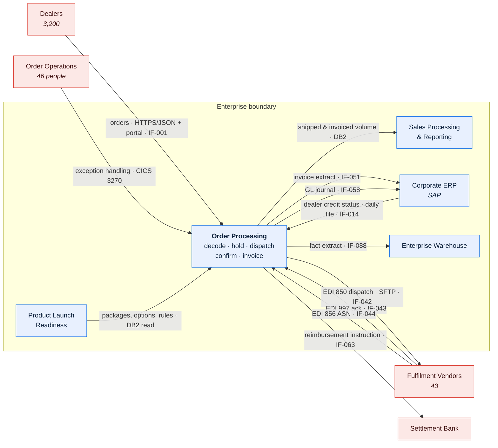
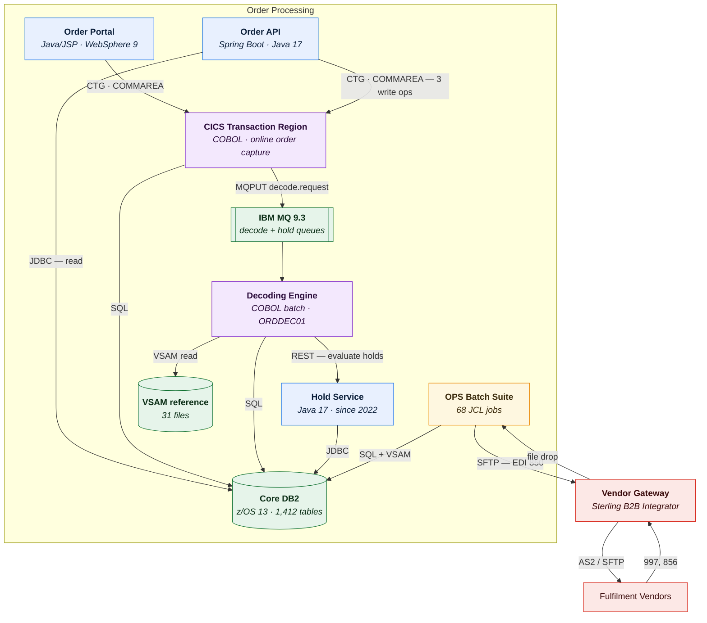
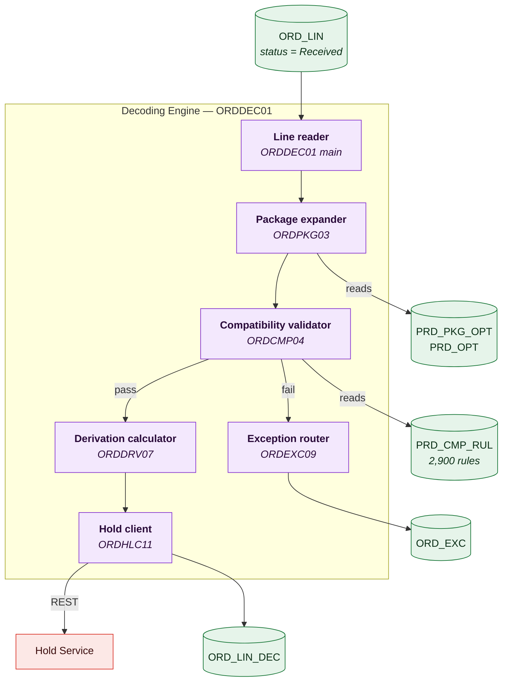
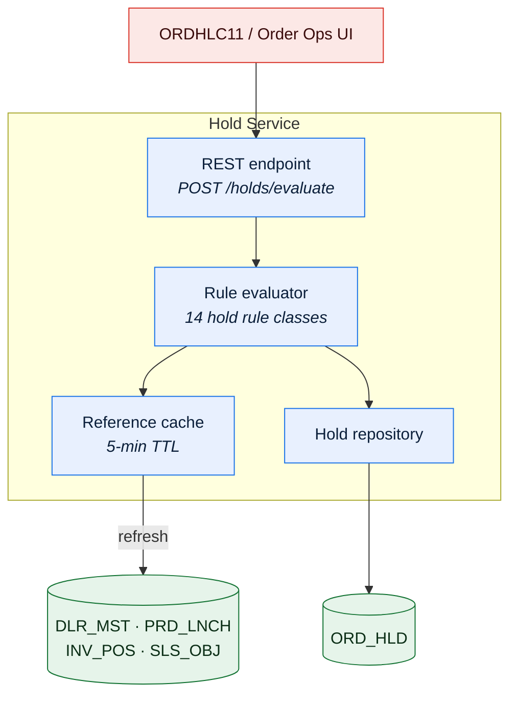
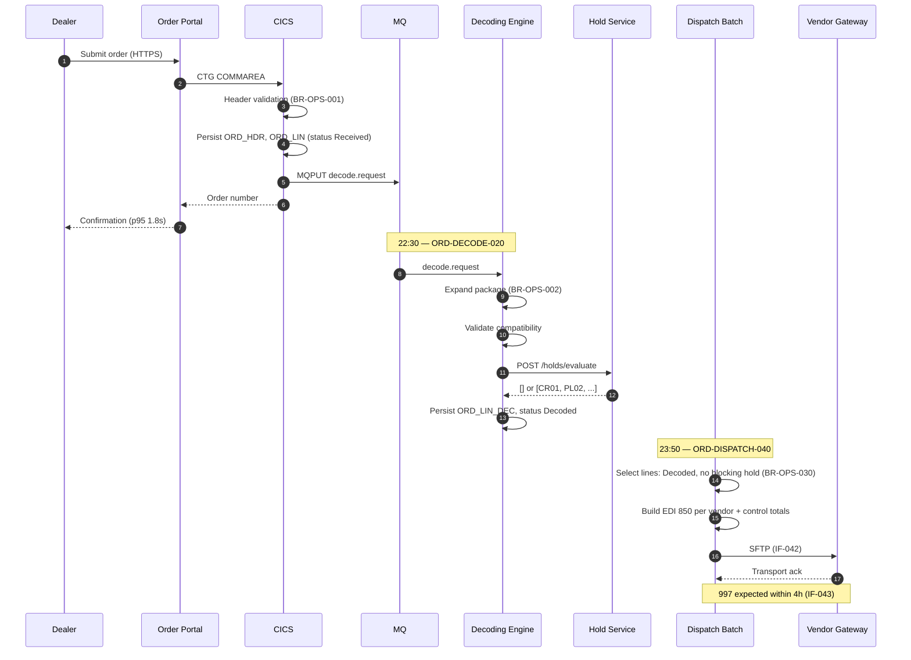
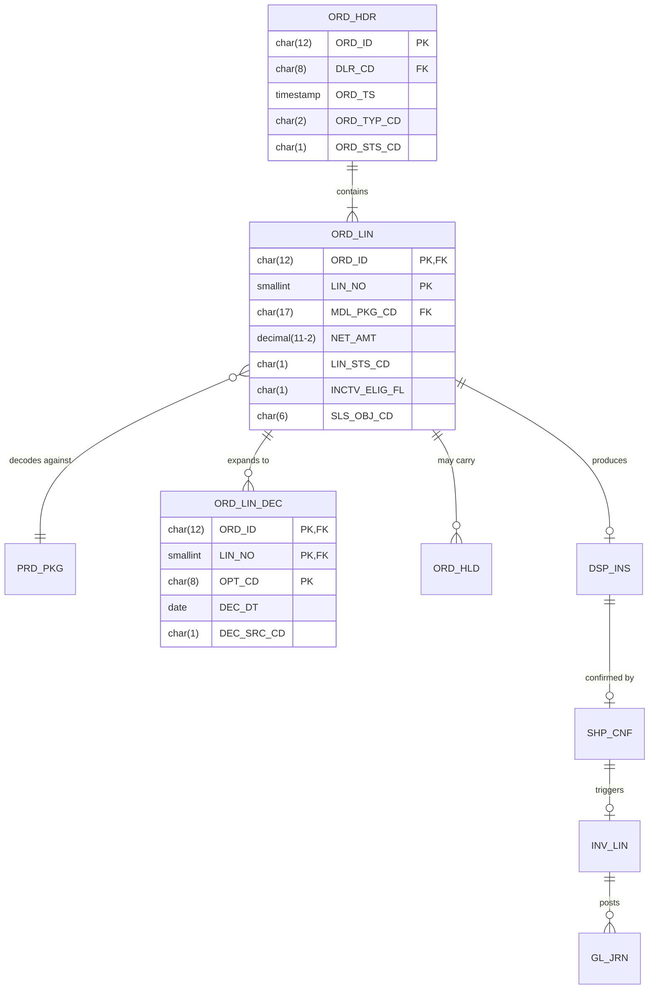
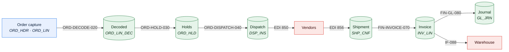
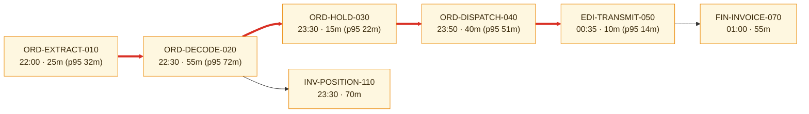
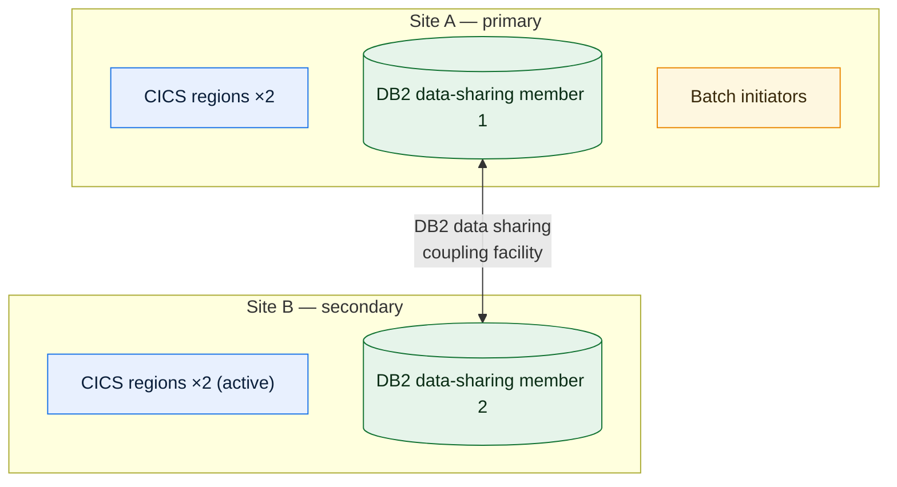
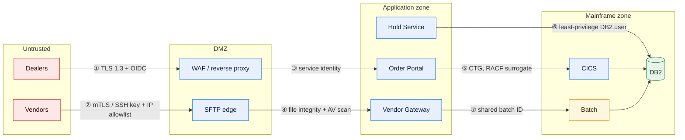

# Meridian Order Processing — Technical Architecture Document

> **This document describes Order Processing as it is in release `R2026.09`.** Target state
> is in `MOD-MER-001`. Where a statement about existing behaviour is not trivially
> observable it carries a confidence tag: `✅ Verified` / `🟡 Inferred` / `🔴 Assumed`.

## Contents

1. [Scope and audience](#1-scope-and-audience)
2. [Architectural drivers](#2-architectural-drivers)
3. [Principles and constraints](#3-principles-and-constraints)
4. [Context — C4 Level 1](#4-context--c4-level-1)
5. [Container view — C4 Level 2](#5-container-view--c4-level-2)
6. [Component views — C4 Level 3](#6-component-views--c4-level-3)
7. [Runtime views](#7-runtime-views)
8. [Data architecture](#8-data-architecture)
9. [Integration architecture](#9-integration-architecture)
10. [Batch and scheduling](#10-batch-and-scheduling)
11. [Cross-cutting concerns](#11-cross-cutting-concerns)
12. [Non-functional requirements](#12-non-functional-requirements)
13. [Failure modes and resilience](#13-failure-modes-and-resilience)
14. [Deployment and environments](#14-deployment-and-environments)
15. [Security architecture](#15-security-architecture)
16. [Architecture decisions](#16-architecture-decisions)
17. [Technical debt and known weaknesses](#17-technical-debt-and-known-weaknesses)
18. [Evolution and open questions](#18-evolution-and-open-questions)

---

## 1. Scope and audience

### 1.1 In scope

| Element | Included because |
| --- | --- |
| Order capture (web, API, green screen) | Entry point for all OPS data |
| Order line decoding (`ORDDEC01`) | The throughput constraint and the densest concentration of business rules |
| Hold evaluation and release (Hold Service) | Determines what dispatches |
| Cancellation, amendment, expedite | Mutate order state outside the main flow |
| Vendor dispatch and ASN reconciliation | The external contract boundary |
| Invoice generation and GL posting | SOX-relevant; the terminal step of the order lifecycle |
| Reimbursement claim processing | Financially material, operationally coupled to dispatch |

### 1.2 Out of scope

| Element | Why excluded | Documented in |
| --- | --- | --- |
| Portfolio and package definition | Owned by PLR; OPS consumes it read-only | [DOM-PLR-001](../04-domains/product-launch-readiness.md) |
| Objective planning, incentives, inventory planning | Owned by SPR | [DOM-SPR-001](../04-domains/sales-processing-and-reporting.md) |
| Pricing and discounting | Corporate ERP; OPS receives net price on the portfolio feed | `SYS-MER-001 §4` |
| Dealer credit limit setting | Corporate ERP; OPS consumes a status code via `IF-014` | `SYS-MER-001 §4` |
| Payment execution | Settlement bank; OPS produces an instruction file | [ICAT-MER-001](../03-interfaces/interface-catalog.md) |
| Warehouse reporting model | Enterprise Warehouse team | — |
| The 2009 web portal's presentation layer | No architecturally significant structure; it is a thin CICS client | — |

### 1.3 Audience and how to read

| Audience | Read | Skip |
| --- | --- | --- |
| Engineer joining Squad 1 | §4, §5, §6.1, §7, §17 | §2, §12 detail |
| Vendor Integration engineer | §4, §9, §13, then [ICD-VND-001](../03-interfaces/icd-vendor-dispatch-outbound.md) | §6 |
| Data engineer / analyst | §8, §10, then [DLN-OPS-001](../02-data/lineage-order-to-cash.md) | §6, §15 |
| SRE / on-call | §5, §10, §13, then [RUN-OPS-001](../05-operations/runbook-nightly-order-cycle.md) | §2, §3 |
| Architecture Review Board | All, especially §2, §12, §16, §17 | — |

---

## 2. Architectural drivers

### 2.1 Business drivers

| ID | Driver | Source | Architectural consequence | Still valid? |
| --- | --- | --- | --- | --- |
| BD-01 | Vendors require a single consolidated dispatch file per day, by 03:00 UTC | Vendor master agreement §7.2 (all 43) | The entire nightly chain exists to meet this cutoff; it is the system's hardest real-time constraint | **Yes** — renegotiated 2024, unchanged |
| BD-02 | Dealers must see order status within one business day of any change | Dealer franchise commitment | Status must be queryable from the OLTP store, not only from the warehouse | Yes |
| BD-03 | Invoice must follow shipment confirmation, never precede it | Revenue recognition policy RR-4.1 | Invoicing is gated on ASN receipt, which couples OPS to vendor responsiveness | Yes |
| BD-04 | Portfolio changes must take effect without a software release | 2003 business case for the DB2 migration | Decoding rules live in reference data — see [ADR-PLR-0012](adr-0012-package-decoding-rules-as-data.md) | Yes, but the governance consequence was not anticipated; see §17 `TD-06` |
| BD-05 | Orders held for reasons outside the dealer's control must not disadvantage them | Sales policy, 2011 | Hold release date, not order date, drives objective attainment; the source of the `ops.order_date` / `spr.objective_date` divergence | Yes |

### 2.2 Technical drivers and historical constraints

| ID | Driver | Era | Consequence today | Reversible? |
| --- | --- | --- | --- | --- |
| TD-01 | Mainframe MIPS cost drove a batch-first design | 1996 | Nearly all processing is nightly; intra-day change is expensive to express | Partly — the constraint has lapsed, the design has not |
| TD-02 | No message broker existed in the 1996 estate | 1996 | Inter-module communication is via shared DB2 tables and VSAM files | Yes, incrementally |
| TD-03 | CICS Transaction Gateway was the only viable web integration in 2009 | 2009 | The web portal is a thin client over COBOL transactions; business logic could not be moved without rewriting it | Yes, and partly done — the Hold Service (2022) proved the pattern |
| TD-04 | EDI was the only format 43 vendors could support in 2014 | 2014 | Fixed-width X12; adding a field requires 43 counterparties to change | No, within current vendor contracts |

### 2.3 Quality attribute priorities

> Ranked. The ranking is the decision; an unranked list defers it to whoever is
> implementing.

| Rank | Attribute | Rationale | Trade-off accepted |
| --- | --- | --- | --- |
| 1 | **Data integrity** | A duplicate dispatch instruction causes a duplicate physical shipment; a duplicate invoice causes a duplicate GL posting. Both are externally visible and expensive to unwind. | We will fail a nightly cycle rather than risk a duplicate. `ORD-DISPATCH-040` aborts on any control-total mismatch rather than transmitting a partial file. |
| 2 | **Batch window adherence** | Missing the 03:00 vendor cutoff slips an entire fulfilment day for ~18,000 orders. | Throughput is prioritised over latency for individual lines. The decoder processes in 5,000-line commit groups rather than per line. |
| 3 | **Availability of order capture** | Dealers must be able to place orders during business hours. | Capture is deliberately decoupled from decode: an order can be accepted while the decoder is down, and decode catches up. |
| 4 | **Changeability** | Rule changes take 1 day or 6 weeks depending on which side of the code/data split they fall. | Accepted as debt. See §17 `TD-02`. |
| 5 | Latency of individual operations | Portal responsiveness matters but no business outcome depends on sub-second response. | p95 of 1.8s on order submission is tolerated. |

---

## 3. Principles and constraints

### 3.1 Principles

| ID | Principle | Rationale | Implication | Compliance |
| --- | --- | --- | --- | --- |
| P-01 | A domain writes only to data it owns | Shared-schema coupling is the largest source of cross-team incidents | Cross-domain updates go through an owning service or an agreed delegation | **Breached** — 31 known violations; see [DMAP-MER-001 §4.1](../00-foundations/domain-map.md) |
| P-02 | Every externally-visible action is idempotent | Retry and recovery must be safe | Dispatch, invoice, and payment steps carry idempotency keys | Partial — dispatch ✅, invoice ✅, reimbursement ❌ (`TD-05`) |
| P-03 | Business rules carry a catalogued identifier | Rules must be citable from code, tests, and support conversations | Every rule has a `BR-OPS-nnn` and the implementing code references it | Partial — 214 of an estimated 260 rules catalogued |
| P-04 | New logic is not added to `ORDDEC01` | The decoder is the highest-risk component and the hardest to change | New behaviour goes into a callable service outside the decoder | Full since 2022 |
| P-05 | Extraction is proved by shadow-run before cutover | The 2022 hold externalisation succeeded because of this | Every decomposition slice budgets for parallel run and output comparison | Full |

### 3.2 Constraints

| ID | Constraint | Type | Source | Impact | Challengeable? |
| --- | --- | --- | --- | --- | --- |
| C-01 | Dispatch file must reach vendors by 03:00 UTC | **Hard** | Vendor master agreement §7.2 | Defines the batch window | No, within current contracts |
| C-02 | Invoice must not precede ASN | **Hard** | Revenue recognition policy RR-4.1 | Invoicing latency is bounded by vendor responsiveness | No |
| C-03 | EDI 850 layout is fixed-width; changes need 43 counterparties | **Hard** | Vendor integration agreements | New dispatch fields are effectively impossible | No, short of a multi-year renegotiation |
| C-04 | Order Operations requires the green-screen path for 14 functions | **Soft** | Never rebuilt on the web | The green screen bypasses validations the web enforces (`TD-03`) | **Yes** — estimated 7 months to close |
| C-05 | No new mainframe MIPS budget | **Soft** | 2025 cost programme | New processing must run distributed | **Yes**, with a business case |
| C-06 | Change freeze for 4 days at year-end | **Hard** | Finance close policy | Affects release planning only | No |

---

## 4. Context — C4 Level 1



> **Caption:** OPS has one inbound demand source (dealers), one read-only upstream authority
> (PLR), and four outbound obligations. The vendor loop — 850 out, 997 and 856 back — is the
> only bidirectional external relationship, and it is where the system's hardest timing
> constraint lives.

### 4.1 External entities

| Entity | Type | Relationship | Data exchanged | Interface | Criticality |
| --- | --- | --- | --- | --- | --- |
| Dealers | External org + person | Producer | Orders, amendments, cancellations, expedite requests | IF-001 | Tier 1 |
| Order Operations | Internal person | Both | Exception correction, manual holds, overrides | *(direct CICS)* | Tier 1 |
| Product Launch Readiness | Internal domain | Producer | Packages, options, compatibility rules | *(DB2 read)* | Tier 1 |
| Corporate ERP — credit | Internal system | Producer | Dealer credit status | IF-014 | Tier 1 |
| Fulfilment Vendors (43) | External org | Both | Dispatch out; ack and ASN back | IF-042/043/044 | Tier 1 |
| Corporate ERP — AR | Internal system | Consumer | Invoice lines | IF-051 | Tier 1 |
| Corporate ERP — GL | Internal system | Consumer | Journal entries | IF-058 | Tier 1 |
| Settlement Bank | External org | Consumer | Reimbursement payment instructions | IF-063 | Tier 2 |
| Sales Processing | Internal domain | Consumer | Shipped and invoiced volume | *(DB2 read)* | Tier 2 |
| Enterprise Warehouse | Internal system | Consumer | Fact and dimension extracts | IF-088 | Tier 3 |

> Reconciles with [ICAT-MER-001](../03-interfaces/interface-catalog.md): 8 OPS-owned
> external interfaces, plus 2 intra-Meridian DB2 read paths that the catalog records as
> `IF-201` and `IF-202` for completeness. ✅ Verified 2026-08-05.

---

## 5. Container view — C4 Level 2



> **Caption:** The Hold Service is the only container extracted from the COBOL core. Its
> boundary — a REST call from `ORDDEC01` — is the seam that
> [ADR-OPS-0007](adr-0007-externalise-hold-evaluation.md) created and the pattern every
> subsequent extraction follows.

### 5.1 Container register

| ID | Container | Responsibility | Technology | Owning team | Criticality | Deployment unit |
| --- | --- | --- | --- | --- | --- | --- |
| CT-01 | Order Portal | Dealer and field-sales UI | Java/JSP, WebSphere 9.0.5 | Squad 1 | Tier 1 | EAR, 4 instances |
| CT-02 | Order API | Read-mostly status API; 3 write operations | Spring Boot, Java 17 | Squad 1 | Tier 2 | Container, 6 replicas |
| CT-03 | CICS Transaction Region | Online order capture, amendment, Order Ops functions | COBOL under CICS TS 5.6 | Squad 1 | Tier 1 | 2 CICS regions, active/active |
| CT-04 | Decoding Engine | Expand order lines into option rows; apply decode rules | COBOL batch, `ORDDEC01` + 14 subprograms | Squad 1 | **Tier 1** | Batch job `ORD-DECODE-020` |
| CT-05 | Hold Service | Evaluate and release holds | Java 17, Spring Boot | Squad 1 | Tier 1 | Container, 4 replicas |
| CT-06 | OPS Batch Suite | Extract, dispatch, ASN ingest, invoice, GL | 68 JCL jobs | Squad 1 | Tier 1 | Scheduled |
| CT-07 | Core DB2 | System of record | DB2 for z/OS 13 | Platform | **Tier 1** | 2-way data sharing |
| CT-08 | VSAM reference | Legacy reference data not migrated in 2003 | VSAM KSDS ×31 | Platform | Tier 2 | — |
| CT-09 | IBM MQ | Decode request queue | MQ 9.3 | Platform | Tier 1 | QM pair |
| CT-10 | Vendor Gateway | EDI translation and transport | Sterling B2B Integrator 6.1 | Vendor Integration | Tier 1 | 2 nodes |

### 5.2 Container interactions

| From | To | Protocol | Payload | Sync | Volume/day | Failure behaviour |
| --- | --- | --- | --- | --- | --- | --- |
| CT-01 | CT-03 | CTG / COMMAREA | Order submission | Sync | 14,600 | Portal shows "submission unavailable"; dealer must retry. **No queueing.** `TD-07` |
| CT-02 | CT-07 | JDBC | Status query | Sync | 240,000 | 503 to caller; caller retries |
| CT-03 | CT-09 | MQPUT | `decode.request` (order id) | Async | 18,200 | Order accepted and persisted; decode catches up next cycle |
| CT-09 | CT-04 | MQGET | As above | Async | 18,200 | Messages accumulate; queue depth alert at 25,000 |
| CT-04 | CT-05 | HTTPS/JSON | Hold evaluation request per line | Sync | 95,000 | **Fails closed**: decode marks the line `HoldEvalFailed` and excludes it from dispatch. Never dispatches unevaluated. |
| CT-04 | CT-07 | SQL | Decoded option rows | Sync | 410,000 rows | Job abends; restart from last commit group |
| CT-06 | CT-10 | SFTP | EDI 850 file | Async | 43 files | Retry ×3 at 20-minute intervals, then hold `DS07` and page Vendor Ops |
| CT-10 | CT-06 | File drop | 997, 856 | Async | ~1,900 | Missing-file alert at the expected-by deadline |

> **Failure behaviour** is the column reviewers insist on. The CT-04 → CT-05 row is the
> important one: the Hold Service failing closed is a deliberate choice that trades
> throughput for the integrity priority in §2.3.

---

## 6. Component views — C4 Level 3

Level 3 is provided for CT-04 (Decoding Engine) and CT-05 (Hold Service) only. The other
containers have no architecturally significant internal structure: CT-01 and CT-02 are thin
clients, CT-06 is a set of independent jobs catalogued in
[JSC-MER-001](../05-operations/job-schedule-catalog.md), and CT-10 is vendor product
configuration.

### 6.1 Decoding Engine (CT-04)

**Responsibility:** expand each order line's model package into its constituent option rows,
validate compatibility, and compute the line's derived attributes.



| Component | Responsibility | Implementation | Key rules | Confidence |
| --- | --- | --- | --- | --- |
| Line reader | Cursor over unprocessed lines; 5,000-line commit groups | `ORDDEC01` main, 3,100 LOC | BR-OPS-001 | ✅ Verified |
| Package expander | Expand `MDL_PKG_CD` into option rows, effective-dated at the line's `DEC_DT` | `ORDPKG03`, 6,400 LOC | BR-OPS-002, BR-OPS-004 to BR-OPS-011 | ✅ Verified — [LGA-OPS-001 §4.1](legacy-system-archaeology-order-decoder.md) |
| Compatibility validator | Evaluate 2,900 pairwise and group rules | `ORDCMP04`, 11,200 LOC | BR-OPS-012 to BR-OPS-058 | 🟡 Inferred for 9 of 47 rules — see `LGA-OPS-001 §9` |
| Derivation calculator | Compute line weight, volumetric class, lead-time band, tax category | `ORDDRV07`, 4,800 LOC | BR-OPS-060 to BR-OPS-074 | ✅ Verified |
| Exception router | Classify decode failures and route to the correct Order Ops queue | `ORDEXC09`, 2,900 LOC | BR-OPS-003, BR-OPS-080 to BR-OPS-092 | ✅ Verified |
| Hold client | Call the Hold Service per line; fail closed on error | `ORDHLC11`, 900 LOC | BR-OPS-014 | ✅ Verified — added 2022 by ADR-OPS-0007 |

**Seams**

| Seam | Type | Enables extraction of | Created |
| --- | --- | --- | --- |
| `ORDHLC11` REST boundary | Service call | Hold evaluation — already extracted | 2022 |
| `ORDCMP04` rule-table read | Data | Compatibility validation — rules are already data; only the evaluator is COBOL | 2003 |
| `ORDEXC09` queue write | Data | Exception routing — the queue table is the contract | Original |
| `ORDDRV07` call boundary | Program call | Derivation — **candidate for the next extraction slice** | Natural |

> 🔴 **Assumed:** `ORDPKG03` has no usable seam; expansion is interleaved with cursor
> management in `ORDDEC01`. Extracting it is believed to require rewriting both together.
> *Owner: Order Management Architecture Lead. Confirm by 2027-01-31 (Q-002 in §18).*

### 6.2 Hold Service (CT-05)

**Responsibility:** evaluate all applicable hold rules for an order line and return the set
of holds to apply.



| Hold code | Meaning | Blocks dispatch | Blocks invoice | Auto-release | Rule |
| --- | --- | --- | --- | --- | --- |
| `CR01` | Dealer credit status suspended | ✅ | ❌ | On credit status returning to `A` | BR-OPS-014 |
| `CR09` | *(obsolete — retained for historical rows)* | — | — | — | BR-OPS-016 |
| `PL02` | Package not launch-ready at the line's requested delivery date | ✅ | ❌ | On launch gate passing | BR-OPS-018 |
| `IN04` | Planned inventory shortfall | ✅ | ❌ | On position recovery | BR-OPS-020 |
| `SL06` | Order exceeds dealer's objective-period allocation | ✅ | ❌ | Manual, Sales Ops | BR-OPS-021 |
| `DS03` | Vendor rejected the dispatch instruction | ✅ | ❌ | Manual, after correction | BR-OPS-031 |
| `DS07` | Vendor acknowledgement not received within SLA | ✅ | ❌ | On late 997 arrival | BR-OPS-032 |
| `EX01` | Expedite requested; awaiting vendor confirmation | ❌ | ❌ | On vendor response | BR-OPS-038 |
| `TC02` | Trade compliance screening hit | ✅ | ✅ | Manual, Compliance only | BR-OPS-024 |
| *(5 further codes)* | | | | | |

> `CR01` blocks dispatch but **not** invoicing. This looks like an oversight and is not: a
> credit hold applied after shipment must not prevent invoicing, because the goods have
> already left. ✅ Verified — `ORDHLD02.CBL:88-131` (as of `R2026.03`) and confirmed against
> 2026-06 production (412 lines invoiced while carrying `CR01`, all post-shipment).

---

## 7. Runtime views

### 7.1 Order submission to dispatch — happy path



| Step | Latency budget | Failure mode | Handling |
| --- | --- | --- | --- |
| 1–7 capture | p95 ≤ 2.5s | CICS region unavailable | Portal error; no queueing (`TD-07`) |
| 8–13 decode | 5,000 lines per commit group; 1,150 lines/min | Abend mid-group | Restart from last commit; group is atomic |
| 11 hold evaluation | p99 ≤ 400ms per line | Hold Service unavailable | **Fail closed** — line marked `HoldEvalFailed`, excluded from dispatch, alert raised |
| 14–17 dispatch | Must complete by 00:45 for a 03:00 cutoff | Control-total mismatch | **Abort the whole file.** Never transmit partial. |
| 18 transmission | ≤ 10 min | SFTP failure | Retry ×3 at 20-min intervals, then hold `DS07` + page |

### 7.2 Vendor acknowledgement timeout — failure path

```mermaid
sequenceDiagram
    autonumber
    participant B as Dispatch Batch
    participant V as Vendor Gateway
    participant P as Vendor (external)
    participant O as Order Operations

    B->>V: EDI 850 (IF-042)
    V->>P: SFTP upload
    Note over P: no 997 within 4h SLA
    V-->>B: ack_timeout event
    B->>B: Apply hold DS07 to affected lines (BR-OPS-032)
    B->>B: Retry transmission (max 3, 2h backoff)
    alt Late 997 arrives
        P-->>V: 997 AK5=A
        V-->>B: acknowledged
        B->>B: Release DS07 (BR-OPS-033)
    else Exhausted after 3 attempts
        B->>O: Page Vendor Ops; route to exception queue
        O->>O: Contact vendor; manual confirmation
        Note over O: Lines remain undispatched.<br/>Fulfilment day is lost for this vendor.
    end
```

**Business consequence while degraded:** for the affected vendor only, dispatch is suspended
and orders accumulate. The other 42 vendors are unaffected — dispatch files are built and
transmitted per vendor, which is a deliberate blast-radius decision. ✅ Verified.

The dangerous variant is **not** this one. It is a vendor that acknowledges the 997 and then
silently fails to act on the 850: the system believes the order is dispatched, no alert
fires, and the discrepancy only surfaces when no ASN arrives. Detection today takes 3–5 days
(`FM-05` in §13).

---

## 8. Data architecture

### 8.1 Data stores

| Store | Technology | Purpose | Owning domain | Size | Growth | Retention | RPO |
| --- | --- | --- | --- | --- | --- | --- | --- |
| Core DB2 | DB2 z/OS 13 | System of record | Mixed (see §8.3) | 41 TB | +3.4 TB/yr | 7 yrs online, 10 yrs archive | ≤ 2 min |
| VSAM reference | VSAM KSDS ×31 | Pre-2003 reference data | PLR | 40 GB | Flat | Indefinite | ≤ 24 h |
| MQ queues | IBM MQ 9.3 | Decode requests | OPS | — | — | 48 h | ≤ 0 (persistent) |
| Dispatch archive | z/OS sequential | Transmitted EDI files | OPS | 2.1 TB | +0.4 TB/yr | 7 yrs | ≤ 24 h |

### 8.2 Core entities



> Physical types are recorded because they matter: `CHAR(12)` on `ORD_ID` means every
> comparison must account for trailing-space padding, and `DECIMAL(11,2)` on `NET_AMT` means
> money is never a float. Mermaid does not accept commas in type declarations, so
> `decimal(11-2)` here is `DECIMAL(11,2)` in DB2 — noted in
> [DD-OPS-001](../02-data/data-dictionary-order-line.md).

| Entity | Owning domain | Volume | Daily new | Authoritative source | Consumers |
| --- | --- | --- | --- | --- | --- |
| `ORD_HDR` | OPS | 148M | 18,200 | Meridian | OPS, SPR, EDW, ERP |
| `ORD_LIN` | OPS *(2 columns SPR — §8.3)* | 812M | 95,000 | Meridian | OPS, SPR, FIN, EDW |
| `ORD_LIN_DEC` | OPS | 3.9B | 410,000 | Meridian | OPS, EDW |
| `ORD_HLD` | OPS | 94M | 11,400 | Meridian | OPS, SPR |
| `DSP_INS` | OPS | 141M | 17,600 | Meridian | OPS, vendors |
| `SHP_CNF` | OPS | 139M | 17,100 | **Vendors** (via IF-044) | OPS, SPR, FIN |
| `INV_LIN` | OPS | 137M | 16,900 | Meridian | FIN, ERP, SPR |

### 8.3 Data ownership across domains

| Table / column | Owning domain | Writers | Readers | Cross-domain writes | Risk |
| --- | --- | --- | --- | --- | --- |
| `ORD_LIN` (most columns) | OPS | OPS | OPS, SPR, FIN, EDW | — | — |
| `ORD_LIN.INCTV_ELIG_FL` | **SPR** | SPR (`SLS-ELIG-090`) | OPS, SPR | **Yes** — V-01 | High |
| `ORD_LIN.SLS_OBJ_CD` | **SPR** | OPS at capture (default), SPR at period close | OPS, SPR | **Yes** — V-02 | High |
| `ORD_LIN.MDL_PKG_CD` | OPS | OPS, **PLR** (annual changeover script) | All | **Yes** — V-04 | High |
| `PRD_PKG`, `PRD_PKG_OPT` | PLR | PLR only | OPS, SPR | No | — |
| `INV_POS.PLND_QTY` | SPR | SPR, **OPS** (`ORDDSP01`) | OPS, SPR | **Yes** — V-03 | Medium |

Full register and remediation owners: [DMAP-MER-001 §4.1](../00-foundations/domain-map.md).

### 8.4 Reference data

| Code set | Volatility | Change process | Effective-dated | Impact of change |
| --- | --- | --- | --- | --- |
| Option codes (`PRD_OPT`) | High — 40–80/month, 300+/month at changeover | PLR maintenance screen, **no release, no approval gate** | ✅ Since 2014-06 | Changes what can be ordered and how it decodes |
| Package-option composition (`PRD_PKG_OPT`) | High | As above | ✅ Since 2014-06 | Changes decode output for every subsequent line |
| Compatibility rules (`PRD_CMP_RUL`) | Medium — 10–20/month | As above | ✅ Since 2014-06 | Changes what decodes successfully |
| Hold codes (`REF_HLD_CD`) | Low — 1–2/year | Change request + release | ❌ | Changes what blocks dispatch |
| Vendor routing (`REF_VND_RTE`) | Low | Vendor Integration + release | ❌ | Changes where orders are sent |
| Tax category (`VSAM REF.TAXCAT`) | Low | **Direct VSAM edit by 2 named people** | ❌ | Feeds ERP tax determination |

> **Two findings here.** First, the high-volatility sets *are* effective-dated — which is
> why post-2014 history is reproducible and pre-2014 history is not
> ([DLN-OPS-001 §7](../02-data/lineage-order-to-cash.md)). Second, the change process for
> those sets has no approval gate, which makes a portfolio analyst able to alter production
> behaviour for 3,200 dealers with no review. That is `TD-06`, and it was the root cause of
> INC-2025-0412.

### 8.5 Data flow overview



Field-level detail, transformation logic, and per-hop controls:
[DLN-OPS-001](../02-data/lineage-order-to-cash.md).

---

## 9. Integration architecture

### 9.1 Patterns in use

| Pattern | Where used | Rationale | Constraints |
| --- | --- | --- | --- |
| Request/response | Portal → CICS; API reads; decoder → Hold Service | Caller needs an answer to proceed | Caller must handle unavailability; portal currently does not (`TD-07`) |
| Message queue | CICS → decoder | Decouples capture availability from decode availability | 48h queue retention bounds recovery |
| Batch file | Dispatch, invoice, GL, warehouse extracts | Vendor and ERP capability; volume efficiency | Latency floor of one cycle |
| EDI over SFTP/AS2 | All 43 vendors | Only format all vendors support | Adding a field needs 43 counterparties |
| **Shared database** | PLR → OPS; OPS → SPR | Historical; never designed | Highest coupling in the system. Debt `TD-08` |

### 9.2 Interface summary

| IF | Name | Dir | Counterparty | Transport | Format | Frequency | Crit | ICD |
| --- | --- | --- | --- | --- | --- | --- | --- | --- |
| IF-001 | Dealer order submission | In | Dealers | HTTPS | JSON / form | Continuous | 1 | Partial |
| IF-014 | Dealer credit status | In | Corporate ERP | SFTP | Fixed-width | Daily 21:30 | 1 | ✅ |
| IF-022 | Product portfolio feed | In | PLM | SFTP | XML | Daily 20:00 | 1 | ✅ |
| IF-042 | Vendor dispatch | Out | 43 vendors | SFTP/AS2 | X12 850 | Nightly | 1 | [✅](../03-interfaces/icd-vendor-dispatch-outbound.md) |
| IF-043 | Vendor functional ack | In | 43 vendors | SFTP/AS2 | X12 997 | Event | 1 | ✅ |
| IF-044 | Vendor shipping confirmation | In | 43 vendors | SFTP/AS2 | X12 856 | Event | 1 | ✅ |
| IF-051 | Invoice to AR | Out | Corporate ERP | MQ | IDoc | Nightly | 1 | ✅ |
| IF-058 | GL journal | Out | Corporate ERP | MQ | IDoc | Nightly | 1 | ✅ |
| IF-063 | Reimbursement instruction | Out | Settlement Bank | SFTP | ISO 20022 | Weekly | 2 | ✅ |
| IF-088 | Fact extract | Out | Enterprise Warehouse | SFTP | Delimited | Nightly | 3 | ❌ |

### 9.3 Coupling assessment

| Interface | Coupling type | Change propagation | Mitigation |
| --- | --- | --- | --- |
| PLR → OPS (DB2 read) | **Schema + semantic** | A PLR column change breaks decode the same night; a *meaning* change breaks it silently | None today. Slice 1 of `MOD-MER-001` introduces a versioned contract |
| IF-042 | Schema | A layout change requires all 43 vendors to change simultaneously | Version negotiation not supported; changes are effectively frozen |
| IF-044 | **Semantic** | Vendors interpret `ship_date` differently | [DCT-VND-001](../02-data/data-contract-vendor-shipping-confirmation.md) pins the semantics; 38 of 43 vendors have signed |
| OPS → SPR (DB2 read) | Schema + temporal | SPR reads mid-cycle if `SLS-ELIG-090` starts before `FIN-INVOICE-070` finishes | Scheduler dependency enforces ordering; see `BAT-MER-001 §3.2` |

---

## 10. Batch and scheduling

Full detail: [BAT-MER-001](batch-and-scheduling-architecture.md) and
[JSC-MER-001](../05-operations/job-schedule-catalog.md). Summary only here.

### 10.1 Processing windows

| Window | Start | End | Contents | Hard cutoff | Driver |
| --- | --- | --- | --- | --- | --- |
| Nightly core | 22:00 UTC | 03:00 UTC | Extract → decode → hold → dispatch → transmit | **03:00 UTC** | Vendor master agreement §7.2 (BD-01) |
| Financial | 01:00 UTC | 03:00 UTC | Invoice, GL | 06:00 UTC | ERP daily close |
| Reporting | 04:30 UTC | 06:30 UTC | Warehouse extracts | 07:00 UTC | Business day start |

All times UTC. **The schedule does not observe daylight saving**; jobs run at the same UTC
time year-round, which means the local-time window shifts by an hour twice a year for
European vendors. ✅ Verified — scheduler calendar `MERIDIAN.NIGHTLY`, and confirmed by the
2025 DST transition review.

### 10.2 Critical path



> **Caption:** Critical path is `ORD-EXTRACT-010 → ORD-DECODE-020 → ORD-HOLD-030 →
> ORD-DISPATCH-040 → EDI-TRANSMIT-050`. Typical 2h25m, **p95 3h11m**, against a 03:00 UTC
> cutoff from a 22:00 start — leaving 1h49m of slack at p95. During model-year changeover
> the decode step alone reaches 118m, cutting slack to 1h03m.

### 10.3 Restart and recovery

| Job | Restartable | Restart point | Idempotent | Cleanup required | Consequence of double-run |
| --- | --- | --- | --- | --- | --- |
| ORD-EXTRACT-010 | ✅ Safe | From start | ✅ | None | None — extract is a snapshot |
| ORD-DECODE-020 | ✅ Safe | Last commit group | ✅ | None | None — decoded rows are keyed and upserted |
| ORD-HOLD-030 | ✅ Safe | From start | ✅ | None | None — holds are evaluated to a set, not appended |
| ORD-DISPATCH-040 | ⚠️ Conditional | From start | ❌ | Must delete `DSP_INS` rows for the cycle first | **Duplicate dispatch instructions → duplicate physical shipments.** Procedure in [RUN-OPS-001 §3](../05-operations/runbook-nightly-order-cycle.md) |
| EDI-TRANSMIT-050 | ❌ **Never** | — | ❌ | Vendor must be contacted | **File already sent. Cannot be recalled.** Re-sending creates duplicate orders at the vendor |
| FIN-INVOICE-070 | ⚠️ Conditional | From start | ❌ | Must reverse `INV_LIN` rows for the cycle | **Duplicate invoices → duplicate AR postings** |
| FIN-GL-080 | ❌ **Never** | — | ❌ | Finance journal reversal required | **Duplicate GL postings.** Requires a Finance-approved reversal |

> These three "never" rows are the most consequential lines in this document, and the
> reason [RUN-OPS-001](../05-operations/runbook-nightly-order-cycle.md) puts scope
> assessment before any action.

---

## 11. Cross-cutting concerns

| Concern | Approach | Implementation | Gaps |
| --- | --- | --- | --- |
| Authentication | Dealers: OIDC via corporate IdP. Internal: RACF. Vendors: mTLS + SFTP key | Portal, CICS, Sterling | Vendor SFTP keys rotated manually; 3 are over 4 years old (`TD-09`) |
| Authorisation | RACF groups for internal; dealer-scoped row filtering in the portal | `ORDSEC01` | Row filtering is enforced in the portal, **not** in the API. API relies on token scope. 🟡 Inferred to be sufficient; not penetration-tested |
| Audit logging | `ORD_AUD` table, insert-only, 7-year retention | All CICS transactions | Batch job data corrections are **not** audited in `ORD_AUD` (`TD-10`) |
| Error handling | Exception queues per failure class; 9 queues | `ORDEXC09` | Consistent within the decoder; ad hoc in the batch suite |
| Configuration | JCL PARM, DB2 `REF_CFG` table, Spring config for Hold Service | Mixed | Scheduler definitions are **not** version controlled (`TD-11`) |
| Observability | Batch: job return codes + SMF. Hold Service: Prometheus + structured logs. CICS: CMF | Mixed | No end-to-end correlation ID across the COBOL boundary (`TD-12`) |
| Time and timezone | All storage UTC. Portal displays dealer local. Batch schedule UTC without DST. | — | `SHP_CNF.SHP_DT` is the **vendor's local date** with no offset — a known ambiguity, pinned by [DCT-VND-001](../02-data/data-contract-vendor-shipping-confirmation.md) |
| Idempotency | Dispatch: `DSP_INS.DSP_ID`. Invoice: `INV_LIN.INV_KEY`. Reimbursement: **none** | — | `TD-05` |
| Reference data caching | Hold Service 5-min TTL. Decoder reads per line, no cache. | — | Decoder's per-line read is a throughput cost, but guarantees consistency within a cycle |

---

## 12. Non-functional requirements

Full scenarios: `NFR-OPS-001` *(not instantiated for this example)*. Summary with **measured**
values:

| ID | Attribute | Requirement | Current measured | Met | Measurement |
| --- | --- | --- | --- | --- | --- |
| NFR-PERF-01 | Order submission latency | p95 ≤ 2.5s, p99 ≤ 5s at ≤ 600 concurrent users | p95 1.8s, p99 4.1s | ✅ | Portal APM, 30-day rolling |
| NFR-PERF-02 | Order submission at peak | p99 ≤ 8s at 1,750 concurrent | p99 7.2s | ✅ | Measured 2026-05-29 (month-end) |
| NFR-PERF-03 | Status API | p99 ≤ 600ms | p99 410ms | ✅ | APM |
| NFR-PERF-04 | Decode throughput | ≥ 1,100 lines/min sustained | 1,150 lines/min typical, 1,480 peak | ✅ | Job SMF records |
| NFR-CAP-01 | Nightly line volume | ≥ 320,000 lines within the window | 310,000 observed peak | ⚠️ **Untested above 310k** | Q-002 in §18 |
| NFR-AVAIL-01 | Order capture, business hours | ≥ 99.7% excluding planned maintenance | 99.82% (12-month) | ✅ | Synthetic probe every 60s |
| NFR-AVAIL-02 | Dispatch by vendor cutoff | ≥ 99.5% of nights | 99.1% (9 misses in 24 months) | ❌ **Not met** | Scheduler completion times |
| NFR-DATA-01 | Recovery | RPO ≤ 2 min, RTO ≤ 4h | RPO ~90s tested; **RTO untested at full volume** | ⚠️ Partial | Last DR test 2026-03-14, partial scope |
| NFR-DATA-02 | No duplicate dispatch | Zero duplicate `DSP_ID` transmitted | Zero in 24 months | ✅ | Daily reconciliation control `C-04` |
| NFR-MAINT-01 | Business rule change lead time | ≤ 10 business days | Reference-data rules: 1 day. **COBOL rules: 31 days median** | ❌ **Not met** | Change records, 24-month sample |
| NFR-OBS-01 | Batch failure alerting | Alert ≤ 5 min | 2 min median | ✅ | Alert timestamps |
| NFR-OBS-02 | Silent interface loss detected | ≤ 4h | **3–5 days** for the ack-then-no-act case | ❌ **Not met** | `FM-05` in §13 |

> Three NFRs are not met and one is untested. Publishing that is the point: an NFR table
> that shows everything green in a 30-year-old system is not believed, and should not be.

---

## 13. Failure modes and resilience

| ID | Failure | Likelihood | Business impact | Detection | Time to detect | Response | Residual risk |
| --- | --- | --- | --- | --- | --- | --- | --- |
| FM-01 | PLM portfolio feed (IF-022) missing or late | Medium | Decode uses yesterday's portfolio; new packages fail | Missing-file alert at 20:45 | 45 min | Proceed with prior portfolio; PLR notified | Low |
| FM-02 | ERP credit feed (IF-014) missing | Medium | Credit holds evaluated on stale status | Missing-file alert at 21:45 | 15 min | Proceed with prior status; Credit Ops notified | **Medium** — a newly suspended dealer could be dispatched to |
| FM-03 | Decode job fails mid-chain | Medium | Window consumed; dispatch at risk | Job abend alert | 2 min | Restart from last commit group | Low |
| FM-04 | Duplicate inbound ASN | Low | Duplicate shipment confirmation → duplicate invoice | `SHP_CNF` unique key on `(DSP_ID, VND_CD)` | Immediate | Rejected at ingest | Low |
| FM-05 | **Vendor acknowledges 997 then does not act on the 850** | Medium | System believes dispatched; nothing ships; no alert | Absence of ASN, noticed by exception ageing report | **3–5 days** | Manual vendor contact | **High** — see below |
| FM-06 | Batch window overrun past 03:00 | Medium | Fulfilment day lost for all vendors | Scheduler deadline alert at 02:30 | Predictive | Escalate; partial transmission not permitted | **Medium** — 9 occurrences in 24 months |
| FM-07 | Vendor sends malformed 856 | High | Shipment not recorded; invoice not generated | Parse rejection at ingest | Immediate | Error file to vendor; exception queue | Low |
| FM-08 | Reference data change with unintended effect | Medium | Decode behaviour changes silently for all subsequent orders | **None automated** | Hours to days | Manual rollback of the reference change | **High** — `TD-06`; root cause of INC-2025-0412 |
| FM-09 | Hold Service unavailable during decode | Low | Lines marked `HoldEvalFailed`, excluded from dispatch | Health check + error rate | 2 min | Fail closed; re-decode after recovery | Low |
| FM-10 | Scheduler (IWS) unavailable | Low | No nightly processing at all | Scheduler heartbeat | 5 min | **No documented manual run procedure** | **High** — Q-004 in `SYS-MER-001` |

### Silent failure analysis

> The failures that produce wrong answers without raising an error. These are ranked above
> availability failures in priority because time-to-detect is measured in days.

| Silent failure | How it happens | Detected by today | Time to detect | Proposed control |
| --- | --- | --- | --- | --- |
| FM-05 — acknowledged but not actioned | Vendor's EDI layer accepts and their WMS rejects | Exception ageing report, weekly | 3–5 days | **ASN-expected control**: alert when no 856 within the vendor's contracted lead time + 24h. Effort 8 days. Priority 1. |
| FM-08 — reference data change | No approval gate, no impact preview, no alert | Decode failure rate rising, or a dealer complaint | Hours to days | **Change preview**: run the change against the prior night's lines and report the delta before it takes effect. Effort 25 days. Priority 1. |
| Dispatch exclusion drift | A hold code newly marked blocking silently reduces dispatch volume | Volume anomaly alert exists but the threshold is ±25%, too wide | 1–2 days | Tighten to ±8% with a per-vendor breakdown. Effort 3 days. Priority 2. |
| Decoded option rows lost on partial commit | A commit group abends after the parent line is marked `Decoded` | **Nothing** | Indefinite | Row-count reconciliation `ORD_LIN` vs `ORD_LIN_DEC` per cycle. Effort 5 days. Priority 1. 🟡 Inferred possible; never observed |

### Single points of failure

| SPOF | Why single | Blast radius | Mitigation | Accepted by |
| --- | --- | --- | --- | --- |
| IBM Workload Scheduler | One instance; no standby | All 210 nightly jobs | None. `TD-01` | VP Order Operations, reviewed 2026-08 |
| Vendor Gateway (Sterling) | 2 nodes, one site | All 43 vendor interfaces | Site failover untested for Sterling | Vendor Integration Lead |
| `ORDDEC01` knowledge | 2 engineers can safely modify it | All decode behaviour | Archaeology document + pairing rota | Order Management Architecture Lead |

---

## 14. Deployment and environments

| Environment | Purpose | Data | Parity with production | Refresh |
| --- | --- | --- | --- | --- |
| Production | — | — | — | — |
| Pre-production | Final validation, performance | Masked production copy, 100% volume | **High** — same LPAR class, all 43 vendor endpoints stubbed | Monthly |
| UAT | Business acceptance | Masked subset, 12% volume | Medium — 4 vendor sandboxes, 39 stubbed | Per release |
| SIT | Integration | Synthetic + masked subset | Low — all vendors stubbed; single CICS region | Weekly |
| Development | — | Synthetic | Low | On demand |

**Parity gaps and their consequences**

| Gap | Cannot be tested | Defects attributable (24m) |
| --- | --- | --- |
| 39 of 43 vendors stubbed below pre-prod | Vendor-specific parsing strictness and timing | 7 |
| UAT at 12% volume | Batch window behaviour; commit-group boundary effects | 4 |
| SIT has one CICS region | Region-affinity and locking defects | 3 |
| No environment has a full DST transition | Schedule behaviour across the transition | 1 (INC-2025-1103) |



> Batch initiators run at Site A only. A Site A loss during the batch window means the
> nightly chain cannot run until batch is re-established at Site B — a procedure that exists
> on paper and has never been executed. Contributes to the RTO gap in NFR-DATA-01.

---

## 15. Security architecture

### 15.1 Trust boundaries



| # | Boundary | Controls | Classification crossing | Gaps |
| --- | --- | --- | --- | --- |
| ① | Dealer → DMZ | TLS 1.3, OIDC, WAF rules, rate limiting | Internal + commercial | — |
| ② | Vendor → DMZ | mTLS (AS2) or SSH key (SFTP), IP allowlist | Confidential (pricing on 850) | 3 SSH keys over 4 years old (`TD-09`) |
| ③ | DMZ → App | Service identity, mutual TLS | Internal | — |
| ④ | SFTP → Gateway | Checksum, AV scan, size bounds | Confidential | — |
| ⑤ | App → Mainframe | RACF surrogate under the portal's ID | Internal | Portal acts as one identity; individual dealer attribution comes from the application layer, not RACF |
| ⑥ | Hold Service → DB2 | Dedicated user, SELECT + INSERT on 6 tables only | Internal | — |
| ⑦ | Gateway → Batch | **Shared batch RACF ID with broad authority** | Confidential | `TD-13` — the single highest-privilege identity in the system |

### 15.2 Sensitive data

| Element | Classification | At rest | In transit | Non-prod | Retention |
| --- | --- | --- | --- | --- | --- |
| Dealer net price (`ORD_LIN.NET_AMT`) | Confidential | DB2 encryption at rest | TLS / AS2 | Masked — value shifted ±15% deterministically | 7 yrs |
| Dealer credit status | Confidential | DB2 | TLS | Masked to a fixed value | 7 yrs |
| Dealer contact details | Restricted (personal data) | DB2 | TLS | Synthetic | Per contract + 2 yrs |
| Vendor SFTP credentials | Restricted | `vault://meridian/prod/edi/*` | — | Separate non-prod credentials | Rotate 12 months |
| Incentive payout amounts | Confidential | DB2 | TLS | Masked | 7 yrs |

---

## 16. Architecture decisions

| ADR | Title | Status | Date | Still valid |
| --- | --- | --- | --- | --- |
| [ADR-OPS-0007](adr-0007-externalise-hold-evaluation.md) | Externalise hold evaluation from the decoder | Accepted | 2021-11-08 | ✅ Yes |
| [ADR-PLR-0012](adr-0012-package-decoding-rules-as-data.md) | Hold package decoding rules as reference data | Accepted (retrospective) | circa 2003 | ✅ Yes, with a governance caveat |
| ADR-OPS-0019 | Fail closed when hold evaluation is unavailable | Accepted | 2022-04-12 | ✅ Yes |
| ADR-OPS-0023 | Build dispatch files per vendor rather than one consolidated file | Accepted | 2023-02-20 | ✅ Yes — limits blast radius (§7.2) |
| ADR-OPS-0031 | Do not add version negotiation to EDI 850 | Accepted | 2024-09-03 | ⚠️ Under review — see Q-003 |

**Decisions with no ADR**

| Decision | Era | Reconstructed rationale | Confidence | ADR to write? |
| --- | --- | --- | --- | --- |
| Invoice gated on ASN rather than on dispatch | ~1996 | Revenue recognition policy predates the system; the gate encodes RR-4.1 | 🟡 Inferred — policy exists, no design record links them | Yes — priority 1, because a modernization team could reasonably "improve" this |
| `CR01` blocks dispatch but not invoicing | ~1999 | Post-shipment credit holds must not block billing for goods already delivered | ✅ Verified — behaviour confirmed; rationale confirmed by Credit Operations interview 2026-04 | Yes |
| Per-line reference reads with no cache in the decoder | ~2003 | Guarantees consistency within a cycle when reference data changes mid-run | 🔴 Assumed — no record; the alternative explanation is that caching was never considered | Yes, after Q-001 resolves |

---

## 17. Technical debt and known weaknesses

| ID | Debt | Category | Business impact | Incident history | Remediation | Effort | Owner | Priority |
| --- | --- | --- | --- | --- | --- | --- | --- | --- |
| TD-01 | IBM Workload Scheduler EOL 2028-06, single instance, definitions not version controlled | Ops | Total loss of nightly processing with no manual fallback | INC-2025-0733 (4h outage) | Replace or upgrade; add standby; version the definitions | ~180 days | Platform Engineering Lead | **1** |
| TD-02 | Business rules split between COBOL and reference data with no principle | Architecture | Rule change lead time 1 day or 31 days, unpredictably. NFR-MAINT-01 not met | — | Classify all 260 rules; migrate the volatile ones to data | ~90 days | Order Management Architecture Lead | **1** |
| TD-06 | Reference data changes bypass change control entirely | Governance | A single analyst can change production behaviour for 3,200 dealers | INC-2025-0412 (USD 310k) | Approval gate + change preview + audit | ~25 days | Portfolio Management Lead + Data Governance Lead | **1** |
| TD-13 | Shared high-privilege batch RACF ID | Security | No attribution for batch data changes; broad blast radius if compromised | — | Split into per-function IDs with least privilege | ~40 days | Security Architect | **1** |
| TD-03 | Green-screen path bypasses validations the web enforces | Architecture | Order Ops can create states the state model calls illegal; 41 observed in H1 2026 | INC-2026-0117 | Rebuild the 14 functions on the web path | ~140 days | Squad 1 Tech Lead | 2 |
| TD-05 | Reimbursement processing has no idempotency key | Architecture | A re-run could produce duplicate payment instructions | Near miss 2025-11 | Add `RMB_KEY` and de-duplication | ~12 days | Squad 1 Tech Lead | 2 |
| TD-07 | Portal has no queueing when CICS is unavailable | Architecture | Dealers see errors during any CICS maintenance | 6 planned-maintenance complaints | Accept-and-queue at the portal | ~20 days | Squad 1 Tech Lead | 2 |
| TD-08 | PLR → OPS and OPS → SPR integrate by shared database | Architecture | Highest coupling in the system; 14 of 31 PLR changes needed an OPS fix in 2025 | Multiple | Versioned portfolio contract (slice 1 of `MOD-MER-001`) | ~120 days | Head of Platform Architecture | 2 |
| TD-10 | Batch data corrections are not audited | Governance | SOX walkthrough finding 2025; compensating control is manual | Audit finding AF-2025-11 | Extend `ORD_AUD` to batch | ~15 days | Order Data Steward | 2 |
| TD-12 | No correlation ID across the COBOL boundary | Ops | Tracing one order end to end takes ~40 minutes of manual log joining | — | Thread a correlation ID through COMMAREA and MQ | ~30 days | Squad 1 Tech Lead | 3 |
| TD-04 | 31 VSAM reference files never migrated in 2003 | Architecture | Two change mechanisms for reference data; one is a direct file edit | — | Migrate to DB2 | ~35 days | Platform Engineering Lead | 3 |
| TD-09 | 3 vendor SFTP keys over 4 years old | Security | Credential exposure window | — | Rotate; automate rotation | ~8 days | Vendor Integration Lead | 2 |
| TD-11 | Scheduler definitions not version controlled | Ops | Unversioned production configuration; no rollback | Folded into TD-01 | — | — | — | — |

**Knowledge debt**

| Component | Engineers who can safely change it | Bus factor | Mitigation |
| --- | --- | --- | --- |
| `ORDDEC01` / `ORDPKG03` | 2 | **2** | [LGA-OPS-001](legacy-system-archaeology-order-decoder.md); mandatory pairing on all changes since 2025-06 |
| `ORDCMP04` compatibility evaluator | 1 | **1** | Archaeology in progress; 9 rules still 🟡 Inferred |
| Sterling B2B configuration | 2 | 2 | Runbooks written 2026-02 |
| VSAM reference maintenance | 2 | 2 | Procedure documented; migration planned (`TD-04`) |
| Financial reversal procedures | 1 | **1** | **No mitigation in place.** Raised as a risk 2026-08 |

**Principle breaches**

| Principle | How breached | Where | Accepted by | Review |
| --- | --- | --- | --- | --- |
| P-01 — write only what you own | 31 cross-domain write paths | `DMAP-MER-001 §4.1` | Data Governance Council 2026-04 | 2027-04 |
| P-02 — idempotency | Reimbursement has no key | `TD-05` | Order Management Architecture Lead | 2026-12 |
| P-03 — catalogued rules | ~46 rules uncatalogued | `LGA-OPS-001 §9` | Order Management Architecture Lead | 2027-02 |

---

## 18. Evolution and open questions

### 18.1 Known upcoming change

| Change | Driver | Timeframe | Architectural impact |
| --- | --- | --- | --- |
| Sterling B2B upgrade to 7.x | EOL 2027-12 | 2027-06 target | All 43 vendor interfaces re-certified |
| Scheduler replacement | EOL 2028-06 | Assessment Q1 2027 | Every job dependency re-expressed and re-tested |
| Two vendors moving to API-based dispatch | Vendor-initiated | 2027 | First non-EDI dispatch path; needs an ADR |
| Portfolio contract between PLR and OPS | `MOD-MER-001` slice 1 | 2027 H1 | Removes the highest-coupling relationship |

### 18.2 Open questions

| ID | Question | Why it matters | Owner | Target |
| --- | --- | --- | --- | --- |
| Q-001 | Why does the decoder read reference data per line with no cache? Deliberate consistency choice, or never considered? | Determines whether caching is a safe optimisation for the throughput constraint | Order Management Architecture Lead | 2026-12-15 |
| Q-002 | Is there a usable seam around `ORDPKG03`, or must expansion and cursor management be rewritten together? | Determines the size of the next decomposition slice | Order Management Architecture Lead | 2027-01-31 |
| Q-003 | Should ADR-OPS-0031 (no EDI version negotiation) be revisited now that two vendors want APIs? | A mixed estate may make the 2024 reasoning obsolete | Vendor Integration Lead | 2026-11-30 |
| Q-004 | What is the true capacity ceiling of `ORD-DECODE-020`? | NFR-CAP-01 is untested above 310k lines | Platform Engineering Lead | 2027-01-31 |

### 18.3 Assumptions to verify

| ID | Assumption | Verification | Owner | Target |
| --- | --- | --- | --- | --- |
| ASM-001 | Decoded option rows cannot be lost on a partial commit | Construct a forced abend mid-group in pre-prod and reconcile counts | Squad 1 Tech Lead | 2026-11-30 |
| ASM-002 | API row-level authorisation is equivalent to the portal's | Penetration test of the API with a dealer-scoped token | Security Architect | 2026-12-31 |
| ASM-003 | All 27 low-risk cross-domain write paths (V-05 to V-31) are still active | Query audit over 90 days of DB2 accounting traces | Data Governance Lead | 2026-12-15 |

---

## Appendix A — Confidence summary

| Section | ✅ Verified | 🟡 Inferred | 🔴 Assumed |
| --- | --- | --- | --- |
| §5 Containers | 10 | 0 | 0 |
| §6 Components | 5 | 1 | 1 |
| §8 Data | 12 | 1 | 0 |
| §10 Batch | 7 | 0 | 0 |
| §11 Cross-cutting | 8 | 1 | 0 |
| §13 Failure modes | 9 | 1 | 0 |
| §16 Decisions | 1 | 1 | 1 |
| **Total** | **52** | **5** | **2** |

> Trend: v3.0 (2025-08) recorded 38 ✅ / 14 🟡 / 9 🔴. The shift is the result of the
> archaeology work in [LGA-OPS-001](legacy-system-archaeology-order-decoder.md) and the
> 2026-03 schema audit. Remaining 🔴 items are tracked in §18.3.

## Appendix B — References

| Reference | Location |
| --- | --- |
| Vendor master agreement §7.2 (dispatch cutoff) | Contracts repository, `VMA-2024-REV3` |
| Revenue recognition policy RR-4.1 | Finance policy library |
| INC-2025-0412 postmortem | Incident system |
| 2026-03 schema audit | `audit/meridian-schema-2026-03.xlsx` |
| SOX walkthrough AF-2025-11 | Internal audit |

---

## Change log

| Version | Date | Author | Change | Approved by |
| --- | --- | --- | --- | --- |
| 4.1.0 | 2026-08-05 | Squad 1 + Platform Architecture | Semi-annual review. Added FM-05 silent failure analysis and the ASN-expected control proposal; promoted the `CR01` invoice behaviour from 🟡 to ✅; added TD-13; updated NFR measurements | Head of Platform Architecture |
| 4.0.0 | 2026-02-19 | Platform Architecture | Restructured §17 to separate debt from principle breaches; added Appendix A confidence trend; added §8.3 cross-domain ownership after the schema audit | Head of Platform Architecture, VP Order Operations |
| 3.2.0 | 2025-11-06 | Squad 1 | Added the Hold Service Level 3 view and the hold code table | Head of Platform Architecture |
| 3.0.0 | 2025-08-14 | Platform Architecture | Adopted the current TAD template; added confidence tags throughout | Head of Platform Architecture |
| 1.0.0 | 2024-08-12 | Documentation Working Group | Initial TAD | Head of Platform Architecture |
