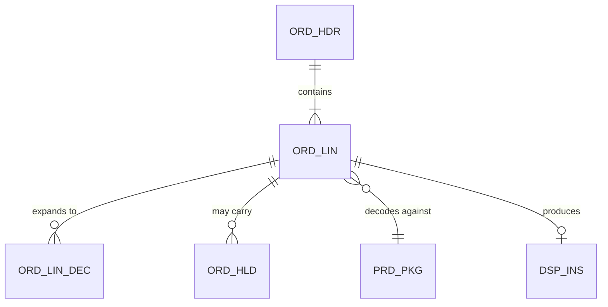

# Order Line — Data Dictionary

> Covers `ORD_LIN` and `ORD_LIN_DEC` — 47 of the 118 columns across the two tables. The 71
> undocumented columns are excluded deliberately: they are neither CDEs, nor in an external
> interface, nor derived, nor in a metric definition. §1 records which and why.

---

## Contents

| Section | Summary |
| --- | --- |
| [1. Scope](#1-scope) | `ORD_LIN` and `ORD_LIN_DEC` — 47 of 118 columns documented |
| [2. Entity: `ORD_LIN`](#2-entity-ord_lin) | Order line: grain, columns, and fields with non-obvious semantics |
| [3. Entity: `ORD_LIN_DEC`](#3-entity-ord_lin_dec) | Decoded option row: grain, columns, and the `OPT_SEQ_NO` instability |
| [4. Data quality](#4-data-quality) | Rules per field with thresholds and current attainment |
| [5. Physical profile](#5-physical-profile) | Profiling evidence: cardinality, nulls, and values still in use since 2020 |
| [6. Usage](#6-usage) | Readers, writers, interfaces, reports, and rules per field |
| [7. History](#7-history) | Field changes, including `SLS_OBJ_CD` repurposing that breaks pre-2007 comparability |
| [Change log](#change-log) | Version, date, author, change |

---

## 1. Scope

| | |
| --- | --- |
| Entities covered | `ORD_LIN` (order line), `ORD_LIN_DEC` (decoded option row) |
| Physical objects | `MERPROD.ORD_LIN`, `MERPROD.ORD_LIN_DEC` |
| Columns documented | 47 of 118 |
| Selection basis | All CDEs; all columns appearing in an external interface; all derived columns; all columns in a certified metric definition; all columns implicated in a data quality incident since 2024 |
| Excluded | 71 columns — audit timestamps, workflow flags used only within a single CICS transaction, and 14 columns no longer populated (§2.6) |

---

## 2. Entity: `ORD_LIN`

| | |
| --- | --- |
| Business name | Order line |
| Description | One requested model/package combination on a dealer order, with quantity and price |
| **Grain** | One row per order per line number. A line represents one package ordered in a quantity, **not** one physical unit |
| Primary key | `(ORD_ID, LIN_NO)` |
| Natural key | `(ORD_ID, LIN_NO)` — `ORD_ID` alone is the order |
| Owning domain | OPS — **except** `INCTV_ELIG_FL` and `SLS_OBJ_CD`, owned by SPR (§2.5) |
| Data Owner | VP, Order Operations |
| Data Steward | Order Data Steward |
| Authoritative source | Meridian |
| Row count | 812M |
| Daily new | ~95,000 |
| Retention | 7y online + 3y archive |
| Classification | Internal; `NET_AMT` is Confidential |

**Relationships**

| Related entity | Cardinality | Key | Enforced by | Orphans present |
| --- | --- | --- | --- | --- |
| `ORD_HDR` | N:1 | `ORD_ID` | **Application only** — no FK constraint | 14 rows, all pre-2009 |
| `ORD_LIN_DEC` | 1:N (avg 4.3) | `(ORD_ID, LIN_NO)` | Application only | ~340 rows, `DI-2025-018` |
| `ORD_HLD` | 1:N | `(ORD_ID, LIN_NO)` | FK constraint | 0 |
| `PRD_PKG` | N:1 | `MDL_PKG_CD` | **Nothing** | ~11,000 rows reference retired packages |

> "Enforced by: Nothing" is the important value. A consumer joining `ORD_LIN` to `PRD_PKG`
> must decide what to do with 11,000 rows whose package no longer exists, and that decision
> belongs to them — but only if they know. This table is how they find out.

---

### 2.1 Attributes

| ID | Field | Business name | Type | Null | Description | Valid values | Source | Owner | Class | CDE |
| --- | --- | --- | --- | --- | --- | --- | --- | --- | --- | --- |
| DE-001 | `ORD_ID` | Order identifier | `CHAR(12)` | N | The parent order. **Space-padded** | `^[A-Z]{3}\d{6}[A-Z]\d{2}$` | Captured | OPS | Internal | — |
| DE-002 | `LIN_NO` | Line number | `SMALLINT` | N | Sequence within the order, from 1. **Gaps occur** where a line was deleted pre-submission | 1–999 | Captured | OPS | Internal | — |
| DE-003 | `MDL_PKG_CD` | Model package code | `CHAR(17)` | N | The package ordered. Resolves against `PRD_PKG` effective at `DEC_DT` | See [RDR-PLR-001](reference-data-option-codes.md) | Captured | OPS | Internal | **CDE-001** |
| DE-004 | `QTY` | Quantity | `SMALLINT` | N | Units of the package ordered | 1–9999 | Captured | OPS | Internal | — |
| DE-005 | `NET_AMT` | Net unit amount | `DECIMAL(11,2)` | N | Net price per unit, excluding tax, after portfolio discounts. **Recalculated at decode** — §2.2 | ≥ 0 | Derived | OPS | **Confidential** | **CDE-002** |
| DE-006 | `LIN_STS_CD` | Line status | `CHAR(1)` | N | Lifecycle state | §2.4 | Derived | OPS | Internal | — |
| DE-007 | `DEC_DT` | Decode date | `DATE` | Y | The date whose reference data governs this line's decode. **Preserved across re-decodes** | — | Derived | OPS | Internal | — |
| DE-008 | `DEC_TS` | Decode timestamp | `TIMESTAMP` | Y | When decode last ran. Changes on re-decode; `DEC_DT` does not | — | Derived | OPS | Internal | — |
| DE-009 | `HLD_EVAL_TS` | Hold evaluation timestamp | `TIMESTAMP` | Y | When holds were last evaluated. **Null means never evaluated, and dispatch excludes the line** | — | Derived | OPS | Internal | — |
| DE-010 | `DRV_WGT` | Derived weight | `DECIMAL(9,2)` | Y | Sum of contained option weights, × 1.15 for EU + class H | ≥ 0, kg | Derived | OPS | Internal | — |
| DE-011 | `VOL_CLS_CD` | Volumetric class | `CHAR(2)` | Y | **Maximum** class among contained options, not the sum | `A1`–`E9` | Derived | OPS | Internal | — |
| DE-012 | `LEAD_BND_CD` | Lead-time band | `CHAR(2)` | Y | Band from the **longest** option lead time | `01`–`12` | Derived | OPS | Internal | — |
| DE-013 | `RQST_DLV_DT` | Requested delivery date | `DATE` | Y | Dealer's requested date. Advisory, not committed | — | Captured | OPS | Internal | — |
| DE-014 | `EXPD_FL` | Expedite flag | `CHAR(1)` | N | `'Y'` if an expedite was requested and accepted | `Y`/`N` | Captured | OPS | Internal | — |
| DE-015 | `ORD_TYP_CD` | Order type | `CHAR(2)` | N | Drives eligibility exclusions and the `ORDDEC88` path | `ST`, `FL`, `XF`, `DM`, `RP`, `WT` | Captured | OPS | Internal | — |
| DE-016 | `INCTV_ELIG_FL` | Incentive eligibility | `CHAR(1)` | Y | Whether the line counts toward objective attainment. **Owned by SPR** — §2.5 | `Y`/`N`/null | Derived | **SPR** | Confidential | **CDE-003** |
| DE-017 | `SLS_OBJ_CD` | Sales objective code | `CHAR(6)` | Y | The objective the line counts toward. **Meaning changes at period close** — §2.3 | See `SLS_OBJ` | Mixed | **SPR** | Internal | **CDE-004** |
| DE-018 | `TAX_CAT_CD` | Tax category | `CHAR(4)` | Y | Fed to the ERP tax engine. **Derivation not fully traced** | 🟡 Unconfirmed | Derived | OPS | Internal | **CDE-061** |
| DE-019 | `CRT_TS` | Created timestamp | `TIMESTAMP` | N | Capture time, UTC. Drives the extract cut-off | — | Captured | OPS | Internal | — |
| DE-020 | `SHRT_SHP_FL` | Short ship flag | `CHAR(1)` | N | `'Y'` if confirmed shipped quantity < ordered | `Y`/`N` | Derived | OPS | Internal | — |

*(27 further documented columns omitted from this example.)*

**Null semantics** — `null` does not mean one thing in this table:

| Field | Null means |
| --- | --- |
| `DEC_DT`, `DEC_TS` | Not yet decoded |
| `HLD_EVAL_TS` | **Not yet evaluated** — an operational state that excludes the line from dispatch |
| `DRV_WGT`, `VOL_CLS_CD`, `LEAD_BND_CD` | Not yet derived, i.e. not yet decoded |
| `INCTV_ELIG_FL` | Eligibility not yet computed — **distinct from `'N'`, which means computed and not eligible** |
| `RQST_DLV_DT` | Dealer supplied no preference — genuinely "not applicable" |
| `TAX_CAT_CD` | 🟡 Either not derived, or derived to no category. **Cannot currently be distinguished** |

> `INCTV_ELIG_FL` null vs. `'N'` has caused two reporting defects. A query counting
> `WHERE INCTV_ELIG_FL <> 'Y'` includes both not-yet-computed and not-eligible lines, which
> during the nightly window is most of the day's volume.

---

### 2.2 Derived attributes

#### `NET_AMT` (DE-005) ⚠️

| | |
| --- | --- |
| Business definition | Net price per unit payable by the dealer, excluding tax, after portfolio-level discounts |
| Formula | `PRD_PKG.NET_PRC` + sum of `PRD_PKG_OPT.PRC_DELTA` for contained options, effective at `DEC_DT` |
| Inputs | Portfolio feed (`IF-022`) via `PRD_PKG`, `PRD_PKG_OPT` |
| Calculated by | Capture (initial), then **`ORDDEC01` at decode (overwrite)** |
| Recalculated on re-decode | **Yes** |
| Rounding | Half-up to 2dp, applied once after summing deltas |
| Null/zero | A null `PRC_DELTA` contributes 0 and raises `DQ-PLR-011` |
| Historical behaviour | `DEC_DT` is preserved across re-decodes, so effective-dated pricing resolves identically — **for lines decoded on or after 2014-06-01** |
| Business rule | BR-OPS-070 |
| Lineage | [DLN-OPS-001 §3.2](lineage-order-to-cash.md) |
| Confidence | ✅ Verified |

**The behaviour that surprises everyone:** `NET_AMT` is set at capture and **overwritten at
decode**. If the portfolio feed changed between the two — which happens daily during
model-year changeover — the dealer is quoted one price at submission and invoiced another.
~40 lines/month normally, ~600/month at changeover. Tracked as `DI-2025-014`; the business
decision on whether to freeze price at capture is still open.

**Worked example**

| Input | Value |
| --- | --- |
| `PRD_PKG.NET_PRC` for `MP2026STD-A4471X` | 1,180.00 |
| Option `OPT-4402` delta | +55.00 |
| Option `OPT-7710` delta | +15.00 |
| Option `OPT-1120` delta | 0.00 |
| Option `OPT-9003` delta | 0.00 |
| **`NET_AMT`** | **1,250.00** |

#### `DRV_WGT` (DE-010)

| | |
| --- | --- |
| Formula | `SUM(PRD_OPT.WGT)` × 1.15 if `DLR_MST.RGN_CD = 'EU'` **and** any option has `OPT_CLS_CD = 'H'` |
| Why the multiplier | EU packaging weight regulation, cited in the 2011 change ticket |
| Rounding | Half-up to 2dp, once, after the multiplier |
| Consumer | EDI 850 `MEA-03`; converted kg → lb for the 9 US vendors |
| Business rule | BR-OPS-062 |
| Confidence | ✅ Verified — `ORDDRV07.CBL:744` at `R2026.03` |

#### `VOL_CLS_CD` (DE-011)

| | |
| --- | --- |
| Formula | **`MAX(PRD_OPT.OPT_CLS_CD)`** among contained options, by the class ordering in `REF_VOL_CLS` |
| Common misconception | That it sums. Three SMEs believed this; test TC-D-31 disproved it |
| Business rule | BR-OPS-063 |
| Confidence | ✅ Verified |

---

### 2.3 Fields with non-obvious semantics ⚠️

| Field | Apparent meaning | Actual meaning | Why | Confidence | Evidence |
| --- | --- | --- | --- | --- | --- |
| `SLS_OBJ_CD` | The objective this line counts toward | **Two different things at different times.** Before period close it is a *default* copied from the dealer's profile at capture. After close it is the *actual* objective assigned by `SLS-ELIG-090`, which may differ | The column was reused in 2007 rather than a second one added | ✅ Verified | `SLSELG03.CBL:310`; `DI-2025-027` |
| `DEC_DT` | The date decode ran | **The date whose reference data governs the decode.** Unchanged by a re-decode; `DEC_TS` is the date decode ran | Effective dating added in 2014 needed a stable as-at date | ✅ Verified | `ORDPKG03.CBL:244` |
| `EXPD_FL` | An expedite was requested | An expedite was requested **and accepted by the vendor.** A requested-but-refused expedite leaves this `'N'` | — | ✅ Verified | `ORDEXP02.CBL:88` |
| `LIN_STS_CD = 'X'` | Cancelled | Cancelled **or** superseded by an amendment. The two are not distinguished in this column | Amendment was implemented as cancel-and-replace in 2009 | ✅ Verified | §2.4 |
| `QTY` | Number of physical units | Number of **packages**. A package can contain multiple physical units for some product lines | — | 🟡 Inferred — true for product lines `C` and `E`; not confirmed for `F` | `DI-2026-009` |

**Overloaded fields**

| Field | Meaning A | When | Meaning B | When | Discriminator |
| --- | --- | --- | --- | --- | --- |
| `SLS_OBJ_CD` | Default from dealer profile | Capture → period close | Assigned objective | After period close | `ORD_HDR.PERIOD_CLS_FL` |
| `RQST_DLV_DT` | Dealer's requested date | `ORD_TYP_CD` ≠ `'WT'` | **Warranty claim date** | `ORD_TYP_CD = 'WT'` | `ORD_TYP_CD` |

> The second row is a genuine trap. For warranty orders, a date field named "requested
> delivery date" holds a claim date. ~900 rows/month. Any report filtering on
> `RQST_DLV_DT` without excluding `WT` is wrong, and at least one warehouse extract does
> exactly that — `DI-2026-012`.

**Fields no longer populated**

| Field | Last populated | Why stopped | Still read by | Safe to drop? |
| --- | --- | --- | --- | --- |
| `RGN_ALLOC_CD` | 2014-03 | Regional allocation moved to SPR | Nothing | Yes, after archive review |
| `FAX_CNF_FL` | 2014-08 | EDI replaced fax confirmation | **One warehouse extract still selects it** | No — fix the extract first |
| `PRT_BATCH_NO` | 2009-11 | Print batching retired with the green-screen order print | Nothing | Yes |
| *(11 further)* | | | | |

---

### 2.4 `LIN_STS_CD` values

| Value | Meaning | Set by | Volume | Notes |
| --- | --- | --- | --- | --- |
| `R` | Received, awaiting decode | Capture | 4% | |
| `D` | Decoded | `ORD-DECODE-020` | 91% | |
| `E` | Decode exception | `ORDEXC09` | 1.8% | Routed to one of 9 queues |
| `H` | Held | Hold Service | 2.4% | Line may be `D` and held simultaneously — see below |
| `S` | Dispatched | `ORD-DISPATCH-040` | — | |
| `C` | Shipment confirmed | `ASN-INGEST-060` | — | |
| `I` | Invoiced | `FIN-INVOICE-070` | — | |
| `X` | Cancelled **or superseded** | Various | 3% | Ambiguous — §2.3 |
| `Z` | Closed | `FIN-GL-080` | — | |
| `P`, `Q`, `V` | **Dead since 2014** | — | 0 | Pre-2014 workflow states; 2.1M historical rows carry them |
| `W`, `Y` | **Unknown** 🔴 | — | 41 rows, all 1998–2001 | No code path sets or reads these |

> Status and hold are **separate dimensions**. A line can be `D` (decoded) and carry a
> blocking hold at the same time; `'H'` is set only when the hold is applied through the
> green-screen manual path. This inconsistency is a known defect (`DI-2024-031`) and means
> `LIN_STS_CD = 'H'` undercounts held lines by roughly 80%. Query `ORD_HLD` instead.

---

### 2.5 Cross-domain fields

| Field | Defining domain | Populated by | Read by | Change approval |
| --- | --- | --- | --- | --- |
| `INCTV_ELIG_FL` | **SPR** | `SLS-ELIG-090` nightly | OPS UI, SPR incentive, warehouse | Order Data Owner **and** Sales Data Owner |
| `SLS_OBJ_CD` | **SPR** | OPS at capture (default), SPR at period close | SPR attainment, warehouse | Sales Data Owner, Order Data Owner notified |

Both are violations V-01 and V-02 in
[DMAP-MER-001 §4.1](../00-foundations/domain-map.md). Dual approval applies per
[DGC-MER-001 §3.3](data-governance-charter.md).

---

## 3. Entity: `ORD_LIN_DEC`

| | |
| --- | --- |
| Business name | Decoded option row |
| Description | One option contained in a decoded order line |
| **Grain** | One row per order per line per option code |
| Primary key | `(ORD_ID, LIN_NO, OPT_CD)` |
| Row count | 3.9B |
| Daily new | ~410,000 |
| Retention | 7y |

| ID | Field | Type | Null | Description | Valid values | Confidence |
| --- | --- | --- | --- | --- | --- | --- |
| DE-101 | `ORD_ID` | `CHAR(12)` | N | Parent order | — | ✅ |
| DE-102 | `LIN_NO` | `SMALLINT` | N | Parent line | — | ✅ |
| DE-103 | `OPT_CD` | `CHAR(8)` | N | Option contained | `PRD_OPT` | ✅ |
| DE-104 | `DEC_DT` | `DATE` | N | As-at date governing this expansion | — | ✅ |
| DE-105 | `DEC_SRC_CD` | `CHAR(1)` | N | How the option got here | `P` from package (99.7%), `A` auto-added by a required-option rule (0.3%), `Z` demo (0.01%) | ✅ |
| DE-106 | `OPT_SEQ_NO` | `SMALLINT` | N | Order of expansion. **Not stable across re-decodes** — see below | 1–99 | ✅ |

> `DEC_SRC_CD = 'A'` marks options the system added that the dealer did not order, under the
> required-option rule BR-OPS-009. They appear on the invoice. Dealers occasionally query
> them, and this column is the answer.
>
> `OPT_SEQ_NO` is **not stable**: it reflects the physical row order of `PRD_CMP_RUL` at
> decode time, which changes after a `REORG`. It must not be used as a business identifier.
> See the non-determinism finding in
> [LGA-OPS-001 §4.3](../01-architecture/legacy-system-archaeology-order-decoder.md).

---

## 4. Data quality

| Field | Rule | Dimension | Threshold | Current | Rule ID |
| --- | --- | --- | --- | --- | --- |
| `MDL_PKG_CD` | Resolves in `PRD_PKG` effective at `DEC_DT` | Validity | ≥ 99.9% | 99.97% | `DQ-OPS-003` |
| `NET_AMT` | > 0 for `ORD_TYP_CD` in (`ST`,`FL`) | Validity | 100% | 100% | `DQ-OPS-005` |
| `HLD_EVAL_TS` | Non-null for all lines with status `D` at dispatch time | Completeness | 100% | 99.996% | `DQ-OPS-021` |
| `INCTV_ELIG_FL` | Non-null for all invoiced lines after `SLS-ELIG-090` | Completeness | 100% | 99.94% | `DQ-OPS-018` |
| `ORD_LIN` → `ORD_LIN_DEC` | Every non-exception line has ≥ 1 decoded row | Integrity | 100% | 99.99996% | `DQ-OPS-014` |
| `TAX_CAT_CD` | — | — | — | **No rule** | ❌ `DI-2024-018` |
| `LIN_STS_CD` | In the active value set | Validity | 100% | 100% | `DQ-OPS-007` |
| `QTY` | Between 1 and 9999 | Validity | 100% | 100% | `DQ-OPS-008` |

**Known quality issues**

| Field | Issue | Extent | Since | Root cause | Impact | Issue |
| --- | --- | --- | --- | --- | --- | --- |
| `NET_AMT` | Capture/decode divergence | ~40/month, ~600/month at changeover | Always | Design (§2.2) | Dealer price surprise | `DI-2025-014` |
| `LIN_STS_CD` | `'H'` undercounts held lines by ~80% | Standing | 2022 | Hold externalisation left the status write behind | Reports using status miss holds | `DI-2024-031` |
| `MDL_PKG_CD` | ~11,000 rows reference retired packages | Standing | Always | No FK; packages retire, lines persist | Joins must be outer | — |
| `TAX_CAT_CD` | No definition, no lineage, no rule | Standing | Always | `REF.TAXCAT` layout unknown | Regulatory exposure | `DI-2024-018` |
| `RQST_DLV_DT` | Holds a claim date for `WT` orders | ~900/month | 2011 | Field overloaded | One warehouse extract is wrong | `DI-2026-012` |

---

## 5. Physical profile

| Field | Distinct | Null % | Min | Max | Most frequent | Values since 2020 |
| --- | --- | --- | --- | --- | --- | --- |
| `LIN_STS_CD` | 14 | 0% | — | — | `D` (91%) | 11 |
| `ORD_TYP_CD` | 6 | 0% | — | — | `ST` (96%) | 6 |
| `NET_AMT` | 41,208 | 0% | 0.00 | 184,220.00 | 1,250.00 | — |
| `QTY` | 187 | 0% | 1 | 640 | 1 (78%) | — |
| `INCTV_ELIG_FL` | 3 | 8.2% | — | — | `Y` (74%) | 3 |
| `TAX_CAT_CD` | 22 | 0.3% | — | — | `TC01` (61%) | 19 |
| `DEC_SRC_CD` | 3 | 0% | — | — | `P` (99.7%) | 3 |

Profile date: 2026-06-20 · Source: production · Sample: full table scan

---

## 6. Usage

| Field | Read by | Written by | External interfaces | Reports/metrics | Business rules |
| --- | --- | --- | --- | --- | --- |
| `MDL_PKG_CD` | Decoder, dispatch, warehouse | Capture, PLR changeover script | IF-042 | Portfolio mix | BR-OPS-002 |
| `NET_AMT` | Dispatch, invoice, incentive, warehouse | Capture, decoder | IF-042, IF-051 | Revenue, ASP | BR-OPS-070, BR-OPS-050 |
| `INCTV_ELIG_FL` | Incentive calc, warehouse, OPS UI | `SLS-ELIG-090` | — | Attainment | BR-SPR-014 |
| `HLD_EVAL_TS` | Dispatch | Hold Service | — | — | BR-OPS-030 |
| `DRV_WGT` | Dispatch | Decoder | IF-042 | Freight cost | BR-OPS-062 |
| `TAX_CAT_CD` | Invoice | Decoder | IF-051 | Tax reporting | — |

---

## 7. History

| Field | Change | Date | Reason | Backfilled | Impact on historical data |
| --- | --- | --- | --- | --- | --- |
| `SLS_OBJ_CD` | Repurposed to hold the post-close assigned objective as well as the capture default | 2007-04 | Avoided adding a column | No | **Pre-2007 rows hold only the default.** A query treating it as the assigned objective is wrong for pre-2007 data |
| `DEC_DT` | Added | 2014-06 | Effective dating | **Yes** — set to `DATE(DEC_TS)` for all existing rows | Pre-2014 rows have a `DEC_DT` but the decoder bypasses the effective-date predicate for them |
| `INCTV_ELIG_FL` | Added | 2016-01 | Incentive automation | No | Null for all pre-2016 rows; attainment before 2016 came from a separate extract |
| `HLD_EVAL_TS` | Added | 2022-06 | Hold externalisation | **No** | Null for all pre-2022 rows. A query asserting non-null must scope to `DEC_TS >= 2022-06-20` |
| `VOL_CLS_CD` | **Meaning changed** from sum to maximum | 2019-11 | Defect fix — the sum produced classes outside the valid range | **No** | ⚠️ **Pre- and post-2019-11 values are not comparable.** Trend reports spanning the boundary are wrong |

> The last row is the most dangerous entry in this dictionary: a column whose *meaning*
> changed while its name, type, and nullability did not. Nothing in the schema records it,
> no test would catch it, and a five-year trend on volumetric class mix has a break in it
> that nobody would look for. It is also flagged on DE-011 itself, because a reader
> consulting one attribute will not necessarily read §7.

---

## Change log

| Version | Date | Author | Change |
| --- | --- | --- | --- |
| 4.0.0 | 2026-06-24 | Order Data Steward | Added §2.3 overloaded-field table (`RQST_DLV_DT` for warranty orders, `DI-2026-012`); added `ORD_LIN_DEC` §3 including the `OPT_SEQ_NO` instability from `LGA-OPS-001`; added the §7 `VOL_CLS_CD` meaning change |
| 3.1.0 | 2026-01-30 | Order Data Steward | Added `DEC_SRC_CD` values and the auto-added option explanation |
| 3.0.0 | 2025-08-19 | Order Data Steward | Added §2.5 cross-domain fields after the schema audit |
| 1.0.0 | 2024-07-30 | Data Governance Office | Initial dictionary |
