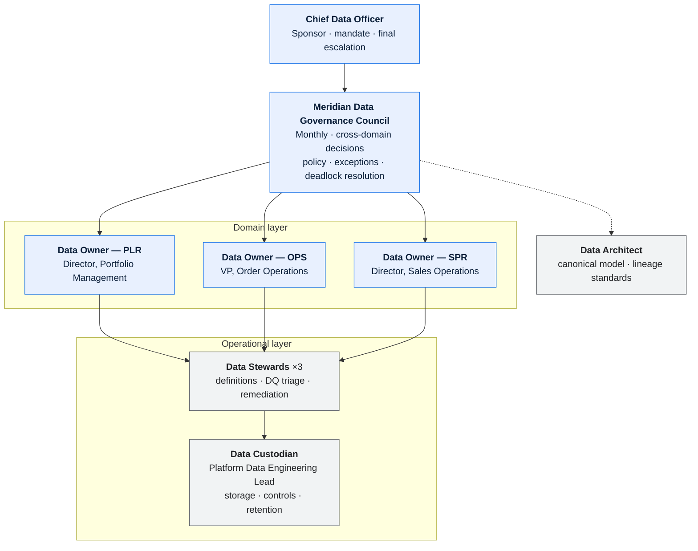
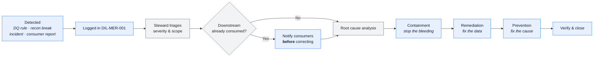

# Meridian — Data Governance Charter

> **The test of a governance charter is whether it resolves a real dispute.** §4 names who
> decides what, with an SLA and a deadlock rule. Everything else in this document exists to
> support that section.

---

## Contents

| Section | Summary |
| --- | --- |
| [1. Scope and mandate](#1-scope-and-mandate) | PLR, OPS, and SPR data in scope; ERP and warehouse explicitly excluded |
| [2. Objectives](#2-objectives) | Five measurable objectives with baseline and current value, including one unmet |
| [3. Operating model](#3-operating-model) | Operating model, roles, and column-level ownership of contested fields |
| [4. Decision rights](#4-decision-rights) | Proposer, consulted, decider, escalation, and SLA per decision — with deadlock escalation |
| [5. Policies](#5-policies) | Eleven policies, each with an enforcement mechanism and measure |
| [6. Critical Data Elements](#6-critical-data-elements) | Designation criteria and the CDE register |
| [7. Forums](#7-forums) | Council and steward forums with quorum and decision rights |
| [8. Processes](#8-processes) | Data quality issue and definition change workflows |
| [9. Compliance measurement](#9-compliance-measurement) | Metrics on ownership, definition, and lineage coverage over three years |
| [10. Maturity assessment](#10-maturity-assessment) | Maturity by dimension, 2024 against 2026, with evidence |
| [11. Roadmap](#11-roadmap) | Phased plan with deliverables and success criteria |
| [Change log](#change-log) | Version, date, author, change |

---

## 1. Scope and mandate

| | |
| --- | --- |
| Scope | All data created, stored, or transmitted by Meridian across the PLR, OPS, and SPR domains, including data in flight to and from 43 fulfilment vendors and the corporate ERP |
| Explicitly out of scope | Corporate ERP master data (dealer, GL account, tax) — governed by the ERP data council; Enterprise Warehouse semantic layer — governed by the BI council, though metric definitions must conform to [MET-SPR-001](metric-catalog-sales-reporting.md) |
| Mandate source | Chief Data Officer, ratified by the Commercial Operations leadership team 2024-05-30 |
| Effective date | 2024-06-11 |
| Sponsor | Chief Data Officer |
| Authority to compel | The Council may **block a release** that changes a Critical Data Element without an approved definition, and may **revoke data access** for policy breach. It may **not** compel a domain to fund remediation; unfunded findings escalate to the Sponsor |

**Regulatory and policy drivers**

| Driver | Obligation | Data affected | Control | Evidence |
| --- | --- | --- | --- | --- |
| SOX — revenue recognition | Demonstrable lineage from order to GL posting | `ORD_LIN`, `SHP_CNF`, `INV_LIN`, `GL_JRN` | [DLN-OPS-001](lineage-order-to-cash.md) is the walkthrough artefact | Annual walkthrough; last passed 2026-04 with one finding (AF-2025-11) |
| Sales & use tax | Accurate tax category on every invoiced line | `ORD_LIN_DEC`, `REF.TAXCAT` | Tax category derivation documented; **layout uncertainty open** (`LGA-OPS-001` Q-A02) | Quarterly sample test |
| Dealer franchise regulation (3 jurisdictions) | Incentive calculation auditable and reproducible | `SLS_OBJ`, `SLS_ICL`, `SLS_IPY` | [DLN-SPR-001](lineage-sales-incentive-payout.md) | On regulator request; last 2025-09 |
| GDPR / state privacy law | Dealer contact data: lawful basis, retention, subject rights | `DLR_MST` contact columns | Retention schedule; erasure feasibility assessed | `DRC-MER-001` |
| Vendor master agreement §11 | Vendor volume and pricing data not disclosed to other vendors | `DSP_INS`, `ORD_LIN.NET_AMT` | Per-vendor file segregation; access controls | Annual attestation |

---

## 2. Objectives

| # | Objective | Measure | Target | Baseline (2024-06) | Current (2026-05) |
| --- | --- | --- | --- | --- | --- |
| 1 | Eliminate disputes about what a published figure means | Metric definition disputes escalated to the Council per quarter | 0 | 4 | **1** |
| 2 | Make the order-to-cash lineage audit-ready without a project | Days of effort to produce SOX walkthrough evidence | ≤ 2 | 21 | **3** |
| 3 | Reduce incentive restatements caused by data defects | Restatements per quarter | ≤ 2 | 9 | **3** |
| 4 | Bring reference data changes under change control | % of `PRD_*` changes with a recorded approver | 100% | 0% | **0%** ⚠️ |
| 5 | Establish resolvable ownership for every CDE | % of CDEs with a named Data Owner | 100% | 41% | **100%** |

> Objective 4 has not moved in two years. It is the governance gap that caused INC-2025-0412
> and it is stated plainly rather than quietly dropped. The remediation is funded for Q4
> 2026; see §11.

---

## 3. Operating model

### 3.1 Roles

| Role | Accountable for | Decision rights | Time commitment |
| --- | --- | --- | --- |
| Chief Data Officer | Mandate, funding, final escalation | Overrides a deadlocked Council | ~2h/quarter |
| Data Governance Lead | The operating model works; compliance is measured and reported | Chairs the Council; may block a release under §1 | 0.6 FTE |
| Data Owner (per domain) | Meaning, access decisions, quality targets for the domain's data | Approves definitions, access, exceptions within the domain | ~4h/month |
| Data Steward (per domain) | Definitions maintained, DQ triaged, remediation driven | Proposes; escalates; cannot approve | 0.5 FTE each |
| Data Custodian | Storage, controls, retention execution, access provisioning | Implements; reports compliance; may refuse a request that breaches policy | 0.3 FTE |
| Data Architect | Lineage standards, canonical model coherence | Approves lineage documents and model changes | 0.2 FTE |

### 3.2 Domain assignments

| Domain | Data Owner | Data Steward | Data Custodian | Core entities | CDEs |
| --- | --- | --- | --- | --- | --- |
| PLR | Director, Portfolio Management | Portfolio Data Steward | Platform Data Engineering Lead | `PRD_PKG`, `PRD_OPT`, `PRD_PKG_OPT`, `PRD_CMP_RUL`, `PRD_LNCH` | 14 |
| OPS | VP, Order Operations | Order Data Steward | Platform Data Engineering Lead | `ORD_HDR`, `ORD_LIN`, `ORD_LIN_DEC`, `ORD_HLD`, `DSP_INS`, `SHP_CNF`, `INV_LIN` | 31 |
| SPR | Director, Sales Operations | Sales Data Steward | Platform Data Engineering Lead | `SLS_OBJ`, `SLS_ICL`, `SLS_IPY`, `SLS_ADJ`, `INV_POS` | 22 |
| *(unowned)* | — | — | — | `DLR_MST` — a projection of ERP master data | 4 |

> `DLR_MST` has no Meridian Data Owner because the ERP owns it. That is correct, and it is
> stated explicitly so that nobody assumes Meridian can change a dealer record. Access and
> quality questions route to the ERP data council; Meridian owns only the currency of its
> copy.

### 3.3 Cross-domain data — column-level ownership

> The rows that do the work. Where a column's physical home and its defining domain differ,
> **both** Data Owners approve any change. These are the highest-risk fields in the system.

| Column | Physical home | Defining domain | Populated by | Consumed by | Change approval | Violation ref |
| --- | --- | --- | --- | --- | --- | --- |
| `ORD_LIN.INCTV_ELIG_FL` | OPS | **SPR** | `SLS-ELIG-090` nightly | OPS UI, SPR incentive calc, warehouse | Order Data Owner **and** Sales Data Owner | V-01 |
| `ORD_LIN.SLS_OBJ_CD` | OPS | **SPR** | OPS at capture (default from dealer profile), SPR at period close | SPR attainment, warehouse | Sales Data Owner, with Order Data Owner notified | V-02 |
| `ORD_LIN.MDL_PKG_CD` | OPS | OPS | OPS at capture; **PLR** annual changeover script | Everything | Order Data Owner; **PLR must obtain approval before each changeover run** | V-04 |
| `INV_POS.PLND_QTY` | SPR | SPR | SPR nightly; **OPS** `ORDDSP01` decrements directly | SPR planning, OPS expedite | Sales Data Owner **and** Order Data Owner | V-03 |
| `ORD_LIN.NET_AMT` | OPS | OPS | Portfolio feed at capture; **recalculated by the decoder** | Invoice, GL, incentive, warehouse | Order Data Owner | — |
| `PRD_PKG.DSPTCH_LEAD_DAYS` | PLR | **Vendor Integration** | Vendor onboarding process | OPS lead-time derivation | Portfolio Data Owner **and** Vendor Integration Lead | — |

**Rule.** Where physical home and defining domain differ, a change to the column's meaning,
type, population logic, or timing requires approval from both Data Owners. Single-sided
changes are a policy breach and are reported to the Council. Four Sev-2 incidents since 2024
originated in single-sided changes to these six columns.

---

## 4. Decision rights

| Decision | Proposer | Consulted | Decider | Escalation | SLA |
| --- | --- | --- | --- | --- | --- |
| Define or change a data element's meaning | Steward | Affected consumers | Data Owner | Council | 10 business days |
| Change a cross-domain column (§3.3) | Steward | Both stewards, affected consumers | **Both Data Owners jointly** | Council | 15 business days |
| Add a reference data code value | Portfolio Data Steward | Order Data Steward | Portfolio Data Owner | Council | 5 business days |
| **Retire a reference data code value** | Portfolio Data Steward | All consumers, Vendor Integration | Portfolio Data Owner | Council | 20 business days |
| Grant access to confidential data | Requester | Steward | Data Owner | Council | 5 business days |
| Accept a data quality exception | Steward | Consumers | Data Owner | Council | 5 business days |
| Approve a new data contract | Producer | Consumers | Both parties | Council | 15 business days |
| **Change a metric definition** | Sales Data Steward | All report consumers, Sales Finance | Sales Data Owner **and** Finance Controller | Council | 15 business days |
| Approve a purge or retention change | Custodian | Legal, Internal Audit | Data Owner | Sponsor | 20 business days |
| Resolve a definition dispute between domains | Either party | Both stewards | **Council** | Sponsor | 20 business days |
| Approve a lineage document | Steward | Data Architect | Data Architect | Council | 10 business days |

**Deadlock rule.** A joint decision not reached within its SLA escalates **automatically** to
the Council at the next monthly meeting — neither party has to raise it. A Council that
cannot decide within one further cycle escalates to the Sponsor, who decides. In practice
this has been invoked twice: once on the `spr.unit` definition (resolved at Council, 2025-02)
and once on `ORD_LIN.SLS_OBJ_CD` ownership (resolved by the Sponsor, 2025-11).

> An escalation path that terminates at a committee is not a path. The Sponsor is named, and
> the Sponsor decides.

---

## 5. Policies

### P-01 Data ownership

| | |
| --- | --- |
| Statement | Every data element in the CDE register has exactly one accountable Data Owner. Cross-domain columns per §3.3 have two, and both must approve. |
| Enforcement | The data dictionary validator rejects a CDE entry without a resolvable owner role |
| Measure | % of CDEs with a resolvable owner |
| Current | **100%** (71 of 71) |
| Exceptions | None |

### P-02 Authoritative source

| | |
| --- | --- |
| Statement | Every data element has one designated authoritative source. Consumers read from it or from an approved derivative recorded in the lineage. |
| Enforcement | Lineage documents name the authoritative source per hop; the Data Architect rejects a lineage that does not |
| Measure | % of CDEs with a named authoritative source |
| Current | 96% (68 of 71) — 3 gaps are the `REF.TAXCAT` fields pending `LGA-OPS-001` Q-A02 |

### P-03 Definitions before use

| | |
| --- | --- |
| Statement | A data element used in an external interface, a financial or regulatory report, or an automated business decision must have an approved definition in a data dictionary before it is used. |
| Enforcement | Release gate: the Council may block a release introducing an undefined CDE |
| Measure | % of CDEs with an approved definition |
| Current | 94% (67 of 71) |

### P-04 Lineage for critical data

| | |
| --- | --- |
| Statement | Every CDE has documented field-level lineage from origin to each consumption point, reviewed semi-annually. |
| Enforcement | Data Architect approval; staleness reported to the Council |
| Measure | % of CDEs with current lineage |
| Current | 89% (63 of 71) |

### P-05 Reference data change control ⚠️

| | |
| --- | --- |
| Statement | Changes to `PRD_PKG`, `PRD_OPT`, `PRD_PKG_OPT`, and `PRD_CMP_RUL` follow the registry change process, are approved by the Portfolio Data Owner, and are effective-dated. |
| Rationale | Reference data changes production decoding behaviour for all 3,200 dealers. A change here is an undeclared release. |
| Enforcement | **None today.** The maintenance screen has no approval workflow |
| Measure | % of `PRD_*` changes with a recorded approver |
| Current | **0%** — Objective 4 |
| Remediation | Approval workflow + change preview, funded Q4 2026, ~25 days |

> This is the most consequential policy in the charter and the least enforced. Stating that
> plainly is more useful than a policy statement that implies a control which does not exist.

### P-06 Data quality measurement

| | |
| --- | --- |
| Statement | Every CDE has at least one automated quality rule with a threshold, an owner, and a defined breach action. |
| Enforcement | DQ rule register reviewed quarterly by the Council |
| Measure | % of CDEs with an active rule |
| Current | 82% (58 of 71) |

### P-07 Classification and protection

| | |
| --- | --- |
| Statement | Data is classified at creation, and controls appropriate to the classification apply at every hop of its lineage — including extracts, warehouse copies, and files sent to vendors. |
| Enforcement | Classification recorded in the dictionary; lineage documents record classification per hop |
| Measure | % of lineage hops with a recorded classification and matching controls |
| Current | 91% |

### P-08 Retention and disposal

| | |
| --- | --- |
| Statement | Data is retained per the retention schedule and disposed of with evidence. |
| Enforcement | Custodian executes; evidence retained for audit |
| Measure | % of retention rules with executed purge evidence in the last cycle |
| Current | 76% — the gap is warehouse extracts and vendor-held copies |

### P-09 Change notification

| | |
| --- | --- |
| Statement | Producers notify registered consumers before a breaking change, respecting contracted notice periods. |
| Enforcement | Data contracts; the Council reviews breaches |
| Measure | Breaking changes shipped without notice |
| Current | 1 in the last 12 months (`SHP_CNF.SHP_DT` semantic change, 2025-10 — see [DCT-VND-001](data-contract-vendor-shipping-confirmation.md)) |

### P-10 Metric definitions

| | |
| --- | --- |
| Statement | A metric published to more than one audience has a single approved definition in [MET-SPR-001](metric-catalog-sales-reporting.md), and every implementation is tested against it. |
| Rationale | Two reports disagreeing about "units sold" cost 11 dealer disputes in 2024 |
| Enforcement | BI council and Meridian Council jointly; uncertified metrics may not appear on a dealer-facing report |
| Measure | % of published metrics certified |
| Current | 88% (37 of 42) |

---

## 6. Critical Data Elements

**Designation criteria** — an element is a CDE if it meets any of:

| # | Criterion | CDEs meeting it |
| --- | --- | --- |
| 1 | Used in external financial or regulatory reporting | 24 |
| 2 | Transmitted to an external party under contract | 31 |
| 3 | Used to calculate a payment, incentive, credit, or invoice | 28 |
| 4 | Used to make an automated business decision | 19 |
| 5 | Personal or otherwise regulated data | 4 |
| 6 | Recurrently implicated in data quality incidents | 9 |

*(Criteria overlap; 71 distinct CDEs.)*

| CDE | Element | Domain | Criteria | Owner | Dictionary | Lineage | DQ rules |
| --- | --- | --- | --- | --- | --- | --- | --- |
| CDE-001 | `ORD_LIN.MDL_PKG_CD` | OPS | 2,3,4 | VP Order Operations | ✅ | ✅ | ✅ |
| CDE-002 | `ORD_LIN.NET_AMT` | OPS | 1,2,3 | VP Order Operations | ✅ | ✅ | ✅ |
| CDE-003 | `ORD_LIN.INCTV_ELIG_FL` | **SPR** *(in OPS table)* | 3,4,6 | Director Sales Ops **+** VP Order Ops | ✅ | ✅ | ✅ |
| CDE-004 | `ORD_LIN.SLS_OBJ_CD` | **SPR** *(in OPS table)* | 3,6 | Director Sales Ops | ✅ | ✅ | ⚠️ Partial |
| CDE-011 | `SHP_CNF.SHP_DT` | OPS | 1,2,3,6 | VP Order Operations | ✅ | ✅ | ✅ |
| CDE-012 | `SHP_CNF.SHP_QTY` | OPS | 1,2,3 | VP Order Operations | ✅ | ✅ | ✅ |
| CDE-023 | `INV_LIN.INV_AMT` | OPS | 1,3 | VP Order Operations | ✅ | ✅ | ✅ |
| CDE-031 | `GL_JRN.JRN_AMT` | OPS | 1 | VP Order Operations | ✅ | ✅ | ✅ |
| CDE-042 | `SLS_OBJ.OBJ_QTY` | SPR | 3,4 | Director Sales Ops | ✅ | ✅ | ✅ |
| CDE-048 | `SLS_IPY.PAYOUT_AMT` | SPR | 1,3 | Director Sales Ops | ✅ | ✅ | ✅ |
| CDE-055 | `PRD_PKG_OPT.OPT_CD` | PLR | 2,4 | Director Portfolio Mgmt | ✅ | ⚠️ | ✅ |
| CDE-061 | `ORD_LIN_DEC.TAX_CAT_CD` | OPS | 1,4 | VP Order Operations | ⚠️ | ❌ | ❌ |
| *(59 further)* | | | | | | | |

> `CDE-061` is the honest gap: tax category feeds the ERP tax engine, has no lineage, and no
> quality rule, because the `REF.TAXCAT` layout is not fully understood
> (`LGA-OPS-001` Q-A02). It is criterion 1 — regulatory — and it is the Council's top open
> item.

---

## 7. Forums

| Forum | Cadence | Chair | Members | Quorum | Decisions it may take | Minutes |
| --- | --- | --- | --- | --- | --- | --- |
| Data Governance Council | Monthly, 90 min | Data Governance Lead | 3 Data Owners, 3 Stewards, Custodian, Data Architect, Internal Audit (observer) | 2 of 3 Data Owners + Chair | Cross-domain definitions, policy, exceptions, deadlock resolution, release blocks | `governance/council/` |
| Steward working session | Fortnightly, 60 min | Rotating | 3 Stewards, Data Architect | 2 stewards | Definition drafting, DQ triage, issue prioritisation | `governance/stewards/` |
| Data quality review | Monthly, 45 min | Order Data Steward | Stewards, Custodian, SRE | 2 | Threshold changes, issue closure | `governance/dq/` |
| Reference data change board | **Proposed, not yet established** | Portfolio Data Owner | Portfolio + Order Stewards, Vendor Integration | — | Reference data approvals (P-05) | — |

**Standing Council agenda**

1. Open decisions and their SLAs — anything past SLA is taken first
2. Automatic escalations under the deadlock rule
3. Data quality dashboard and breaches
4. Data issue log: new, ageing > 90 days, closed
5. Exceptions requested and expiring
6. Policy compliance metrics (§9)
7. Upcoming changes affecting shared data or cross-domain columns

---

## 8. Processes

### 8.1 Data quality issue

**Notify before correcting.** If a consumer has already used the bad data, correcting it
silently means their figures change without explanation. The notification step is mandatory
and is the step most often skipped under time pressure.

**An issue may not be closed without a prevention action or an explicit Council decision to
accept recurrence risk.** Before this rule (2025-02), 6 of 14 closed issues recurred within
a year; since, 1 of 19.

### 8.2 Reference data change — current vs. target

| Step | Current | Target (funded Q4 2026) |
| --- | --- | --- |
| 1 | Analyst edits the maintenance screen | Analyst drafts the change |
| 2 | — | **Change preview**: the change is applied to a copy and the prior night's lines are re-decoded; the delta is reported |
| 3 | — | **Portfolio Data Owner approves**, with the delta attached |
| 4 | Change is live at the next decode | Change is scheduled with an effective date |
| 5 | `PRD_AUD` records who and when | `PRD_AUD` records who, when, approver, and reason |
| 6 | — | Consumers on the notification list are informed |

> Step 2 is the control that would have prevented INC-2025-0412: the change removed an
> option from a package, and re-decoding the prior night would have shown 1,840 lines
> changing composition.

---

## 9. Compliance measurement

| Metric | Target | 2024-06 | 2025-05 | 2026-05 | Trend | Owner |
| --- | --- | --- | --- | --- | --- | --- |
| CDEs with a resolvable owner | 100% | 41% | 88% | **100%** | ▲ | Data Governance Lead |
| CDEs with an approved definition | 100% | 33% | 79% | **94%** | ▲ | Stewards |
| CDEs with current lineage | ≥ 95% | 12% | 61% | **89%** | ▲ | Data Architect |
| CDEs with an active DQ rule | 100% | 22% | 64% | **82%** | ▲ | Stewards |
| DQ rules passing | ≥ 98% | 91% | 96% | **97.4%** | ▲ | Stewards |
| Open data issues > 90 days | 0 | 17 | 8 | **4** | ▲ | Stewards |
| Access reviews on schedule | 100% | 50% | 100% | **100%** | — | Custodian |
| Active exceptions | Falling | 11 | 7 | **5** | ▲ | Data Governance Lead |
| **Reference data changes with an approver** | 100% | 0% | 0% | **0%** | — ⚠️ | Portfolio Data Owner |
| Metrics certified | 100% | 45% | 71% | **88%** | ▲ | Sales Data Steward |
| Cross-domain column changes with dual approval | 100% | n/a | 67% | **100%** | ▲ | Data Governance Lead |
| Days to produce SOX walkthrough evidence | ≤ 2 | 21 | 7 | **3** | ▲ | Order Data Steward |

**Reporting**

| Report | Audience | Cadence | Owner |
| --- | --- | --- | --- |
| Council pack | Council | Monthly | Data Governance Lead |
| DQ dashboard | Stewards, SRE | Daily | Custodian |
| Compliance scorecard | CDO, domain leadership | Quarterly | Data Governance Lead |
| Audit evidence pack | Internal Audit | Annual + on request | Order Data Steward |

---

## 10. Maturity assessment

| Dimension | 2024 | 2026 | Target | Evidence |
| --- | --- | --- | --- | --- |
| Ownership clarity | 1 | **4** | 4 | Every CDE has a resolvable owner; cross-domain columns have two |
| Definition coverage | 1 | **4** | 4 | 94% of CDEs defined and approved |
| Lineage coverage | 1 | **4** | 4 | 89%; SOX evidence in 3 days rather than 21 |
| Quality measurement | 2 | **3** | 4 | 82% coverage; monitoring exists, prevention is inconsistent |
| Issue management | 2 | **4** | 4 | Prevention mandatory; recurrence fell from 43% to 5% |
| **Reference data control** | 1 | **1** | 4 | No approval gate exists. The one dimension that has not moved |
| Access management | 2 | **4** | 4 | Reviews on schedule; least privilege enforced |
| Retention compliance | 2 | **3** | 4 | 76% evidenced; warehouse and vendor copies are the gap |

| Level | Description |
| --- | --- |
| 1 — Initial | Ad hoc; knowledge is tribal |
| 2 — Repeatable | Some documentation; inconsistently maintained |
| 3 — Defined | Standards exist and are followed for critical data |
| 4 — Managed | Measured, monitored, enforced |
| 5 — Optimised | Continuously improved; prevention over remediation |

---

## 11. Roadmap

| Phase | Objectives | Deliverables | Duration | Success criteria |
| --- | --- | --- | --- | --- |
| **Q4 2026** | Close the reference data gap (P-05, Objective 4) | Approval workflow; change preview; reason field in `PRD_AUD`; reference data change board established | ~25 days | 100% of `PRD_*` changes carry an approver and a preview delta for 3 consecutive months |
| Q4 2026 | Close CDE-061 | `REF.TAXCAT` layout resolved; tax category lineage and DQ rules added | Dependent on `LGA-OPS-001` Q-A02 | Tax category has a definition, a lineage, and a quality rule |
| Q1 2027 | Retention evidence to 95% | Warehouse and vendor-copy purge evidence | ~15 days | Evidence for every retention rule in the cycle |
| Q1 2027 | Remaining metric certification | 5 uncertified metrics defined or retired | ~10 days | 100% of published metrics certified |
| Q2 2027 | DQ coverage to 100% | Rules for the remaining 13 CDEs | ~20 days | Every CDE has an active rule |
| 2027 H2 | Remediate cross-domain writes | V-01 and V-02 resolved via an SPR-owned eligibility table | Dependent on `MOD-MER-001` | `ORD_LIN` has a single writing domain |

---

## Change log

| Version | Date | Author | Change |
| --- | --- | --- | --- |
| 3.0.0 | 2026-05-20 | Data Governance Office | Added §3.3 column-level ownership for cross-domain columns and the dual-approval rule, following the 2026-03 schema audit. Added the deadlock rule to §4 after two escalations in 2025. Restated Objective 4 as unmet rather than removing it |
| 2.1.0 | 2025-11-14 | Data Governance Office | Added the "notify before correcting" step and the mandatory-prevention rule to §8.1 |
| 2.0.0 | 2025-05-08 | Data Governance Office | Added CDE register; added P-10 after INC-2024-0891 |
| 1.0.0 | 2024-06-11 | Data Governance Office | Initial charter |
