# Order to Cash — Data Lineage

> **This document is the SOX walkthrough artefact** for revenue recognition in Meridian. It
> traces order value from dealer submission to general ledger posting at field level, naming
> every transformation, the job that performs it, and the control that proves it worked.
>
> Producing this evidence took 21 days in 2024 and takes 3 days now. That reduction is the
> business case for the document.

---

## Contents

| Section | Summary |
| --- | --- |
| [1. Summary](#1-summary) | Order capture to general ledger, spanning nine hops |
| [2. Lineage overview](#2-lineage-overview) | Hop diagram, with the H4 → H5 held-line exclusion carrying the greatest risk |
| [3. Field-level lineage](#3-field-level-lineage) | Per-hop field mappings and transformation logic across all nine hops |
| [4. Critical Data Element trace](#4-critical-data-element-trace) | `NET_AMT` traced from capture to invoice value |
| [5. Controls and reconciliation](#5-controls-and-reconciliation) | Per-hop controls with tolerance, owner, and break procedure |
| [6. Timing and dependencies](#6-timing-and-dependencies) | Hop scheduling, cutoffs, and consequences of missing them |
| [7. Temporal behaviour](#7-temporal-behaviour) | Late ASNs, period assignment, and why invoices are never restated |
| [8. Known gaps and issues](#8-known-gaps-and-issues) | Known gaps, including the 9.7% exclusion and the missing daily ASN control |
| [9. Consumers](#9-consumers) | Vendors, ERP, and warehouse consumers, with contractual notice periods |
| [10. Retention](#10-retention) | Retention per hop, from 48-hour work tables to 7-year SOX retention |
| [11. Verification](#11-verification) | How the mappings were checked, by whom, and the result |
| [Change log](#change-log) | Version, date, author, change |

---

## 1. Summary

| | |
| --- | --- |
| Flow | Order to cash — dealer order → decoded line → dispatch → shipment → invoice → GL |
| Business purpose | Revenue recognition; the authoritative record of what was sold, shipped, and billed |
| Origin system | Meridian order capture (`IF-001`) |
| Terminal consumers | Corporate ERP (AR and GL), Enterprise Warehouse, SPR incentive calculation |
| Hops | 9 |
| End-to-end latency | 26h (p50) to GL; 4–11 days including vendor shipment time |
| Criticality | Tier 1 |
| Regulatory relevance | SOX revenue recognition; sales & use tax |
| Data Owner | VP, Order Operations |
| Data Steward | Order Data Steward |
| CDEs covered | 11 — CDE-001, 002, 011, 012, 023, 024, 031, 032, 061, 062, 063 |
| Overall confidence | ✅ Verified for H1–H8; 🟡 Inferred for the H6 tax category derivation |

---

## 2. Lineage overview

```mermaid
flowchart LR
    H1["<b>H1</b> Order capture<br/><i>ORD_HDR · ORD_LIN</i>"]
    H2["<b>H2</b> Extract<br/><i>ORD_WRK</i>"]
    H3["<b>H3</b> Decode<br/><i>ORD_LIN_DEC</i>"]
    H4["<b>H4</b> Hold eval<br/><i>ORD_HLD</i>"]
    H5["<b>H5</b> Dispatch<br/><i>DSP_INS + EDI 850</i>"]
    H6["<b>H6</b> Shipment<br/><i>SHP_CNF</i>"]
    H7["<b>H7</b> Invoice<br/><i>INV_LIN</i>"]
    H8["<b>H8</b> GL journal<br/><i>GL_JRN</i>"]
    H9["<b>H9</b> ERP / Warehouse<br/><i>external</i>"]

    H1 -->|"snapshot cut-off<br/>ORD-EXTRACT-010"| H2
    H2 -->|"expand package → options<br/>BR-OPS-002 · ORD-DECODE-020"| H3
    H3 -->|"evaluate 14 hold classes<br/>ORD-HOLD-030"| H4
    H4 -->|"<b>filter</b>: no blocking hold<br/>BR-OPS-030 · ORD-DISPATCH-040"| H5
    H5 -->|"match on DSP_ID<br/>ASN-INGEST-060"| H6
    H6 -->|"price × qty − allowances<br/>BR-OPS-050 · FIN-INVOICE-070"| H7
    H7 -->|"map to account by product line<br/>FIN-GL-080"| H8
    H8 -->|"IF-058 / IF-088"| H9

    classDef datastore fill:#E6F4EA,stroke:#137333,color:#0B2E16
    classDef external fill:#FCE8E6,stroke:#D93025,color:#3A0B0B
    class H1,H2,H3,H4,H5,H6,H7,H8 datastore
    class H9 external
```



> **Caption:** value flows through nine hops. The greatest risk sits at **H4 → H5**, where a
> filter removes held lines — the exclusion that accounts for almost all of the difference
> between orders placed and orders invoiced — and at **H5 → H6**, where the grain changes
> and control passes to an external party.

### Hop index

| Hop | System | Object | Grain | Owner | Latency from origin | Retention | Confidence |
| --- | --- | --- | --- | --- | --- | --- | --- |
| H1 | Meridian | `ORD_HDR`, `ORD_LIN` | One row per order line | VP Order Operations | 0 | 7y online, 10y archive | ✅ |
| H2 | Meridian | `ORD_WRK` | One row per unprocessed line | VP Order Operations | ≤ 24h | 48h | ✅ |
| H3 | Meridian | `ORD_LIN_DEC` | **One row per line per option** ⚠️ | VP Order Operations | ≤ 25h | 7y | ✅ |
| H4 | Meridian | `ORD_HLD` | One row per line per hold | VP Order Operations | ≤ 26h | 7y | ✅ |
| H5 | Meridian → vendor | `DSP_INS`, EDI 850 | **One row per line per vendor** ⚠️ | VP Order Operations | ≤ 27h | 7y | ✅ |
| H6 | Vendor → Meridian | `SHP_CNF` | **One row per dispatch per shipment event** ⚠️ | VP Order Operations *(vendor is the authoritative source)* | 4–11 days | 7y | ✅ |
| H7 | Meridian | `INV_LIN` | One row per invoiced line | VP Order Operations | +26h from H6 | 7y online, 10y archive | ✅ |
| H8 | Meridian | `GL_JRN` | **One row per account per period per product line** ⚠️ | VP Order Operations | +27h from H6 | 10y | ✅ |
| H9 | ERP / EDW | Various | Varies | ERP / BI teams | +28h | Per their policy | Out of scope |

> **Four grain changes**, at H3, H5, H6, and H8. Each is called out below. Undeclared grain
> changes are the single commonest cause of double counting, and a system-level lineage
> diagram makes all four invisible.

---

## 3. Field-level lineage

### 3.1 H1 → H2 — Extract

| | |
| --- | --- |
| Performed by | `ORD-EXTRACT-010` |
| Trigger | Time, 22:00 UTC |
| Duration | 25m (p95 32m) |
| Volume | ~95,000 lines |
| Grain change | None |
| Load type | Full snapshot into a truncated work table |
| Restart | Safe — re-runnable from start |

**Field mappings** — a straight copy of the 34 columns needed downstream. Two are notable:

| # | Source | Type | Target | Transformation | Confidence |
| --- | --- | --- | --- | --- | --- |
| 1 | `ORD_LIN.ORD_ID` | `CHAR(12)` | `ORD_WRK.ORD_ID` | Direct copy. **Fixed-length, space-padded** — every downstream comparison must account for trailing spaces | ✅ |
| 2 | `ORD_LIN.NET_AMT` | `DECIMAL(11,2)` | `ORD_WRK.NET_AMT` | Direct copy of the value set at capture from the portfolio feed. **Recalculated at H3** — see §3.2 | ✅ |

**Filters and exclusions** ⚠️

| Filter | Condition | Rows excluded (typical) | Business reason | Confidence |
| --- | --- | --- | --- | --- |
| Status | `LIN_STS_CD = 'R'` (Received) | ~2,100/night | Lines already decoded, cancelled, or in an exception queue | ✅ |
| **Cut-off** | `CRT_TS < :extract_start_ts` | ~340/night | Lines created after the extract began are deferred to the next cycle | ✅ Verified — `ORDEXT01.CBL:96` |

> The cut-off uses the extract's **start timestamp**, captured once, not `CURRENT
> TIMESTAMP`. That is what makes the boundary deterministic and the extract re-runnable. An
> implementation using `CURRENT TIMESTAMP` would include or exclude rows depending on when
> each was read, creating a permanent, unexplainable reconciliation gap.

---

### 3.2 H2 → H3 — Decode ⚠️ *grain change*

| | |
| --- | --- |
| Performed by | `ORD-DECODE-020` (`ORDDEC01` and subprograms) |
| Duration | 55m (p95 72m; 118m at model-year changeover) |
| Volume in | ~95,000 lines |
| Volume out | ~410,000 option rows |
| **Grain change** | **One row per line → one row per line per contained option.** Average 4.3 options per line |
| Load type | Upsert on `(ORD_ID, LIN_NO, OPT_CD)` |
| Restart | Safe — idempotent, last commit group |

**Field mappings**

| # | Source | Target | Transformation | Rule | Confidence |
| --- | --- | --- | --- | --- | --- |
| 1 | `ORD_WRK.ORD_ID` | `ORD_LIN_DEC.ORD_ID` | Direct | — | ✅ |
| 2 | `ORD_WRK.LIN_NO` | `ORD_LIN_DEC.LIN_NO` | Direct | — | ✅ |
| 3 | `PRD_PKG_OPT.OPT_CD` | `ORD_LIN_DEC.OPT_CD` | **Derived by expansion.** Select options where `PKG_CD = ORD_WRK.MDL_PKG_CD` and `DEC_DT` falls within `[EFF_FROM_DT, EFF_TO_DT)` | BR-OPS-002 | ✅ |
| 4 | *(none)* | `ORD_LIN_DEC.DEC_SRC_CD` | `'P'` if from the package, `'A'` if auto-added by a required-option rule, `'Z'` if a demo package | BR-OPS-009 | ✅ |
| 5 | *(none)* | `ORD_LIN_DEC.DEC_DT` | Set to the **line's original decode date** on a re-decode, not the current date — so a re-decode uses the same effective-dated reference data | BR-OPS-002 | ✅ |
| 6 | `PRD_OPT.WGT` × options | `ORD_LIN.DRV_WGT` | Sum of contained option weights × 1.15 if `DLR_MST.RGN_CD = 'EU'` and any option is class `H` | BR-OPS-062 | ✅ |
| 7 | `PRD_OPT.OPT_CLS_CD` | `ORD_LIN.VOL_CLS_CD` | **Maximum** class among contained options, not the sum | BR-OPS-063 | ✅ |
| 8 | `PRD_OPT.LEAD_DAYS` | `ORD_LIN.LEAD_BND_CD` | Band derived from the **longest** lead time among contained options | BR-OPS-066 | ✅ |
| 9 | `PRD_PKG.NET_PRC` + option deltas | `ORD_LIN.NET_AMT` | **Recalculated**, overwriting the capture-time value | BR-OPS-070 | ✅ |

> **Mapping 9 matters more than it looks.** `NET_AMT` is populated at capture from the
> portfolio feed and then *overwritten* at decode. If the portfolio feed moved between
> capture and decode — which happens daily during changeover — the dealer sees one price at
> submission and a different one on the invoice. This is a known and accepted behaviour, and
> it is documented in [DD-OPS-001](data-dictionary-order-line.md); it surprises new analysts
> every time.

**Transformation detail — derived weight (mapping 6)**

```
DRV_WGT = SUM(PRD_OPT.WGT for each contained option)
IF DLR_MST.RGN_CD = 'EU' AND EXISTS(option with OPT_CLS_CD = 'H'):
    DRV_WGT = DRV_WGT * 1.15
ROUND to 2 decimal places, half-up
```

| Aspect | Rule |
| --- | --- |
| Null handling | A `PRD_OPT` row with null `WGT` contributes 0 and raises a DQ warning; it does **not** fail the decode |
| Rounding | Half-up to 2dp, applied once after the multiplier — not per option |
| Multiplier source | EU packaging weight regulation, cited in the 2011 change ticket (`LGA-OPS-001 §4.4`) |
| Truncation | `DRV_WGT` is `DECIMAL(9,2)`; a value above 9,999,999.99 would truncate. Maximum observed: 4,120.55 |

**Filters and exclusions** ⚠️

| Filter | Condition | Rows excluded | Business reason | Confidence |
| --- | --- | --- | --- | --- |
| Decode failure | Expansion or compatibility failure | ~1,700/night (1.8%); ~6,600 at changeover (7%) | Routed to `ORD_EXC`; the line does not proceed until corrected | ✅ |
| Retired option omission | Option retired before `DEC_DT` | ~0.4% of option rows | **The option is silently omitted; the line still decodes.** BR-OPS-004 | ✅ |

> The second exclusion is the subtle one: it removes *option rows*, not *lines*. A line can
> decode "successfully" with fewer options than the package nominally contains, and nothing
> flags it. `DQ-OPS-014` counts these and alerts above 1%.

**Joins**

| Join | To | Type | Key | Cardinality | If key missing | Fan-out risk |
| --- | --- | --- | --- | --- | --- | --- |
| Package expansion | `PRD_PKG_OPT` | Inner, effective-dated | `PKG_CD` + date range | 1:N (avg 4.3) | Decode fails, `EXC-02` | **Yes** — a package with a duplicated `(PKG_CD, OPT_CD)` row across overlapping effective ranges would fan out. `DQ-PLR-007` asserts no overlap |
| Option attributes | `PRD_OPT` | Inner | `OPT_CD` | N:1 | Decode fails, `EXC-02` (BR-OPS-005) | No |
| Dealer region | `DLR_MST` | Left | `DLR_CD` | N:1 | Region treated as non-EU; no multiplier | No |

**Reference data used**

| Code set | Purpose | Effective-dated | Version used | On a missing code |
| --- | --- | --- | --- | --- |
| `PRD_PKG_OPT` | Expansion | ✅ since 2014-06 | As-at `DEC_DT` | Decode fails |
| `PRD_OPT` | Attributes | ✅ since 2014-06 | As-at `DEC_DT` | Decode fails |
| `PRD_CMP_RUL` | Compatibility | ✅ since 2014-06 | As-at `DEC_DT` | Rule not applied |
| `REF.TAXCAT` (VSAM) | Tax category | ❌ **Not effective-dated** | **Current file contents** | 🟡 Behaviour unconfirmed — `LGA-OPS-001` Q-A02 |

> The tax category is the one non-effective-dated input to decode, and it is regulatory
> data. A historical re-decode applies today's tax categories. This is CDE-061 in
> [DGC-MER-001 §6](data-governance-charter.md) and the Council's top open item.

---

### 3.3 H3 → H4 — Hold evaluation

| | |
| --- | --- |
| Performed by | `ORD-HOLD-030`, calling the Hold Service |
| Duration | 15m (p95 22m) |
| Grain | One row per line per applicable hold |
| Volume | ~11,400 holds applied to ~9,200 distinct lines |
| Restart | Safe — the hold set is replaced, not appended |

| # | Source | Target | Transformation | Rule | Confidence |
| --- | --- | --- | --- | --- | --- |
| 1 | `DLR_MST.CRDT_STS_CD` | `ORD_HLD.HLD_CD = 'CR01'` | Applied when credit status = `'S'` at evaluation time | BR-OPS-014 | ✅ |
| 2 | `PRD_LNCH.GATE_STS_CD` | `ORD_HLD.HLD_CD = 'PL02'` | Applied when the package's launch gate has not passed by the requested delivery date | BR-OPS-018 | ✅ |
| 3 | `INV_POS.PLND_QTY` | `ORD_HLD.HLD_CD = 'IN04'` | Applied when planned position is below the line quantity | BR-OPS-020 | ✅ |
| 4 | *(compliance service)* | `ORD_HLD.HLD_CD = 'TC02'` | Applied on a trade-compliance screening hit | BR-OPS-024 | ✅ |
| 5 | *(computed)* | `ORD_LIN.HLD_EVAL_TS` | Timestamp of evaluation. **Dispatch selects on this being non-null** | BR-OPS-030 | ✅ |

> Mapping 5 is the integrity control that makes "never dispatch an unevaluated line" true.
> Lines where the Hold Service was unavailable keep a null `HLD_EVAL_TS` and are silently
> excluded from H5 — which is correct, and which is why `DQ-OPS-021` alerts on the count.

---

### 3.4 H4 → H5 — Dispatch ⚠️ *the critical exclusion, and a grain change*

| | |
| --- | --- |
| Performed by | `ORD-DISPATCH-040`, then `EDI-TRANSMIT-050` |
| Duration | 40m + 10m |
| Volume in | ~95,000 decoded lines |
| Volume out | ~17,600 dispatch instructions across 43 files |
| **Grain change** | **One row per line → one row per line per fulfilling vendor.** A line fulfilled by two vendors produces two `DSP_INS` rows |
| Restart | ⚠️ Conditional — see [BAT-MER-001 §5](../01-architecture/batch-and-scheduling-architecture.md) |

**Field mappings**

| # | Source | Target | Transformation | Rule | Confidence |
| --- | --- | --- | --- | --- | --- |
| 1 | *(generated)* | `DSP_INS.DSP_ID` | `CYCLE_ID` + vendor code + sequence. **The idempotency key** for the whole downstream chain | — | ✅ |
| 2 | `ORD_LIN.ORD_ID` + `LIN_NO` | `DSP_INS.ORD_ID`, `LIN_NO` | Direct | — | ✅ |
| 3 | `REF_VND_RTE.VND_CD` | `DSP_INS.VND_CD` | Routed by `(VOL_CLS_CD, RGN_CD, OPT_CLS_CD)` | BR-OPS-028 | ✅ |
| 4 | `ORD_LIN.NET_AMT` | EDI 850 `PO1-04` | **Divided by 100 and sent as an implied-decimal integer.** `1250.00` → `125000` | — | ✅ |
| 5 | `ORD_LIN.DRV_WGT` | EDI 850 `MEA-03` | Converted kg → lb (× 2.20462) **for the 9 US vendors only**; rounded to 1dp | BR-OPS-029 | ✅ |
| 6 | *(computed)* | EDI 850 `CTT-01`, `CTT-02` | Control totals: line count and sum of `PO1-04` | — | ✅ |

**Filters and exclusions** ⚠️ **— the most important table in this document**

| Filter | Condition | Rows excluded (typical) | Business reason | Confidence |
| --- | --- | --- | --- | --- |
| **Blocking hold** | Any `ORD_HLD` row with `BLK_DSP_FL = 'Y'` | **~9,200 lines/night (9.7%)** | Credit, launch, inventory, compliance holds must stop dispatch | ✅ Verified — `ORDDSP01.CBL:1204-1238` |
| **Unevaluated** | `ORD_LIN.HLD_EVAL_TS IS NULL` | 0–40 lines/night | Never dispatch a line whose holds were not evaluated | ✅ Verified — `ORDDSP01.CBL:340` |
| Already dispatched | A `DSP_INS` row exists for this cycle | ~0 | Prevents double dispatch on a re-run | ✅ |
| Zero quantity | `ORD_LIN.QTY = 0` | ~15/night | Amended-to-zero lines pending cancellation | ✅ |
| Vendor unroutable | No `REF_VND_RTE` match | ~8/night | Routed to exception queue `EXC-07` | ✅ |

> **9.7% of decoded lines do not dispatch on the night they decode.** This single figure
> explains almost all of the gap between "orders placed" and "orders shipped", and it is the
> first thing to check when those two numbers disagree. It is not a defect; it is the hold
> framework working.

**Control totals**

| Control | Definition | Tolerance | On mismatch |
| --- | --- | --- | --- |
| `CTT-01` | Count of `PO1` segments | 0 | **Abort the entire file.** No partial transmission |
| `CTT-02` | Sum of `PO1-04` (implied decimal) | 0 | Abort the entire file |

---

### 3.5 H5 → H6 — Shipment confirmation ⚠️ *external source, grain change*

| | |
| --- | --- |
| Performed by | `ASN-INGEST-060`, file-arrival triggered |
| Latency | 4–11 days after dispatch, vendor-dependent |
| Volume | ~17,100/day |
| **Grain change** | **One dispatch instruction → one row per shipment event.** A split shipment produces multiple `SHP_CNF` rows for one `DSP_ID` |
| **Authoritative source** | **The vendor**, not Meridian |
| Restart | Safe — unique key on `(DSP_ID, VND_CD, SHP_SEQ)` rejects duplicates |

| # | Source (EDI 856) | Target | Transformation | Confidence |
| --- | --- | --- | --- | --- |
| 1 | `PRF-01` | `SHP_CNF.DSP_ID` | Direct; matched to `DSP_INS` | ✅ |
| 2 | `DTM-02` (qualifier 011) | `SHP_CNF.SHP_DT` | **Vendor's local date, no offset supplied.** Stored as received; **not** converted to UTC | ✅ |
| 3 | `SN1-01` | `SHP_CNF.SHP_QTY` | Direct | ✅ |
| 4 | `TD5` segment | `SHP_CNF.CARR_CD` | Mapped via `REF_CARR_MAP`; unmapped → `'UNK'` | ✅ |
| 5 | *(computed)* | `SHP_CNF.RCV_TS` | Meridian's receipt timestamp, UTC | ✅ |

> **`SHP_DT` is a vendor-local date with no timezone.** For a shipment leaving Singapore at
> 23:00 local, the date is one day ahead of UTC. Because invoice date derives from `SHP_DT`,
> this shifts revenue recognition across a period boundary for shipments near month-end. The
> semantics are pinned in
> [DCT-VND-001 §3](data-contract-vendor-shipping-confirmation.md); 38 of 43 vendors have
> signed. For the other 5, the interpretation is 🟡 Inferred from observed patterns.

**Unmatched and late arrivals**

| Case | Volume | Handling |
| --- | --- | --- |
| ASN with no matching `DSP_ID` | ~12/day | Rejected, error file to vendor, `EXC-09` |
| ASN quantity ≠ dispatch quantity | ~90/day | Accepted; a short-ship flag is set and the residual stays open |
| No ASN within the vendor's lead time + 24h | ~40/day | **No alert today** — `FM-05` in `TAD-OPS-001 §13`. Detected by weekly ageing report, 3–5 days later |

---

### 3.6 H6 → H7 — Invoice generation

| | |
| --- | --- |
| Performed by | `FIN-INVOICE-070` |
| Duration | 55m |
| Volume | ~16,900 invoice lines |
| Grain | One row per invoiced line — **collapses split shipments back to one row per line per invoice date** |
| Restart | ⚠️ Conditional — requires `FINREV01` reversal first |

| # | Source | Target | Transformation | Rule | Confidence |
| --- | --- | --- | --- | --- | --- |
| 1 | `SHP_CNF.DSP_ID` → `DSP_INS` → `ORD_LIN` | `INV_LIN.ORD_ID`, `LIN_NO` | Join back through dispatch | — | ✅ |
| 2 | `ORD_LIN.NET_AMT` × `SHP_CNF.SHP_QTY` | `INV_LIN.GRS_AMT` | Unit price × shipped quantity. **Shipped, not ordered** — a short ship invoices less | BR-OPS-050 | ✅ |
| 3 | `REF_ALW` allowances | `INV_LIN.ALW_AMT` | Sum of applicable allowances, each rounded to 2dp **before** summing | BR-OPS-052 | ✅ |
| 4 | Mappings 2 − 3 | `INV_LIN.INV_AMT` | `GRS_AMT − ALW_AMT`, rounded half-up to 2dp | BR-OPS-053 | ✅ |
| 5 | `SHP_CNF.SHP_DT` | `INV_LIN.INV_DT` | **Equals ship date**, not invoice run date | BR-OPS-054 | ✅ |
| 6 | `ORD_LIN_DEC.TAX_CAT_CD` | `INV_LIN.TAX_CAT_CD` | Direct; consumed by the ERP tax engine | — | 🟡 Inferred — derivation at H3 not fully traced |

**Worked example** — the arithmetic an auditor will check:

| Step | Detail | Value |
| --- | --- | --- |
| Ordered quantity | `ORD_LIN.QTY` | 12 |
| Shipped quantity | `SHP_CNF.SHP_QTY` (short ship) | 10 |
| Unit price | `ORD_LIN.NET_AMT` | USD 1,250.00 |
| Gross | 1,250.00 × 10 | USD 12,500.00 |
| Volume allowance | 2.5%, rounded to 2dp | USD 312.50 |
| Launch allowance | Flat | USD 150.00 |
| Total allowances | 312.50 + 150.00 | USD 462.50 |
| **Invoice amount** | 12,500.00 − 462.50 | **USD 12,037.50** |
| Invoice date | `SHP_CNF.SHP_DT` | 2026-06-28 |
| Residual | 2 units remain open on the line | — |

> **Allowances are rounded individually before summing**, not after. On a 12,500 base the
> difference is cents; across 16,900 nightly lines it is material enough that the ERP
> reconciliation has a 0.5% tolerance rather than zero. This is the kind of detail that only
> appears in a lineage document and only matters when two systems disagree.

**Filters and exclusions**

| Filter | Condition | Rows excluded | Reason | Confidence |
| --- | --- | --- | --- | --- |
| Not shipped | No `SHP_CNF` row | ~700/night | BD-03: invoice must not precede shipment | ✅ |
| Invoice hold | `ORD_HLD` with `BLK_INV_FL = 'Y'` (only `TC02`) | ~4/night | Trade compliance blocks billing as well as shipping | ✅ |
| Already invoiced | `INV_LIN` row exists for `(DSP_ID, SHP_SEQ)` | 0 | Idempotency | ✅ |

> `CR01` is absent from this list, and that is deliberate: a credit hold applied after
> shipment must not block billing for goods already delivered. See
> [TAD-OPS-001 §6.2](../01-architecture/tad-order-processing.md).

---

### 3.7 H7 → H8 — GL journal ⚠️ *grain change*

| | |
| --- | --- |
| Performed by | `FIN-GL-080` |
| Duration | 30m |
| Volume in | ~16,900 invoice lines |
| Volume out | ~340 journal rows |
| **Grain change** | **Aggregation** — one row per GL account per accounting period per product line |
| Restart | ❌ **Never** — Finance reversal required |

| # | Source | Target | Transformation | Confidence |
| --- | --- | --- | --- | --- |
| 1 | `INV_LIN.INV_AMT` | `GL_JRN.JRN_AMT` | **SUM** grouped by `(GL_ACCT_CD, PERIOD_CD, PRD_LN_CD)` | ✅ |
| 2 | `ORD_LIN_DEC` → `REF_GL_MAP` | `GL_JRN.GL_ACCT_CD` | Mapped from product line, derived from the option set's primary class | ✅ |
| 3 | `INV_LIN.INV_DT` | `GL_JRN.PERIOD_CD` | Accounting period containing `INV_DT`, per the ERP calendar — **not** the job run date | ✅ |
| 4 | *(job run date)* | `GL_JRN.POST_DT` | **The job's run date.** Distinct from `PERIOD_CD` | ✅ |

> Mappings 3 and 4 together caused INC-2024-0512. `PERIOD_CD` derives from the invoice date
> and `POST_DT` from the run date; when `FIN-INVOICE-070` overran past midnight, invoices
> dated the 31st posted with a run date of the 1st, and AR and GL disagreed about which
> period they belonged to. The scheduler dependency in
> [BAT-MER-001 §3.2](../01-architecture/batch-and-scheduling-architecture.md) now enforces
> same-calendar-date execution.

---

## 4. Critical Data Element trace

### CDE-002: `ORD_LIN.NET_AMT` → invoice value

| Hop | System.Object.Field | Type | Transformation at this hop | Confidence |
| --- | --- | --- | --- | --- |
| H1 | `ORD_LIN.NET_AMT` | `DECIMAL(11,2)` | Origin — set at capture from the portfolio feed's net price for the package | ✅ |
| H2 | `ORD_WRK.NET_AMT` | `DECIMAL(11,2)` | Direct copy | ✅ |
| H3 | `ORD_LIN.NET_AMT` | `DECIMAL(11,2)` | **Recalculated** from current package price + option deltas, overwriting H1 | ✅ |
| H5 | EDI 850 `PO1-04` | `N0(9)` | × 100, implied decimal | ✅ |
| H6 | — | — | Not returned by the vendor | — |
| H7 | `INV_LIN.GRS_AMT` | `DECIMAL(13,2)` | × `SHP_CNF.SHP_QTY` | ✅ |
| H7 | `INV_LIN.INV_AMT` | `DECIMAL(13,2)` | `GRS_AMT` − allowances | ✅ |
| H8 | `GL_JRN.JRN_AMT` | `DECIMAL(15,2)` | SUM by account, period, product line | ✅ |

| | |
| --- | --- |
| Business definition | The net price per unit payable by the dealer, excluding tax and after portfolio-level discounts. [DD-OPS-001](data-dictionary-order-line.md) |
| Authoritative source | Portfolio feed (`IF-022`), recalculated at decode |
| Known issues | Recalculation at H3 can differ from the capture-time value if the portfolio feed moved. ~40 lines/month, rising to ~600/month at changeover. `DI-2025-014` |
| Consumers | Vendors (850), ERP AR, ERP GL, warehouse, SPR incentive calculation |
| Restatement history | None — `NET_AMT` has never been retrospectively corrected in bulk |

---

## 5. Controls and reconciliation

| Hop | Control | Type | Frequency | Tolerance | Owner | Break procedure |
| --- | --- | --- | --- | --- | --- | --- |
| H1→H2 | `C-01` Row count `ORD_LIN` eligible vs. `ORD_WRK` | Record count | Per cycle | 0 | SRE | Abort; investigate before decode |
| H2→H3 | `C-02` Every non-failed `ORD_WRK` row has ≥ 1 `ORD_LIN_DEC` row | Integrity | Per cycle | 0 | SRE | Alert; identify orphans |
| H2→H3 | `C-03` Decode failure rate | Distribution | Per cycle | ≤ 3% (≤ 9% at changeover) | Order Data Steward | Investigate; usually a reference data change |
| H3→H4 | `C-09` Lines with null `HLD_EVAL_TS` | Completeness | Per cycle | 0 | SRE | Re-run hold evaluation before dispatch |
| H4→H5 | `C-04` `DSP_INS` count = sum of EDI `CTT-01` across 43 files | Record count | Per cycle | **0** | SRE | **Abort transmission** |
| H4→H5 | `C-05` Sum of `DSP_INS.NET_AMT` = sum of EDI `CTT-02` ÷ 100 | Control total | Per cycle | **0** | SRE | **Abort transmission** |
| H4→H5 | `C-10` Held-line percentage | Distribution | Per cycle | 7–13% | Order Data Steward | Outside band ⇒ investigate a hold rule or reference data change |
| H5→H6 | `C-06` Dispatches with no ASN after lead time + 24h | Timeliness | **Weekly** ⚠️ | ≤ 50 | Vendor Integration | Contact vendor |
| H6→H7 | `C-07` Invoiced quantity = confirmed shipped quantity | Balance | Per cycle | 0 | Order Data Steward | Halt GL; investigate |
| H7→H8 | `C-08` Sum of `INV_LIN.INV_AMT` = sum of `GL_JRN.JRN_AMT` for the period | Balance | Per cycle | **0** | Finance Controller | **Halt ERP transmission** |
| H8→H9 | `C-11` ERP-acknowledged total = transmitted total | Balance | Per cycle | 0 | Finance Controller | Re-transmit after reconciliation |

**Control coverage**

| Hop | Row count | Amount total | Key integrity | Distribution | Timeliness |
| --- | --- | --- | --- | --- | --- |
| H1→H2 | ✅ | ❌ | ✅ | ❌ | ✅ |
| H2→H3 | ✅ | ❌ | ✅ | ✅ | ✅ |
| H3→H4 | ✅ | — | ✅ | ❌ | ✅ |
| H4→H5 | ✅ | ✅ | ✅ | ✅ | ✅ |
| H5→H6 | ❌ | ❌ | ✅ | ❌ | ⚠️ **weekly only** |
| H6→H7 | ✅ | ✅ | ✅ | ❌ | ✅ |
| H7→H8 | ✅ | ✅ | ✅ | ❌ | ✅ |

**Uncontrolled and weakly-controlled hops**

| Hop | Risk | Detection today | Time to detect | Proposed control |
| --- | --- | --- | --- | --- |
| H5→H6 | A vendor stops sending ASNs entirely | Weekly ageing report | **3–5 days** | Daily per-vendor ASN-expected control, alerting when a vendor's ASN count falls below 40% of its 4-week average. 8 days effort. **Priority 1** |
| H2→H3 | Amount totals are not reconciled — `NET_AMT` recalculation is unverified in aggregate | Nothing | Indefinite | Compare pre- and post-decode `NET_AMT` sums per cycle; alert above 0.1% variance. 3 days. Priority 2 |
| H1→H2 | Amount total not carried | Nothing | Indefinite | Add to `C-01`. 1 day. Priority 3 |

---

## 6. Timing and dependencies

```mermaid
gantt
    dateFormat HH:mm
    axisFormat %H:%M
    title End-to-end timing for one cycle (UTC)
    section Nightly
    H1 capture (continuous)     :done, h1, 06:00, 16h
    H2 ORD-EXTRACT-010          :h2, 22:00, 25m
    H3 ORD-DECODE-020           :h3, after h2, 55m
    H4 ORD-HOLD-030             :h4, after h3, 15m
    H5 ORD-DISPATCH-040         :h5, after h4, 40m
    H5 EDI-TRANSMIT-050         :crit, h5b, after h5, 10m
    section Deferred
    H6 ASN (4-11 days later)    :h6, 01:00, 30m
    H7 FIN-INVOICE-070          :h7, after h6, 55m
    H8 FIN-GL-080               :h8, after h7, 30m
```



| Hop | Job | Window | Depends on | Cutoff | If missed |
| --- | --- | --- | --- | --- | --- |
| H2 | `ORD-EXTRACT-010` | 22:00–22:25 | `IF-022` portfolio ingest | — | Decode uses stale portfolio |
| H3 | `ORD-DECODE-020` | 22:30–23:25 | H2 | — | Cascades |
| H4 | `ORD-HOLD-030` | 23:30–23:45 | H3, `IF-014` credit ingest | — | Cascades |
| H5 | `ORD-DISPATCH-040` + `EDI-TRANSMIT-050` | 23:50–00:45 | H4 | **03:00** | **Fulfilment day lost** |
| H6 | `ASN-INGEST-060` | Event-driven | Vendor | — | Invoice deferred |
| H7 | `FIN-INVOICE-070` | 01:00–01:55 | H6, `EDI-TRANSMIT-050` | 06:00 | Invoice slips a day |
| H8 | `FIN-GL-080` | 02:00–02:30 | H7, **same calendar date** | 06:00 | Period mismatch risk |

**Consumer commitments**

| Consumer | Needs data by | Available by | Margin | Risk |
| --- | --- | --- | --- | --- |
| Fulfilment vendors | 03:00 UTC | 00:45 (p95 01:11) | 1h49m | Changeover reduces this to 1h03m |
| ERP AR | 06:00 UTC | 01:55 | 4h05m | Low |
| ERP GL | 06:30 UTC | 02:30 | 4h00m | Low |
| SPR eligibility | 02:15 UTC | 01:55 | 20m | **Tight** — an invoice overrun delays incentive calculation |
| Warehouse | 07:00 UTC | 06:05 | 55m | Low |

---

## 7. Temporal behaviour

| Aspect | Behaviour |
| --- | --- |
| Late-arriving data | An ASN arriving after the period close is invoiced in the **current** period with the original `SHP_DT`. Period and invoice date can therefore differ, which is correct but confuses analysts |
| Restatement | `INV_LIN` is never restated. A correction is a **new credit line**, not an amendment |
| Back-dated corrections | Prohibited for `INV_LIN` and `GL_JRN`. Corrections are forward-dated credits |
| Period boundary | Accounting period per the ERP calendar, typically month-end + 2 business days. **Distinct from the scheduler's "month-end"** — see [BAT-MER-001 §8](../01-architecture/batch-and-scheduling-architecture.md) |
| Reprocessing | A cycle can be re-decoded. `DEC_DT` is preserved, so effective-dated reference data resolves identically — **for lines decoded on or after 2014-06-01** |
| **Historical reference data** | ⚠️ **Lines with `DEC_DT` before 2014-06-01 bypass the effective-date predicate and use current reference data.** Re-decoding them produces a different result from the original |
| Slowly changing dimensions | `DLR_MST` is type 1 (overwrite). A dealer's region change retrospectively alters the EU weight multiplier on a re-decode |
| Idempotency | H2, H3, H4, H6 idempotent. H5, H7, H8 are not — see [BAT-MER-001 §5](../01-architecture/batch-and-scheduling-architecture.md) |

> **The pre-2014 limitation is the most important line in this section.** Order lines
> decoded before 2014-06-01 cannot be reproduced under current rules, which means historical
> reporting before that date is not reconstructible and an audit request covering it cannot
> be satisfied by re-decoding. Tracked as `Q-001` in
> [SYS-MER-001 §11](../00-foundations/system-profile.md); the mitigation is that
> `ORD_LIN_DEC` rows from that era are retained, so the *stored* result is available even
> though it cannot be *reproduced*.

**Restatement history**

| Period | Date | Reason | Magnitude | Consumers notified | Issue |
| --- | --- | --- | --- | --- | --- |
| 2025-03 | 2025-04-11 | 1,840 lines re-decoded after INC-2025-0412 changed package composition retroactively | USD 2.3M of invoice value re-issued as credits and re-invoices | ERP, warehouse, SPR — all notified before correction | `DI-2025-009` |
| 2024-11 | 2024-12-03 | 412 invoices with the wrong tax category | USD 84k of tax adjustment | ERP tax team | `DI-2024-021` |

---

## 8. Known gaps and issues

| ID | Gap | Hop | Impact | Detected by | Workaround | Remediation | Owner |
| --- | --- | --- | --- | --- | --- | --- | --- |
| `DI-2025-014` | `NET_AMT` recalculation at H3 can differ from capture | H3 | Dealer sees a different price than submitted; ~40/month, ~600/month at changeover | Dealer queries | Order Ops explains | Freeze price at capture, or show "price may change" at submission. **Business decision pending** | VP Order Operations |
| `DI-2026-003` | No daily ASN-expected control | H5→H6 | Silent vendor failure undetected for 3–5 days | Weekly ageing | Weekly report | Daily per-vendor control, 8 days | Vendor Integration Lead |
| `DI-2024-018` | Tax category derivation not fully traced | H3, H7 | CDE-061 has no lineage or DQ rule; regulatory exposure | Archaeology | Sample testing against ERP | `LGA-OPS-001` Q-A02 | Squad 1 Tech Lead |
| `DI-2025-022` | 5 of 43 vendors have not signed the ASN data contract | H6 | `SHP_DT` semantics inferred, not agreed, for those vendors | Contract review | — | Complete signature campaign | Vendor Integration Lead |
| `DI-2026-011` | Pre-2014 lines not reproducible | H3 | Historical reporting before 2014-06 not reconstructible | Archaeology | Stored results retained | Accept; document the boundary | Order Data Steward |

**Known reconciliation differences**

| Between | Typical difference | Explanation | Accepted | Investigate above |
| --- | --- | --- | --- | --- |
| Orders placed vs. lines dispatched, same night | −9.7% | Blocking holds (§3.4) | ✅ | Outside 7–13% |
| Dispatched vs. shipped quantity | −0.4% | Short shipments | ✅ | −1.0% |
| `INV_LIN` sum vs. ERP AR sum | ±0.5% | Allowance rounding applied per-allowance before summing (§3.6) | ✅ | ±0.5% |
| `GL_JRN` vs. warehouse revenue fact | ±0.02% | Warehouse excludes intercompany (`ORD_TYP_CD = 'XF'`) | ✅ | ±0.1% |

---

## 9. Consumers

| Consumer | Hop | Fields used | Purpose | Criticality | Notice required | Contact |
| --- | --- | --- | --- | --- | --- | --- |
| Fulfilment vendors (43) | H5 | EDI 850 full segment set | Fulfilment | Tier 1 | **90 days** (contractual) | Vendor Integration Lead |
| ERP AR | H7 | `INV_LIN` all | Receivables | Tier 1 | 30 days | Finance Systems Lead |
| ERP GL | H8 | `GL_JRN` all | General ledger | Tier 1 | 30 days | Finance Systems Lead |
| ERP tax engine | H7 | `TAX_CAT_CD`, `INV_AMT` | Tax determination | Tier 1 | 30 days | Finance Systems Lead |
| SPR incentive | H7 | `INV_LIN.INV_AMT`, `INV_DT`, `ORD_ID`, `LIN_NO` | Eligibility and attainment | Tier 1 | 30 days | Sales Data Steward |
| Enterprise Warehouse | H3, H7, H8 | Fact extracts | Reporting | Tier 3 | 14 days | BI Lead |
| Settlement bank | *(via reimbursement)* | Derived | Payment | Tier 2 | 60 days | Finance Systems Lead |

**Downstream of downstream**

| Consumer | Via | Fields | Known? |
| --- | --- | --- | --- |
| Dealer incentive statements | SPR | Attainment derived from `INV_LIN` | ✅ |
| Statutory revenue reporting | ERP GL | `GL_JRN` | ✅ |
| Vendor performance scorecards | Warehouse | `SHP_CNF` vs. `DSP_INS` | ✅ |
| **Regional sales dashboards** | Warehouse | Unknown field set | 🔴 **Built by regional teams outside BI governance.** At least 4 known to exist; content not catalogued |

---

## 10. Retention

| Hop | Object | Retention | Basis | Purge | Verified |
| --- | --- | --- | --- | --- | --- |
| H1 | `ORD_HDR`, `ORD_LIN` | 7y online + 3y archive | SOX + tax | Annual, `PRG-ORD-01` | ✅ 2026-02 |
| H2 | `ORD_WRK` | 48h | Operational | Truncated per cycle | ✅ |
| H3 | `ORD_LIN_DEC` | 7y | SOX | Annual, `PRG-ORD-02` | ✅ 2026-02 |
| H4 | `ORD_HLD` | 7y | SOX + compliance audit | Annual | ✅ 2026-02 |
| H5 | `DSP_INS` + EDI archive | 7y | Vendor agreement §14 | Annual | ✅ 2026-02 |
| H6 | `SHP_CNF` | 7y | SOX | Annual | ✅ 2026-02 |
| H7 | `INV_LIN` | 7y online + 3y archive | Tax (10y) | Annual | ✅ 2026-02 |
| H8 | `GL_JRN` | 10y | Tax | Annual | ✅ 2026-02 |
| H9 | Warehouse facts | **13 months** ⚠️ | BI policy | Rolling | ⚠️ Not Meridian's |

> **The warehouse keeps 13 months; the source keeps 7 years.** Historical analysis beyond 13
> months must go to the operational store, which is slower and access-controlled. Analysts
> repeatedly discover this the hard way, and it belongs in this document rather than in their
> memory.

---

## 11. Verification

| Verification | Method | Date | By | Result |
| --- | --- | --- | --- | --- |
| Field mappings match implementation | Code review of `ORDDEC01`, `ORDDSP01`, `INVGEN02`, `FINGL08` against this document | 2026-06-12 | Squad 1 + Order Data Steward | ✅ 3 discrepancies found and this document corrected |
| Volumes reconcile end to end | Query comparison across all 9 hops for 2026-06-10 | 2026-06-15 | Order Data Steward | ✅ Within stated tolerances |
| Sample records traced end to end | 25 lines, including 4 short ships, 2 split shipments, 3 held-then-released | 2026-06-18 | Internal Audit | ✅ All reconciled |
| Transformation logic reproduced independently | Invoice arithmetic recomputed in a spreadsheet for 200 lines | 2026-06-20 | Internal Audit | ✅ Matched to the cent |

**Sample trace** — order `ORD250610X447`, line 3 (synthetic values):

| Hop | Key | `NET_AMT` / value | Notes |
| --- | --- | --- | --- |
| H1 | `ORD250610X447` / 3 | 1,250.00 | Captured 2026-06-10 14:22 UTC |
| H2 | same | 1,250.00 | Extracted 22:00 |
| H3 | same, 4 option rows | **1,250.00** | Recalculated; unchanged (portfolio stable) |
| H4 | 1 hold `IN04` | — | Inventory shortfall; **blocking** |
| H5 | — | — | **Excluded.** Not dispatched 2026-06-10 |
| H4 | hold released 2026-06-12 | — | Position recovered |
| H5 | `DSP250612V07-00891` | 1,250.00 → `125000` | Dispatched to vendor `V07` |
| H6 | same `DSP_ID`, qty 10 of 12 | — | Short ship, `SHP_DT` 2026-06-19 |
| H7 | `INV260620-004412` | **12,037.50** | 12,500.00 − 462.50 allowances |
| H8 | acct `41200`, period `2026-06` | aggregated | One of 340 journal rows |

> This single trace demonstrates the hold exclusion, the two-day delay, the short ship, and
> the allowance arithmetic. Auditors ask for exactly this, and having it pre-built is most of
> the 21-days-to-3-days improvement.

---

## Change log

| Version | Date | Author | Change |
| --- | --- | --- | --- |
| 3.1.0 | 2026-06-30 | Order Data Steward | Semi-annual review. Corrected 3 mappings found in the 2026-06 code review; added `C-09`, `C-10`, `C-11`; added the §11 sample trace; added `DI-2026-011` |
| 3.0.0 | 2026-01-22 | Data Governance Office | Added §7 temporal behaviour including the pre-2014 reproducibility limitation from `LGA-OPS-001`; added the grain-change annotations |
| 2.0.0 | 2025-07-14 | Order Data Steward | Added per-hop controls and the uncontrolled-hop analysis after the SOX walkthrough finding |
| 1.0.0 | 2024-09-09 | Data Governance Office | Initial lineage |
