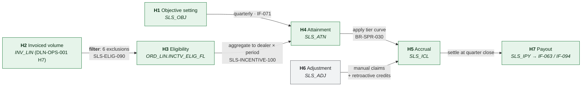

# Sales Incentive Payout — Data Lineage

> **The harder lineage case.** Order-to-cash traces a value that is captured once and carried
> forward. This traces a value that is *derived* from a moving population, *restated* when
> late data arrives, and *retroactively adjusted* by manual claims — where the question
> "where did this number come from?" has a different answer depending on when you ask.
>
> Classification is `confidential`: incentive formulas are commercially sensitive.

---

## 1. Summary

| | |
| --- | --- |
| Flow | Sales incentive payout — objectives → eligible volume → attainment → accrual → payout |
| Business purpose | Calculate and settle USD ~41M of quarterly dealer incentive |
| Origin systems | Demand Planning (`IF-071`), Meridian OPS invoicing (`DLN-OPS-001` H7) |
| Terminal consumers | Settlement bank (`IF-063`), ERP AP, dealer incentive statements, Enterprise Warehouse |
| Hops | 7 |
| End-to-end latency | Quarter close + 14 business days to payment |
| Criticality | Tier 1 |
| Regulatory relevance | Dealer franchise regulation in 3 jurisdictions — calculations must be reproducible on regulator request |
| Data Owner | Director, Sales Operations |
| Data Steward | Sales Data Steward |
| CDEs covered | 9 — CDE-003, 004, 042, 043, 044, 047, 048, 049, 050 |
| Overall confidence | ✅ Verified H1–H6; 🟡 Inferred for the H4 tier-boundary rounding |
| **Reproducible?** | ⚠️ **Partly.** H5 is not reproducible after the fact — see §7 |

---

## 2. Lineage overview

> **Caption:** value is derived, not carried. The number a dealer sees is a function of a
> population (H3) that keeps changing as late ASNs arrive, a tier curve (H5) whose inputs
> move, and a manual adjustment stream (H6) that can reach back into closed periods. The two
> highest-risk points are the H2 → H3 exclusion set and the H5 non-reproducibility.

### Hop index

| Hop | System | Object | Grain | Owner | Latency | Retention | Confidence |
| --- | --- | --- | --- | --- | --- | --- | --- |
| H1 | Demand Planning → Meridian | `SLS_OBJ` | One row per dealer per period per product line | Director Sales Ops | Quarterly, T−10 days | 7y | ✅ |
| H2 | Meridian OPS | `INV_LIN` | One row per invoiced line | VP Order Ops | Nightly | 7y | ✅ |
| H3 | Meridian SPR | `ORD_LIN.INCTV_ELIG_FL` ⚠️ | One flag per order line | **Director Sales Ops** *(column in an OPS table)* | Nightly | 7y | ✅ |
| H4 | Meridian SPR | `SLS_ATN` | **One row per dealer per period per product line** ⚠️ | Director Sales Ops | Nightly | 7y | ✅ |
| H5 | Meridian SPR | `SLS_ICL` | One row per dealer per period per programme | Director Sales Ops | Nightly | 7y | ✅ |
| H6 | Meridian SPR | `SLS_ADJ` | One row per adjustment | Director Sales Ops | Ad hoc | 7y | ✅ |
| H7 | Meridian → bank / AP | `SLS_IPY` | One row per dealer per period | Finance Controller | Quarter close + 14d | 10y | ✅ |

---

## 3. Field-level lineage

### 3.1 H1 — Objective setting

| | |
| --- | --- |
| Performed by | `IF-071` quarterly load from Demand Planning |
| Trigger | Quarterly, 10 business days before period start |
| Volume | ~3,200 dealers × ~6 product lines = ~19,200 rows |
| Grain | Dealer × period × product line |
| Load type | Full replace for the period |

| # | Source | Target | Transformation | Rule | Confidence |
| --- | --- | --- | --- | --- | --- |
| 1 | Planning `dealer_id` | `SLS_OBJ.DLR_CD` | Mapped via `REF_DLR_XREF`; unmapped rows **rejected**, not defaulted | BR-SPR-002 | ✅ |
| 2 | Planning `target_units` | `SLS_OBJ.OBJ_QTY` | Direct, integer | — | ✅ |
| 3 | Planning `programme` | `SLS_OBJ.PGM_CD` | Mapped via `REF_PGM_MAP` | — | ✅ |
| 4 | *(computed)* | `SLS_OBJ.OBJ_STS_CD` | `'D'` draft until Sales Ops approves, then `'A'` | BR-SPR-004 | ✅ |

**Objective changes mid-period** ⚠️

Objectives can be revised in-period — typically after a market event or a dealer
acquisition. A revision **replaces** the row and increments `OBJ_VER_NO`; prior versions are
retained in `SLS_OBJ_HIST`.

| Aspect | Behaviour | Confidence |
| --- | --- | --- |
| Attainment recalculated on revision? | **Yes**, at the next `SLS-INCENTIVE-100` run | ✅ |
| Accrual restated? | Yes — the period's accrual is recomputed wholesale | ✅ |
| Dealer notified? | Yes, by Sales Ops, manually | ✅ |
| Frequency | ~40 revisions per quarter | ✅ |

---

### 3.2 H2 → H3 — Eligibility ⚠️ *the exclusion set*

| | |
| --- | --- |
| Performed by | `SLS-ELIG-090` (`SLSELG03`) |
| Duration | 35m |
| Depends on | `FIN-INVOICE-070` — eligibility reads **invoiced** status, not shipped |
| Grain | One flag per order line |
| **Cross-domain write** | Writes `ORD_LIN.INCTV_ELIG_FL`, a column in an OPS-owned table — violation V-01 |

| # | Source | Target | Transformation | Rule | Confidence |
| --- | --- | --- | --- | --- | --- |
| 1 | `INV_LIN` exists for the line | `ORD_LIN.INCTV_ELIG_FL` | `'Y'` if invoiced **and** none of the six exclusions apply; else `'N'` | BR-SPR-014 | ✅ |
| 2 | `ORD_HDR.ORD_TS` or hold release | `ORD_LIN.SLS_OBJ_DT` | **The objective date**, which is the order date *unless* the line was held across a period boundary, in which case it is the hold release date | BR-SPR-016 | ✅ |
| 3 | `SLS_OBJ_CD` default | `ORD_LIN.SLS_OBJ_CD` | Overwritten at period close from the dealer's approved objective | BR-SPR-018 | ✅ |

**The six exclusions** ⚠️ **— the most disputed table in the system**

| # | Exclusion | Condition | Volume excluded/quarter | Business reason | Confidence |
| --- | --- | --- | --- | --- | --- |
| E1 | Fleet | `ORD_TYP_CD = 'FL'` | ~11,400 lines (3.1%) | Fleet sales are separately compensated | ✅ Verified — `SLSELG03.CBL:142` |
| E2 | Demo | `DLR_CD` in the demo dealer list | ~180 lines | Not real sales | ✅ |
| E3 | Intercompany | `ORD_TYP_CD = 'XF'` | ~120 lines | Internal transfer, no external sale | ✅ |
| E4 | Cancelled after invoice | A credit line exists reversing the invoice | ~2,900 lines (0.8%) | The sale did not stand | ✅ |
| E5 | **Non-participating programme** | The dealer's `PGM_CD` excludes the product line | ~24,000 lines (6.5%) | Dealer is not enrolled in that programme | ✅ |
| E6 | **Late-invoiced** | `INV_DT` more than 45 days after `SLS_OBJ_DT` | ~1,100 lines (0.3%) | Prevents a dealer banking volume across period boundaries | ✅ Verified — `SLSELG03.CBL:288`; **this is the exclusion nobody expects** |

> **E6 is the source of most dealer disputes.** A line ordered on the 20th of a quarter's
> last month, held for inventory, shipped 50 days later, is invoiced in the next quarter and
> is excluded from **both** — it is past 45 days for the first and its objective date falls
> in the first for the second. Roughly 1,100 lines per quarter fall into this gap. The
> business has accepted it; the dealers have not, and it generates ~15 disputes a quarter.
> Documented here so that support can explain it rather than re-derive it each time.

**`ops.unit` vs. `spr.unit`.** The exclusion set above is precisely the difference between
the two definitions in [DMAP-MER-001 §3](../00-foundations/domain-map.md). Six exclusions
removing ~10.7% of invoiced lines is why a dashboard using `ops.unit` shows a higher number
than an incentive statement using `spr.unit` — the cause of INC-2024-0891.

---

### 3.3 H3 → H4 — Attainment ⚠️ *grain change*

| | |
| --- | --- |
| Performed by | `SLS-INCENTIVE-100` (`SLSINC04`) |
| Duration | 90m (279m at quarter-end) |
| Volume in | ~370,000 eligible lines per quarter |
| Volume out | ~19,200 attainment rows |
| **Grain change** | **Line → dealer × period × product line.** Aggregation |

| # | Source | Target | Transformation | Rule | Confidence |
| --- | --- | --- | --- | --- | --- |
| 1 | `ORD_LIN` where `INCTV_ELIG_FL = 'Y'` | `SLS_ATN.ATN_QTY` | `SUM(QTY)` grouped by `(DLR_CD, PERIOD_CD, PRD_LN_CD)` | BR-SPR-020 | ✅ |
| 2 | `SLS_OBJ.OBJ_QTY` | `SLS_ATN.OBJ_QTY` | Joined on the same key; **current approved version** | BR-SPR-021 | ✅ |
| 3 | Mappings 1 ÷ 2 | `SLS_ATN.ATN_PCT` | `ATN_QTY / OBJ_QTY × 100`, rounded to **4 decimal places** | BR-SPR-022 | ✅ |
| 4 | `SLS_ATN.ATN_PCT` | `SLS_ATN.ATN_TIER_CD` | Banded via `REF_TIER` — see §3.4 | BR-SPR-030 | ✅ |

| Aspect | Rule |
| --- | --- |
| `OBJ_QTY = 0` | Attainment percentage is set to null, **not** infinity or zero. The dealer is treated as non-participating for that product line. ✅ Verified — ~340 rows/quarter |
| Rounding | 4dp on the percentage, applied once. **Critical** — see §3.4 |
| Joins | Left join from `SLS_OBJ` to attainment, so a dealer with an objective and zero volume produces a row with `ATN_QTY = 0` rather than no row. This matters for reporting completeness |
| Fan-out risk | None — both sides are keyed on `(DLR_CD, PERIOD_CD, PRD_LN_CD)` and `DQ-SPR-004` asserts uniqueness on `SLS_OBJ` |

---

### 3.4 H4 → H5 — Accrual ⚠️ *tier boundaries and rounding*

| | |
| --- | --- |
| Performed by | `SLS-INCENTIVE-100`, second phase |
| Grain | Dealer × period × programme |
| Restart | ⚠️ Conditional — accrual rows for the period must be deleted first |

**Tier curve** — `REF_TIER`, effective-dated by programme and period:

| Tier | Attainment from | to | Rate per unit | Cumulative? |
| --- | --- | --- | --- | --- |
| T0 | 0.0000% | 79.9999% | USD 0 | — |
| T1 | 80.0000% | 94.9999% | USD 110 | No — applies to **all** eligible units |
| T2 | 95.0000% | 104.9999% | USD 185 | No |
| T3 | 105.0000% | 119.9999% | USD 240 | No |
| T4 | 120.0000% | — | USD 310 | No |

> **The curve is a cliff, not a ramp.** A dealer at 94.9999% earns USD 110 per unit; at
> 95.0000% they earn USD 185 per unit on **every** eligible unit. For a dealer with 400 units
> that is a USD 30,000 difference from one additional unit. This is intended — it is the
> programme's design — and it makes the 4dp rounding at H3 mapping 3 financially material.

| # | Source | Target | Transformation | Rule | Confidence |
| --- | --- | --- | --- | --- | --- |
| 1 | `SLS_ATN.ATN_TIER_CD` → `REF_TIER.RATE` | `SLS_ICL.TIER_RATE` | Lookup, effective-dated on period start | BR-SPR-030 | ✅ |
| 2 | `SLS_ATN.ATN_QTY` × `TIER_RATE` | `SLS_ICL.ACCR_AMT` | Rounded half-up to 2dp | BR-SPR-031 | ✅ |
| 3 | Sum across product lines | `SLS_ICL.PGM_ACCR_AMT` | Summed **after** per-product-line rounding | BR-SPR-032 | 🟡 Inferred |
| 4 | `REF_PGM.CAP_AMT` | `SLS_ICL.ACCR_AMT` | Capped at the programme's per-dealer ceiling if one exists | BR-SPR-034 | ✅ |

**Worked example**

| Step | Detail | Value |
| --- | --- | --- |
| Eligible units, product line A | After the six exclusions | 412 |
| Objective, product line A | `SLS_OBJ.OBJ_QTY` | 434 |
| Attainment | 412 / 434 × 100, 4dp | **94.9309%** |
| Tier | Below 95.0000% | **T1** |
| Rate | `REF_TIER` | USD 110 |
| Accrual, product line A | 412 × 110 | USD 45,320.00 |
| *(counterfactual: 413 units)* | 413 / 434 = 95.1613% → **T2** @ 185 | *USD 76,405.00* |
| **Difference from one unit** | | **USD 31,085.00** |

> This example is in the document because it is the single most-asked question by dealers and
> by Sales Finance, and because it shows why the rounding rule at H3 is not a detail. A
> 2-decimal rounding would put 94.93% and 94.9309% in the same place, but a 0-decimal
> rounding would push 94.9309% to 95% and change the tier — which is exactly the kind of
> change someone could make to "tidy up" a report and cost USD 31,000 per affected dealer.

🟡 **Mapping 3 is inferred.** Whether the programme total sums pre- or post-rounded
per-product-line amounts was not confirmed in code; the difference is at most a few cents
per dealer per quarter but is not zero. *Owner: Sales Data Steward. Verification: recompute
both ways for one quarter and compare to stored values. Target 2026-11-30.*

---

### 3.5 H6 → H5 — Adjustments ⚠️ *manual, and retroactive*

| | |
| --- | --- |
| Performed by | Sales Finance, via the adjustment screen |
| Grain | One row per adjustment |
| Volume | ~8,900 per quarter |
| **Can reach into closed periods** | **Yes** — up to 2 quarters back |

| Adjustment type | Code | Volume/quarter | Reaches back | Approval |
| --- | --- | --- | --- | --- |
| Dispute resolution credit | `DR` | ~1,400 | 2 quarters | Sales Ops Manager |
| Late ASN inclusion | `LA` | ~3,100 | 1 quarter | Automatic if within tolerance, else Sales Ops |
| Objective revision true-up | `OT` | ~2,200 | Current only | Sales Ops Manager |
| Programme enrolment correction | `PE` | ~900 | 2 quarters | Director Sales Ops |
| Manual override | `MO` | ~1,300 | 2 quarters | **Director Sales Ops + Finance Controller** |

| # | Source | Target | Transformation | Rule | Confidence |
| --- | --- | --- | --- | --- | --- |
| 1 | `SLS_ADJ.ADJ_AMT` | `SLS_ICL.ADJ_TOT_AMT` | Sum of approved adjustments for the dealer and period | BR-SPR-040 | ✅ |
| 2 | `SLS_ICL.ACCR_AMT` + `ADJ_TOT_AMT` | `SLS_ICL.NET_ACCR_AMT` | Addition; adjustments may be negative | BR-SPR-041 | ✅ |

> **Adjustments do not recompute the tier.** A `LA` (late ASN) adjustment adds the value of
> the late units at the tier already determined — it does **not** re-run attainment and
> potentially move the dealer into a higher tier. Whether that is correct is a live business
> question (`Q-S02` in §8); it is worth roughly USD 400k per quarter in aggregate, and it is
> the single largest unresolved question in this flow.

---

### 3.6 H5 → H7 — Payout

| | |
| --- | --- |
| Performed by | `SLS-PAYOUT-130`, quarter close + 14 business days |
| Grain | One row per dealer per period |
| Volume | ~3,200 rows, ~USD 41M |
| Restart | ❌ **Never** — a payment file may already have been transmitted |

| # | Source | Target | Transformation | Rule | Confidence |
| --- | --- | --- | --- | --- | --- |
| 1 | `SUM(SLS_ICL.NET_ACCR_AMT)` | `SLS_IPY.PAYOUT_AMT` | Summed across programmes for the dealer and period | BR-SPR-050 | ✅ |
| 2 | `DLR_MST.OFFSET_FL` | `SLS_IPY.OFFSET_AMT` | Outstanding dealer debit balance is netted off | BR-SPR-052 | ✅ |
| 3 | Mappings 1 − 2 | `SLS_IPY.NET_PAY_AMT` | If ≤ 0, no payment is made and the balance carries forward | BR-SPR-053 | ✅ |
| 4 | `SLS_IPY.NET_PAY_AMT` | `IF-063` ISO 20022 payment instruction | Amount in cents; dealer bank details from `DLR_MST` | — | ✅ |
| 5 | `SLS_IPY` all | `IF-094` AP posting file | Liability recognition | — | ✅ |

---

## 4. Critical Data Element trace

### CDE-048: `SLS_IPY.PAYOUT_AMT`

| Hop | Field | Transformation at this hop | Confidence |
| --- | --- | --- | --- |
| H2 | `INV_LIN.INV_AMT`, `ORD_LIN.QTY` | Origin — invoiced volume from [DLN-OPS-001 H7](lineage-order-to-cash.md) | ✅ |
| H3 | `ORD_LIN.INCTV_ELIG_FL` | Six exclusions applied; ~10.7% of lines removed | ✅ |
| H4 | `SLS_ATN.ATN_QTY`, `ATN_PCT` | Aggregated to dealer × period × product line; percentage at 4dp | ✅ |
| H4 | `SLS_ATN.ATN_TIER_CD` | Banded via the cliff curve | ✅ |
| H5 | `SLS_ICL.ACCR_AMT` | Units × tier rate, 2dp | ✅ |
| H5 | `SLS_ICL.NET_ACCR_AMT` | Plus manual adjustments | ✅ |
| H7 | `SLS_IPY.PAYOUT_AMT` | Summed across programmes | ✅ |
| H7 | `SLS_IPY.NET_PAY_AMT` | Less dealer debit offset | ✅ |

| | |
| --- | --- |
| Business definition | The gross incentive earned by a dealer for a period, before offset of outstanding balances |
| Authoritative source | Meridian SPR |
| Known issues | Restated in ~3 periods per year; see §7 |
| Consumers | Settlement bank, ERP AP, dealer statements, warehouse, regulators on request |

---

## 5. Controls and reconciliation

| Hop | Control | Type | Frequency | Tolerance | Owner | Break procedure |
| --- | --- | --- | --- | --- | --- | --- |
| H1 | `S-01` Objective row count = dealers × enrolled product lines | Record count | Per load | 0 | Sales Data Steward | Reject the load |
| H1 | `S-02` No duplicate `(DLR_CD, PERIOD_CD, PRD_LN_CD)` | Uniqueness | Per load | 0 | Sales Data Steward | Reject the load |
| H2→H3 | `S-03` Eligible line count vs. invoiced line count | Distribution | Nightly | Exclusion rate 9–13% | Sales Data Steward | Outside band ⇒ investigate |
| H2→H3 | `S-09` Lines with `INCTV_ELIG_FL` null after the job | Completeness | Nightly | 0 | Sales Data Steward | Re-run |
| H3→H4 | `S-04` `SUM(ATN_QTY)` = count of eligible units | Balance | Nightly | 0 | Sales Data Steward | Halt accrual |
| H4→H5 | `S-05` Dealers within 0.5% of a tier boundary | Distribution | Nightly | Report only | Sales Finance | Manual review before quarter close |
| H5 | `S-06` `SUM(ACCR_AMT)` vs. the finance accrual forecast | Balance | Monthly | ±3% | Finance Controller | Investigate |
| H6 | `S-07` Adjustments above USD 25,000 | Threshold | Per adjustment | Report | Finance Controller | Dual approval |
| H5→H7 | `S-08` `SUM(NET_ACCR_AMT)` = `SUM(PAYOUT_AMT)` | Balance | Per payout | **0** | Finance Controller | **Halt payment file** |
| H7 | `S-10` Payment file total = AP posting total | Balance | Per payout | **0** | Finance Controller | Halt both |

> `S-05` is unusual and worth copying. It does not detect an error; it flags dealers near a
> cliff, where a small data defect has an outsized financial consequence. Roughly 90 dealers
> per quarter fall within 0.5% of a boundary, and Sales Finance reviews their underlying
> volume manually before close. It has caught 4 genuine data defects in 6 quarters.

---

## 6. Timing

| Event | Timing | Depends on |
| --- | --- | --- |
| Objectives loaded | Period start − 10 business days | Demand Planning |
| Eligibility computed | Nightly, 02:15 UTC | `FIN-INVOICE-070` |
| Attainment and accrual | Nightly, 02:50 UTC | `SLS-ELIG-090` |
| Adjustment window opens | Period end | — |
| **Adjustment window closes** | Period end + 10 business days | — |
| Payout calculated | Period end + 12 business days | Adjustment window closed |
| Payment transmitted | Period end + 14 business days | Finance Controller sign-off |
| Statements issued | Period end + 15 business days | Payout |

**The 45-day E6 exclusion interacts badly with the 10-day adjustment window.** A line
invoiced on day 44 is eligible; one invoiced on day 46 is not, and by the time anyone
notices, the adjustment window has closed. This is the mechanism behind most of the ~15
disputes per quarter.

---

## 7. Temporal behaviour ⚠️

> The section that makes this lineage harder than order-to-cash.

| Aspect | Behaviour |
| --- | --- |
| Late-arriving data | An ASN arriving after period close invoices in the current period. If it is within 45 days of the objective date it is eligible for the **prior** period, and enters via an `LA` adjustment rather than by recomputing attainment |
| **Restatement** | The period's accrual **is** recomputed wholesale each night until the adjustment window closes. A dealer's accrual can therefore change daily for 10 business days after period end |
| Back-dated corrections | Permitted up to 2 quarters back via `SLS_ADJ`; **never** by altering `SLS_ICL` directly |
| Period boundary | Calendar quarter for objectives; **not** the ERP accounting period. A third definition of "period end" in the same system |
| **Reproducibility** | ⚠️ **H5 is not reproducible after the fact.** See below |
| Historical reference data | `REF_TIER` is effective-dated ✅. `REF_PGM` enrolment is **not** ❌ — a dealer's current enrolment is used, so a re-run applies today's enrolment to a past period |
| Idempotency | H3, H4 idempotent. H5 is not — accrual rows must be deleted before a re-run. H7 is never re-runnable |

### Why H5 is not reproducible

`SLS_ICL` stores the accrual but **not** the inputs that produced it. To reproduce a past
accrual you would need:

| Input | Retained? | Consequence |
| --- | --- | --- |
| `SLS_ATN.ATN_QTY` at the time | ✅ `SLS_ATN` is retained per night | — |
| `SLS_OBJ.OBJ_QTY` at the time | ✅ `SLS_OBJ_HIST` | — |
| `REF_TIER` rates at the time | ✅ Effective-dated | — |
| **`REF_PGM` enrolment at the time** | ❌ **Overwritten** | A dealer whose enrolment changed cannot have their prior accrual reproduced |
| `INCTV_ELIG_FL` at the time | ❌ **Overwritten nightly** | Which lines were eligible on a given night is not recoverable |

> **Consequence.** For a regulator asking "show me how this dealer's Q3 2025 payout was
> calculated", the stored `SLS_ICL` and `SLS_ATN` rows answer *what* was calculated, and the
> `SLS_ADJ` rows show the adjustments — but the eligibility decision for each contributing
> line cannot be reconstructed if enrolment has since changed. This was raised in the 2025-09
> regulator review and accepted with a commitment to remediate.
>
> **Remediation:** snapshot `REF_PGM` enrolment into `SLS_ATN` at calculation time, and
> retain a per-period eligibility snapshot. Funded for Q1 2027, ~18 days. Tracked as
> `DI-2025-031`.

### Restatement history

| Period | Restated | Reason | Magnitude | Dealers affected | Notified | Issue |
| --- | --- | --- | --- | --- | --- | --- |
| 2026-Q1 | 2026-04-22 | 340 late ASNs from vendor V19 arrived after close | +USD 610k | 84 | Yes, before payment | `DI-2026-007` |
| 2025-Q4 | 2026-01-19 | Objective revision applied retroactively for 12 acquired dealers | +USD 240k | 12 | Yes | `DI-2026-001` |
| 2025-Q2 | 2025-08-14 | INC-2025-0412 package composition change altered eligible volume | −USD 1.1M | 610 | **Yes, after payment** — recovered via offset over 2 quarters | `DI-2025-009` |
| 2025-Q1 | 2025-05-06 | E5 programme enrolment applied incorrectly for 3 programmes | +USD 380k | 190 | Yes | `DI-2025-004` |

> Four restatements in six quarters, three of them upward. Objective 3 in
> [DGC-MER-001 §2](data-governance-charter.md) targets ≤ 2 per quarter; the current rate is
> ~0.7 per quarter, which meets it. The 2025-Q2 case — restating *after* payment and
> recovering by offset — is the one nobody wants to repeat, and it drove the `S-05`
> near-boundary control.

---

## 8. Known gaps and issues

| ID | Gap | Hop | Impact | Remediation | Owner | Target |
| --- | --- | --- | --- | --- | --- | --- |
| `DI-2025-031` | H5 not reproducible — enrolment and eligibility not snapshotted | H5 | Regulator cannot be shown a full calculation trace | Snapshot enrolment and eligibility per period | Sales Data Steward | 2027-Q1 |
| `Q-S02` | Late-ASN adjustments do not recompute the tier | H6 | ~USD 400k/quarter; dealers argue it should | **Business decision required**, not a technical fix | Director Sales Operations | 2026-12-31 |
| `DI-2026-014` | E6 45-day rule interacts badly with the 10-day adjustment window | H3, H6 | ~15 disputes/quarter | Extend the window, or make E6 relative to period end | Director Sales Operations | 2027-Q1 |
| `DI-2025-027` | `SLS_OBJ_CD` overwritten at period close (V-02) | H3 | The column means two different things at different times of its life | Split into `SLS_OBJ_CD_DFLT` and `SLS_OBJ_CD_FINAL` | Sales Data Steward | 2027-Q2 |
| `Q-S03` | Programme total rounding (mapping 3, §3.4) unverified | H5 | Cents per dealer per quarter | Recompute both ways and compare | Sales Data Steward | 2026-11-30 |

**Known reconciliation differences**

| Between | Typical | Explanation | Accepted | Investigate above |
| --- | --- | --- | --- | --- |
| Invoiced lines vs. eligible lines | −10.7% | The six exclusions (§3.2) | ✅ | Outside 9–13% |
| `SUM(ACCR_AMT)` vs. finance forecast | ±3% | Forecast uses projected rather than actual attainment | ✅ | ±3% |
| Warehouse attainment vs. `SLS_ATN` | ±0.1% | Warehouse loads at 04:30 and misses adjustments made after | ✅ | ±0.5% |
| Dealer statement vs. dashboard | 0 since 2025-02 | Was `ops.unit` vs. `spr.unit` — INC-2024-0891, resolved by [MET-SPR-001](metric-catalog-sales-reporting.md) | ✅ | Any difference |

---

## 9. Consumers

| Consumer | Hop | Fields | Purpose | Criticality | Notice | Contact |
| --- | --- | --- | --- | --- | --- | --- |
| Settlement bank | H7 | Payment instruction | Payment | Tier 1 | 60 days | Finance Systems Lead |
| ERP AP | H7 | `SLS_IPY` all | Liability posting | Tier 1 | 30 days | Finance Systems Lead |
| Dealer statements | H4, H5, H6, H7 | Attainment, accrual, adjustments, payout | Dealer-facing | Tier 1 | 30 days | Sales Operations Manager |
| Enterprise Warehouse | H4, H5 | Attainment and accrual facts | Reporting | Tier 3 | 14 days | BI Lead |
| Finance accrual reporting | H5 | `SLS_ICL` | Liability recognition | Tier 1 | 30 days | Finance Controller |
| Regulators (3 jurisdictions) | H1–H7 | Full trace on request | Compliance | Tier 1 | On request | Director Sales Operations |

---

## 10. Retention

| Hop | Object | Retention | Basis | Purge verified |
| --- | --- | --- | --- | --- |
| H1 | `SLS_OBJ`, `SLS_OBJ_HIST` | 7y | Franchise regulation | ✅ 2026-02 |
| H3 | `ORD_LIN.INCTV_ELIG_FL` | 7y with the line | SOX | ✅ |
| H4 | `SLS_ATN` | 7y | Franchise regulation | ✅ |
| H5 | `SLS_ICL` | 7y | Franchise regulation | ✅ |
| H6 | `SLS_ADJ` | 7y | Audit — manual adjustments are an audit focus | ✅ |
| H7 | `SLS_IPY` | 10y | Tax + franchise | ✅ |
| — | Warehouse | 13 months | BI policy | ⚠️ Not Meridian's |

---

## 11. Verification

| Verification | Method | Date | By | Result |
| --- | --- | --- | --- | --- |
| Exclusion logic matches implementation | Code review of `SLSELG03` against §3.2 | 2026-07-02 | Sales Data Steward + Squad 2 | ✅ E6 threshold corrected from 40 to 45 days in this document |
| Tier arithmetic reproduced independently | 500 dealers recomputed in a spreadsheet for 2026-Q1 | 2026-07-03 | Internal Audit | ✅ Matched to the cent, except 2 dealers with `MO` adjustments |
| Attainment reconciles to eligible volume | Query comparison, full quarter | 2026-07-04 | Sales Data Steward | ✅ |
| Payout reconciles to accrual | `S-08` re-run for 4 quarters | 2026-07-04 | Finance Controller | ✅ |
| **H5 reproducibility** | Attempt to reconstruct a 2025-Q3 accrual from retained inputs | 2026-07-07 | Internal Audit | ❌ **Failed for 41 of 200 sampled dealers** — enrolment had changed. Confirms `DI-2025-031` |

> The last row is why this section exists. A verification that fails and is published is
> worth more than one that is not attempted.

---

## Change log

| Version | Date | Author | Change |
| --- | --- | --- | --- |
| 2.2.0 | 2026-07-08 | Sales Data Steward | Semi-annual review. Corrected E6 from 40 to 45 days after code review; added the §11 reproducibility test result and `DI-2025-031`; added `S-09`, `S-10` |
| 2.1.0 | 2026-02-26 | Data Governance Office | Added §7 reproducibility analysis after the 2025-09 regulator review |
| 2.0.0 | 2025-09-30 | Sales Data Steward | Added the §3.4 worked example and the cliff-curve explanation after repeated Sales Finance questions |
| 1.0.0 | 2025-02-17 | Data Governance Office | Initial lineage, commissioned after INC-2024-0891 |
