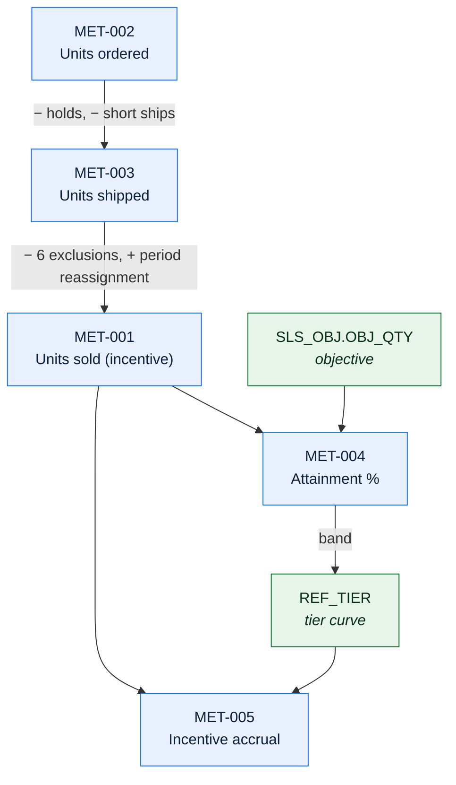

# Sales Reporting — Metric and KPI Definition Catalog

> **This catalog exists because of INC-2024-0891.** A dealer dashboard and an incentive
> statement showed different numbers for "units sold". Both were defensible; neither matched;
> 340 dealers saw the discrepancy and 11 raised formal disputes. The resolution was not a
> code fix — it was a definition.

---

## 1. Catalog

| ID | Metric | Owner | Grain | Refresh | Certification | Systems |
| --- | --- | --- | --- | --- | --- | --- |
| MET-001 | Units sold (incentive) | Sales Data Steward | Dealer × period × product line | Nightly | ✅ Certified | Meridian, EDW |
| MET-002 | Units ordered | Order Data Steward | Dealer × day × product line | Nightly | ✅ Certified | Meridian, EDW |
| MET-003 | Units shipped | Order Data Steward | Dealer × day × product line | Nightly | ✅ Certified | Meridian, EDW |
| MET-004 | Objective attainment % | Sales Data Steward | Dealer × period × product line | Nightly | ✅ Certified | Meridian, EDW |
| MET-005 | Incentive accrual | Sales Data Steward | Dealer × period × programme | Nightly | ✅ Certified | Meridian, EDW, ERP |
| MET-006 | Average selling price | Sales Data Steward | Dealer × period × product line | Nightly | ✅ Certified | EDW |
| MET-007 | Order-to-ship days | Order Data Steward | Dealer × period | Nightly | ✅ Certified | EDW |
| MET-008 | Fill rate | Order Data Steward | Vendor × period | Nightly | ✅ Certified | EDW |
| MET-009 | Held-line rate | Order Data Steward | Dealer × day | Nightly | 🟡 Managed | Meridian |
| MET-010 | Portfolio mix | Portfolio Data Steward | Period × product line | Weekly | 🟡 Managed | EDW |
| MET-011 | Dealer inventory turns | Sales Data Steward | Dealer × period | Monthly | 🔴 Uncertified | EDW |
| *(31 further)* | | | | | | |

| Level | Count | Use |
| --- | --- | --- |
| ✅ Certified | 37 | External, dealer-facing, and executive reporting |
| 🟡 Managed | 4 | Internal operational reporting only |
| 🔴 Uncertified | 1 | **Do not use for decisions** — §4 |

---

## 2. Metric: Units sold (incentive) — MET-001

| | |
| --- | --- |
| ID | MET-001 |
| Business definition | The number of units a dealer sold in a period that count toward their objective attainment |
| Owner | Sales Data Steward |
| Certification | ✅ Certified 2025-02-24 |
| Unit | Units (packages, not physical units — see §2.7) |
| **Grain** | Dealer × objective period × product line |
| Aggregation | Sum |
| **Additivity** | **Fully additive** across dealer and product line; **not additive across periods** — a line can move between periods via an `LA` adjustment, so summing two periods can double count |

### 2.1 Calculation

```
MET-001 = SUM(ORD_LIN.QTY)
WHERE    ORD_LIN.INCTV_ELIG_FL = 'Y'
AND      ORD_LIN.SLS_OBJ_CD    = <the dealer's objective for the period>
GROUPED BY dealer, objective period, product line
```

| Input | Source | Field |
| --- | --- | --- |
| Quantity | `ORD_LIN` | `QTY` |
| Eligibility | `ORD_LIN` | `INCTV_ELIG_FL` — set by `SLS-ELIG-090` |
| Period assignment | `ORD_LIN` | `SLS_OBJ_CD`, `SLS_OBJ_DT` |
| Product line | `ORD_LIN_DEC` → `REF_PRD_LN` | Derived from the option set's primary class |

| Aspect | Rule |
| --- | --- |
| **Inclusions** | Invoiced lines where all six eligibility exclusions pass |
| **Exclusions** | Fleet (`ORD_TYP_CD = 'FL'`), demo dealers, intercompany (`'XF'`), cancelled-after-invoice, non-participating programme, **invoiced more than 45 days after the objective date** |
| Null handling | A line with `INCTV_ELIG_FL` null is **excluded** — it has not been evaluated yet, which during the nightly window is most of the day's volume |
| Zero/negative | A credit line carries a negative `QTY` and reduces the total |
| Rounding | None — integer units |
| Currency | Not applicable |
| **Period definition** | The **objective period**: calendar quarter. Not the ERP accounting period, and not the scheduler's month-end |
| **Timing basis** | `SLS_OBJ_DT` — the order date, *unless* the line was held across a period boundary, in which case the hold release date |

Full lineage: [DLN-SPR-001 §3.2](lineage-sales-incentive-payout.md).

### 2.2 The exclusions, stated plainly

| # | Exclusion | Volume/quarter | Why |
| --- | --- | --- | --- |
| E1 | Fleet orders | ~11,400 lines (3.1%) | Separately compensated |
| E2 | Demo dealers | ~180 | Not real sales |
| E3 | Intercompany transfers | ~120 | No external sale |
| E4 | Cancelled after invoice | ~2,900 (0.8%) | The sale did not stand |
| E5 | Non-participating programme | ~24,000 (6.5%) | Dealer not enrolled for that product line |
| E6 | **Invoiced > 45 days after the objective date** | ~1,100 (0.3%) | Prevents banking volume across periods |
| | **Total excluded** | **~10.7%** | |

> **MET-001 is approximately 10.7% below MET-002 (units ordered), and the difference is
> entirely these six exclusions.** Anyone comparing the two should expect this gap. E6 is
> the one nobody anticipates.

### 2.3 Worked example

| Step | Detail | Value |
| --- | --- | --- |
| Dealer `D-04471`, 2026-Q2, product line A | | |
| Lines invoiced in the period | | 486 |
| Less: fleet (E1) | | −18 |
| Less: cancelled after invoice (E4) | | −4 |
| Less: non-participating programme (E5) | | −49 |
| Less: invoiced > 45 days after objective date (E6) | | −3 |
| Eligible lines | | 412 |
| **MET-001 = SUM(QTY) over eligible lines** | (each line QTY = 1) | **412** |
| MET-002 for comparison | All invoiced lines | 486 |
| Difference | 15.2% — above the typical 10.7% because of this dealer's programme mix | |

### 2.4 Dimensions

| Dimension | Values | Hierarchy | Valid slicing |
| --- | --- | --- | --- |
| Dealer | 3,200 | Dealer → district → region → country | ✅ |
| Objective period | Calendar quarter | Quarter → year | ✅ |
| Product line | 6 | Product line → category | ✅ |
| Programme | 12 | — | ✅ |
| Order type | 6 | — | ❌ **Invalid** — E1 and E3 already exclude types; slicing by type shows only `ST` and misleads |
| Vendor | 43 | — | ❌ **Invalid** — a line can be split across vendors; slicing double counts |

### 2.5 Temporal behaviour

| Aspect | Behaviour |
| --- | --- |
| Restatement | **Yes.** The value changes nightly until the adjustment window closes (period end + 10 business days) |
| Restatement window | 10 business days after period end, plus `SLS_ADJ` adjustments reaching back 2 quarters |
| Late-arriving data | Enters via an `LA` adjustment; **does not** recompute the tier |
| Comparability across periods | ✅ Comparable from 2025-Q1. **Break in series at 2024-Q4** — see §2.8 |
| **Point-in-time reconstruction** | ⚠️ **Not fully possible.** `INCTV_ELIG_FL` is overwritten nightly and `REF_PGM` enrolment is not effective-dated, so which lines were eligible on a given past night cannot be reconstructed. See [DLN-SPR-001 §7](lineage-sales-incentive-payout.md) |

### 2.6 Consumers

| Report / dashboard | Audience | Frequency | Implementation | Verified matching |
| --- | --- | --- | --- | --- |
| Dealer incentive statement | 3,200 dealers | Quarterly | Meridian `SLSRPT01` | ✅ 2026-06-05 |
| Dealer portal dashboard | Dealers, field sales | Daily | EDW semantic layer | ✅ 2026-06-05 |
| Regional attainment report | Sales leadership | Weekly | EDW semantic layer | ✅ 2026-06-05 |
| Executive scorecard | Executive | Monthly | EDW semantic layer | ✅ 2026-06-05 |
| Finance accrual pack | Finance | Monthly | Meridian extract | ✅ 2026-06-05 |

> All five implementations are tested against each other quarterly on a 500-dealer sample.
> Before certification, the dealer portal and the incentive statement differed by 10.7% —
> the exclusion set — and neither team knew the other's definition.

### 2.7 Related metrics and confusions

| Metric | Relationship | Expected consistency |
| --- | --- | --- |
| MET-002 units ordered | Superset | MET-001 ≈ MET-002 × 0.893 |
| MET-003 units shipped | Overlapping, different timing basis | Differ by holds, short ships, and period assignment |
| MET-004 attainment % | MET-001 ÷ objective | Derived from MET-001 |

**Commonly confused with**

| Similar metric | Difference | Why the confusion arises |
| --- | --- | --- |
| **MET-002 units ordered** | No eligibility exclusions; uses order date not objective date | Both are called "units" in casual conversation. This was INC-2024-0891 |
| **MET-003 units shipped** | Counts shipment events, not invoiced lines; a split shipment counts once per event | "Sold" and "shipped" are used interchangeably by the business |
| Physical units | MET-001 counts **packages**. For product lines C and E a package contains multiple physical units | 🟡 The package/unit distinction is not universally understood; `DI-2026-009` |

### 2.8 Definition history

| Version | Effective from | Change | Reason | Comparability |
| --- | --- | --- | --- | --- |
| 3.0 | 2025-01-01 | E6 (45-day rule) added | Dealers were banking volume across period boundaries | **Break in series.** Pre-2025 figures are ~0.3% higher on a like-for-like basis |
| 2.0 | 2019-01-01 | E3 (intercompany) added | Intercompany transfers were inflating attainment | Break in series, ~0.03% |
| 1.1 | 2013-01-01 | E2 (demo) added | — | Negligible |
| 1.0 | 2008-01-01 | Original definition with E1, E4, E5 | — | — |

> **The 2024-Q4 → 2025-Q1 boundary is a break in series** and must be flagged on any report
> showing data across it. The dealer portal does this with a footnote; the executive
> scorecard did not until 2026-02, and a leadership review in 2025 misread a 0.3% decline as
> a market signal.

### 2.9 Known issues

| Issue | Impact | Since | Workaround | Remediation |
| --- | --- | --- | --- | --- |
| Not reconstructible point-in-time | Regulator cannot be shown the full eligibility trace | Always | Stored `SLS_ATN` shows the result | `DI-2025-031`, 2027-Q1 |
| E6 interacts badly with the adjustment window | ~15 disputes/quarter | 2025-01 | Manual `DR` adjustments | `DI-2026-014` |
| Package vs. physical unit ambiguity | Product lines C and E under-report physical volume | Always | — | `DI-2026-009` |

---

## 3. Metric: Objective attainment % — MET-004

| | |
| --- | --- |
| Business definition | The proportion of a dealer's objective achieved in a period |
| Owner | Sales Data Steward |
| Certification | ✅ Certified |
| Unit | Percent |
| Grain | Dealer × period × product line |
| Aggregation | **Ratio — not additive** |
| **Additivity** | ⚠️ **Non-additive.** Attainment percentages must never be summed or averaged across dealers or product lines. A weighted recalculation from the underlying quantities is required |

### 3.1 Calculation

```
MET-004 = (MET-001 / SLS_OBJ.OBJ_QTY) * 100
ROUNDED to 4 decimal places
```

| Aspect | Rule |
| --- | --- |
| `OBJ_QTY = 0` | Result is **null**, not zero and not infinity. The dealer is non-participating for that product line |
| **Rounding** | **4 decimal places.** Financially material — the tier curve is a cliff at exact boundaries; see §3.2 |
| Objective version | The **current approved** version. A mid-period revision recomputes attainment |
| Roll-up | To compute regional attainment, sum the quantities and sum the objectives, then divide. **Never average the percentages** |

### 3.2 Why the rounding matters

The incentive tier curve steps at exact boundaries — 80%, 95%, 105%, 120% — and each step
applies to **all** eligible units, not just the marginal ones.

| Attainment | Tier | Rate | Accrual on 412 units |
| --- | --- | --- | --- |
| 94.9309% | T1 | USD 110 | USD 45,320 |
| 95.0000% | T2 | USD 185 | USD 76,205 |

A rounding change from 4dp to 2dp would leave these in different tiers, correctly. A change
to 0dp would round 94.9309% to 95% and move the dealer up a tier — **a USD 31,000 error per
affected dealer**. Roughly 90 dealers per quarter sit within 0.5% of a boundary.

> This is why "round to a sensible number of decimals" is not a cosmetic decision, and why
> the rounding rule is part of the certified definition rather than an implementation detail.

### 3.3 Valid slicing

| Dimension | Valid | Reason |
| --- | --- | --- |
| Dealer | ✅ | The natural grain |
| Product line | ✅ | The natural grain |
| Period | ✅ | The natural grain |
| **Region, district** | ⚠️ **Only by recalculation** | Summing or averaging dealer percentages is wrong. The semantic layer enforces recalculation from quantities |
| Programme | ✅ | |

---

## 4. Uncertified metrics in use

| Metric | Used in | Owner | Risk | Action | Target |
| --- | --- | --- | --- | --- | --- |
| **MET-011 Dealer inventory turns** | 3 regional dashboards | 🔴 **Unassigned** | Built by a regional team in 2023 from a warehouse extract; the denominator is `INV_POS.PLND_QTY`, which is *planned* not *actual* inventory. The metric is describing something other than its name | **Define correctly or retire.** Regional leadership is currently using it for dealer conversations | 2026-11-30 |

> One uncertified metric, and it is on three dashboards being used for dealer conversations.
> Listing it here is uncomfortable and is the point: the alternative is that it stays
> invisible and keeps being used.

---

## 5. Conflicting implementations

| Metric | Implementations | Difference | Variance observed | Resolution | Status |
| --- | --- | --- | --- | --- | --- |
| MET-001 | Meridian `SLSRPT01`, EDW semantic layer | Was 10.7% — the exclusion set | 10.7% | Certified definition; EDW rebuilt to match | ✅ Resolved 2025-02 |
| MET-004 | Meridian, EDW, 2 regional dashboards | Regional dashboards averaged dealer percentages | Up to 4.2% | Semantic layer enforces recalculation; regional dashboards repointed | ✅ Resolved 2025-06 |
| MET-006 ASP | Meridian, EDW | EDW included cancelled lines in the denominator | 0.9% | EDW corrected | ✅ Resolved 2025-09 |
| MET-007 order-to-ship | 2 EDW implementations | One measured to dispatch, one to ASN receipt | 2.1 days | Certified as ASN receipt; second implementation retired | ✅ Resolved 2026-01 |
| MET-010 portfolio mix | Meridian, EDW | 🟡 Under investigation — EDW excludes packages unmapped in `SLS_PKG_MAP` | Up to 3% at changeover | Pending | 🟡 Open |

---

## 6. Metric relationships



---

## 7. Period definitions ⚠️

> Three different "period ends" exist in Meridian, all legitimate, and confusing them has
> caused reporting disputes.

| Period concept | Definition | Used by | Owner |
| --- | --- | --- | --- |
| **Objective period** | Calendar quarter, ending on the last calendar day | MET-001, MET-004, MET-005, incentive settlement | Sales Data Owner |
| **Accounting period** | Set by Finance; typically calendar month-end + 2 business days | GL posting, revenue recognition | Finance Controller |
| **Scheduler month-end** | The **last business day** of the calendar month | 17 batch jobs | Platform Engineering Lead |

| Comparison | Can differ by | Consequence |
| --- | --- | --- |
| Objective vs. accounting | Up to 2 business days | A shipment on the last calendar day is in the current objective period but possibly the next accounting period |
| Objective vs. scheduler | Up to 3 days | An objective period can close before the batch job labelled "month-end" runs |

> When a report is labelled "Q2", say which period definition it uses. The dealer statement
> uses the objective period; the finance accrual pack uses the accounting period; they do not
> reconcile at the boundary and are not expected to.

---

## Change log

| Version | Date | Author | Change |
| --- | --- | --- | --- |
| 3.1.0 | 2026-06-05 | Sales Data Steward | Semi-annual review. Added §7 period definitions after a Q1 reporting dispute; added MET-010 to the conflicting-implementations list; re-verified all five MET-001 implementations |
| 3.0.0 | 2026-01-15 | Sales Data Steward | Added §3.2 rounding materiality after a proposal to "simplify" attainment to 1dp; added the §2.8 break-in-series flag to the executive scorecard |
| 2.0.0 | 2025-06-30 | Sales Data Steward | Added MET-004 non-additivity and the recalculation rule after the regional dashboard variance |
| 1.0.0 | 2025-02-24 | Data Governance Office | Initial catalog, commissioned after INC-2024-0891 |
