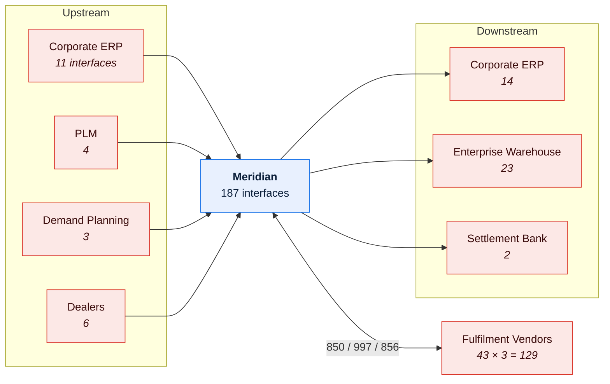

# Meridian — Interface Catalog

> The register of every boundary crossing. **Complete before deep**: a thin row for all 187
> interfaces is worth more than a full ICD for 31 of them, because you cannot impact-assess a
> change against interfaces you do not know exist.
>
> The count rose from an initial estimate of **62** to **187** during discovery. §8 records
> where the extra 125 came from.

---

## Contents

| Section | Summary |
| --- | --- |
| [1. Summary](#1-summary) | 187 live interfaces by direction, criticality, and documentation coverage |
| [2. Catalog — Tier 1 interfaces](#2-catalog--tier-1-interfaces) | The Tier 1 interfaces with counterparty, transport, volume, owners, coverage |
| [3. By counterparty](#3-by-counterparty) | Interfaces grouped by counterparty, with notice periods and register links |
| [4. By domain](#4-by-domain) | Inbound and outbound counts per domain |
| [5. Data crossing the boundary](#5-data-crossing-the-boundary) | Entities, CDEs, classification, and counterparty retention per boundary |
| [6. Timing map](#6-timing-map) | Windows, cutoffs, dependencies, and slack |
| [7. Manual interfaces ⚠️](#7-manual-interfaces-) | Seventeen interfaces with a human step, invisible to automated discovery |
| [8. Discovery record](#8-discovery-record) | How the catalog grew from an estimated 62 to 187, and where the extras came from |
| [9. Deprecated and retired](#9-deprecated-and-retired) | Deprecated interfaces still in use, and what blocks their retirement |
| [10. Gaps](#10-gaps) | Missing ICDs, owners, monitoring, and reconciliation, with remediation |
| [Change log](#change-log) | Version, date, author, change |

---

## 1. Summary

| | Count |
| --- | --- |
| **Total live interfaces** | **187** |
| Inbound / Outbound / Bidirectional | 71 / 98 / 18 |
| Synchronous / Asynchronous / Batch file | 24 / 19 / 144 |
| External counterparties | 48 organisations (43 vendors + 5 others) |
| Tier 1 (critical) | 34 |
| Tier 2 | 61 |
| Tier 3 | 92 |
| With a current ICD | **31** (91% of Tier 1) |
| With reconciliation controls | 42 |
| With monitoring | 118 |
| **With no identified owner** | **6** ⚠️ |
| Deprecated but still live | 9 |
| **Manual interfaces** | **17** |
| Discovered but not yet assessed | 0 |

> **129 of the 187 interfaces are the three vendor transaction sets × 43 vendors.** They are
> counted individually because each vendor has its own endpoint, credentials, certification
> state, SLA, and failure history — treating them as three interfaces hides 43 distinct
> operational relationships.

---

## 2. Catalog — Tier 1 interfaces

| IF ID | Name | Dir | Counterparty | Type | Pattern | Transport | Format | Frequency | Vol/day | Owner (ours) | Owner (theirs) | ICD | Recon | Mon | Status |
| --- | --- | --- | --- | --- | --- | --- | --- | --- | --- | --- | --- | --- | --- | --- | --- |
| IF-001 | Dealer order submission — portal | In | Dealers | Ext | Sync | HTTPS | Form | Continuous | 14,600 | Integration Lead | n/a | ⚠️ Partial | ❌ | ✅ | Live |
| IF-002 | Dealer order submission — B2B API | In | 180 large dealers | Ext | Sync | HTTPS | JSON | Continuous | 3,600 | Integration Lead | Dealer IT | ✅ | ✅ | ✅ | Live |
| IF-014 | Dealer credit status | In | Corporate ERP | Int | Batch | SFTP | Fixed-width | Daily 21:30 | 3,200 rows | Integration Lead | Finance Systems Lead | ✅ | ✅ | ✅ | Live |
| IF-022 | Product portfolio feed | In | PLM | Int | Batch | SFTP | XML | Daily 20:00 | ~61,000 rows | Portfolio Data Steward | PLM Lead | ✅ | ✅ | ✅ | Live |
| IF-042 | Vendor dispatch (EDI 850) | Out | 43 vendors | Ext | Batch | SFTP/AS2 | X12 850 | Nightly | 17,600 | Vendor Integration Lead | Per vendor | [✅](icd-vendor-dispatch-outbound.md) | ✅ | ✅ | Live |
| IF-043 | Vendor functional ack (997) | In | 43 vendors | Ext | Async | SFTP/AS2 | X12 997 | Event | ~43 | Vendor Integration Lead | Per vendor | ✅ | ✅ | ✅ | Live |
| IF-044 | Vendor shipping confirmation (856) | In | 43 vendors | Ext | Async | SFTP/AS2 | X12 856 | Event | 17,100 | Vendor Integration Lead | Per vendor | ✅ | ⚠️ Weekly | ✅ | Live |
| IF-051 | Invoice to ERP AR | Out | Corporate ERP | Int | Async | MQ | IDoc | Nightly | 16,900 | Integration Lead | Finance Systems Lead | ✅ | ✅ | ✅ | Live |
| IF-058 | GL journal to ERP | Out | Corporate ERP | Int | Async | MQ | IDoc | Nightly | ~340 | Integration Lead | Finance Systems Lead | ✅ | ✅ | ✅ | Live |
| IF-063 | Reimbursement payment instruction | Out | Settlement Bank | Ext | Batch | SFTP | ISO 20022 | Weekly | ~3,200 | Finance Systems Lead | Bank ops | ✅ | ✅ | ✅ | Live |
| IF-071 | Sales objectives | In | Demand Planning | Int | Batch | SFTP | Delimited | Quarterly | 19,200 | Sales Data Steward | Planning Lead | ✅ | ✅ | ✅ | Live |
| IF-094 | Incentive payout to AP | Out | Corporate ERP | Int | Batch | SFTP | IDoc | Quarterly | 3,200 | Finance Systems Lead | Finance Systems Lead | ✅ | ✅ | ✅ | Live |
| IF-088 | Warehouse fact extract | Out | Enterprise Warehouse | Int | Batch | SFTP | Delimited | Nightly | ~2.1M rows | Integration Lead | BI Lead | ❌ | ❌ | ✅ | Live |
| IF-112 | Trade compliance screening | Out/In | Compliance SaaS | Ext | Sync | HTTPS | JSON | Per line | ~95,000 | Integration Lead | Vendor CSM | ✅ | ❌ | ✅ | Live |
| IF-203 | Hold evaluation | Internal | Hold Service | Int | Sync | HTTPS | JSON | Per line | ~95,000 | Squad 1 Tech Lead | Squad 1 Tech Lead | ✅ | ❌ | ✅ | Live |
| IF-204 | `REF.TAXCAT` VSAM read | Internal | *(manual file)* | Int | Batch | VSAM | KSDS | Per line | ~95,000 | **Unassigned** ⚠️ | **Unassigned** | ❌ | ❌ | ❌ | Live |
| IF-205 | PLR changeover direct call to `ORDPKG03` | Internal | PLR script | Int | Sync | Program call | COMMAREA | Annual | ~11,000 | Portfolio Data Steward | Portfolio Data Steward | ❌ | ❌ | ❌ | Live |
| *(17 further Tier 1)* | | | | | | | | | | | | | | | |

**Criticality**

| Tier | Definition | Count |
| --- | --- | --- |
| 1 | Business process stops within hours; external or financial impact | 34 |
| 2 | Degraded operation; workaround exists for up to a day | 61 |
| 3 | Tolerable interruption for days | 92 |

> `IF-204` and `IF-205` were discovered during the decoder archaeology
> ([LGA-OPS-001 §7](../01-architecture/legacy-system-archaeology-order-decoder.md)) and added
> in 2026-02. Both are Tier 1 — the tax category feeds a regulatory interface and the
> changeover script mutates transactional data — and neither has an owner, an ICD, or
> monitoring. They are the clearest example of why a complete catalog matters.

---

## 3. By counterparty

| Counterparty | Type | Interfaces | Max criticality | Relationship owner | Contract | Notice period | Dependency register |
| --- | --- | --- | --- | --- | --- | --- | --- |
| Fulfilment vendors (43) | External | 129 | Tier 1 | Vendor Integration Lead | Master agreement per vendor | **90 days** | [ED-001 to ED-043](external-dependency-register.md) |
| Corporate ERP | Internal | 25 | Tier 1 | Integration Lead | Internal OLA | 30 days | — |
| Enterprise Warehouse | Internal | 23 | Tier 3 | Integration Lead | Internal OLA | 14 days | — |
| Dealers (3,200) | External | 6 | Tier 1 | Integration Lead | Franchise agreement | 60 days | — |
| PLM | Internal | 4 | Tier 1 | Portfolio Data Steward | Internal OLA | 30 days | — |
| Demand Planning | Internal | 3 | Tier 1 | Sales Data Steward | Internal OLA | 30 days | — |
| Compliance SaaS | External | 2 | Tier 1 | Integration Lead | SaaS contract | 30 days | ED-044 |
| Settlement Bank | External | 2 | Tier 1 | Finance Systems Lead | Banking agreement | 60 days | ED-045 |
| Carrier data provider | External | 1 | Tier 3 | Vendor Integration Lead | Subscription | 30 days | ED-046 |
| *(internal, misc)* | Internal | 2 | Tier 3 | Various | — | — | — |

---

## 4. By domain

| Domain | Inbound | Outbound | Tier 1 | Notes |
| --- | --- | --- | --- | --- |
| PLR | 5 | 3 | 3 | Portfolio feed is the critical one |
| OPS | 58 | 79 | 24 | Dominated by the 129 vendor interfaces |
| SPR | 6 | 12 | 5 | Objectives in, payout out |
| Cross-domain | 2 | 4 | 2 | Warehouse extracts |

---

## 5. Data crossing the boundary

| IF ID | Entities | CDEs | Classification | Personal data | Retention at counterparty |
| --- | --- | --- | --- | --- | --- |
| IF-042 | `DSP_INS`, `ORD_LIN`, `ORD_LIN_DEC` | CDE-001, 002 | **Confidential** (net price) | ❌ | 12 months (contract) |
| IF-044 | `SHP_CNF` | CDE-011, 012 | Internal | ❌ | 12 months |
| IF-051 | `INV_LIN` | CDE-023 | Confidential | ❌ | Per ERP policy |
| IF-063 | Payment instruction | CDE-048 | **Restricted** (bank details) | ✅ Dealer bank details | Per banking regulation |
| IF-112 | Dealer name, address, option codes | — | **Restricted** | ✅ Dealer contact data | 90 days (contract) |
| IF-088 | Wide fact extract | Multiple | Confidential | ❌ | 13 months |
| IF-001/002 | Order submission | CDE-001 | Internal | ✅ Submitter identity | n/a |

> `IF-063` and `IF-112` carry personal data to external parties and are the two interfaces
> in scope for privacy review. Both have a DPA; `IF-112`'s 90-day retention is the shortest
> in the estate and is checked annually.

---

## 6. Timing map

```mermaid
gantt
    dateFormat HH:mm
    axisFormat %H:%M
    title Daily interface timing (UTC)
    section Inbound
    IF-022 portfolio     :i1, 20:00, 30m
    IF-014 credit        :i2, 21:30, 20m
    section Processing
    Nightly core chain   :p1, 22:00, 165m
    section Outbound
    IF-042 dispatch ×43  :crit, o1, 00:35, 10m
    IF-051 invoice       :o2, 01:55, 15m
    IF-058 GL            :o3, 02:30, 10m
    IF-088 warehouse     :o4, 06:05, 25m
    section Async
    IF-043 acks          :a1, 00:45, 240m
    IF-044 ASNs (continuous) :a2, 00:00, 24h
```

| IF ID | Window | Cutoff | Depends on | Blocks | Slack |
| --- | --- | --- | --- | --- | --- |
| IF-022 | 20:00–20:30 | 22:00 | PLM nightly | `ORD-DECODE-020` | 1h30m |
| IF-014 | 21:30–21:50 | 23:30 | ERP nightly | `ORD-HOLD-030` | 1h40m |
| IF-042 | 00:35–00:45 | **03:00** | Nightly core chain | Vendor fulfilment | 2h15m (1h03m at changeover) |
| IF-043 | Event | +4h from IF-042 | IF-042 | Hold `DS07` release | — |
| IF-051 | 01:55–02:10 | 06:00 | `FIN-INVOICE-070` | ERP AR close | 3h50m |
| IF-058 | 02:30–02:40 | 06:30 | `FIN-GL-080` | ERP GL close | 3h50m |
| IF-088 | 06:05–06:30 | 07:00 | `RPT-WAREHOUSE-120` | Business day reporting | 30m |

---

## 7. Manual interfaces ⚠️

> Seventeen interfaces involving a human step. They have real SLAs and real failure modes,
> and they are invisible to every automated discovery method. Most were found by asking
> people what they do.

| ID | Description | Counterparty | Frequency | Who performs | Time | Failure mode | Automation candidate |
| --- | --- | --- | --- | --- | --- | --- | --- |
| IF-151 | Vendor capacity commitments emailed as a spreadsheet, re-keyed into `REF_VND_RTE` | 43 vendors | Monthly | Vendor Integration analyst | ~6h/month | Transcription error; one caused mis-routing of 400 orders in 2025 | ✅ High value |
| IF-152 | Tax category updates applied directly to `REF.TAXCAT` VSAM | Tax team | ~4/year | 2 named individuals | ~1h each | No audit, no rollback, no owner | ✅ High value (`TD-04`) |
| IF-153 | Dealer bank detail changes phoned through and entered manually | Dealers | ~30/month | Finance Ops | ~10 min each | **Fraud risk** — verbal authorisation only | ✅ **Highest priority** |
| IF-154 | Vendor onboarding certification results recorded in a shared spreadsheet | New vendors | ~2/year | Vendor Integration Lead | ~2h | Spreadsheet is the only record | Medium |
| IF-155 | Compliance watch-list updates uploaded via the SaaS portal | Compliance SaaS | Weekly | Compliance analyst | ~30 min | Missed upload leaves stale screening | ✅ High value |
| IF-156 | Month-end objective adjustments emailed by regional managers | Regional sales | Monthly | Sales Ops analyst | ~4h | No audit trail of who requested what | Medium |
| IF-157 | Carrier SCAC list refreshed annually from an NMFTA download | NMFTA | Annual | Vendor Integration analyst | ~2h | Stale codes map to `'UNK'` | Low |
| *(10 further)* | | | | | | | |

> **IF-153 is a control weakness, not an efficiency problem.** Dealer bank details changed on
> a phone call with verbal authorisation, feeding a payment file worth USD 41M a quarter.
> Raised with Internal Audit 2026-03; remediation is a dealer-portal self-service change with
> dual confirmation, scheduled Q1 2027.

---

## 8. Discovery record

> The catalog grew from an estimated 62 to 187. This table records where the extra 125 came
> from, because the pattern generalises.

| Source | Interfaces found | Of which previously unknown | Notes |
| --- | --- | --- | --- |
| Firewall rules / network flows | 71 | 14 | Including 9 to decommissioned systems, since removed |
| SFTP / MFT account list | 148 | **38** | The largest single source. Many were project-created and never decommissioned |
| Scheduler job definitions | 96 | 21 | File-based interfaces visible only as job steps |
| MQ channel definitions | 19 | 3 | |
| API gateway access logs (90 days) | 24 | 6 | Includes 2 callers nobody could identify |
| Database links and ETL catalogs | 31 | 11 | "Not interfaces" until you try to change a table |
| Vendor contracts and invoices | 48 | 4 | Found dependencies with no technical footprint |
| Service account inventory | 62 | 9 | |
| **SME interviews** | 34 | **17** | **Found all 17 manual interfaces.** No automated method finds these |
| Code archaeology | 2 | 2 | `IF-204`, `IF-205` |

**Lessons**

1. **SFTP accounts are the richest source.** A project creates a transfer, the project ends,
   the transfer keeps running. 38 were unknown; 9 turned out to be dead and were removed.
2. **Interviews are the only way to find manual interfaces.** All 17 came from asking "what
   do you do that involves getting data from, or sending data to, someone else?"
3. **Two API callers could not be identified.** Both were traced to internal teams after
   posting in a company channel. Had the gateway logs been shorter than 90 days, they would
   still be unknown.
4. **Code archaeology found 2 that nothing else could** — a VSAM read and a direct program
   call, neither of which crosses a network boundary and so appears in no infrastructure
   inventory.

---

## 9. Deprecated and retired

| IF ID | Name | Counterparty | Deprecated | Retire by | Still in use | Consumers to migrate | Blocker |
| --- | --- | --- | --- | --- | --- | --- | --- |
| IF-033 | Legacy order status FTP | 4 dealers | 2024-06 | 2026-12 | ✅ ~40 files/mo | 4 dealers | Dealers have not adopted the API |
| IF-047 | Fax confirmation fallback | 2 vendors | 2014-08 | **Overdue** | 🔴 Unknown | 2 vendors | Nobody can confirm whether it is used |
| IF-076 | Regional allocation extract | Regional teams | 2019-03 | Overdue | ✅ 3 consumers | 3 regional dashboards | Consumers unidentified until 2026-02 |
| *(6 further)* | | | | | | | |

> `IF-047` has been deprecated for 12 years and nobody can confirm whether it still carries
> traffic, because the fax gateway logs are not retained. The honest entry is 🔴 Unknown, and
> it is scheduled for a controlled disable-and-watch in Q4 2026.

---

## 10. Gaps

| Gap | Tier 1 | Tier 2 | Tier 3 | Total | Trend |
| --- | --- | --- | --- | --- | --- |
| No ICD | 3 | 47 | 106 | 156 | ▼ from 171 |
| **No identified owner** | **2** | 1 | 3 | **6** | ▼ from 14 |
| No monitoring | 1 | 18 | 50 | 69 | ▼ from 94 |
| No reconciliation | 4 | 49 | 92 | 145 | ▼ from 152 |
| Not in the DR plan | 0 | 12 | 61 | 73 | ▼ from 88 |

**Tier 1 gaps — the actionable list**

| IF ID | Gap | Risk | Remediation | Owner | Target |
| --- | --- | --- | --- | --- | --- |
| IF-204 | No owner, no ICD, no monitoring | Regulatory data with no governance | Assign an owner; migrate to DB2 | Data Governance Lead | **Overdue** — raised 2026-02 |
| IF-205 | No owner*, no ICD, no monitoring | Mutates OPS transactional data annually | Formalise as a controlled process with approval | Portfolio Data Steward | 2026-Q4 |
| IF-088 | No ICD, no reconciliation | Warehouse silently diverging from source | Add row-count and control-total reconciliation | Integration Lead | 2026-Q4 |
| IF-044 | Reconciliation is weekly, not daily | Silent vendor failure undetected 3–5 days | Daily per-vendor ASN-expected control | Vendor Integration Lead | 2026-Q4 |
| IF-112 | No reconciliation | Screening results not independently verified | Sample-based verification | Integration Lead | 2027-Q1 |
| IF-001 | ICD is partial | Dealer portal contract under-specified | Complete the ICD | Integration Lead | 2027-Q1 |

\* `IF-205`'s owner column shows Portfolio Data Steward as the remediation owner, but no
accountable interface owner has been assigned. The distinction matters: someone is fixing it,
nobody owns it.

---

## Change log

| Version | Date | Author | Change |
| --- | --- | --- | --- |
| 5.2.0 | 2026-08-19 | Integration Lead | Quarterly review. Added IF-153 fraud-risk note after the Internal Audit discussion; updated gap counts; confirmed IF-047 status remains unknown |
| 5.0.0 | 2026-02-26 | Integration Lead | Added `IF-204` and `IF-205` from the decoder archaeology; added §8 discovery record |
| 4.0.0 | 2025-09-11 | Integration Lead | Added §7 manual interfaces — 17 found through SME interviews |
| 2.0.0 | 2024-11-05 | Integration Lead | Count revised from 62 to 174 after the SFTP account audit |
| 1.0.0 | 2024-04-08 | Integration Lead | Initial catalog, 62 interfaces |
