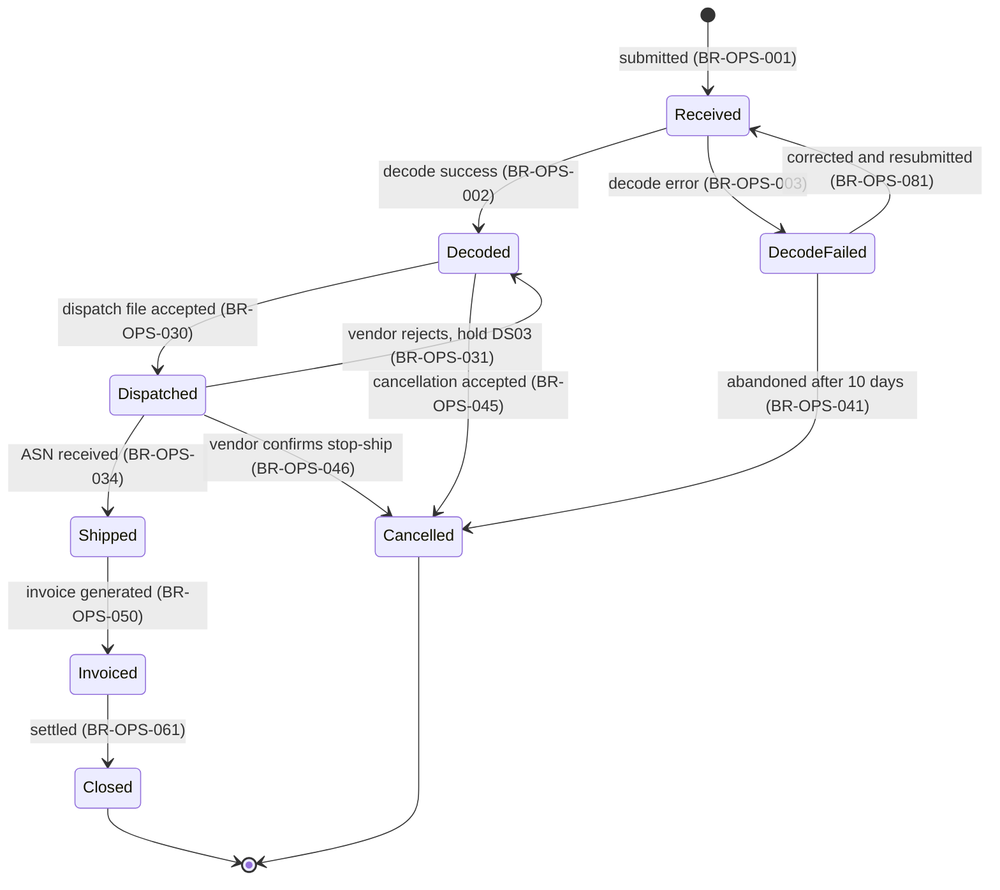
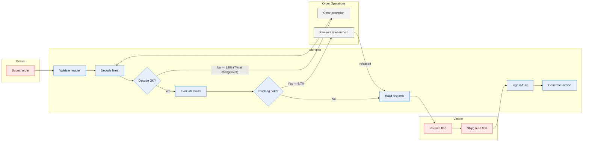

# Order Processing — Domain Overview

> This overview carries compressed versions of the process flow (§7), business rules (§8),
> and state model (§6). Full six-document packs are not yet written; that is the honest state
> of the corpus and is recorded in
> [DMAP-MER-001 §7](../00-foundations/domain-map.md).

---

## 1. Scope

| | |
| --- | --- |
| Domain | Order Processing |
| Code | `OPS` |
| Business purpose | Turn a dealer's order into shipped, invoiced goods |
| Business owner | VP, Order Operations |
| Technical owner | Meridian Squad 1 |
| Product owner | Order Management Product Owner |

**In scope**

| Area | Description |
| --- | --- |
| Order capture | Portal, B2B API, and green-screen entry |
| Order line decoding | Expanding packages into option rows and deriving line attributes |
| Hold evaluation and release | 14 hold classes gating dispatch and, for one, invoicing |
| Amendment and cancellation | Change to an order before or after dispatch |
| Delivery expediting | Requesting accelerated fulfilment |
| Vendor dispatch | Building and transmitting EDI 850 to 43 vendors |
| Shipment confirmation | Ingesting EDI 856 and reconciling to dispatch |
| Invoicing | Generating invoice lines from confirmed shipments |
| Reimbursement | Processing dealer reimbursement claims |

**Out of scope**

| Area | Owned by | Boundary rationale |
| --- | --- | --- |
| Package and option definition | PLR | OPS consumes the catalogue read-only |
| Pricing | Corporate ERP | Net price arrives on the portfolio feed |
| Credit limits | Corporate ERP | OPS consumes a status code and applies holds |
| Objective attainment and incentives | SPR | OPS produces the invoiced volume SPR consumes |
| Physical inventory | Vendors | OPS holds no stock |

**Boundary cases**

| Case | Resolution | Decided by |
| --- | --- | --- |
| Who owns `INCTV_ELIG_FL`, a column in `ORD_LIN`? | **SPR defines it, OPS stores it.** Dual approval for any change | Data Governance Council, 2025-11 |
| Who owns the annual re-pointing of open lines at changeover? | PLR performs it, OPS owns the data. **Approval gate required from OPS from 2027** | Council, 2026-04 |
| Is delivery expediting an OPS or SPR concern? | OPS — it is a fulfilment action, not a commercial one | Domain review, 2025-03 |

---

## 2. Business context

Order Processing is the operational core of Meridian. If it stops, nothing ships.

| Measure | Value |
| --- | --- |
| Orders/day | 18,200 typical, 62,000 peak |
| Order lines/day | 95,000 typical, 310,000 peak |
| Value dispatched/night | ~USD 21M |
| Internal users | 46 Order Operations, 410 field sales |
| External parties | 3,200 dealers, 43 vendors |
| Peak period | Model-year changeover ×2.4; month-end ×1.9 |

**Business calendar**

| Event | Timing | Impact |
| --- | --- | --- |
| Model-year changeover | Mid-Aug to late Sep | Decode failure rate 1.8% → 7%; exception queues at ~4× |
| Month-end | Last 3 business days | Volume ×1.9; batch window utilisation peaks |
| Vendor cutoff | 03:00 UTC daily | The hardest constraint in the system |
| Year-end freeze | 4 days late Dec | No changes |

---

## 3. Capabilities

| ID | Capability | Volume | Criticality | Automation |
| --- | --- | --- | --- | --- |
| C4 | Order capture | 18,200/day | Tier 1 | Full |
| C5 | Order line decoding | 95,000 lines/day | Tier 1 | Full |
| C6 | Hold evaluation and release | 11,400 holds/day | Tier 1 | Full, with manual override |
| C7 | Cancellation and amendment | 2,100/day | Tier 2 | Partial — 14 functions are green-screen only |
| C8 | Delivery expediting | 190/day | Tier 2 | **Partial** — vendor confirmation is by email for 31 of 43 |
| C9 | Vendor dispatch and ASN reconciliation | 17,600/night | Tier 1 | Full |
| C10 | Invoicing | 16,900/night | Tier 1 | Full |
| C11 | Reimbursement | 4,300/week | Tier 2 | **Partial** — claim assessment is manual |

---

## 4. Actors

| Actor | Type | Role | Volume |
| --- | --- | --- | --- |
| Dealer order administrators | External person | Submit, amend, cancel, track | ~7,400 people |
| Field sales | Internal person | View status; request expedites | 410 |
| Order Operations | Internal person | Clear exceptions, apply and release manual holds, override | 46 |
| Credit Operations | Internal person | Release credit holds | 8 |
| Trade Compliance | Internal person | Release `TC02` holds — **only they can** | 5 |
| Fulfilment vendors | External system | Receive dispatch, return ack and ASN | 43 orgs |
| Corporate ERP | Internal system | Supply credit status; consume invoices and journals | — |

---

## 5. Core concepts

| Concept | Definition | Glossary | Entity |
| --- | --- | --- | --- |
| `ops.order` | A dealer's request, one or more lines | [DMAP-MER-001 §3](../00-foundations/domain-map.md) | `ORD_HDR` |
| `ops.order_line` | One package ordered in a quantity | — | `ORD_LIN` |
| `ops.decoded_package` | The option rows a line expands into | DMAP §3 | `ORD_LIN_DEC` |
| `ops.hold` | A condition blocking dispatch and sometimes invoicing | — | `ORD_HLD` |
| `ops.dispatch` | An instruction to a vendor to ship | — | `DSP_INS` |
| `ops.order_date` | The timestamp the dealer submitted, UTC | DMAP §3 — **differs from `spr.objective_date`** | `ORD_HDR.ORD_TS` |
| `ops.unit` | One order line | DMAP §3 — **differs from `spr.unit`** | — |
| `ops.cancelled` | A line in state `Cancelled`, regardless of whether it shipped | DMAP §3 | — |

---

## 6. Order line state model

> **Holds are a separate dimension.** A line can be `Decoded` and carry blocking holds
> simultaneously; holds gate the `Decoded → Dispatched` transition rather than forming a
> state of their own. The `LIN_STS_CD = 'H'` value exists but is set only by the green-screen
> manual path and undercounts held lines by ~80% — see
> [DD-OPS-001 §2.4](../02-data/data-dictionary-order-line.md).

### 6.1 States

| Code | State | Meaning | Typical duration | Terminal | Volume now |
| --- | --- | --- | --- | --- | --- |
| `R` | Received | Awaiting decode | ≤ 12h | No | ~3,800 |
| `D` | Decoded | Decoded; may carry holds | 0–30 days | No | ~41,000 |
| `E` | DecodeFailed | In an exception queue | p50 1 day, p95 6 days | No | ~1,700 |
| `S` | Dispatched | Sent to a vendor | 4–11 days | No | ~178,000 |
| `C` | Shipped | ASN received | ≤ 26h | No | ~19,000 |
| `I` | Invoiced | Invoice generated | 30–90 days | No | ~412,000 |
| `X` | Cancelled | **Or superseded by an amendment** — ambiguous | — | ✅ | — |
| `Z` | Closed | Settled | — | ✅ | — |

### 6.2 Transition checks

| Check | Result | Notes |
| --- | --- | --- |
| Every non-terminal state has an exit | ✅ | |
| Every state reachable from the initial state | ✅ | |
| Every transition cites a rule | ✅ | |
| No transition bypasses a required rule | ⚠️ | The green-screen path can set `X` directly from any state without the cancellation rules |

**Illegal transitions observed in production** ⚠️

| From | To | Occurrences H1 2026 | Suspected cause |
| --- | --- | --- | --- |
| `I` Invoiced | `X` Cancelled | 28 | Green-screen cancellation after invoicing; bypasses BR-OPS-045 |
| `S` Dispatched | `R` Received | 9 | Direct data fix during recovery from a dispatch failure |
| `E` DecodeFailed | `S` Dispatched | 4 | 🔴 **Unexplained.** Under investigation |

> 41 illegal transitions in six months, all through the green-screen path or direct data
> fixes. This is `TD-03` in `TAD-OPS-001 §17` and is the evidence for rebuilding the 14
> green-screen functions.

---

## 7. Process flow

| Measure | Value |
| --- | --- |
| **Straight-through rate** | **88.5%** (lines reaching dispatch with no human intervention). 79% at changeover |
| Order-to-dispatch, p50 | 1 day |
| Order-to-dispatch, p95 | 4 days |
| Order-to-invoice, p50 | 8 days |
| Order-to-invoice, p95 | 19 days |

**Wait states** — where elapsed time goes:

| Wait | Cause | Typical | Avoidable |
| --- | --- | --- | --- |
| Capture → decode | Nightly batch cycle | 0–12h | ✅ Yes — decode is queue-triggered and could run continuously |
| Dispatch → ASN | Vendor fulfilment | 4–11 days | ❌ Physical |
| Exception queue | Order Ops working hours | p50 1 day | Partly |
| Hold release | Depends on the hold class | 1–14 days | Partly |

---

## 8. Business rules — summary

> 214 catalogued of an estimated 260. Full catalogue in `BRC-OPS-001` *(not instantiated in
> this example)*; the rules referenced across the Meridian documents are listed here.

| Rule | Condition | Outcome | Where implemented | Confidence |
| --- | --- | --- | --- | --- |
| BR-OPS-001 | Order header passes validation | Line created with status `Received` | CICS code | ✅ |
| BR-OPS-002 | Package resolves at `DEC_DT` | Expand into option rows | `ORDPKG03` | ✅ |
| BR-OPS-003 | Expansion or compatibility fails | Route to an exception queue | `ORDEXC09` | ✅ |
| BR-OPS-004 | An option is retired before `DEC_DT` | **Silently omitted**; the line still decodes | `ORDPKG03` | ✅ |
| BR-OPS-005 | An option has no `PRD_OPT` row at all | **Decode fails**, `EXC-02` | `ORDPKG03` | ✅ |
| BR-OPS-008 | Two options are mutually exclusive | Decode fails, `EXC-04` | `ORDCMP04` | ✅ |
| BR-OPS-009 | An option requires another that is absent | The required option is **auto-added** | `ORDCMP04` | ✅ |
| BR-OPS-011 | Auto-add creates a new exclusion | Decode fails, `EXC-05`. **Single pass only** | `ORDCMP04` | ✅ |
| BR-OPS-014 | Dealer credit status is `S` | Apply hold `CR01` — blocks dispatch, **not** invoicing | Hold Service | ✅ |
| BR-OPS-018 | Package launch gate not passed by the requested delivery date | Apply `PL02` | Hold Service | ✅ |
| BR-OPS-020 | Planned position below line quantity | Apply `IN04` | Hold Service | ✅ |
| BR-OPS-024 | Trade compliance screening hit | Apply `TC02` — **blocks dispatch and invoicing** | Hold Service | ✅ |
| BR-OPS-028 | Route by volumetric class, region, option class | Assign the vendor | `ORDDSP01` | ✅ |
| BR-OPS-030 | Decoded, holds evaluated, no blocking hold | Include in the dispatch file | `ORDDSP01` | ✅ |
| BR-OPS-031 | 997 rejection received | Apply `DS03` | `EDI-INGEST` | ✅ |
| BR-OPS-032 | No 997 within 4 hours | Apply `DS07` | `EDI-INGEST` | ✅ |
| BR-OPS-034 | ASN received and matched | Status → `Shipped` | `ASN-INGEST-060` | ✅ |
| BR-OPS-041 | Decode exception unresolved for 10 days | Auto-cancel | Batch | ✅ |
| BR-OPS-045 | Cancellation requested before dispatch | Accept; status → `Cancelled` | CICS | ✅ |
| BR-OPS-046 | Cancellation after dispatch, vendor confirms stop-ship | Accept | CICS + manual | ✅ |
| BR-OPS-050 | Shipment confirmed and no invoice hold | Generate an invoice line | `INVGEN02` | ✅ |
| BR-OPS-062 | EU region and any class-H option | Derived weight × 1.15 | `ORDDRV07` | ✅ |
| BR-OPS-063 | — | Volumetric class = **max** across options | `ORDDRV07` | ✅ |
| BR-OPS-066 | — | Lead-time band from the **longest** option lead time | `ORDDRV07` | ✅ |
| BR-OPS-070 | — | `NET_AMT` recalculated at decode, overwriting capture | `ORDDEC01` | ✅ |

**By implementation mechanism** — this predicts change cost:

| Mechanism | Rules | Change lead time | Approval |
| --- | --- | --- | --- |
| Compiled COBOL | 147 | **31 days median** | Full release |
| Java (Hold Service) | 38 | 9 days | Normal release |
| Reference data | 21 | **1 day** | **None** ⚠️ |
| Database constraint | 4 | Full release | Release |
| Manual procedure | 4 | Immediate | Team lead |

> The spread from 1 day to 31 days with no governing principle is `TD-02`. Business
> stakeholders consistently assume the 1-day case, which is why NFR-MAINT-01 is recorded as
> not met.

---

## 9. Interfaces

| IF | Direction | Counterparty | Criticality | Used by | If unavailable |
| --- | --- | --- | --- | --- | --- |
| IF-001/002 | In | Dealers | Tier 1 | Capture | Dealers cannot order; no queueing (`TD-07`) |
| IF-014 | In | Corporate ERP | Tier 1 | Hold evaluation | Credit holds use yesterday's status |
| IF-022 | In | PLM | Tier 1 | Decode | Decode uses yesterday's portfolio |
| IF-042 | Out | 43 vendors | Tier 1 | Dispatch | **Fulfilment day lost** |
| IF-043 | In | 43 vendors | Tier 1 | Dispatch confirmation | `DS07` holds accumulate |
| IF-044 | In | 43 vendors | Tier 1 | Shipment, invoicing | Invoicing stops for affected lines |
| IF-051 | Out | Corporate ERP | Tier 1 | Invoicing | AR posting delayed |
| IF-058 | Out | Corporate ERP | Tier 1 | GL | GL posting delayed |
| IF-112 | Out/In | Compliance SaaS | Tier 1 | Hold evaluation | **Dispatch stops** — lines fail closed |
| IF-203 | Internal | Hold Service | Tier 1 | Decode | Lines marked `HoldEvalFailed`, excluded from dispatch |

Full detail: [ICAT-MER-001](../03-interfaces/interface-catalog.md).

---

## 10. Known pain points

| Pain point | Impact | Frequency | Root cause | Remediation |
| --- | --- | --- | --- | --- |
| Decode failures at changeover | 2.5 FTE of manual correction over 6 weeks | Annual | PLR supersession has no OPS approval gate; no anti-corruption layer | Portfolio contract, `MOD-MER-001` slice 1 |
| ASN never arrives | 0.8 FTE ongoing; 3–5 day detection | ~40/day | No daily ASN-expected control | `DI-2026-003`, 8 days |
| Green-screen validation bypass | 41 illegal transitions in H1 2026 | Ongoing | 14 functions never rebuilt on the web | `TD-03`, ~140 days |
| Expedite confirmation by email | ~190/day, 31 of 43 vendors | Daily | No EDI transaction for expedites | Would need a layout change across 43 vendors |
| Reimbursement claim assessment is manual | ~1.2 FTE | Weekly | Never automated | Not prioritised |

**Manual effort in this domain**

| Activity | Who | Effort | Automation candidate |
| --- | --- | --- | --- |
| Decode exception correction | Order Ops | **3.1 FTE** (4.8 at changeover) | Partly — a change preview would prevent much of it |
| Hold review and release | Order Ops, Credit Ops | 1.8 FTE | Partly |
| ASN chasing | Vendor Integration | 0.8 FTE | ✅ Daily control |
| Expedite confirmation | Order Ops | 0.6 FTE | Needs a vendor layout change |
| Reimbursement assessment | Order Ops | 1.2 FTE | ✅ |
| **Total** | | **7.5 FTE** | |

> Quantifying manual effort is what converts "this is painful" into a business case. It is
> also the most reliable way to find undocumented process steps — people describe what they
> actually do when asked how long it takes.

---

## Change log

| Version | Date | Author | Change |
| --- | --- | --- | --- |
| 3.2.0 | 2026-07-17 | Order Management Product Owner | Semi-annual review. Added §6.2 illegal transitions from the H1 2026 audit; added the rules-by-mechanism table; quantified manual effort |
| 3.0.0 | 2026-02-05 | Order Management Product Owner | Added the rules graduated from `LGA-OPS-001` |
| 1.0.0 | 2024-11-14 | Order Management Product Owner | Initial overview |
