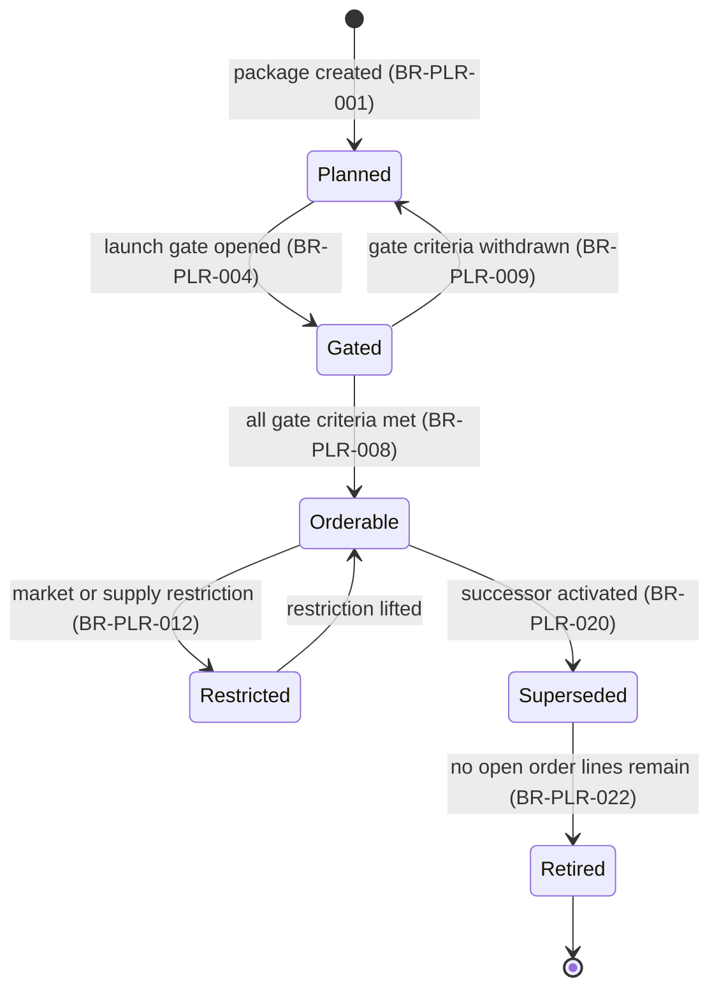
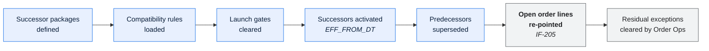

# Product Launch Readiness — Domain Overview

---

## Contents

| Section | Summary |
| --- | --- |
| [1. Scope](#1-scope) | Domain `PLR` — defining what can be sold, in what combinations, from when |
| [2. Business context](#2-business-context) | Twelve people whose reference data governs 95,000 decoded lines a night |
| [3. Capabilities](#3-capabilities) | Portfolio definition, compatibility rules, launch gates, with maturity scores |
| [4. Actors](#4-actors) | Portfolio analysts, launch managers, and the PLM feed |
| [5. Core concepts](#5-core-concepts) | Package, option, compatibility rule, launch gate |
| [6. Launch gate model](#6-launch-gate-model) | Launch gate states and their effect on order decoding |
| [7. Model-year changeover](#7-model-year-changeover) | Model-year changeover — the defining process and the source of cross-domain friction |
| [8. Business rules — summary](#8-business-rules--summary) | PLR rules and where each is implemented |
| [9. Interfaces](#9-interfaces) | PLM inbound and the unowned, unmonitored `IF-205` re-pointing script |
| [10. Known pain points](#10-known-pain-points) | No approval gate and no change preview on reference data |
| [Change log](#change-log) | Version, date, author, change |

---

## 1. Scope

| | |
| --- | --- |
| Domain | Product Launch Readiness / Portfolio Management |
| Code | `PLR` |
| Business purpose | Define what can be sold, in what combinations, from when |
| Business owner | Director, Portfolio Management |
| Technical owner | Meridian Squad 3 |

**In scope**

| Area | Description |
| --- | --- |
| Portfolio definition | Which models and packages are sellable in which markets |
| Package composition | Which option codes a package contains |
| Option definitions | Option attributes driving weight, volumetric class, lead time, price delta |
| Compatibility rules | 2,900 pairwise and group constraints between options |
| Launch readiness gating | Whether a package may be ordered for a given delivery date |
| Model-year changeover | The annual supersession of the portfolio |

**Out of scope**

| Area | Owned by | Rationale |
| --- | --- | --- |
| Product engineering and bills of material | PLM | Meridian holds a sellable projection, not the engineering BOM |
| Pricing | Corporate ERP | PLR receives net price on `IF-022` |
| Order decoding | OPS | PLR defines the rules; OPS executes them |
| Reporting rollups | SPR | SPR maintains its own mapping via `SLS_PKG_MAP` |

---

## 2. Business context

PLR is small in headcount and enormous in leverage: twelve people maintain the reference
data that determines what 3,200 dealers can order and how 95,000 lines a night decode.

| Measure | Value |
| --- | --- |
| Active packages | 340 (1,100 during changeover) |
| Active option codes | 14,200 |
| Package-option rows | 61,000 |
| Compatibility rules | 2,900 |
| Launches per year | ~40 |
| Reference data changes per month | 40–80 normal; **300+ at changeover** |
| Team size | 12 |

**Business calendar**

| Event | Timing | Impact |
| --- | --- | --- |
| Model-year changeover | Mid-Aug to late Sep | The domain's defining event; 6 weeks of daily catalogue change |
| Mid-year portfolio refresh | Feb | ~60 packages updated |
| Launch gates | ~40/year, distributed | Each gates a package's orderability |

---

## 3. Capabilities

| ID | Capability | Volume | Criticality | Automation | Maturity |
| --- | --- | --- | --- | --- | --- |
| C1 | Portfolio and package definition | 340 active | Tier 1 | Full (screen-based) | **2** — no approval gate, no preview |
| C2 | Option compatibility rule maintenance | 2,900 rules | Tier 1 | Full (screen-based) | **2** |
| C3 | Launch readiness gating | ~40/year | Tier 2 | Partial — gate status is set manually | 2 |
| C4 | Model-year changeover | Annual | Tier 1 | **Partial** — a bulk load plus a manual re-pointing script | **1** |
| C5 | Portfolio feed ingest from PLM | Daily | Tier 1 | Full | 4 |

> Maturity 1–2 across four of five capabilities, on the domain with the highest blast radius
> in the system. That is the single most important fact in this document.

---

## 4. Actors

| Actor | Type | Role |
| --- | --- | --- |
| Portfolio analysts | Internal person, ×8 | Maintain packages, options, compatibility rules |
| Launch managers | Internal person, ×3 | Set and clear launch gates |
| Portfolio Data Steward | Internal person | Definitions, quality, governance |
| PLM | Internal system | Supplies the model and option master via `IF-022` |
| Order Processing | Internal domain | Consumes the catalogue read-only |
| Sales Processing | Internal domain | Consumes via `SLS_PKG_MAP` |

---

## 5. Core concepts

| Concept | Definition | Entity |
| --- | --- | --- |
| `plr.package` | A marketable bundle of option codes, valid for one model year | `PRD_PKG` |
| `plr.option` | An individually-identified component or feature | `PRD_OPT` |
| `plr.compatibility_rule` | A constraint between options: mutually exclusive, required, or group | `PRD_CMP_RUL` |
| `plr.launch_gate` | A readiness checkpoint controlling orderability from a date | `PRD_LNCH` |
| `plr.supersession` | The replacement of a package by a successor at changeover | `PRD_PKG.SUCC_PKG_CD` |
| `plr.active` | Within the launch window and not superseded | — |

> `plr.package` differs from `ops.decoded_package` and `spr.reporting_package`. Always use
> the qualified form — see [DMAP-MER-001 §3](../00-foundations/domain-map.md).

---

## 6. Launch gate model

| State | Meaning | Effect on order decoding |
| --- | --- | --- |
| Planned | Defined, not yet orderable | Decode fails, `EXC-06` |
| Gated | Gate open, criteria not all met | Decode succeeds; hold `PL02` applied if the requested delivery date precedes gate clearance |
| Orderable | Fully available | Normal decode |
| Restricted | Temporarily unavailable in some markets | Decode fails for restricted markets |
| Superseded | Replaced by a successor | Decodes for existing lines; **not offered for new orders** |
| Retired | No longer decodable | Decode fails, `EXC-06` |

**Gate criteria**

| # | Criterion | Owner | Typical clearance |
| --- | --- | --- | --- |
| 1 | Homologation and regulatory approval | Compliance | 8–14 weeks before launch |
| 2 | Vendor capacity committed | Vendor Integration | 6 weeks |
| 3 | Pricing confirmed on the portfolio feed | Finance | 4 weeks |
| 4 | Compatibility rules loaded and validated | Portfolio analyst | 3 weeks |
| 5 | Dealer communications issued | Marketing | 2 weeks |

> Criterion 4 is the one that slips, because it is the only one with no external deadline
> forcing it. When it slips, packages become orderable with incomplete compatibility rules
> and the decode failure rate rises — the mechanism behind most changeover exceptions.

---

## 7. Model-year changeover

The domain's defining process, and the origin of most cross-domain friction.

| Step | Duration | Owner | Cross-domain impact |
| --- | --- | --- | --- |
| Successor definition | 6 weeks | Portfolio analysts | — |
| Compatibility rule load | 3 weeks | Portfolio analysts | Decode failure rate rises if incomplete |
| Gate clearance | Variable | Launch managers | Holds `PL02` if late |
| Activation | 1 day | Portfolio analysts | New packages decodable immediately |
| Supersession | 1 day | Portfolio analysts | Predecessors no longer offered |
| **Open line re-pointing** | 1 day | **PLR script, `IF-205`** | ⚠️ **Mutates OPS transactional data with no OPS approval gate** — violation V-04 |
| Residual exception clearing | 2–4 weeks | **Order Operations** | ~2.5 FTE absorbed by another domain |

**The cross-domain problem, stated plainly.** PLR's supersession is a one-way broadcast; OPS
absorbs the consequences in its exception queue; SPR's reporting mapping lags by up to five
days. All three teams experience changeover as the other teams' problem, which is what a
conformist relationship with no anti-corruption layer produces. The remediation is a
versioned portfolio contract with a notice period — `MOD-MER-001` slice 1 *(not instantiated
in this example; see the
[modernization roadmap template](../../../templates/01-architecture/modernization-roadmap.md))*.

**Changeover metrics**

| Metric | 2024 | 2025 | Target |
| --- | --- | --- | --- |
| Decode failure rate at peak | 8.1% | 7.0% | ≤ 4% |
| Order Ops effort absorbed | 3.1 FTE | 2.5 FTE | ≤ 1 FTE |
| Packages unmapped in `SLS_PKG_MAP` at peak | 61 | 47 | 0 |
| Lines re-pointed by `IF-205` | 12,400 | 11,000 | — |
| Incidents attributed to changeover | 12 | 9 | ≤ 3 |

---

## 8. Business rules — summary

| Rule | Condition | Outcome | Mechanism | Confidence |
| --- | --- | --- | --- | --- |
| BR-PLR-001 | Package created | Status `Planned`; not decodable | Screen | ✅ |
| BR-PLR-004 | Launch gate opened | Status `Gated`; decodable with possible `PL02` | Screen | ✅ |
| BR-PLR-008 | All 5 gate criteria met | Status `Orderable` | **Manual** | ✅ |
| BR-PLR-012 | Market restriction applied | Decode fails for that market | Reference data | ✅ |
| BR-PLR-015 | Option added to a package | Effective from the stated date; decodes thereafter | Reference data | ✅ |
| BR-PLR-016 | Option removed from a package | **Silently absent from decode thereafter** | Reference data | ✅ |
| BR-PLR-018 | Option retired (`EFF_TO_DT` set) | Omitted from expansion; **line still decodes** | Reference data | ✅ |
| BR-PLR-020 | Successor activated | Predecessor superseded; no longer offered | Screen | ✅ |
| BR-PLR-022 | No open lines reference a superseded package | May be retired | Batch check | ✅ |
| BR-PLR-025 | Compatibility rule type not in the evaluator's 47 | **Silently ignored** | ⚠️ Compiled constant | ✅ `DEF-2026-0341` |

> BR-OPS-016 and BR-OPS-018 together are the mechanism behind INC-2025-0412: an analyst
> intending to retire an option removed it from a package instead. Both are silent
> operations, and neither has a preview or an approval gate.

**By mechanism**

| Mechanism | Rules | Lead time | Approval |
| --- | --- | --- | --- |
| Reference data | 34 | **Immediate** | **None** ⚠️ |
| Screen-driven status change | 12 | Immediate | None |
| Compiled COBOL | 8 | 31 days | Full release |
| Manual procedure | 5 | — | Team lead |

---

## 9. Interfaces

| IF | Direction | Counterparty | Criticality | Notes |
| --- | --- | --- | --- | --- |
| IF-022 | In | PLM | Tier 1 | Model and option master, daily 20:00 |
| IF-205 | Out | OPS `ORDPKG03` | **Tier 1** | The changeover re-pointing script. **No owner, no ICD, no monitoring** |
| *(via DB2 read)* | Out | OPS, SPR | Tier 1 | Catalogue consumed read-only by both |

---

## 10. Known pain points

| Pain point | Impact | Root cause | Remediation |
| --- | --- | --- | --- |
| **No approval gate on reference data** | INC-2025-0412, USD 310k | The maintenance screen has no workflow | `RF-01`, funded Q4 2026 |
| **No change preview** | Every change's first test is production | Never built | `RF-02`, funded Q4 2026 |
| Changeover cost lands on Order Operations | 2.5 FTE absorbed by another domain | Conformist relationship, no contract | Portfolio contract, `MOD-MER-001` slice 1 |
| Compatibility rule loading slips | Decode failure rate rises | Criterion 4 has no external deadline | Add a gate checkpoint with a hard date |
| `SLS_PKG_MAP` lags PLR | Attainment under-reported during changeover | SPR maintains the mapping manually | Automate mapping proposal from supersession |
| Vendor notification of new option codes is manual | 7 vendors reject unknown codes; 30-day contractual notice | Not in the change workflow | `RF-07`, part of `RF-01` |

---

## Change log

| Version | Date | Author | Change |
| --- | --- | --- | --- |
| 2.1.0 | 2026-06-12 | Portfolio Management Product Owner | Semi-annual review. Added §7 changeover metrics; added BR-PLR-025 after `DEF-2026-0341`; added the vendor notification pain point |
| 2.0.0 | 2025-09-17 | Portfolio Management Product Owner | Added the launch gate state model and criteria after INC-2025-0412 |
| 1.0.0 | 2025-01-08 | Portfolio Management Product Owner | Initial overview |
