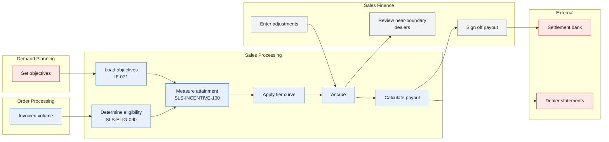

# Sales Processing and Reporting — Domain Overview

> Classification `confidential` — incentive programme structures are commercially sensitive.

---

## 1. Scope

| | |
| --- | --- |
| Domain | Sales Processing & Reporting |
| Code | `SPR` |
| Business purpose | Set dealer objectives, measure attainment, settle incentives, plan inventory, and adjust credits and debits |
| Business owner | Director, Sales Operations |
| Technical owner | Meridian Squad 2 |

**In scope**

| Area | Description |
| --- | --- |
| Objective planning | Loading and revising quarterly dealer objectives |
| Eligibility determination | Deciding which order lines count toward attainment |
| Attainment measurement | Aggregating eligible volume against objectives |
| Incentive accrual and payout | Applying the tier curve and settling quarterly |
| Inventory planning | Maintaining planned dealer inventory positions |
| Credit and debit adjustment | Manual corrections reaching up to two quarters back |
| Sales reporting | Dealer statements, regional and executive reporting |

**Out of scope**

| Area | Owned by | Rationale |
| --- | --- | --- |
| Order capture, dispatch, invoicing | OPS | SPR consumes invoiced volume |
| Physical inventory | Vendors | SPR holds *planned* positions only |
| Payment execution | Settlement bank | SPR produces the instruction |
| Warehouse semantic layer | BI | Must conform to [MET-SPR-001](../02-data/metric-catalog-sales-reporting.md) |
| Dealer master data | Corporate ERP | — |

---

## 2. Business context

| Measure | Value |
| --- | --- |
| Dealers with objectives | 3,200 |
| Objectives per quarter | ~19,200 (dealer × product line) |
| Eligible lines per quarter | ~370,000 |
| **Incentive settled per quarter** | **~USD 41M** |
| Adjustments per quarter | ~8,900 |
| Dealer disputes per quarter | ~15 |
| Inventory positions recalculated nightly | 1.4M |
| Team size | 28 Sales Finance, 14 Sales Operations |

**Business calendar**

| Event | Timing | Impact |
| --- | --- | --- |
| Objective load | Period start − 10 business days | Quarterly |
| Quarter end | Last calendar day | Attainment freezes; adjustment window opens |
| Adjustment window close | Quarter end + 10 business days | The busiest 10 days in the domain |
| Payout calculation | Quarter end + 12 business days | — |
| Payment | Quarter end + 14 business days | USD ~41M moves |
| Statements | Quarter end + 15 business days | 3,200 dealers see their number |

---

## 3. Capabilities

| ID | Capability | Volume | Criticality | Automation | Maturity |
| --- | --- | --- | --- | --- | --- |
| C12 | Objective planning | 19,200/quarter | Tier 2 | Full (loaded from Planning) | 4 |
| C13a | Eligibility determination | 370,000 lines/quarter | Tier 1 | Full | 4 |
| C13b | Attainment measurement | 19,200 rows nightly | Tier 1 | Full | 4 |
| C13c | Incentive accrual and payout | USD 41M/quarter | **Tier 1** | Full | 3 — not reproducible point-in-time |
| C14 | Inventory planning | 1.4M positions | Tier 2 | Full | 3 |
| C15 | Credit/debit adjustment | 8,900/quarter | Tier 2 | **Manual** | **2** |
| C16 | Sales reporting | — | Tier 2 | Full | 4 since certification |

---

## 4. Actors

| Actor | Type | Role |
| --- | --- | --- |
| Sales Finance | Internal person, ×28 | Adjustments, accrual review, payout sign-off |
| Sales Operations | Internal person, ×14 | Objective revisions, dispute resolution, programme enrolment |
| Regional sales managers | Internal person, ×42 | Request objective revisions; consume reporting |
| Dealers | External | Receive statements; raise disputes |
| Demand Planning | Internal system | Supplies objectives via `IF-071` |
| Corporate ERP (AP) | Internal system | Receives the payout liability |
| Settlement bank | External system | Executes payment |
| Franchise regulators (3) | External | Request calculation traces |

---

## 5. Core concepts

| Concept | Definition | Entity |
| --- | --- | --- |
| `spr.objective` | A dealer's target volume for a product line in a period | `SLS_OBJ` |
| `spr.unit` | An eligible line counting toward attainment — **excludes 6 categories** | — |
| `spr.objective_date` | The date a line counts toward; **may differ from `ops.order_date` by up to 5 business days** | `ORD_LIN.SLS_OBJ_DT` |
| `spr.attainment` | Eligible volume ÷ objective, as a percentage at 4dp | `SLS_ATN` |
| `spr.accrual` | Incentive earned but not yet paid | `SLS_ICL` |
| `spr.adjustment` | A manual correction, reaching up to 2 quarters back | `SLS_ADJ` |
| `spr.cancelled` | Reversed from attainment — **only if cancellation preceded invoicing** | — |
| `spr.reporting_package` | A rollup group, one-to-many with `plr.package` | `SLS_PKG_MAP` |

> Four of these eight terms mean something different in another domain. Always qualify —
> see [DMAP-MER-001 §3](../00-foundations/domain-map.md).

---

## 6. Process flow

Field-level detail: [DLN-SPR-001](../02-data/lineage-sales-incentive-payout.md).

| Measure | Value |
| --- | --- |
| Eligibility determination | Nightly, fully automated |
| Adjustments per quarter | 8,900 — **entirely manual** |
| Near-boundary dealers reviewed manually | ~90/quarter |
| Disputes per quarter | ~15 |
| Restatements per quarter | ~0.7 (4 in 6 quarters) |

---

## 7. Business rules — summary

| Rule | Condition | Outcome | Mechanism | Confidence |
| --- | --- | --- | --- | --- |
| BR-SPR-002 | Planning dealer id unmapped in `REF_DLR_XREF` | **Objective row rejected**, not defaulted | COBOL | ✅ |
| BR-SPR-004 | Objective approved by Sales Ops | Status `A`; used for attainment | Screen | ✅ |
| BR-SPR-014 | Line invoiced and passes all six exclusions | `INCTV_ELIG_FL = 'Y'` | COBOL | ✅ |
| BR-SPR-016 | Line held across a period boundary | `SLS_OBJ_DT` = hold release date, not order date | COBOL | ✅ |
| BR-SPR-018 | Period closes | `SLS_OBJ_CD` overwritten with the assigned objective | COBOL | ✅ |
| BR-SPR-020 | — | Attainment quantity = sum of eligible line quantities | COBOL | ✅ |
| BR-SPR-022 | — | Attainment % at **4 decimal places** | COBOL | ✅ |
| BR-SPR-024 | Objective quantity = 0 | Attainment % is **null**, not zero or infinity | COBOL | ✅ |
| BR-SPR-030 | — | Tier banded from attainment % via the effective-dated curve | Reference data + COBOL | ✅ |
| BR-SPR-031 | — | Accrual = eligible units × tier rate, **all units at the achieved tier** | COBOL | ✅ |
| BR-SPR-034 | Programme has a per-dealer cap | Accrual capped | Reference data | ✅ |
| BR-SPR-040 | Adjustment approved | Added to the period's accrual | Screen | ✅ |
| BR-SPR-041 | **Late-ASN adjustment applied** | Value added at the **already-determined tier**; attainment is **not** recomputed | COBOL | ✅ — but see `Q-S02` |
| BR-SPR-050 | Payout calculated | Sum of net accrual across programmes | COBOL | ✅ |
| BR-SPR-053 | Net payout ≤ 0 after offset | **No payment**; balance carries forward | COBOL | ✅ |

### 7.1 The six eligibility exclusions

> The most disputed rule set in the system, and the entire difference between `ops.unit` and
> `spr.unit`.

| # | Exclusion | Volume/quarter | Share |
| --- | --- | --- | --- |
| E1 | Fleet orders (`ORD_TYP_CD = 'FL'`) | ~11,400 | 3.1% |
| E2 | Demo dealers | ~180 | 0.05% |
| E3 | Intercompany (`'XF'`) | ~120 | 0.03% |
| E4 | Cancelled after invoice | ~2,900 | 0.8% |
| E5 | Non-participating programme | ~24,000 | 6.5% |
| **E6** | **Invoiced > 45 days after the objective date** | ~1,100 | 0.3% |
| | **Total** | **~39,700** | **10.7%** |

**E6 is the one that generates disputes.** A line ordered near a quarter end, held for
inventory, and shipped 50 days later is excluded from both quarters — past 45 days for the
first, and its objective date falls in the first rather than the second. ~1,100 lines a
quarter, ~15 disputes. The business has accepted the rule; the dealers have not. Tracked as
`DI-2026-014`.

### 7.2 The tier cliff

| Tier | Attainment from | Rate/unit |
| --- | --- | --- |
| T0 | 0.0000% | USD 0 |
| T1 | 80.0000% | USD 110 |
| T2 | 95.0000% | USD 185 |
| T3 | 105.0000% | USD 240 |
| T4 | 120.0000% | USD 310 |

Each rate applies to **all** eligible units, not just the marginal ones. For a dealer with
412 units, crossing from 94.9999% to 95.0000% is worth **USD 31,085** — one additional unit.

> This is why attainment is computed at 4 decimal places and why that rounding rule is part
> of the certified metric definition rather than an implementation detail. It is also why
> control `S-05` flags the ~90 dealers per quarter sitting within 0.5% of a boundary for
> manual review before close.

---

## 8. Interfaces

| IF | Direction | Counterparty | Criticality | Notes |
| --- | --- | --- | --- | --- |
| IF-071 | In | Demand Planning | Tier 1 | Quarterly objectives |
| IF-063 | Out | Settlement bank | Tier 1 | Payment instruction, ISO 20022 |
| IF-094 | Out | Corporate ERP AP | Tier 1 | Liability posting |
| IF-088 | Out | Enterprise Warehouse | Tier 3 | Attainment and accrual facts |
| *(DB2 read)* | In | OPS `INV_LIN` | Tier 1 | Invoiced volume |
| *(DB2 write)* | Out | OPS `ORD_LIN` | Tier 1 | ⚠️ **Violations V-01 and V-02** — SPR writes two columns in an OPS table |

---

## 9. Cross-domain position

SPR is the domain most entangled with others, and the entanglement is asymmetric.

| Relationship | Type | Health |
| --- | --- | --- |
| OPS → SPR (invoiced volume) | Customer/supplier | ✅ Healthy — quarterly contract, changes are agreed |
| **SPR → OPS (eligibility flags)** | **Shared kernel** | ⚠️ **Unhealthy** — SPR writes into an OPS table; neither team can change `ORD_LIN` alone |
| PLR → SPR (reporting rollups) | Anti-corruption layer | ⚠️ The layer exists but drifts; 47 unmapped packages at the 2025 changeover peak |

**Remediation:** move `INCTV_ELIG_FL` and `SLS_OBJ_CD` to an SPR-owned eligibility table
keyed on `(ORD_ID, LIN_NO)`, removing the shared kernel. Estimated 40 days; scheduled 2027
H2, dependent on `MOD-MER-001`.

---

## 10. Known pain points

| Pain point | Impact | Root cause | Remediation |
| --- | --- | --- | --- |
| **Accrual not reproducible point-in-time** | A regulator cannot be shown a full calculation trace; failed for 41 of 200 sampled dealers | Enrolment and eligibility are overwritten, not snapshotted | `DI-2025-031`, 18 days, 2027-Q1 |
| E6 interacts badly with the adjustment window | ~15 disputes/quarter | A 45-day rule against a 10-day window | `DI-2026-014` |
| Late-ASN adjustments do not recompute the tier | ~USD 400k/quarter at stake | Design choice, never revisited | **Business decision** `Q-S02` |
| 8,900 manual adjustments per quarter | ~2.2 FTE in the 10-day window | Adjustments were never automated | Automate `LA` (late ASN), the largest category at 3,100 |
| `SLS_OBJ_CD` means two things | Queries are wrong unless they check the period-close flag | Column reused in 2007 | `DI-2025-027`, split the column |
| `SLS_PKG_MAP` drifts at changeover | Attainment under-reported | Mapping maintained manually | Automate mapping proposals from PLR supersession |
| MET-011 in use and uncertified | 3 regional dashboards using a metric whose denominator is planned, not actual, inventory | Built outside governance in 2023 | Define or retire by 2026-11-30 |

**Manual effort**

| Activity | Who | Effort |
| --- | --- | --- |
| Adjustment entry and approval | Sales Finance | **2.2 FTE** concentrated in 10 days/quarter |
| Near-boundary dealer review | Sales Finance | 0.4 FTE/quarter |
| Dispute investigation | Sales Operations | 0.6 FTE |
| Objective revision processing | Sales Operations | 0.3 FTE |
| **Total** | | **3.5 FTE** |

---

## Change log

| Version | Date | Author | Change |
| --- | --- | --- | --- |
| 2.3.0 | 2026-07-24 | Sales Operations Product Owner | Semi-annual review. Added §7.2 tier cliff explanation; recorded the failed reproducibility test; added MET-011 to the pain points |
| 2.1.0 | 2026-02-13 | Sales Operations Product Owner | Added §9 cross-domain position and the shared-kernel remediation plan |
| 2.0.0 | 2025-08-06 | Sales Operations Product Owner | Added §7.1 the six exclusions after INC-2024-0891 |
| 1.0.0 | 2024-12-03 | Sales Operations Product Owner | Initial overview |
