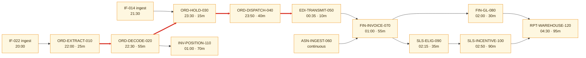

# Meridian — Job Schedule Catalog

> The operational counterpart to
> [BAT-MER-001](../01-architecture/batch-and-scheduling-architecture.md). That document
> explains the design; this is what someone consults at 02:00 when a job has abended.
>
> §8 lists the 23 jobs with no documented restart procedure. That list is the highest-priority
> operational gap in the system.

---

## 1. Summary

| | |
| --- | --- |
| Scheduler | IBM Workload Scheduler 9.5 — **EOL 2028-06** |
| Nightly jobs | 210 |
| Month-end additional | 17 |
| Quarter-end additional | 9 |
| Schedule definitions | `MERIDIAN.NIGHTLY`, `MERIDIAN.MONTHEND`, `MERIDIAN.QTREND` |
| **Version controlled** | ❌ **No** — `TD-11`. Weekly manual export only |
| Timezone | UTC, no daylight saving |
| Calendar | `MERIDIAN.CALENDAR` — US + EU holidays merged |
| Critical path jobs | 5 |
| **Jobs with no documented restart procedure** | **23** |
| **Jobs that must never be blindly re-run** | **5** |

---

## 2. Nightly core chain

| Job ID | Name | Purpose | Schedule | Trigger | p50 | p95 | Predecessors | Crit | Restart | Runbook |
| --- | --- | --- | --- | --- | --- | --- | --- | --- | --- | --- |
| `ORD-EXTRACT-010` | Order extract | Snapshot unprocessed lines into `ORD_WRK` | 22:00 | Time | 25m | 32m | `IF-022` ingest | 1 | ✅ Safe | [RUN-OPS-001](runbook-nightly-order-cycle.md) §3 |
| `ORD-DECODE-020` | Order decode | Expand packages, validate, derive | — | Predecessor | 55m | 72m | `ORD-EXTRACT-010` | **1** | ✅ Safe | `RUN-OPS-001` §3 |
| `ORD-HOLD-030` | Hold evaluation | Persist hold results | — | Predecessor | 15m | 22m | `ORD-DECODE-020`, `IF-014` ingest | 1 | ✅ Safe | `RUN-OPS-001` §3 |
| `ORD-DISPATCH-040` | Dispatch build | Build 43 EDI 850 files with control totals | — | Predecessor | 40m | 51m | `ORD-HOLD-030` | 1 | ⚠️ **Conditional** | `RUN-OPS-001` §3 |
| `EDI-TRANSMIT-050` | Dispatch transmit | Transmit to the vendor gateway | — | Predecessor | 10m | 14m | `ORD-DISPATCH-040` | 1 | ❌ **Never** | `RUN-OPS-001` §5 |
| `ASN-INGEST-060` | ASN ingest | Ingest EDI 856 | Continuous | **File arrival** | 2m | 8m | — | 1 | ✅ Safe | `RUN-OPS-002` |
| `FIN-INVOICE-070` | Invoice generation | Generate invoice lines from confirmed shipments | 01:00 | Predecessor | 55m | 68m | `EDI-TRANSMIT-050`, `ASN-INGEST-060` | 1 | ⚠️ **Conditional** | `RUN-OPS-003` |
| `FIN-GL-080` | GL interface | Post journals to the ERP | — | Predecessor | 30m | 38m | `FIN-INVOICE-070` **same calendar date** | 1 | ❌ **Never** | `RUN-OPS-003` |
| `SLS-ELIG-090` | Eligibility | Compute incentive eligibility | 02:15 | Predecessor | 35m | 44m | `FIN-INVOICE-070` | 2 | ✅ Safe | `RUN-OPS-004` |
| `SLS-INCENTIVE-100` | Incentive calculation | Attainment and accrual | — | Predecessor | 90m | 112m (279m at quarter-end) | `SLS-ELIG-090` | 1 | ⚠️ **Conditional** | `RUN-OPS-004` |
| `INV-POSITION-110` | Inventory position | Recalculate planned positions | 01:00 | Predecessor | 70m | 88m | `ORD-DECODE-020` | 2 | ✅ Safe | — |
| `RPT-WAREHOUSE-120` | Warehouse extract | Fact and dimension extracts | 04:30 | Predecessor | 95m | 118m | `FIN-GL-080`, `SLS-INCENTIVE-100` | 3 | ✅ Safe | — |

*(198 further nightly jobs — feeds, reconciliations, housekeeping, reporting — omitted from
this example.)*

---

## 3. Dependency graph

**Critical path:** `ORD-EXTRACT-010 → ORD-DECODE-020 → ORD-HOLD-030 → ORD-DISPATCH-040 →
EDI-TRANSMIT-050`. p50 2h25m, **p95 3h11m**, against a 03:00 UTC cutoff from a 22:00 start —
1h49m slack at p95, falling to **1h03m during model-year changeover**.

---

## 4. Job detail — the constraint

### `ORD-DECODE-020`

| | |
| --- | --- |
| Purpose | Expand each order line's package into option rows, validate compatibility, derive attributes |
| Owner | Meridian Squad 1 |
| Criticality | **Tier 1 — the throughput constraint of the entire nightly chain** |
| Schedule | Predecessor-triggered, typically 22:30 |
| Calendar | Every day |
| p50 / p95 / max observed | 55m / 72m / **131m** (2025-09-04, changeover) |
| Must complete by | 23:45 to keep the chain on plan |
| Programs | `ORDDEC01` + 14 subprograms |

**Dependencies**

| Type | Item | Blocking | If missing |
| --- | --- | --- | --- |
| Predecessor | `ORD-EXTRACT-010` | ✅ | Job held |
| Input | `ORD_WRK` populated | ✅ | Zero-record run; completes with nothing decoded |
| Reference | `PRD_PKG`, `PRD_OPT`, `PRD_PKG_OPT`, `PRD_CMP_RUL` current | ⚠️ Not enforced | Decodes against stale portfolio |
| Reference | `REF.TAXCAT` current | ❌ **Not enforced, no dependency declared** | Stale tax categories, no alert |
| Service | Hold Service reachable | ✅ | Lines marked `HoldEvalFailed`, excluded from dispatch |
| Database | DB2 available | ✅ | Abend |

**Resources**

| Resource | Typical | Peak | Contention |
| --- | --- | --- | --- |
| CPU | ~14% of the LPAR | ~31% | — |
| DB2 buffer pool `BP4` | High | Very high | **`INV-POSITION-110`** — costs decode 8–14% above ~240k lines |
| Commit frequency | Every 5,000 lines | — | — |

**Restart and recovery**

| | |
| --- | --- |
| Re-runnable | ✅ **Safe** |
| Restart point | From the last commit group |
| Idempotent | ✅ — decoded rows are keyed `(ORD_ID, LIN_NO, OPT_CD)` and upserted |
| Pre-restart cleanup | None |
| **Consequence of a double run** | **None.** Rows are replaced, not appended |
| Maximum safe delay | Must complete by 23:45 to preserve the chain; hard limit is whatever leaves 50m before the 03:00 cutoff |
| Catch-up | Can absorb two days of volume in one run — **tested to 310,000 lines, unverified above** (`Q-004`) |

**Failure handling**

| Failure | Automatic | Manual | Escalate | Downstream |
| --- | --- | --- | --- | --- |
| Abend | Successors held | Diagnose, restart from last commit | Page after 15 min | Chain stalls |
| Overrun past 23:45 | Alert | Assess against the cutoff | Immediate | Cutoff at risk |
| Hold Service unavailable | Lines marked `HoldEvalFailed` | Re-run decode after recovery | Page | Those lines do not dispatch |
| Decode failure rate > 3% (9% at changeover) | Alert | Investigate — usually a reference data change | Ticket | Exception queues fill |

**Monitoring**

| Signal | Threshold | Alert to |
| --- | --- | --- |
| Job failed | Any | SRE page |
| Running longer than p95 | 72m | SRE ticket |
| Not started by 23:00 | — | SRE page |
| Decode failure rate | > 3% (> 9% at changeover) | Order Ops ticket |
| Throughput | < 1,100 lines/min | SRE ticket |

---

## 5. Restart semantics — all critical jobs

| Job | Re-runnable | Restart point | Idempotent | Cleanup | Consequence of a double run |
| --- | --- | --- | --- | --- | --- |
| `ORD-EXTRACT-010` | ✅ Safe | Start | ✅ | None | None — `ORD_WRK` is truncated on entry |
| `ORD-DECODE-020` | ✅ Safe | Last commit | ✅ | None | None |
| `ORD-HOLD-030` | ✅ Safe | Start | ✅ | None | None — the hold set is replaced |
| `ORD-DISPATCH-040` | ⚠️ Conditional | Start | ❌ | `DELETE FROM DSP_INS WHERE CYCLE_ID = :cycle` | **Duplicate dispatch instructions → duplicate physical shipments** |
| `EDI-TRANSMIT-050` | ❌ **Never** | — | ❌ | Contact the vendor first | **Files already sent. Cannot be recalled.** Duplicate orders at the vendor |
| `ASN-INGEST-060` | ✅ Safe | Start | ✅ | None | None — unique key rejects duplicates |
| `FIN-INVOICE-070` | ⚠️ Conditional | Start | ❌ | Run `FINREV01` for the cycle | **Duplicate invoices → duplicate AR postings** |
| `FIN-GL-080` | ❌ **Never** | — | ❌ | Finance journal reversal | **Duplicate GL postings** |
| `SLS-ELIG-090` | ✅ Safe | Start | ✅ | None | None |
| `SLS-INCENTIVE-100` | ⚠️ Conditional | Start | ❌ | Delete the period's accrual rows | **Double accrual → overstated incentive liability** |
| `INV-POSITION-110` | ✅ Safe | Start | ✅ | None | None |
| `RPT-WAREHOUSE-120` | ✅ Safe | Start | ✅ | None | None — idempotent on `(cycle_id, grain_key)` |

---

## 6. Jobs that must never be blindly re-run

> Read this before touching anything.

| Job | Why | Correct procedure | Approval needed |
| --- | --- | --- | --- |
| `EDI-TRANSMIT-050` | Files are at 43 vendors | Contact the vendor, agree a cancel-and-replace, retransmit with a **new** `ISA13` | Vendor Integration Lead |
| `FIN-GL-080` | Journals posted to the ERP general ledger | Finance raises a reversal journal, then the job may re-run | Finance Controller |
| `ORD-DISPATCH-040` | Produces the instructions `EDI-TRANSMIT-050` sends | Delete the cycle's `DSP_INS` rows. **Safe only if `EDI-TRANSMIT-050` has not run** | SRE Lead |
| `FIN-INVOICE-070` | AR postings | Run `FINREV01` for the cycle first | Finance Controller |
| `SLS-INCENTIVE-100` | Accrues incentive liability | Delete the period's accrual rows first | Sales Data Steward |

---

## 7. Special schedules

| Schedule | Jobs | Timing | Calendar rule |
| --- | --- | --- | --- |
| Weekly | 8 | Sunday 05:00 | Every Sunday |
| **Month-end** | 17 | After the nightly chain on the **last business day** | `MERIDIAN.CALENDAR` |
| Quarter-end | 9 | Month-end + incentive settlement | Last business day of Mar/Jun/Sep/Dec |
| Year-end | 4 | Additional close jobs | Last business day of Dec |
| On-demand | 6 | Manual | `FINREV01`, re-decode utilities, ad-hoc extracts |

> "Month-end" here means the **last business day**. Finance means the accounting period
> close (typically month-end + 2 business days); Sales means the last calendar day for
> objective periods. Three definitions, all legitimate — see
> [MET-SPR-001 §7](../02-data/metric-catalog-sales-reporting.md).

---

## 8. Jobs with no documented restart procedure ⚠️

> Twenty-three jobs whose recovery depends on two individuals' knowledge. This is the
> highest-priority operational gap in the system.

| Job | Domain | Criticality | Why undocumented | Owner | Target |
| --- | --- | --- | --- | --- | --- |
| `RMB-CLAIM-140` | OPS | **Tier 1** | Reimbursement claim processing; original author left in 2019 | Squad 1 Tech Lead | 2026-10-31 |
| `RMB-PAY-150` | OPS | **Tier 1** | Produces the payment instruction; has no idempotency key (`TD-05`) | Squad 1 Tech Lead | 2026-10-31 |
| `PLR-BULK-010` | PLR | Tier 1 | The changeover bulk load; run once a year by one person | Portfolio Data Steward | **2026-09-30** — before the 2026 changeover |
| `TAX-REFRESH-200` | OPS | Tier 2 | Refreshes `REF.TAXCAT`; run by the two named individuals | **Unassigned** | Blocked on `RF-05` |
| `SLS-ADJ-160` | SPR | Tier 2 | Adjustment application | Squad 2 Tech Lead | 2026-12-31 |
| *(18 further, Tier 2/3)* | | | | | |

**Progress**

| Period | Undocumented | Change |
| --- | --- | --- |
| 2025-Q1 | 35 | Baseline |
| 2025-Q4 | 28 | −7 |
| 2026-Q2 | 25 | −3 |
| 2026-Q3 | **23** | −2 |

> Twelve documented in 18 months against a target of all 35. The rate is slowing because the
> remaining ones are the hardest — their authors have left. `PLR-BULK-010` is prioritised
> because it runs once a year, six weeks from now, and one person knows how to recover it.

---

## 9. Manual interventions

| Intervention | Job | Frequency | Who | Why still manual |
| --- | --- | --- | --- | --- |
| WLM capacity increase for changeover | All | Annual | Platform Engineering | Never automated; depends on one person remembering (`BI-06`) |
| `REF.TAXCAT` refresh | `TAX-REFRESH-200` | ~4/year | 2 named individuals | Direct VSAM edit; no owner |
| Quarter-end window extension to 06:00 | Sales chain | Quarterly | SRE | Scheduler calendar edit |
| Vendor file manual resend | `EDI-TRANSMIT-050` | ~6/year | Vendor Ops | Requires vendor coordination by design |
| Exception queue bulk reassignment | — | Weekly at changeover | Order Ops | No bulk tool |

---

## 10. Performance history

| Job | p50 | p95 | Max | Trend | Failures (90d) | Action |
| --- | --- | --- | --- | --- | --- | --- |
| `ORD-DECODE-020` | 55m | 72m | 131m | ▲ +6%/yr | 2 | Monitor against the changeover projection |
| `ORD-DISPATCH-040` | 40m | 51m | 74m | ▲ +4%/yr | 1 | — |
| `FIN-INVOICE-070` | 55m | 68m | 96m | ▲ +5%/yr | 0 | — |
| `SLS-INCENTIVE-100` | 90m | 112m | **279m** | ▲ +9%/yr | 3 | Quarter-end runtime is the concern |
| `RPT-WAREHOUSE-120` | 95m | 118m | 164m | ▲ +11%/yr | 4 | Fastest-growing job in the estate |

**Jobs approaching their window**

| Job | Window | p95 | Utilisation | Projected breach | Action |
| --- | --- | --- | --- | --- | --- |
| Critical path (changeover) | 5h00m | 3h57m | **79%** | **2028 changeover** | Decision needed by 2027-Q2 |
| `SLS-INCENTIVE-100` (quarter-end) | 3h45m extended | 4h39m | **124%** ⚠️ | **Already breaching** — window extended manually each quarter | Make the extension permanent, or optimise |
| `RPT-WAREHOUSE-120` | 2h30m | 1h58m | 79% | 2028 | Monitor |

> `SLS-INCENTIVE-100` already exceeds its standard window at quarter-end and is accommodated
> by a manual calendar edit four times a year. That works until the quarter someone forgets.

---

## 11. Retired jobs

| Job | Retired | Reason | Definition removed from the scheduler |
| --- | --- | --- | --- |
| `ORD-FAX-090` | 2014-08 | EDI replaced fax | ❌ **Still present, disabled** |
| `RGN-ALLOC-170` | 2019-03 | Regional allocation moved to SPR | ❌ **Still present, disabled** |
| `ORD-PRINT-180` | 2009-11 | Green-screen order print retired | ✅ Removed 2024-11 |
| *(6 further)* | | | |

> Two disabled-but-present definitions remain. A disabled job can be re-enabled by accident
> during a recovery and clutters dependency analysis. Removing them is a 1-day task that has
> been deferred four times; it is now on the Q4 2026 list.

---

## Change log

| Version | Date | Author | Change |
| --- | --- | --- | --- |
| 4.1.0 | 2026-08-11 | SRE Lead | Quarterly review. Prioritised `PLR-BULK-010` ahead of the 2026 changeover; added the §10 window-utilisation projection showing `SLS-INCENTIVE-100` already breaching |
| 4.0.0 | 2026-05-13 | SRE Lead | Added §8 undocumented-restart list with progress tracking |
| 3.0.0 | 2025-11-18 | SRE Lead | Added §6 never-re-run list after INC-2025-0733 |
| 1.0.0 | 2024-12-16 | SRE Lead | Initial catalog |
