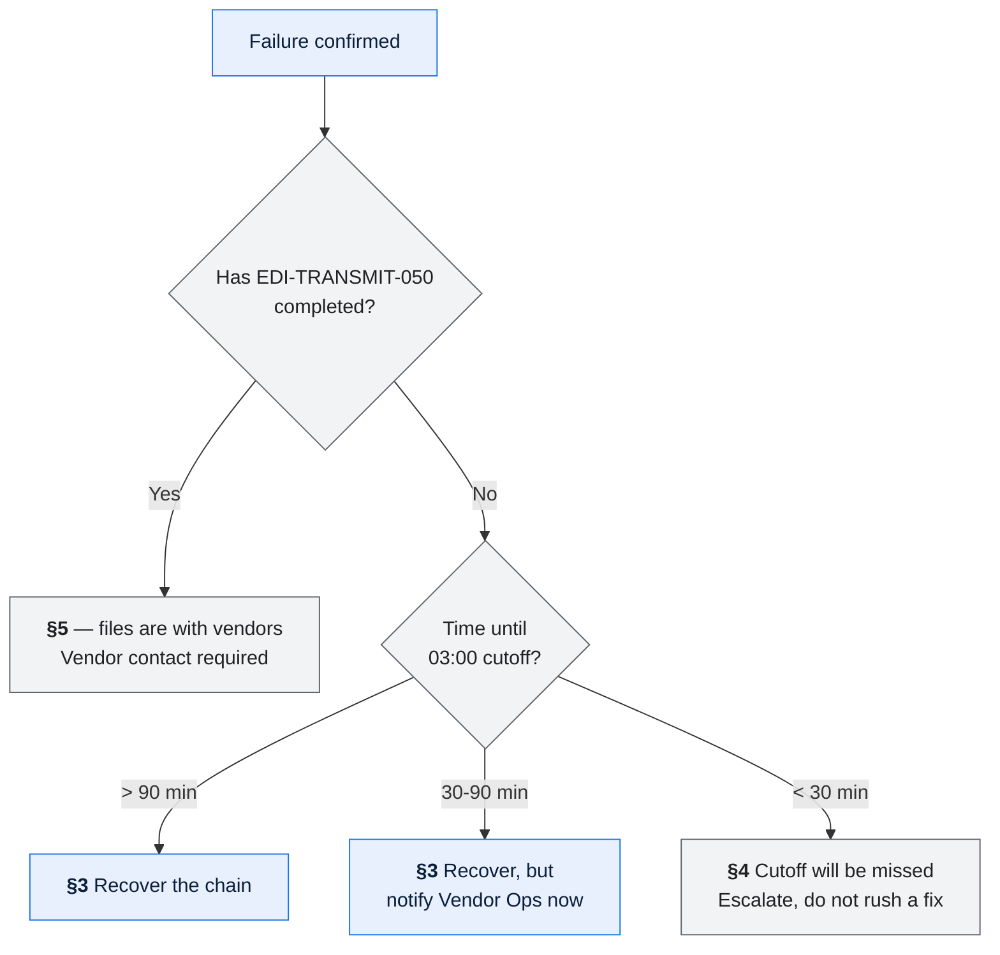

# Nightly Order Cycle Failure — Runbook

> **You have been paged at 03:00 and you do not work on Meridian every day.** This runbook
> assumes that.
>
> **Establish scope before you act.** Three jobs in this chain cause irreversible external
> effects, and the wrong recovery is worse than a delayed one.

---

## When to use this

| | |
| --- | --- |
| Triggering alerts | `MER-BATCH-ABEND`, `MER-BATCH-OVERRUN`, `MER-DISPATCH-CUTOFF-RISK`, `MER-CTT-MISMATCH` |
| Symptoms | A job in the nightly core chain has failed, overrun, or not started |
| **Do not use this if** | The alert is `MER-ASN-*` (use `RUN-OPS-002`), `MER-FIN-*` for invoice or GL failures (use `RUN-OPS-003`), or `MER-SLS-*` (use `RUN-OPS-004`) |
| Related | [JSC-MER-001](job-schedule-catalog.md) · [BAT-MER-001](../01-architecture/batch-and-scheduling-architecture.md) · [ICD-VND-001](../03-interfaces/icd-vendor-dispatch-outbound.md) |
| Expected duration | 20 min to assess; 15 min to 3h to resolve |
| Severity | Sev 2 by default; **Sev 1** if the 03:00 cutoff is at risk or a duplicate has been transmitted |

---

## Before you start

**Access required**

| Access | How to get it | If you don't have it |
| --- | --- | --- |
| TSO / ISPF on `MERPROD` | RACF group `MERSRE` | Escalate — you cannot run this runbook |
| IWS scheduler console | RACF group `MERSCHED` | Escalate |
| DB2 read on `MERPROD` | RACF group `MERSRE` | Escalate |
| DB2 **write** | RACF group `MERSREW` — **break-glass, logged** | Request via on-call escalation |
| `#meridian-edi` Slack | — | — |

**Approvals needed before certain steps**

| Action | Approver | How to reach | Can it wait? |
| --- | --- | --- | --- |
| Re-run `ORD-DISPATCH-040` | SRE Lead | On-call escalation | Yes — until 02:00 |
| Re-transmit to a vendor | Vendor Integration Lead | `#meridian-edi`, then phone | **No** — but the vendor must be contacted first |
| Re-run `FIN-INVOICE-070` | Finance Controller | On-call finance rota | Yes — until 05:00 |
| Re-run `FIN-GL-080` | Finance Controller | On-call finance rota | **No — requires a reversal journal first** |

> ⚠️ **Risks in this procedure**
>
> | Step | Risk | Consequence |
> | --- | --- | --- |
> | §3.4 re-run `ORD-DISPATCH-040` | Duplicate `DSP_INS` rows | Duplicate physical shipments at 43 vendors |
> | §5 re-transmit | The file is already at the vendor | Duplicate orders in the vendor's system; goods shipped twice |
> | Any `FIN-*` re-run | Financial postings | Duplicate AR or GL entries |

---

## 1. Assess

### 1.1 Confirm what failed

```
TSO: EX 'MER.PROD.CLIST(CHAINSTS)'
```

Expected output:

```
MERIDIAN NIGHTLY CHAIN STATUS  2026-08-14 03:02 UTC
JOB                  STATUS    START     END       RC
ORD-EXTRACT-010      COMPLETE  22:00     22:26     0000
ORD-DECODE-020       COMPLETE  22:30     23:41     0000
ORD-HOLD-030         COMPLETE  23:45     00:04     0000
ORD-DISPATCH-040     ABEND     00:08     00:31     S0C7
EDI-TRANSMIT-050     HELD      -         -         ----
```

| If you see | Then |
| --- | --- |
| A job in `ABEND` | Continue to 1.2 |
| A job `RUNNING` past its p95 (see [JSC-MER-001 §10](job-schedule-catalog.md)) | Go to §2.2 |
| A job that never started (`----` with successors `HELD`) | Go to §2.3 |
| `EDI-TRANSMIT-050` = `COMPLETE` **and** a downstream problem | ⚠️ **Files are already with vendors.** Go to §5 |
| Everything `COMPLETE` | This is not your alert. Check the alert source |

### 1.2 Determine scope — before acting

```sql
-- How many lines are affected, and what state are they in?
SELECT LIN_STS_CD, COUNT(*)
FROM   MERPROD.ORD_LIN
WHERE  CYCLE_ID = :cycle_id
GROUP  BY LIN_STS_CD;

-- Did anything reach the vendors?
SELECT VND_CD, COUNT(*) AS dsp_rows, MAX(TRANSMIT_TS) AS last_transmit
FROM   MERPROD.DSP_INS
WHERE  CYCLE_ID = :cycle_id
GROUP  BY VND_CD;
```

**Record these before you do anything else:**

| Question | Your answer |
| --- | --- |
| How many lines are affected? | |
| Which job failed, and did it write output? | |
| **Has anything been transmitted to a vendor?** | |
| How long until the 03:00 cutoff? | |
| Is this changeover season (mid-Aug to late Sep)? | |

> An escalation without these five answers forces the next person to redo this section.
> Establishing scope takes four minutes and saves far more.

### 1.3 Decide the path



---

## 2. Specific symptoms

### 2.1 Control total mismatch (`MER-CTT-MISMATCH`)

`ORD-DISPATCH-040` aborted because the file's `CTT` totals did not match `DSP_INS`. **This is
the system working correctly** — it refused to transmit an inconsistent file.

```sql
SELECT d.VND_CD, COUNT(*) AS dsp_rows, SUM(d.NET_AMT) AS dsp_amt,
       f.file_po1_count, f.file_amount
FROM   MERPROD.DSP_INS d
JOIN   MERPROD.EDI_FILE_SUMMARY f
       ON f.CYCLE_ID = d.CYCLE_ID AND f.VND_CD = d.VND_CD
WHERE  d.CYCLE_ID = :cycle_id
GROUP  BY d.VND_CD, f.file_po1_count, f.file_amount
HAVING COUNT(*) <> f.file_po1_count OR SUM(d.NET_AMT) <> f.file_amount;
```

| If | Then |
| --- | --- |
| One vendor mismatches | Note the vendor; go to §3.4 — the other 42 files are valid and can transmit |
| Several vendors mismatch | A build defect. **Escalate to Squad 1** — do not re-run |
| Counts match but amounts differ | Usually a `NET_AMT` change mid-build. Escalate to Squad 1 |

### 2.2 Job overrunning

```
TSO: EX 'MER.PROD.CLIST(JOBPROG)' JOB(ORD-DECODE-020)
```

Compare progress against p95 in [JSC-MER-001 §10](job-schedule-catalog.md).

| Assessment | Action |
| --- | --- |
| Progressing, will finish with ≥ 50 min before 03:00 | **Let it run.** Do not cancel a progressing job |
| Progressing, will finish with < 50 min | Notify Vendor Ops now; let it run |
| Not progressing (same commit group for > 10 min) | Check for a lock: §2.4 |
| Changeover season and decode is at ~118m | This is expected. Let it run |

> **Cancelling a progressing job is almost always wrong.** `ORD-DECODE-020` restarts from its
> last commit group, so cancelling and restarting loses the partial group and gains nothing.

### 2.3 Job did not start

```
IWS console: SHOW JOB ORD-DECODE-020 DEPENDENCIES
```

| Cause | Check | Action |
| --- | --- | --- |
| Predecessor incomplete | Chain status | Resolve the predecessor first |
| Input file missing | `IF-022` / `IF-014` arrival | See §2.5 |
| Calendar excluded today | IWS calendar | Verify against `MERIDIAN.CALENDAR`; escalate if wrong |
| Scheduler unresponsive | IWS heartbeat | **Escalate immediately** — `FM-10`; there is no documented manual run procedure |

### 2.4 Lock or contention

```sql
SELECT * FROM SYSIBMADM.LOCKS_HELD
WHERE  TABSCHEMA = 'MERPROD'
AND    TABNAME IN ('ORD_LIN','ORD_LIN_DEC','DSP_INS','ORD_HLD');
```

| If | Then |
| --- | --- |
| An online CICS transaction holds a lock | Expected briefly. Wait 2 minutes and re-check |
| `INV-POSITION-110` is contending on `BP4` | Expected at high volume; decode is 8–14% slower. Let both run |
| A lock held > 10 min by an idle session | Escalate to the DBA on call. **Do not cancel a session yourself** |

### 2.5 Input file missing

| File | Expected by | Source | If missing |
| --- | --- | --- | --- |
| `IF-022` portfolio | 20:30 | PLM | Chain proceeds on yesterday's portfolio. New packages will fail to decode. Notify Portfolio Data Steward |
| `IF-014` credit | 21:50 | Corporate ERP | Chain proceeds on yesterday's credit status. **A newly suspended dealer could be dispatched to.** Notify Credit Operations |

> Neither of these blocks the chain by design — a missed reference feed is less damaging than
> a missed vendor cutoff. Both require notification so the affected team can assess exposure.

---

## 3. Recover the chain

### 3.1 Identify the restart point

Check [JSC-MER-001 §5](job-schedule-catalog.md) for the failed job's restart semantics. The
short version:

| Job | Action |
| --- | --- |
| `ORD-EXTRACT-010`, `ORD-DECODE-020`, `ORD-HOLD-030` | ✅ Restart directly — go to §3.2 |
| `ORD-DISPATCH-040` | ⚠️ Cleanup required — go to §3.4 |
| `EDI-TRANSMIT-050` | ❌ **Stop.** Go to §5 |

### 3.2 Restart a safe job

> ✅ **Reversible.** These jobs are idempotent; a restart cannot cause duplicate business
> effect.

```
IWS console: RERUN JOB(ORD-DECODE-020) FROM(LASTCHECKPOINT)
```

Verify it started:

```
TSO: EX 'MER.PROD.CLIST(CHAINSTS)'
```

Expected: the job shows `RUNNING` with a new start time.

| If | Then |
| --- | --- |
| It starts and progresses | Monitor to completion; then §6 |
| It abends again with the same code | **Escalate to Squad 1.** Do not restart a third time |
| It abends with a different code | Return to §1.2 and reassess scope |

### 3.3 Check for downstream holds

```
IWS console: SHOW CHAIN MERIDIAN.NIGHTLY STATUS(HELD)
```

Successors are released automatically when a predecessor completes. If they stay `HELD`,
release them manually:

```
IWS console: RELEASE JOB(ORD-HOLD-030)
```

### 3.4 Re-run `ORD-DISPATCH-040`

> 💰 **Financial and physical risk.** This job produces the dispatch instructions that
> `EDI-TRANSMIT-050` sends to vendors. Re-running it without deleting the existing rows
> creates **duplicate dispatch instructions**, which become **duplicate physical shipments**.
>
> ⚠️ **Do not proceed unless step 1 returns `COMPLETE = NO` for every vendor.**

**Step 1 — confirm nothing has been transmitted**

```sql
SELECT VND_CD,
       CASE WHEN MAX(TRANSMIT_TS) IS NULL THEN 'NO' ELSE 'YES' END AS transmitted
FROM   MERPROD.DSP_INS
WHERE  CYCLE_ID = :cycle_id
GROUP  BY VND_CD;
```

| Result | Action |
| --- | --- |
| All `NO` | ✅ Safe to continue to step 2 |
| **Any `YES`** | ❌ **STOP.** Go to §5 |

**Step 2 — obtain approval**

SRE Lead approval is required. Record who approved and when.

**Step 3 — delete the cycle's dispatch rows**

> ⚠️ Requires break-glass write access (`MERSREW`). This action is logged.

```sql
DELETE FROM MERPROD.DSP_INS WHERE CYCLE_ID = :cycle_id;
COMMIT;
```

Verify:

```sql
SELECT COUNT(*) FROM MERPROD.DSP_INS WHERE CYCLE_ID = :cycle_id;
-- Expected: 0
```

**Step 4 — re-run**

```
IWS console: RERUN JOB(ORD-DISPATCH-040) FROM(START)
```

**Step 5 — verify control totals before transmission**

Run the query in §2.1. It must return **zero rows** before `EDI-TRANSMIT-050` is released.

---

## 4. Cutoff will be missed

When less than 30 minutes remain before 03:00 and the chain is not at `EDI-TRANSMIT-050`:

> **Do not rush a fix.** A partial or incorrect transmission is worse than a late one. The
> business consequence of missing the cutoff is a delayed fulfilment day; the consequence of
> a wrong transmission is wrong goods shipped to dealers.

| # | Action | Owner |
| --- | --- | --- |
| 1 | Declare Sev 1 | You |
| 2 | Notify Vendor Ops in `#meridian-edi` — they notify the 43 vendors by 04:00 | You → Vendor Ops |
| 3 | Notify the Order Operations duty manager | You |
| 4 | Continue recovery **without time pressure** | You |
| 5 | Transmit when the chain is verified, even if after 03:00 — vendors process on their next working day | You |
| 6 | Confirm the next night can absorb two days of volume (see §4.1) | SRE Lead |

### 4.1 Two-day catch-up

| Check | Threshold | If exceeded |
| --- | --- | --- |
| Combined line volume | ≤ 310,000 | Above this is untested (`Q-004`). Escalate to Platform Engineering |
| Projected decode duration | ≤ 120m | Consider splitting across two cycles |
| Changeover season | — | Volume is already ×2.9. **Assume a two-day catch-up will not fit** |

> **The chain cannot be run twice in one calendar day.** `FIN-GL-080` derives its posting
> date from the run date, so two runs post both cycles to the same accounting period. See
> [BAT-MER-001 §6](../01-architecture/batch-and-scheduling-architecture.md).

---

## 5. Files already transmitted

> ❌ **The most dangerous situation in this runbook.** Files are at the vendors and cannot be
> recalled. A vendor that receives the same order twice will ship it twice.

**Do not re-transmit. Do not re-run `EDI-TRANSMIT-050`.**

| # | Action | Owner |
| --- | --- | --- |
| 1 | Declare Sev 1 | You |
| 2 | Identify exactly which vendors received what: `SELECT VND_CD, TRANSMIT_TS, ISA_CTL_NO, COUNT(*) FROM MERPROD.DSP_INS WHERE CYCLE_ID = :cycle_id GROUP BY VND_CD, TRANSMIT_TS, ISA_CTL_NO;` | You |
| 3 | Page the Vendor Integration Lead — **phone, not Slack** | You |
| 4 | **Vendor Integration contacts each affected vendor** and requests a stop-ship or a cancel-and-replace | Vendor Integration Lead |
| 5 | Only after vendor agreement: retransmit with a **new `ISA13` interchange control number** | Vendor Integration Lead |
| 6 | Reconcile `DSP_INS` against vendor 997 responses the next morning | Vendor Integration |
| 7 | Raise a data issue for any duplicate shipment | Order Data Steward |

> A bare retransmission with the same `ISA13` is rejected by the vendor as a duplicate, which
> is a safety net — but it also means the corrected file is not processed. A new control
> number is required, **and** the vendor must know it is a replacement, or they will treat it
> as an additional order. See
> [ICD-VND-001 §5.1](../03-interfaces/icd-vendor-dispatch-outbound.md).

---

## 6. Verify

| # | Check | Command | Expected |
| --- | --- | --- | --- |
| 1 | Chain complete | `CHAINSTS` | All jobs `COMPLETE`, RC 0000 |
| 2 | Line counts reconcile | `SELECT COUNT(*) FROM ORD_LIN WHERE CYCLE_ID=:c AND LIN_STS_CD='D'` | Matches the extract count less exceptions |
| 3 | **No duplicate dispatch rows** | `SELECT DSP_ID, COUNT(*) FROM DSP_INS WHERE CYCLE_ID=:c GROUP BY DSP_ID HAVING COUNT(*)>1` | **Zero rows** |
| 4 | Control totals match | Query in §2.1 | Zero rows |
| 5 | All 43 files transmitted | `SELECT COUNT(DISTINCT VND_CD) FROM DSP_INS WHERE CYCLE_ID=:c AND TRANSMIT_TS IS NOT NULL` | 43 |
| 6 | Held-line rate in band | `SELECT COUNT(*) FROM ORD_HLD WHERE CYCLE_ID=:c AND BLK_DSP_FL='Y'` | 7–13% of decoded lines |
| 7 | Alert cleared | Monitoring console | Green |

> **Check 3 is the one people skip.** Recovery procedures that re-run a job are the main
> source of duplicates, and duplicates surface later as vendor disputes over goods shipped
> twice.

---

## 7. After

| Action | Owner | When |
| --- | --- | --- |
| Update the incident ticket with the timeline and actions | You | Immediately |
| Notify Order Operations of any lines not dispatched | You | Before 07:00 |
| Notify Vendor Ops if the cutoff was missed | You | Before 04:00 |
| Record any manual data change in the change log | You | Immediately |
| Raise a data issue if data remains incorrect | Order Data Steward | Next business day |
| Postmortem if Sev 1 or Sev 2 | SRE Lead | Within 5 business days |
| **Update this runbook if it was wrong or incomplete** | You | Before you go off shift |

---

## Related information

| | |
| --- | --- |
| Architecture | [TAD-OPS-001 §10, §13](../01-architecture/tad-order-processing.md) |
| Batch design | [BAT-MER-001](../01-architecture/batch-and-scheduling-architecture.md) |
| Job detail and restart semantics | [JSC-MER-001](job-schedule-catalog.md) |
| Vendor interface | [ICD-VND-001](../03-interfaces/icd-vendor-dispatch-outbound.md) |
| Lineage | [DLN-OPS-001](../02-data/lineage-order-to-cash.md) |
| Escalation rota | `oncall/meridian` |

---

## Execution log

> Every real use. This is what keeps the runbook honest — a procedure that has never been
> executed is a hypothesis.

| Date | Incident | Executed by | Outcome | Duration | Accurate? | Updates made |
| --- | --- | --- | --- | --- | --- | --- |
| 2026-08-02 | INC-2026-0551 | J. Okafor (SRE, not a Meridian specialist) | Resolved | 42 min | ⚠️ Partly | §2.1 did not say the other 42 files could still transmit. **Added in v5.3** |
| 2026-05-19 | INC-2026-0318 | M. Halvorsen | Resolved | 1h 10m | ✅ | — |
| 2026-03-08 | INC-2026-0187 | R. Achebe | Escalated at §2.4 | 2h 30m | ✅ | Lock held by an idle session; DBA escalation worked as written |
| 2026-01-22 | INC-2026-0044 | J. Okafor | Resolved | 28 min | ⚠️ Partly | §3.4 step 1 was not prominent enough; **the engineer nearly re-ran dispatch after a partial transmission.** Warning box added in v5.1 |
| 2025-11-04 | INC-2025-0733 | Team (scheduler outage) | Escalated | 4h | ❌ | **No manual run procedure exists.** Raised as `Q-004`; still open |
| 2025-09-12 | Changeover drill | M. Halvorsen | N/A — drill | 35 min | ✅ | — |

**Runbook test** — executed end to end by someone unfamiliar with Meridian:

| Date | Tester | Result |
| --- | --- | --- |
| 2026-06-15 | Platform SRE, no prior Meridian exposure | ✅ Completed a simulated `ORD-DISPATCH-040` abend without escalating. Two wording changes made as a result |

---

## Change log

| Version | Date | Author | Change |
| --- | --- | --- | --- |
| 5.3.0 | 2026-08-14 | SRE Lead | Quarterly review. §2.1 now states that non-mismatching vendors' files can still transmit — from the INC-2026-0551 execution feedback |
| 5.1.0 | 2026-02-02 | SRE Lead | Made the §3.4 "has anything transmitted?" check a blocking step with a warning box, after a near-miss in INC-2026-0044 |
| 5.0.0 | 2025-11-20 | SRE Lead | Added §4 cutoff-missed procedure and §4.1 catch-up limits after INC-2025-0733 |
| 4.0.0 | 2025-06-30 | SRE Lead | Restructured around scope-before-action after a review found engineers acting before assessing |
| 1.0.0 | 2024-09-25 | SRE Lead | Initial runbook |
