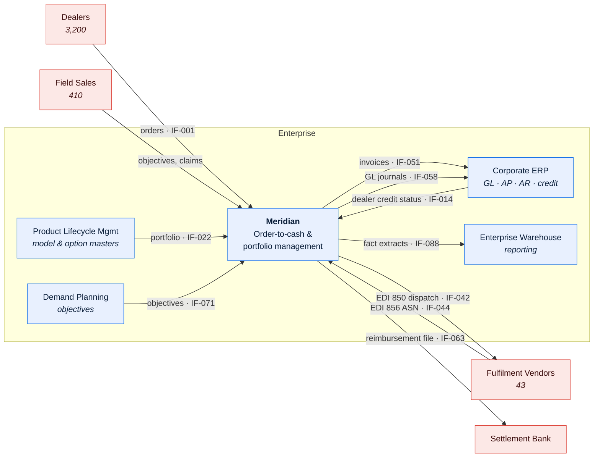
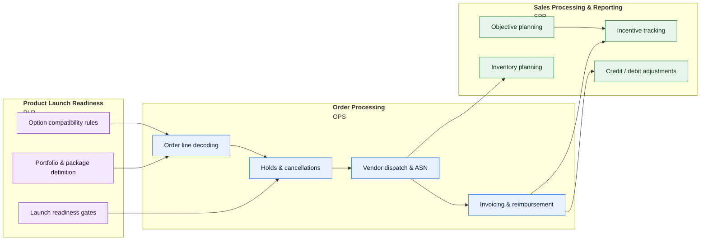

# Worked Example — Meridian

**Meridian** is a fictional platform invented for this repository. It exists to show what
the templates look like when they are actually filled in, at the depth real documentation
needs.

It was designed to have the characteristics that make documentation hard:

- **30 years old** (first production 1996), with four distinct architectural eras still
  visible in the code.
- **Three business domains** sharing one 1,400-table DB2 schema, with contested field
  ownership between them.
- **A decoding engine at its heart** — order lines are expanded from model packages into
  option rows, and the rules live partly in COBOL and partly in reference data.
- **~210 nightly batch jobs** whose dependency graph encodes business sequencing that
  appears in no other artefact.
- **187 live interfaces** and 43 external fulfilment vendors, most integrated by EDI.
- **Genuine unknowns** — several documented findings are `🟡 Inferred` or `🔴 Assumed`,
  because that is the honest state of knowledge about a system this old, and pretending
  otherwise is what makes documentation untrustworthy.

> Every figure, code reference, incident, and person in these documents is invented. The
> *shapes* are real: the classes of problem, the structure of the analysis, and the level
> of detail are drawn from how systems like this actually behave.

---

## The system



## The three domains



---

## Documents

### 0 · Foundations

| Doc | What it shows |
| --- | --- |
| [SYS-MER-001 — System Profile](00-foundations/system-profile.md) | The two-page orientation document, including the "what it explicitly does not do" table and the architectural-eras timeline |
| [DMAP-MER-001 — Domain Map](00-foundations/domain-map.md) | Three domains on one schema; contested term translation; the cross-domain write violations that form the coupling backlog |

### 1 · Architecture

| Doc | What it shows |
| --- | --- |
| [TAD-OPS-001 — Order Processing TAD](01-architecture/tad-order-processing.md) | A complete technical architecture document for a legacy subsystem: C4 levels 1–3, the decoding engine's internals, NFR budgets against measured reality, eight failure modes, and an honest technical-debt register |
| [ADR-OPS-0007 — Externalise hold evaluation](01-architecture/adr-0007-externalise-hold-evaluation.md) | A real decision with three genuine alternatives and its negative consequences stated |
| [ADR-PLR-0012 — Package decoding rules as data](01-architecture/adr-0012-package-decoding-rules-as-data.md) | A **retrospective** ADR reconstructing a 2003 decision whose rationale is still load-bearing |
| [BAT-MER-001 — Batch & Scheduling Architecture](01-architecture/batch-and-scheduling-architecture.md) | The critical path against the 03:00 vendor cutoff, implicit business sequencing excavated from job order, and per-job double-run consequences |
| [LGA-OPS-001 — Order Decoder Archaeology](01-architecture/legacy-system-archaeology-order-decoder.md) | How behaviour was recovered from 41,000 lines of undocumented COBOL, with a confidence level and evidence on every finding |

### 2 · Data

| Doc | What it shows |
| --- | --- |
| [DGC-MER-001 — Data Governance Charter](02-data/data-governance-charter.md) | An operating model for three domains sharing one schema: decision rights with SLAs, a deadlock rule, column-level ownership of contested fields, and measured compliance |
| [DLN-OPS-001 — Order-to-Cash Lineage](02-data/lineage-order-to-cash.md) | Field-level lineage across nine hops from order capture to general ledger, with transformation logic, exclusion filters, grain changes, and reconciliation controls per hop |
| [DLN-SPR-001 — Sales Incentive Payout Lineage](02-data/lineage-sales-incentive-payout.md) | The harder case: a derived, restated, retroactively adjusted metric, including the restatement history and why one hop is not reproducible |
| [DD-OPS-001 — Order Line Data Dictionary](02-data/data-dictionary-order-line.md) | Attribute definitions including overloaded fields, a column whose meaning changed in 2014, and fields owned by another domain |
| [RDR-PLR-001 — Option Code Registry](02-data/reference-data-option-codes.md) | Reference data as business logic, with the governance finding that code changes bypass change control |
| [DCT-VND-001 — Vendor Shipping Confirmation](02-data/data-contract-vendor-shipping-confirmation.md) | A producer↔consumer contract with semantic guarantees, quality commitments, and a semantic-change clause |
| [MET-SPR-001 — Sales Reporting Metric Catalog](02-data/metric-catalog-sales-reporting.md) | Why two reports disagreed about "units sold", and the certified definition that resolved it |

### 3 · Interfaces

| Doc | What it shows |
| --- | --- |
| [ICAT-MER-001 — Interface Catalog](03-interfaces/interface-catalog.md) | 187 interfaces including the manual ones, the discovery-source audit, and the gap summary by tier |
| [ICD-VND-001 — Vendor Dispatch Outbound](03-interfaces/icd-vendor-dispatch-outbound.md) | A full EDI 850 interface contract: field specification, three-way acknowledgement semantics, control totals, error catalog, and certification scenarios |
| [EDR-MER-001 — External Dependency Register](03-interfaces/external-dependency-register.md) | 43 vendors with concentration and fourth-party risk, plus the dependencies that have no technical footprint |

### 4 · Domains

| Doc | What it shows |
| --- | --- |
| [DOM-PLR-001 — Product Launch Readiness](04-domains/product-launch-readiness.md) | Portfolio and package definition, launch gates, and the reference-data change process that is really a release process |
| [DOM-OPS-001 — Order Processing](04-domains/order-processing.md) | Domain overview with the order-line state model, the hold framework, and the business rules that govern dispatch |
| [DOM-SPR-001 — Sales Processing & Reporting](04-domains/sales-processing-and-reporting.md) | Objectives, incentives, inventory planning, and credit/debit adjustment |

### 5 · Operations

| Doc | What it shows |
| --- | --- |
| [JSC-MER-001 — Job Schedule Catalog](05-operations/job-schedule-catalog.md) | The nightly chain with p95 durations, restart semantics, and the jobs that must never be blindly re-run |
| [RUN-OPS-001 — Nightly Order Cycle Runbook](05-operations/runbook-nightly-order-cycle.md) | A 03:00 runbook with scope assessment before action, financial-risk warnings before mutating steps, and an execution log |

---

## Reading paths

**"Show me the best single example."**
[TAD-OPS-001](01-architecture/tad-order-processing.md), then
[DLN-OPS-001](02-data/lineage-order-to-cash.md).

**"I need to document a legacy system and don't know where to start."**
[`guides/06-documenting-legacy-systems.md`](../../guides/06-documenting-legacy-systems.md),
then [SYS-MER-001](00-foundations/system-profile.md) →
[DMAP-MER-001](00-foundations/domain-map.md) →
[ICAT-MER-001](03-interfaces/interface-catalog.md) in that order, which is the order they
were produced.

**"I care about data governance."**
[DGC-MER-001](02-data/data-governance-charter.md) →
[DLN-SPR-001](02-data/lineage-sales-incentive-payout.md) →
[MET-SPR-001](02-data/metric-catalog-sales-reporting.md).

**"I integrate with external partners."**
[ICAT-MER-001](03-interfaces/interface-catalog.md) →
[ICD-VND-001](03-interfaces/icd-vendor-dispatch-outbound.md) →
[DCT-VND-001](02-data/data-contract-vendor-shipping-confirmation.md).

**"How do you write down what you don't know?"**
[LGA-OPS-001](01-architecture/legacy-system-archaeology-order-decoder.md) — every finding
carries a confidence level and its evidence.

---

## Try the impact graph

The documents declare their dependencies in front matter, so impact analysis is a graph
traversal rather than an act of memory:

```bash
python3 tools/validate_docs.py . --impact SYS-MER-001
python3 tools/validate_docs.py . --impact ICD-VND-001
python3 tools/validate_docs.py . --impact RDR-PLR-001
```
