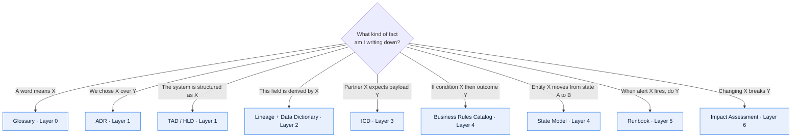

# How to Use This Repository

## The problem this solves

Large legacy platforms fail to stay documented for structural reasons, not lazy ones:

1. **No stable unit of documentation.** Without agreed document types, every author invents
   a shape. Two people documenting the same interface produce incomparable artefacts.
2. **No ownership.** A page owned by "the team" is owned by nobody and rots within two
   quarters.
3. **Undifferentiated confidence.** In a legacy system, half of what anyone "knows" is
   inference. When inference is written with the same authority as verified fact, readers
   eventually distrust everything and re-derive from source.
4. **Detail in the wrong place.** Business rules end up in architecture documents, lineage
   ends up in runbooks, and nothing can be found or maintained.

This repository addresses each: fixed document types, a mandatory owner field, an explicit
confidence convention, and a layered model that tells you where a fact belongs.

## The seven layers

| Layer | Answers | Typical audience |
| --- | --- | --- |
| 0 · Foundations | What is this, who owns it, what do the words mean? | Everyone, especially new joiners |
| 1 · Architecture | How is it built, and why is it built that way? | Engineers, architects, reviewers |
| 2 · Data | What data exists, who governs it, where did each value come from? | Data engineers, analysts, auditors, risk |
| 3 · Interfaces | What crosses the system boundary, under what contract? | Integration engineers, partners, support |
| 4 · Domain | What are the business rules and processes? | Analysts, product, QA, support |
| 5 · Operations | How is it run, watched, and recovered? | SRE, on-call, service management |
| 6 · Change | How is it safely modified? | Delivery teams, change board, QA |

A fact belongs in exactly one layer. If you are tempted to repeat it, link instead. The
validator does not enforce this, but reviewers should.

### Where does this fact go?

## Three usage modes

### Mode 1 — Documenting a system from scratch

Create `systems/<system-name>/` mirroring the `templates/` layer structure, then work the
order in [`06-documenting-legacy-systems.md`](06-documenting-legacy-systems.md). Do not try
to complete a layer before moving on; do a thin pass across layers 0–3 first so that the
shape of the system is visible, then deepen.

### Mode 2 — Documenting one change

You need four documents, not forty:

1. [Impact Assessment](../templates/06-change/impact-assessment.md) — it enumerates which
   existing documents your change invalidates.
2. [HLD](../templates/01-architecture/high-level-design.md) — the solution shape.
3. An [ADR](../templates/01-architecture/architecture-decision-record.md) for each decision
   that is expensive to reverse.
4. Updates to whatever the impact assessment flagged: ICDs, business rules, lineage,
   runbooks.

### Mode 3 — Answering a question

Use the layer table. Most questions resolve in one document. If a question routinely
requires three documents, that is a signal your layer boundaries are wrong for this system —
raise it as a PR against the templates.

## Non-negotiables

These are enforced by [`tools/validate_docs.py`](../tools/validate_docs.py):

- **Front matter on every document**, conforming to
  [`03-front-matter-schema.md`](03-front-matter-schema.md).
- **Globally unique `doc_id`**, using a registered type prefix.
- **No broken relative links.**
- **Balanced and typed Mermaid fences.**
- **`next_review` in the future** for documents with `status: approved`.

And enforced by reviewers:

- **One accountable owner**, expressed as a role (e.g. "Order Management Product Owner"),
  not a person's name and not a team.
- **Confidence levels on legacy assertions** — see
  [`01-documentation-standards.md`](01-documentation-standards.md#3-confidence-levels).
- **No screenshots as the sole source of truth.**

## Anti-patterns this repository deliberately blocks

| Anti-pattern | What we do instead |
| --- | --- |
| A 200-page "system design document" that nobody updates | Many small typed documents with individual owners and review cadences |
| Architecture diagrams in a drawing tool, exported as PNG | Mermaid in the markdown file, diffable in the PR |
| "The code is the documentation" | Business Rules Catalog with rule IDs referenced from code comments |
| Tribal knowledge about which batch job must run first | Job Schedule Catalog with an explicit dependency graph |
| Two reports that disagree about "units sold" | Metric & KPI Definition Catalog as the single authority |
| An interface understood only by the person who built it | ICD with payload, semantics, errors, SLA, and a named owner on both sides |
| Documents that claim certainty about undocumented legacy behaviour | `Verified` / `Inferred` / `Assumed` confidence tags with evidence |
