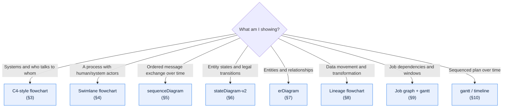
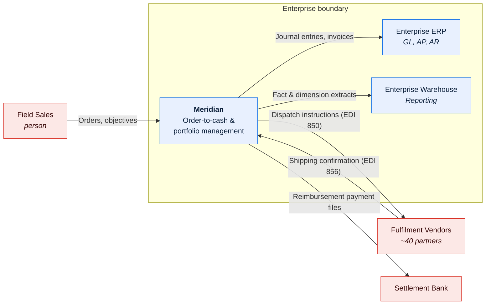
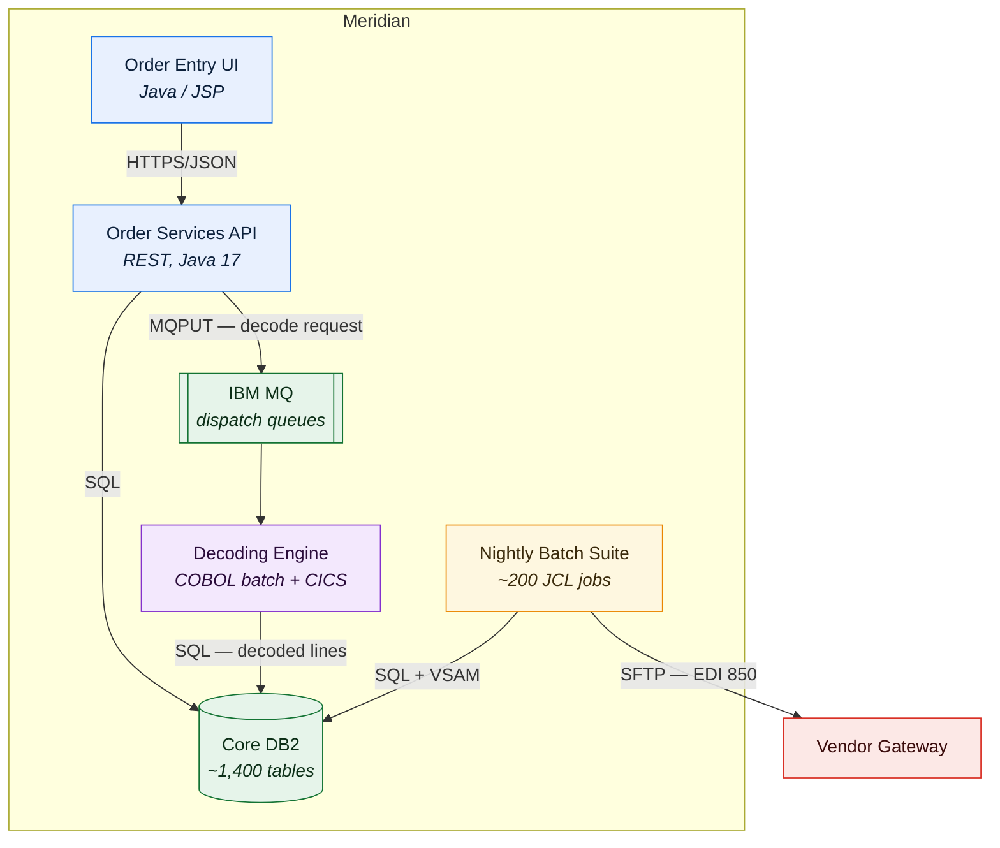
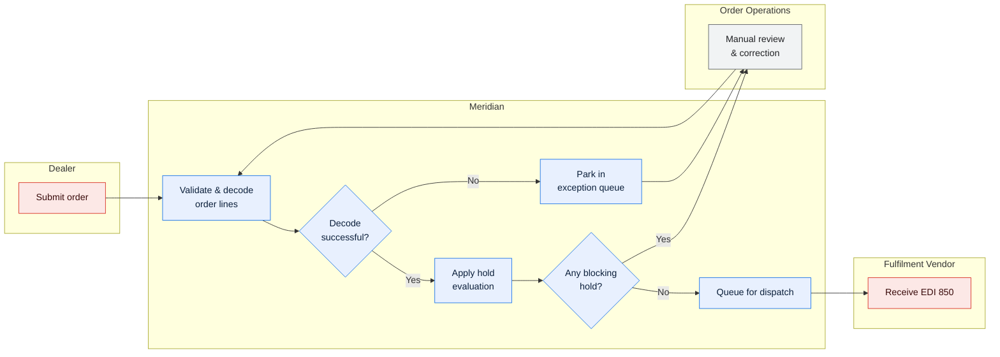
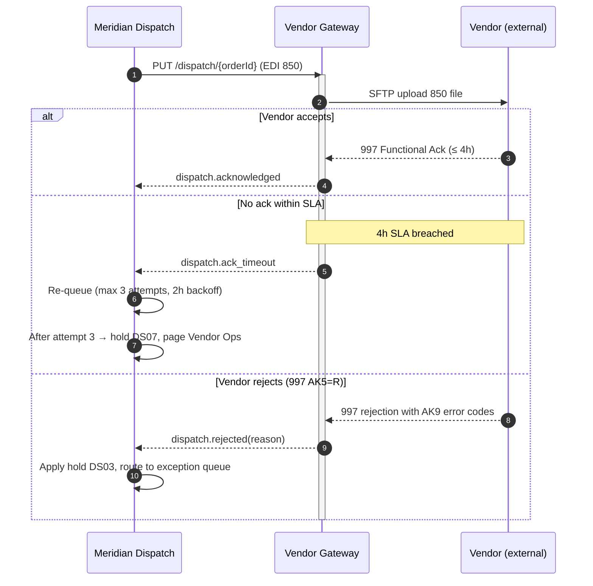
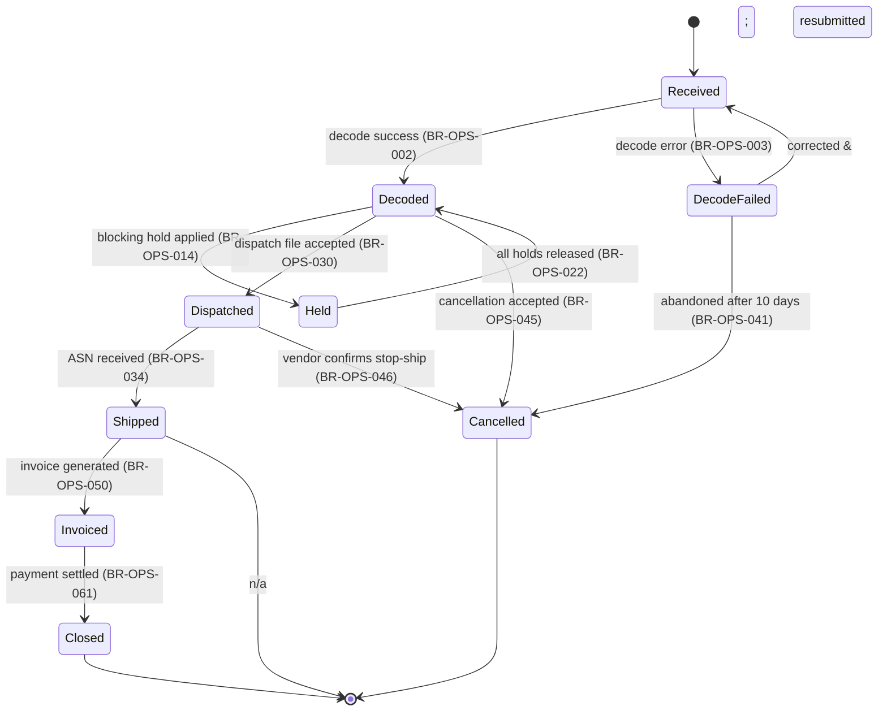
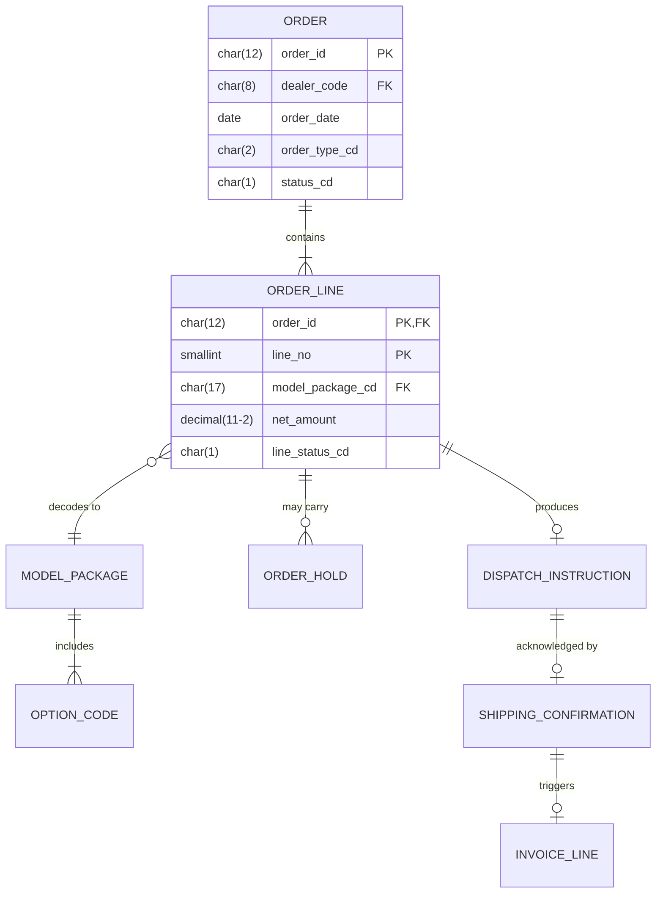
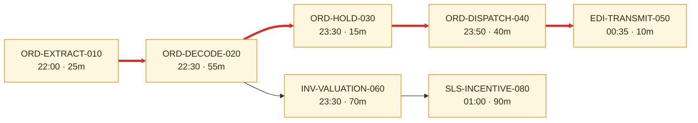
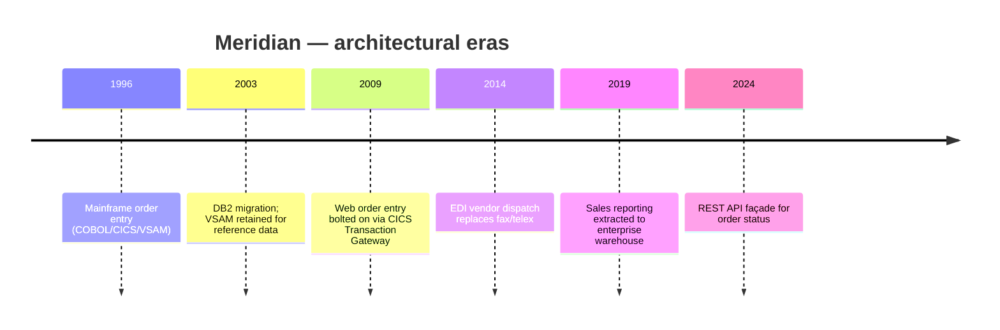

# Diagram Conventions

All diagrams are **Mermaid, inline in the markdown file**. No `.drawio`, no `.vsdx`, no
exported PNGs. Diagrams-as-code are diffable in a pull request, survive tool churn, and
cannot drift into a shared drive nobody can find.

---

## Contents

| Section | Summary |
| --- | --- |
| [1. Choosing a diagram type](#1-choosing-a-diagram-type) | Reader's question → diagram type mapping |
| [2. The standard palette](#2-the-standard-palette) | Six `classDef` styles with explicit `color:` for light and dark themes |
| [3. C4-style architecture diagrams](#3-c4-style-architecture-diagrams) | C4 Levels 1–3 as `flowchart` with `subgraph` boundaries, not `C4Context` |
| [4. Swimlane process flows](#4-swimlane-process-flows) | Per-actor subgraphs, left-to-right, unhappy path mandatory |
| [5. Sequence diagrams](#5-sequence-diagrams) | Required for every ICD: happy path, error path, timeouts, acknowledgements |
| [6. State diagrams](#6-state-diagrams) | One per lifecycle-bearing entity; terminal states and rule-ID transition labels |
| [7. Entity relationship diagrams](#7-entity-relationship-diagrams) | Scoped to one domain, never the whole schema |
| [8. Lineage diagrams](#8-lineage-diagrams) | One node per hop, transformation on the edge, `H1..Hn` shared with the prose table |
| [9. Job dependency graphs](#9-job-dependency-graphs) | Batch dependency graph with the critical path marked by thick links |
| [10. Timelines and plans](#10-timelines-and-plans) | `gantt` for plans and cutover runsheets; `timeline` for system history |
| [11. Rules that apply to every diagram](#11-rules-that-apply-to-every-diagram) | Universal constraints: captions, ≤ 15 nodes, labelled edges, `&` escaping |

---

## 1. Choosing a diagram type



| Question the reader has | Diagram type |
| --- | --- |
| What is in scope and who are the external actors? | C4 Context (flowchart, §3) |
| What are the major deployable pieces? | C4 Container (flowchart, §3) |
| What is inside this container? | C4 Component (flowchart, §3) |
| Who does what, in what order, with what handoffs? | Swimlane flowchart (§4) |
| What is the exact message exchange, including errors and timeouts? | `sequenceDiagram` (§5) |
| What states can this entity be in, and what moves it? | `stateDiagram-v2` (§6) |
| What is the data model? | `erDiagram` (§7) |
| Where did this field's value come from? | Lineage flowchart (§8) |
| What must run before what? | Job dependency flowchart (§9) |
| When does this happen? | `gantt` or `timeline` (§10) |

---

## 2. The standard palette

Use these six `classDef` styles so that colour means the same thing in every document in
the corpus. Each sets an explicit `color:` so labels remain legible in both GitHub light
and dark themes — Mermaid's default text colour inverts with the theme and will otherwise
disappear against a fixed `fill`.

```
classDef internal  fill:#E8F0FE,stroke:#1A73E8,color:#0B1F3A
classDef external  fill:#FCE8E6,stroke:#D93025,color:#3A0B0B
classDef datastore fill:#E6F4EA,stroke:#137333,color:#0B2E16
classDef batch     fill:#FEF7E0,stroke:#EA8600,color:#3A2A0B
classDef legacy    fill:#F3E8FD,stroke:#8430CE,color:#2A0B3A
classDef manual    fill:#F1F3F4,stroke:#5F6368,color:#202124
```

| Class | Meaning |
| --- | --- |
| `internal` | A component your organisation builds and runs |
| `external` | A third party, partner, or system outside your control |
| `datastore` | Database, file store, queue with retention, warehouse |
| `batch` | Scheduled/asynchronous processing |
| `legacy` | Component slated for replacement, or whose behaviour is only partly understood |
| `manual` | A human step — always make these visible; they are where SLAs die |

Reference legend to paste under any diagram whose audience is not daily-familiar:

> **Legend:** blue = internal component · red = external party · green = data store ·
> amber = batch process · purple = legacy component · grey = manual step

---

## 3. C4-style architecture diagrams

Mermaid's native `C4Context` syntax renders inconsistently across GitHub versions. Use
`flowchart` with `subgraph` for boundaries instead — it is stable, stylable, and
diff-friendly.

### Level 1 — System Context

Scope: your system as one box; every external actor and system it exchanges data with.
Never show internal structure at this level.



### Level 2 — Container

Scope: deployable/runnable units inside the system — applications, batch suites, databases,
queues. Label every arrow with **protocol and payload**, not just a verb.



### Level 3 — Component

Scope: the inside of **one** container. Only draw this for containers with non-obvious
internal structure — a decoding engine, a pricing calculator, a hold framework.

**Do not draw Level 4 (code) diagrams.** They are obsolete on commit. Point at the code.

---

## 4. Swimlane process flows

Use `subgraph` per actor, left-to-right. Always include the unhappy path — a process
diagram showing only the happy path is worse than no diagram, because it implies the
exceptions are unimportant.



---

## 5. Sequence diagrams

Required for every interface documented in an ICD. Must show:

- the **happy path**,
- at least one **error path**,
- **timeouts and retries** with real numbers,
- any **asynchronous callback** and how it is correlated.



---

## 6. State diagrams

One per lifecycle-bearing entity (order, order line, hold, claim, objective period). Show
terminal states explicitly and label transitions with the **event or rule ID** that causes
them — not a bare verb. That is what makes the diagram checkable against the Business Rules
Catalog.



---

## 7. Entity relationship diagrams

Scope one ER diagram to one domain — never the whole schema. In a 1,400-table legacy
database, a full ER diagram is unreadable and therefore unused.



Annotate physical types when documenting a legacy schema — `char(12)` versus `varchar(12)`
matters for padding defects, and `decimal(11,2)` versus `float` matters for money. Mermaid
does not accept commas inside type declarations, so write `decimal(11-2)` and note the real
type in the accompanying data dictionary.

---

## 8. Lineage diagrams

Left-to-right, one node per **hop** (a system, table, or file where data comes to rest),
with transformation described on the edge. Number hops `H1..Hn` so that the prose table and
the diagram share identifiers.

```mermaid
flowchart LR
    H1["<b>H1</b> Order Entry UI<br/><i>ORDER_LINE</i>"]
    H2["<b>H2</b> Decoding Engine<br/><i>ORDER_LINE_DECODED</i>"]
    H3["<b>H3</b> Dispatch Extract<br/><i>DSP_OUT.DAT</i>"]
    H4["<b>H4</b> Vendor ASN<br/><i>SHIP_CONF</i>"]
    H5["<b>H5</b> Invoice Generation<br/><i>INVOICE_LINE</i>"]
    H6["<b>H6</b> GL Interface<br/><i>GL_JOURNAL</i>"]

    H1 -->|"decode package → option rows<br/>BR-OPS-002"| H2
    H2 -->|"filter: no blocking hold<br/>BR-OPS-014"| H3
    H3 -->|"match on dispatch_id<br/>+ vendor ack"| H4
    H4 -->|"price × qty − allowances<br/>BR-OPS-050"| H5
    H5 -->|"map to account by<br/>product line"| H6

    classDef datastore fill:#E6F4EA,stroke:#137333,color:#0B2E16
    class H1,H2,H3,H4,H5,H6 datastore
```



Every lineage diagram is paired with a hop table giving, per hop: source field, target
field, transformation, job that performs it, and the control that verifies it. The diagram
orients; the table is the artefact of record. See
[`templates/02-data/data-lineage-document.md`](../templates/02-data/data-lineage-document.md).

---

## 9. Job dependency graphs

For batch systems, show dependency **and** the critical path. Mark the critical path with
thick links so the reader immediately sees where a delay becomes an SLA breach.



> **Caption pattern:** "Critical path (red) is `ORD-EXTRACT-010 → ORD-DECODE-020 →
> ORD-HOLD-030 → ORD-DISPATCH-040 → EDI-TRANSMIT-050`, total 2h25m against a 03:00 UTC
> vendor cutoff — 2h35m of slack."

---

## 10. Timelines and plans

`gantt` for delivery plans and cutover runsheets; `timeline` for system history — which is
genuinely useful in a legacy TAD, where "why is it like this" is usually chronological.



---

## 11. Rules that apply to every diagram

1. **Caption every diagram** with the conclusion the reader should draw.
2. **≤ 15 nodes.** More than that, split by level or by domain.
3. **Label every edge** with protocol, payload, or trigger — never leave a bare arrow.
4. **Direction is meaningful and consistent**: `LR` for flows through time or data, `TD`
   for containment or hierarchy. Do not mix within a document.
5. **Show the unhappy path** in any process or sequence diagram.
6. **Make manual steps visible** with the `manual` class. Hidden human steps are the most
   common cause of unexplained latency in cross-functional processes.
7. **Prose carries the facts.** A diagram supports the prose; it never replaces it.
8. **No colour-only encoding.** Colour repeats information that is also in the label, so
   the diagram survives greyscale printing and colour-vision differences.

### Escaping in Mermaid labels

| You want | Write |
| --- | --- |
| `&` | `&amp;` |
| `<` `>` | `&lt;` `&gt;` |
| `"` inside a label | `&quot;` |
| A line break | `<br/>` |
| Bold / italic | `<b>…</b>` / `<i>…</i>` |
| Parentheses in a node label | Wrap the whole label in `["…"]` |
| `,` inside an `erDiagram` type | Not supported — use `-` and note the real type elsewhere |
