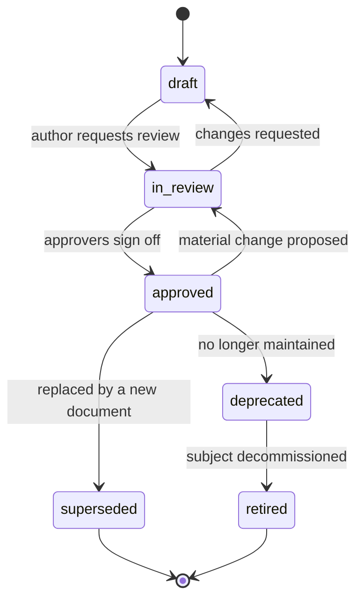

# Front Matter Schema and Identifier Registry

Every markdown document in this repository begins with a YAML front-matter block. The block
is what makes the corpus machine-navigable: it powers the catalog, staleness detection,
ownership reporting, and — most importantly — **mechanical impact analysis** via the
`upstream_docs` / `downstream_docs` graph.

[`tools/validate_docs.py`](../tools/validate_docs.py) enforces this schema in CI.

---

## Contents

| Section | Summary |
| --- | --- |
| [1. The block](#1-the-block) | The canonical YAML block |
| [2. Field reference](#2-field-reference) | Per-field requirement, type, and notes; why `owner` is a role and the dependency graph matters |
| [3. `doc_type` registry](#3-doc_type-registry) | All document types by layer, with type code and template path |
| [4. `status` values](#4-status-values) | Status values, meaning, and whether the document can be cited as authority |
| [5. Versioning](#5-versioning) | Semantic versioning applied to meaning rather than edits |
| [6. `review_cycle`](#6-review_cycle) | Cadence values, intervals, and the document types each applies to |
| [7. `classification`](#7-classification) | Classification values, definitions, and sharing scope |
| [8. `domains` and scope codes](#8-domains-and-scope-codes) | Scope codes used in `doc_id`, and the Meridian registrations |
| [9. Validation rules in force](#9-validation-rules-in-force) | The FM / LN / MD rule table with severities |

---

## 1. The block

```yaml
---
doc_id: TAD-OPS-001                      # required, globally unique
title: Order Processing Subsystem — Technical Architecture
doc_type: tad                            # required, from §3
status: approved                         # required, from §4
version: 2.3.0                           # required, semver (§5)
owner: Order Management Architecture Lead # required, a ROLE not a person
authors: [J. Dean]                       # optional
reviewers: [Data Governance Lead, SRE Lead]
approvers: [Head of Platform Architecture]
created: 2024-03-11
last_reviewed: 2026-07-02                # required when status is approved
next_review: 2027-01-02                  # required when status is approved
review_cycle: semi-annual                # from §6
classification: internal                 # required, from §7
systems: [MERIDIAN]                      # required, ≥1
domains: [order-processing]              # from §8
upstream_docs: [SYS-MER-001, DMAP-MER-001]
downstream_docs: [LLD-OPS-004, RUN-OPS-002]
related_interfaces: [IF-042, IF-043]
related_rules: [BR-OPS-014, BR-OPS-030]
tags: [legacy, batch, cobol, edi]
---
```

---

## 2. Field reference

| Field | Required | Type | Notes |
| --- | --- | --- | --- |
| `doc_id` | ✅ | string | `<TYPE>-<SCOPE>-<NNN>`. Globally unique, never reused. |
| `title` | ✅ | string | Must match the document's H1. |
| `doc_type` | ✅ | enum | §3. Drives which validator rules apply. |
| `status` | ✅ | enum | §4. |
| `version` | ✅ | semver | §5. |
| `owner` | ✅ | string | A **role**. `Order Management Architecture Lead`, not `Priya`. |
| `authors` | — | list | People who wrote it. Credit, not accountability. |
| `reviewers` | — | list | Roles that reviewed. Required for `approved`. |
| `approvers` | — | list | Roles that signed off. Required for `approved`. |
| `created` | — | date | ISO-8601. |
| `last_reviewed` | ⚠️ | date | Required when `status: approved`. |
| `next_review` | ⚠️ | date | Required when `status: approved`. CI flags if in the past. |
| `review_cycle` | ⚠️ | enum | §6. Required when `status: approved`. |
| `classification` | ✅ | enum | §7. Determines where the document may be shared. |
| `systems` | ✅ | list | System codes. At least one. |
| `domains` | — | list | §8. |
| `upstream_docs` | — | list of `doc_id` | Documents this one depends on. |
| `downstream_docs` | — | list of `doc_id` | Documents invalidated if this changes. |
| `related_interfaces` | — | list of `IF-NNN` | Cross-links to the interface catalog. |
| `related_rules` | — | list of `BR-*` | Cross-links to business rules. |
| `supersedes` | — | `doc_id` | For replacements. |
| `superseded_by` | — | `doc_id` | Required when `status: superseded`. |
| `tags` | — | list | Free-form, lowercase, kebab-case. |

### Why `owner` must be a role

Ownership expressed as a person breaks the moment that person changes team — and in a
legacy platform, they will. Roles persist, and a role can be resolved to a person through
one indirection in [`05-ownership-and-raci.md`](05-ownership-and-raci.md). Maintain that
mapping in exactly one place.

### Why the `upstream_docs` / `downstream_docs` graph matters

It converts "what does this change break?" from an act of memory into a graph traversal:

```bash
python3 tools/validate_docs.py . --impact TAD-OPS-001
```

An [Impact Assessment](../templates/06-change/impact-assessment.md) starts from this
traversal and then adds human judgement. Without the graph, every impact assessment is a
guess weighted by who happens to be in the room.

---

## 3. `doc_type` registry

The type code is also the document-ID prefix.

### Layer 0 — Foundations

| Type | Code | Template |
| --- | --- | --- |
| System profile | `SYS` | [system-profile.md](../templates/00-foundations/system-profile.md) |
| Capability model | `CAP` | [capability-model.md](../templates/00-foundations/capability-model.md) |
| Domain map | `DMAP` | [domain-map.md](../templates/00-foundations/domain-map.md) |
| Stakeholder & RACI | `RACI` | [stakeholder-and-raci-matrix.md](../templates/00-foundations/stakeholder-and-raci-matrix.md) |
| Glossary & taxonomy | `GLOS` | [glossary-and-taxonomy.md](../templates/00-foundations/glossary-and-taxonomy.md) |

### Layer 1 — Architecture

| Type | Code | Template |
| --- | --- | --- |
| Technical architecture document | `TAD` | [technical-architecture-document.md](../templates/01-architecture/technical-architecture-document.md) |
| Architecture decision record | `ADR` | [architecture-decision-record.md](../templates/01-architecture/architecture-decision-record.md) |
| High-level design | `HLD` | [high-level-design.md](../templates/01-architecture/high-level-design.md) |
| Low-level design | `LLD` | [low-level-design.md](../templates/01-architecture/low-level-design.md) |
| Component specification | `CMP` | [component-specification.md](../templates/01-architecture/component-specification.md) |
| Integration architecture | `INT` | [integration-architecture.md](../templates/01-architecture/integration-architecture.md) |
| Batch & scheduling architecture | `BAT` | [batch-and-scheduling-architecture.md](../templates/01-architecture/batch-and-scheduling-architecture.md) |
| NFRs & quality attributes | `NFR` | [nfr-and-quality-attributes.md](../templates/01-architecture/nfr-and-quality-attributes.md) |
| Security & privacy architecture | `SEC` | [security-and-privacy-architecture.md](../templates/01-architecture/security-and-privacy-architecture.md) |
| Resilience & failure mode analysis | `RES` | [resilience-and-failure-mode-analysis.md](../templates/01-architecture/resilience-and-failure-mode-analysis.md) |
| Deployment & environments | `DEP` | [deployment-and-environments.md](../templates/01-architecture/deployment-and-environments.md) |
| Legacy system archaeology | `LGA` | [legacy-system-archaeology.md](../templates/01-architecture/legacy-system-archaeology.md) |
| Modernization roadmap | `MOD` | [modernization-roadmap.md](../templates/01-architecture/modernization-roadmap.md) |

### Layer 2 — Data

| Type | Code | Template |
| --- | --- | --- |
| Data governance charter | `DGC` | [data-governance-charter.md](../templates/02-data/data-governance-charter.md) |
| Data domain charter | `DDC` | [data-domain-charter.md](../templates/02-data/data-domain-charter.md) |
| Data dictionary | `DD` | [data-dictionary.md](../templates/02-data/data-dictionary.md) |
| Canonical data model | `CDM` | [canonical-data-model.md](../templates/02-data/canonical-data-model.md) |
| Data lineage document | `DLN` | [data-lineage-document.md](../templates/02-data/data-lineage-document.md) |
| Reference data & code set registry | `RDR` | [reference-data-and-code-set-registry.md](../templates/02-data/reference-data-and-code-set-registry.md) |
| Data quality rules & controls | `DQR` | [data-quality-rules-and-controls.md](../templates/02-data/data-quality-rules-and-controls.md) |
| Data contract | `DCT` | [data-contract.md](../templates/02-data/data-contract.md) |
| Master data management | `MDM` | [master-data-management.md](../templates/02-data/master-data-management.md) |
| Metric & KPI definition catalog | `MET` | [metric-and-kpi-definition-catalog.md](../templates/02-data/metric-and-kpi-definition-catalog.md) |
| Retention, classification & privacy | `DRC` | [data-retention-classification-and-privacy.md](../templates/02-data/data-retention-classification-and-privacy.md) |
| Data issue & remediation log | `DIL` | [data-issue-and-remediation-log.md](../templates/02-data/data-issue-and-remediation-log.md) |

### Layer 3 — Interfaces

| Type | Code | Template |
| --- | --- | --- |
| Interface catalog | `ICAT` | [interface-catalog.md](../templates/03-interfaces/interface-catalog.md) |
| Interface control document | `ICD` | [interface-control-document.md](../templates/03-interfaces/interface-control-document.md) |
| API specification | `API` | [api-specification.md](../templates/03-interfaces/api-specification.md) |
| File & batch interface spec | `FIS` | [file-and-batch-interface-specification.md](../templates/03-interfaces/file-and-batch-interface-specification.md) |
| Event & message contract | `EMC` | [event-and-message-contract.md](../templates/03-interfaces/event-and-message-contract.md) |
| External dependency register | `EDR` | [external-dependency-register.md](../templates/03-interfaces/external-dependency-register.md) |
| Partner onboarding & certification | `PON` | [partner-onboarding-and-certification.md](../templates/03-interfaces/partner-onboarding-and-certification.md) |
| SLA, OLA & support model | `SLA` | [sla-ola-and-support-model.md](../templates/03-interfaces/sla-ola-and-support-model.md) |

### Layer 4 — Domain

| Type | Code | Template |
| --- | --- | --- |
| Domain overview | `DOM` | [domain-overview.md](../templates/04-domain/domain-overview.md) |
| Business process flow | `BPF` | [business-process-flow.md](../templates/04-domain/business-process-flow.md) |
| Business rules catalog | `BRC` | [business-rules-catalog.md](../templates/04-domain/business-rules-catalog.md) |
| State model & lifecycle | `SML` | [state-model-and-lifecycle.md](../templates/04-domain/state-model-and-lifecycle.md) |
| Domain data entities | `DDE` | [domain-data-entities.md](../templates/04-domain/domain-data-entities.md) |
| Domain interface map | `DIM` | [domain-interface-map.md](../templates/04-domain/domain-interface-map.md) |

### Layer 5 — Operations

| Type | Code | Template |
| --- | --- | --- |
| Runbook | `RUN` | [runbook.md](../templates/05-operations/runbook.md) |
| Job schedule catalog | `JSC` | [job-schedule-catalog.md](../templates/05-operations/job-schedule-catalog.md) |
| Monitoring & alerting | `MON` | [monitoring-and-alerting.md](../templates/05-operations/monitoring-and-alerting.md) |
| Incident response & postmortem | `IRP` | [incident-response-and-postmortem.md](../templates/05-operations/incident-response-and-postmortem.md) |
| Disaster recovery & continuity | `DRP` | [disaster-recovery-and-continuity.md](../templates/05-operations/disaster-recovery-and-continuity.md) |
| Release & change management | `RCM` | [release-and-change-management.md](../templates/05-operations/release-and-change-management.md) |
| Capacity & performance plan | `CPP` | [capacity-and-performance-plan.md](../templates/05-operations/capacity-and-performance-plan.md) |

### Layer 6 — Change

| Type | Code | Template |
| --- | --- | --- |
| Business requirements document | `BRD` | [business-requirements-document.md](../templates/06-change/business-requirements-document.md) |
| Functional specification | `FSP` | [functional-specification.md](../templates/06-change/functional-specification.md) |
| Impact assessment | `IMP` | [impact-assessment.md](../templates/06-change/impact-assessment.md) |
| Requirements traceability matrix | `RTM` | [requirements-traceability-matrix.md](../templates/06-change/requirements-traceability-matrix.md) |
| Test strategy & UAT plan | `TST` | [test-strategy-and-uat-plan.md](../templates/06-change/test-strategy-and-uat-plan.md) |
| Cutover & migration plan | `CUT` | [cutover-and-migration-plan.md](../templates/06-change/cutover-and-migration-plan.md) |

### Meta

| Type | Code |
| --- | --- |
| Guide (this repository's own docs) | `GUIDE` |
| Checklist | `CHK` |

---

## 4. `status` values

| Status | Meaning | Can be cited as authority? |
| --- | --- | --- |
| `draft` | Being written. Structure may change. | No |
| `in-review` | Content complete, under review. | With caution — note the status |
| `approved` | Signed off by listed `approvers`. | ✅ Yes |
| `deprecated` | Still describes reality but is no longer maintained. | Read-only, verify before relying |
| `superseded` | Replaced. `superseded_by` is required. | No — follow the pointer |
| `retired` | Describes something that no longer exists. Kept for audit. | No |



---

## 5. Versioning

Semantic versioning, applied to *meaning*:

| Bump | When |
| --- | --- |
| **Major** (`2.0.0`) | The described behaviour or contract changed in a way that invalidates downstream work — a removed field, a changed rule outcome, a new mandatory step. |
| **Minor** (`1.3.0`) | Material content added without invalidating prior reading — a new section, a new optional field, a newly documented error path. |
| **Patch** (`1.2.4`) | Clarifications, typos, formatting, confidence-level promotion with no change in stated behaviour. |

For an ICD or a Data Contract, the version in front matter is the **document** version. The
**interface** version is a separate field inside the document and follows its own lifecycle —
conflating the two causes partners to believe an interface changed when only its prose did.

---

## 6. `review_cycle`

| Value | Interval | Apply to |
| --- | --- | --- |
| `quarterly` | 3 months | Interface catalogs, external dependency registers, runbooks for tier-1 services, data quality rules |
| `semi-annual` | 6 months | TADs, ICDs, lineage documents, governance charters, domain packs |
| `annual` | 12 months | System profiles, capability models, glossaries, modernization roadmaps |
| `on-change` | No calendar | ADRs (immutable), BRDs, impact assessments, cutover plans — historical records |

Documents with `review_cycle: on-change` are exempt from staleness checks. Everything else
is flagged by CI once `next_review` passes.

---

## 7. `classification`

| Value | Definition | Sharing |
| --- | --- | --- |
| `public` | No harm if published | Anywhere |
| `internal` | Default for most documents | Any employee |
| `confidential` | Commercially or operationally sensitive — pricing logic, incentive formulas, vendor terms | Named roles only |
| `restricted` | Regulated or personal data, security control detail, key material locations | Explicit grant, logged access |

Classification propagates: a document that quotes a `confidential` source is `confidential`.
When a partner-facing document must be shared externally, produce a separate `public`
extract rather than downgrading the internal document.

---

## 8. `domains` and scope codes

Scope codes appear in the middle of every `doc_id`. Register yours here when you adopt this
repository. The example set used by `examples/meridian/`:

| Scope code | Domain | `domains` value |
| --- | --- | --- |
| `MER` | Whole system / cross-domain | `cross-domain` |
| `PLR` | Product launch readiness & portfolio management | `product-launch-readiness` |
| `OPS` | Order processing | `order-processing` |
| `SPR` | Sales processing & reporting | `sales-processing-reporting` |
| `FIN` | Finance interfaces (invoicing, reimbursement, GL) | `finance` |
| `VND` | Vendor & partner integration | `vendor-integration` |
| `PLT` | Platform / cross-cutting infrastructure | `platform` |

---

## 9. Validation rules in force

| # | Rule | Severity |
| --- | --- | --- |
| FM-01 | Front matter present and parseable | error |
| FM-02 | All required fields present | error |
| FM-03 | `doc_id` matches `^[A-Z]{2,5}-[A-Z0-9]{2,6}-\d{3,4}$` or `^(GUIDE\|CHK)-\d{3}$` | error |
| FM-04 | `doc_id` globally unique | error |
| FM-05 | `doc_type` prefix agrees with `doc_id` prefix | error |
| FM-06 | `status`, `classification`, `review_cycle` are valid enum values | error |
| FM-07 | `version` is valid semver | error |
| FM-08 | Dates are ISO-8601 and real | error |
| FM-09 | `status: approved` ⇒ `last_reviewed`, `next_review`, `review_cycle`, `approvers` present | error |
| FM-10 | `status: superseded` ⇒ `superseded_by` present and resolvable | error |
| FM-11 | `upstream_docs` / `downstream_docs` entries resolve to a known `doc_id` | warning |
| FM-12 | `next_review` is in the future | warning (stale) |
| FM-13 | `owner` is present and is not obviously a personal name | warning |
| LN-01 | Relative links resolve to an existing file | error |
| LN-02 | Anchor links resolve to a heading in the target | warning |
| MD-01 | Mermaid fences are balanced and declare a supported diagram type | error |
| MD-02 | H1 matches front-matter `title` (an ADR's `<DOC-ID>: ` prefix is accepted) | warning |
| MD-03 | No unresolved `TODO`/`TBD` without an owner in an `approved` document | warning |
| MD-04 | Mermaid labels escape `&`; no commas inside `erDiagram` type declarations | warning |
| MD-05 | A `## Contents` table is present and links to every `##` section (documents with 3+ sections) | warning |

> **FM-09 does not apply to `review_cycle: on-change` documents.** ADRs, BRDs, impact
> assessments, and cutover plans are historical records, exempt from calendar review per §6,
> so review dates are not required on them.
