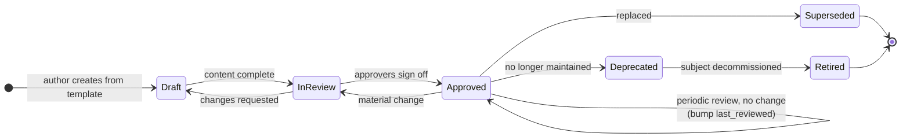
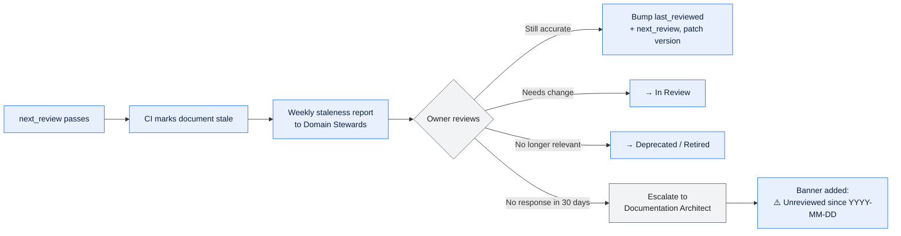

# Document Lifecycle and Governance

Documentation decays by default. This describes the mechanism that keeps it from doing so:
who is accountable, what triggers an update, how approval works, and how staleness is
detected rather than discovered during an incident.

---

## Contents

| Section | Summary |
| --- | --- |
| [1. Accountability model](#1-accountability-model) | Document Owner, Domain Steward, Architect — accountabilities and typical holders |
| [2. Lifecycle](#2-lifecycle) | State machine from draft to retired, with per-transition requirements |
| [3. Update triggers](#3-update-triggers) | Events obliging a documentation change as part of the change itself |
| [4. Review cadence and staleness](#4-review-cadence-and-staleness) | Cadence, staleness handling, and why stale documents are never deleted |
| [5. Approval matrix](#5-approval-matrix) | Approver and forum per document type |
| [6. Handling disagreement](#6-handling-disagreement) | Recording competing claims, then resolving by evidence |
| [7. Metrics for the documentation system itself](#7-metrics-for-the-documentation-system-itself) | Quarterly indicators of corpus health, with targets |
| [8. Archival](#8-archival) | Decommissioning procedure — retire and annotate, never delete |

---

## 1. Accountability model

| Role | Accountable for | Typically held by |
| --- | --- | --- |
| **Document Owner** | This document being correct and reviewed on cadence | Named in front matter (`owner`), a role |
| **Domain Documentation Steward** | Completeness and coherence of one domain's document set | Domain tech lead or principal analyst |
| **Documentation Architect** | The template system, conventions, tooling, and the corpus as a whole | Architecture function |
| **Data Governance Lead** | Layer 2 documents; approves lineage, dictionary and contract changes | Data governance function |
| **Architecture Review Board (ARB)** | Approving TADs and consequential ADRs | Standing forum |

A document with no `owner` is treated as a defect and fails CI. A document whose owner role
no longer exists is reassigned by the Domain Documentation Steward at the next review.

---

## 2. Lifecycle



### Transition requirements

| Transition | Requires |
| --- | --- |
| Draft → In Review | All sections addressed or explicitly marked N/A with a reason; validator passes |
| In Review → Approved | Sign-off from every role in `approvers`; review checklist completed; all `🔴 Assumed` items have an owner and target date |
| Approved → In Review | Any change that would bump the major or minor version |
| Approved → Approved (review) | Owner confirms accuracy; `last_reviewed` and `next_review` updated; patch bump |
| Approved → Deprecated | Owner states why and what readers should use instead |
| → Superseded | `superseded_by` populated and resolvable |

---

## 3. Update triggers

Calendar review is the safety net, not the primary mechanism. These events **oblige** a
document update as part of the change itself — not afterwards:

| Event | Documents that must be updated |
| --- | --- |
| Interface payload, endpoint, or semantics change | ICD, Interface Catalog, Data Contract, affected Domain Interface Maps, partner-facing extract |
| New external partner or vendor onboarded | External Dependency Register, Interface Catalog, ICD, SLA/OLA, Partner Onboarding record |
| Business rule added, changed, or retired | Business Rules Catalog, affected Process Flow, State Model, RTM, test cases |
| New or changed derived field / metric | Data Dictionary, Data Lineage, Metric Catalog, Data Quality Rules |
| Batch job added, removed, or re-sequenced | Job Schedule Catalog, Batch & Scheduling Architecture, affected Runbooks, DR plan |
| Component added or decommissioned | TAD, Deployment & Environments, Interface Catalog, Monitoring & Alerting |
| Architecture decision taken | New ADR; TAD updated to reflect the outcome |
| Sev-1/Sev-2 incident | Postmortem; plus any Runbook, Monitoring, or Resilience document whose gap the incident exposed |
| Regulatory or audit finding | Governance Charter, Retention & Classification, affected lineage |
| Reference data code set extended | Reference Data Registry, Data Dictionary, affected decoding rules |

> **Enforcement:** the PR template requires the author to state which of these triggers
> apply and to link the corresponding documentation change. "Docs to follow" is the
> mechanism by which documentation dies; the change and its documentation land together.

---

## 4. Review cadence and staleness



A stale document is **never silently deleted**. Deleting it destroys the record of what the
system was believed to do — which is exactly what an auditor, an incident responder, or a
migration team needs. Mark it, date it, and let readers judge.

Generate the staleness report with:

```bash
python3 tools/validate_docs.py . --stale-report
```

---

## 5. Approval matrix

| Document type | Approver(s) | Forum |
| --- | --- | --- |
| `TAD` | Head of Platform Architecture + Domain Owner | ARB |
| `ADR` (reversible) | Domain Architecture Lead | Async PR review |
| `ADR` (expensive to reverse, cross-domain, or external-facing) | ARB | ARB |
| `HLD` | Domain Architecture Lead | Design review |
| `LLD`, `CMP` | Tech Lead | PR review |
| `DGC`, `DDC`, `CDM`, `MDM`, `DRC` | Data Governance Lead + Domain Data Owner | Data Governance Council |
| `DD`, `DLN`, `DQR`, `MET`, `RDR` | Domain Data Steward | Data Governance Council (quarterly batch) |
| `DCT` | Producer Owner **and** Consumer Owner (both) | Async, both sides recorded |
| `ICD`, `API`, `FIS`, `EMC` | Integration Lead + counterparty owner | Interface review |
| `EDR`, `SLA` | Service Management Lead | Service review |
| Domain pack (`DOM`/`BPF`/`BRC`/`SML`/`DDE`/`DIM`) | Domain Product Owner | Domain review |
| `RUN`, `JSC`, `MON`, `IRP`, `DRP`, `RCM`, `CPP` | SRE Lead | Operational readiness review |
| `BRD`, `FSP` | Business Sponsor + Product Owner | Change board |
| `IMP`, `RTM`, `TST`, `CUT` | Delivery Lead + QA Lead | Change board |

**Rule of two for contracts.** Any document that binds two parties — Data Contract, ICD,
SLA — requires an approver from each side. A one-sided contract is a wish.

---

## 6. Handling disagreement

Two people believe different things about how the legacy system behaves. This is normal and
frequent. Resolve it as follows:

1. Write **both** claims into the document with `🔴 Assumed` and attribution.
2. Raise `Q-<NNN>` in the Open Questions section with an owner and a target date.
3. Define the experiment that settles it — a production query, a log sample, a code read, a
   controlled test in a lower environment.
4. Record the outcome, promote to `✅ Verified` with the evidence, and remove the losing
   claim — but keep a one-line note in the change log saying it was considered and
   disproved. That note prevents the same disagreement recurring in twelve months.

Never resolve a disagreement by omitting both claims. Silence is how a system becomes
undocumented in the first place.

---

## 7. Metrics for the documentation system itself

Track these quarterly. They are leading indicators of whether the corpus is trusted.

| Metric | Definition | Target |
| --- | --- | --- |
| Coverage | Required documents present ÷ required documents expected, by layer | ≥ 90% for tier-1 systems |
| Freshness | Documents with `next_review` in the future ÷ all `approved` documents | ≥ 85% |
| Ownership | Documents with a resolvable owner role ÷ all documents | 100% |
| Confidence | `✅ Verified` assertions ÷ all tagged assertions | Rising quarter on quarter |
| Assumption burn-down | Open `🔴 Assumed` items older than 90 days | Trending to zero |
| Change coupling | PRs touching code + docs ÷ PRs that triggered a documentation obligation | ≥ 80% |
| Incident traceability | Sev-1/2 incidents where the runbook was sufficient ÷ all Sev-1/2 | ≥ 70% |

Two of these deserve comment. **Confidence** is the honest measure of how well a legacy
system is actually understood — it will start low, and that is useful information. **Change
coupling** is the metric that predicts everything else: if code changes ship without their
documentation, no review cadence will save the corpus.

---

## 8. Archival

When a system is decommissioned:

1. Set every document to `status: retired` — do not delete.
2. Add a `retired_on` date and a one-paragraph note on the front of the system profile
   describing what replaced it and where its data went.
3. Keep the Data Lineage and Retention documents in an accessible state for the full
   retention period of the data the system produced. These are the documents auditors ask
   for years after a system is switched off, and they are the ones most often lost.
