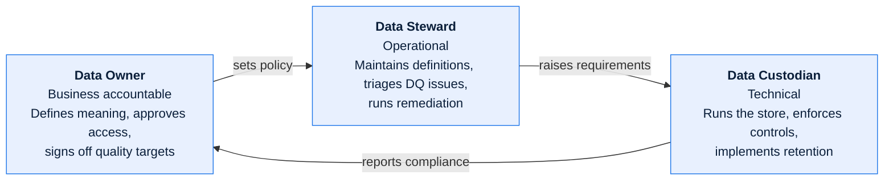

# Ownership and RACI Conventions

In a disaggregated system, most documentation failures are ownership failures. A field is
populated by one team, transformed by a second, reported by a third, and relied upon by a
fourth — and when it is wrong, four teams each correctly observe that it is not their
problem.

This defines how ownership is expressed so that never happens.

---

## Contents

| Section | Summary |
| --- | --- |
| [1. Four distinct kinds of ownership](#1-four-distinct-kinds-of-ownership) | Document, system, data, and process ownership — distinct questions and records |
| [2. Roles, not people](#2-roles-not-people) | Front-matter `owner` as a role; the per-system role register that resolves it |
| [3. RACI, applied properly](#3-raci-applied-properly) | R/A/C/I definitions and the exactly-one-accountable constraint |
| [4. Data ownership specifically](#4-data-ownership-specifically) | Data Owner, Steward, and Custodian as three separate jobs |
| [5. Shared-database ownership](#5-shared-database-ownership) | Table- and column-granular ownership where one database serves several domains |
| [6. Column-level ownership for contested fields](#6-column-level-ownership-for-contested-fields) | Contested columns — defined by one domain, stored by another |
| [7. Ownership in the front matter, in practice](#7-ownership-in-the-front-matter-in-practice) | Worked front-matter and body patterns for recording ownership |

---

## 1. Four distinct kinds of ownership

They are routinely conflated, and conflating them is what produces the "not my problem"
outcome.

| Kind | Question it answers | Held by | Recorded in |
| --- | --- | --- | --- |
| **System ownership** | Who decides this system's roadmap and funds it? | Business/product owner | [System Profile](../templates/00-foundations/system-profile.md) |
| **Component ownership** | Who changes this code and gets paged for it? | Engineering team | [Component Specification](../templates/01-architecture/component-specification.md) |
| **Data ownership** | Who decides what this data means and who may use it? | Business data owner | [Data Domain Charter](../templates/02-data/data-domain-charter.md) |
| **Process ownership** | Who is accountable for this business outcome end to end? | Business process owner | [Business Process Flow](../templates/04-domain/business-process-flow.md) |

The same person rarely holds all four for a given artefact, and in a cross-functional
platform they never do. A field like `net_incentive_amount` can be owned as data by Sales
Finance, owned as code by the Incentive Engine team, and owned as process by Field Sales
Operations. All three must be named.

---

## 2. Roles, not people

Front matter `owner` is always a **role**. Roles are resolved to people in exactly one
place — a role register maintained per system:

| Role | Current holder | Deputy | Escalation | Team channel |
| --- | --- | --- | --- | --- |
| Order Management Architecture Lead | *(name)* | *(name)* | Head of Platform Architecture | `#meridian-arch` |
| Order Data Steward | *(name)* | *(name)* | Data Governance Lead | `#meridian-data` |
| Vendor Integration Lead | *(name)* | *(name)* | Head of Supply Chain Systems | `#meridian-edi` |

Keep this table in the system's [Stakeholder & RACI Matrix](../templates/00-foundations/stakeholder-and-raci-matrix.md),
not scattered across documents. When someone changes jobs, one table changes.

---

## 3. RACI, applied properly

| Letter | Meaning | Constraint |
| --- | --- | --- |
| **R** — Responsible | Does the work | One or more |
| **A** — Accountable | Answers for the outcome; has decision rights | **Exactly one**, always |
| **C** — Consulted | Two-way input before the decision | Keep small |
| **I** — Informed | One-way notification after | Keep honest |

Two failure modes to check for in any RACI you write:

- **Two A's** — means no decision can be made; the matrix is describing a stand-off, not an
  operating model. Split the activity until each part has one accountable role.
- **A without R** — someone is accountable for work nobody is doing. Either assign an R or
  remove the activity.

### Worked example — a cross-functional data flow

Ownership of one field, `vendor_confirmed_ship_date`, across its life:

| Activity | Vendor Integration | Order Ops | Order Data Steward | Sales Finance | SRE |
| --- | --- | --- | --- | --- | --- |
| Define the field's business meaning | C | C | **A/R** | C | I |
| Receive and parse the ASN | **A/R** | I | C | — | C |
| Handle a malformed or late ASN | R | **A** | C | I | R |
| Decide the tolerance for "late" | C | **A/R** | C | C | I |
| Use the date for incentive eligibility | I | C | C | **A/R** | — |
| Monitor ASN feed availability | C | I | — | — | **A/R** |
| Approve a change to the ASN contract | **A** | C | C | C | I |

Reading this matrix answers the question that actually gets asked during an incident —
"the ship date is wrong on 400 orders, whose problem is it?" — in one row each for
parsing (Vendor Integration), handling (Order Ops), and downstream consequence
(Sales Finance).

---

## 4. Data ownership specifically

Data ownership is split into three roles because the responsibilities genuinely are three
different jobs:



| | Data Owner | Data Steward | Data Custodian |
| --- | --- | --- | --- |
| Typical holder | Business function head | Senior analyst / domain SME | Platform / DBA / data engineering |
| Approves access requests | ✅ | Recommends | Implements |
| Defines the field | ✅ | Drafts | — |
| Sets quality thresholds | ✅ | Proposes | Measures |
| Triages a DQ incident | Informed | ✅ | Investigates |
| Implements retention/purge | Approves | Specifies | ✅ |
| Signs a data contract | ✅ | Reviews | Reviews |

**Every data element in the Data Dictionary carries an owning domain**, and every domain has
exactly one Data Owner. Elements that cross domains — the derived fields, which are always
the contentious ones — are owned by the domain that *defines the calculation*, not the one
that stores the result.

---

## 5. Shared-database ownership

Legacy platforms commonly have one physical database serving several domains. Physical
co-location does not imply shared ownership. Record ownership at **table and column
granularity**, and record it explicitly rather than by convention:

| Table | Owning domain | Writers | Readers | Notes |
| --- | --- | --- | --- | --- |
| `ORDER_LINE` | Order Processing | Order Entry, Decoding Engine | Sales Reporting, Finance, Vendor Dispatch | Columns `SLS_OBJ_CD`, `INCTV_ELIG_FL` are owned by Sales despite living here — see §6 |
| `MODEL_PACKAGE` | Product Launch Readiness | Portfolio Management only | Order Processing, Sales Reporting | Read-only to everyone else; writes outside PLR are a defect |
| `SALES_OBJECTIVE` | Sales Processing | Objective Planning | Incentive Engine, Reporting | — |

Then state the rule that makes the table meaningful:

> **Cross-domain write rule.** A domain may write only to tables it owns, or to columns
> explicitly delegated to it in the table above. Any other write path is an architectural
> defect and is recorded as such in the TAD with a remediation owner — not quietly
> tolerated because it has always been there.

Legacy reality: you will find violations. Document each one as a finding with a
confidence level and an owner rather than pretending the rule holds. The list of
violations *is* the modernization backlog.

---

## 6. Column-level ownership for contested fields

Some columns exist in one domain's table but are defined and maintained by another. These
are the highest-risk fields in the system: they are changed by a team that does not own the
meaning and consumed by a team that does not own the storage.

| Column | Physical home | Defining domain | Populated by | Change requires |
| --- | --- | --- | --- | --- |
| `ORDER_LINE.INCTV_ELIG_FL` | Order Processing | Sales Processing | `SLS-ELIG-070` nightly job | Sales Data Owner + Order Data Owner |
| `ORDER_LINE.SLS_OBJ_CD` | Order Processing | Sales Processing | Order entry, defaulted from dealer profile | Sales Data Owner |
| `MODEL_PACKAGE.DSPTCH_LEAD_DAYS` | Product Launch Readiness | Vendor Integration | Vendor onboarding process | Vendor Integration Lead |

Maintain this table in the Data Dictionary and reference it from each affected domain pack.
If a field appears here, its change process is dual-approval by construction.

---

## 7. Ownership in the front matter, in practice

```yaml
owner: Order Management Architecture Lead   # accountable for this document
```

For documents about data, add the data roles in the body rather than overloading `owner`:

```markdown
| Role | Holder (role name) |
| --- | --- |
| Document Owner | Order Data Steward |
| Data Owner | VP, Order Operations |
| Data Custodian | Platform Data Engineering Lead |
```
