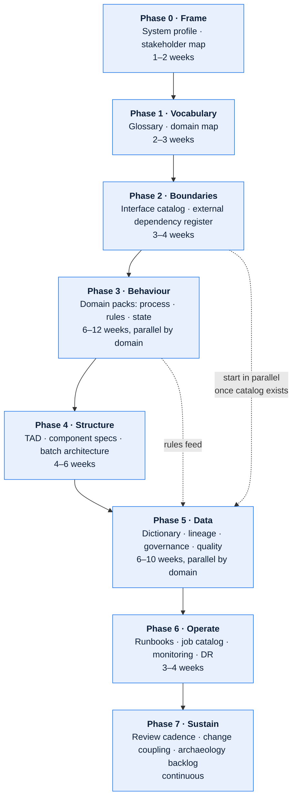

# Documenting Large Legacy Systems

A method for the specific case this repository was built for: a system that is 15–35 years
old, supports several business domains, holds business rules in code rather than
configuration, integrates with dozens of external parties, and has no accurate documentation
in existence.

The instinct is to start with an architecture diagram. That is wrong, and the reason it is
wrong is worth stating plainly: **you cannot draw a correct boundary before you know what
the words mean**. Three domains using "order" to mean three different things will produce
three incompatible architecture diagrams and a month of argument.

---

## Contents

| Section | Summary |
| --- | --- |
| [1. Sequence](#1-sequence) | Eight-phase order of attack with indicative durations |
| [2. Phase 0 — Frame (1–2 weeks)](#2-phase-0--frame-12-weeks) | System Profile and RACI — purpose, dependants, cost of being wrong |
| [3. Phase 1 — Vocabulary (2–3 weeks)](#3-phase-1--vocabulary-23-weeks) | Glossary and Domain Map — the highest-leverage and most-skipped phase |
| [4. Phase 2 — Boundaries (3–4 weeks)](#4-phase-2--boundaries-34-weeks) | Interface Catalog, External Dependency Register, ICDs for the top interfaces |
| [5. Phase 3 — Behaviour (6–12 weeks, parallel by domain)](#5-phase-3--behaviour-612-weeks-parallel-by-domain) | One domain pack per bounded context; rule-harvesting method |
| [6. Phase 4 — Structure (4–6 weeks)](#6-phase-4--structure-46-weeks) | TAD, component specifications, batch and scheduling architecture |
| [7. Phase 5 — Data (6–10 weeks, parallel by domain)](#7-phase-5--data-610-weeks-parallel-by-domain) | Governance charter, dictionary, lineage, and reference data |
| [8. Phase 6 — Operate (3–4 weeks)](#8-phase-6--operate-34-weeks) | Runbooks, job schedule catalog, monitoring and alerting |
| [9. Phase 7 — Sustain (continuous)](#9-phase-7--sustain-continuous) | Change coupling, weekly staleness sweep, burning down `🔴 Assumed` |
| [10. Techniques](#10-techniques) | Archaeology techniques, the five-questions interview, deciding when to stop |
| [11. Common traps](#11-common-traps) | Trap, why it fails, and what to do instead |

---

## 1. Sequence

Durations assume a team of 2–3 people documenting alongside SMEs who have other jobs. They
scale with the number of domains, not the number of lines of code.

---

## 2. Phase 0 — Frame (1–2 weeks)

**Produce:** [System Profile](../templates/00-foundations/system-profile.md),
[Stakeholder & RACI Matrix](../templates/00-foundations/stakeholder-and-raci-matrix.md).

**Do:** find out what the system is for, who depends on it, what it costs to be wrong, and
who knows things. Timebox hard — this phase exists to orient, not to be complete.

**Highest-value question:** *"What happens to the business if this system is down for a
day?"* The answer tells you which domains to document first, and it is usually not the one
the loudest stakeholder nominates.

**Deliberately skip:** anything technical. Do not open the code yet.

---

## 3. Phase 1 — Vocabulary (2–3 weeks)

**Produce:** [Glossary & Taxonomy](../templates/00-foundations/glossary-and-taxonomy.md),
[Domain Map](../templates/00-foundations/domain-map.md).

This is the highest-leverage phase and the one most often skipped.

**Method:**

1. Collect every term that appears in screen labels, report headers, file layouts, table
   names, and interface specs. Do not filter yet.
2. For each, ask three different domains what it means. Record all answers.
3. Where answers differ, you have found a **bounded context boundary**. That is the finding,
   not a problem to resolve.
4. Record the term once per context with a qualifier, plus the translation between them.

**What a real conflict looks like:**

| Term | Product Launch Readiness | Order Processing | Sales Reporting |
| --- | --- | --- | --- |
| *Package* | A marketable bundle of option codes, valid for a model year | The decoded set of option lines on an order line | A reporting rollup used for objective attainment |
| *Order date* | — | Date the dealer submitted | Date the order was accepted into the objective period (may differ by up to 5 days) |
| *Unit* | One model/package combination | One order line | One vehicle counted toward an objective — excludes fleet and demo |

The right response is **not** to force a single definition. It is to name each precisely
(`plr.package`, `ops.decoded_package`, `spr.reporting_package`) and to document the
translation rule between them. Forcing one definition across three domains is how
multi-domain systems acquire fields nobody can explain.

**Rule:** if a term has more than one meaning, the ambiguous bare term is banned from all
subsequent documents. The validator cannot enforce this; reviewers must.

---

## 4. Phase 2 — Boundaries (3–4 weeks)

**Produce:** [Interface Catalog](../templates/03-interfaces/interface-catalog.md),
[External Dependency Register](../templates/03-interfaces/external-dependency-register.md),
ICDs for the top ~10 interfaces by criticality.

Boundaries are easier to establish than internals because they leave evidence: firewall
rules, SFTP accounts, scheduled transfers, API gateway logs, MQ channel definitions, service
accounts, vendor invoices.

**Discovery sources, in order of reliability:**

| Source | Finds | Reliability |
| --- | --- | --- |
| Network/firewall rules, SFTP account list | Every live external connection | High — but includes dormant ones |
| Scheduler job definitions | File-based interfaces and their timing | High |
| MQ / topic / queue definitions | Async interfaces | High |
| API gateway or web server access logs | Live synchronous callers | High for 90 days, then gone |
| Database links, replication, ETL job catalogs | Interfaces nobody calls interfaces | Medium |
| Vendor contracts and invoices | Dependencies with no technical footprint (portals, manual uploads) | Medium |
| Asking people | The manual and email-based interfaces | Low but irreplaceable |

> **Expect this:** the count of real interfaces will be 2–4× what anyone estimates. The
> overage is concentrated in file transfers created for a single project and never
> decommissioned, and in "temporary" manual processes.

For each interface, capture the minimum viable row first — direction, counterparty,
transport, frequency, criticality, owner — and write full ICDs only for the critical ones.
A complete catalog of thin rows beats a partial catalog of thick ones.

---

## 5. Phase 3 — Behaviour (6–12 weeks, parallel by domain)

**Produce:** one [domain pack](../templates/04-domain/) per bounded context.

This is where the business rules live, and where the real value of the exercise is.

**Method — rule harvesting:**

1. **Start from the exceptions, not the happy path.** Ask support and operations: "what are
   the top 20 reasons an order gets stuck?" Each answer is one or more business rules, and
   they are the rules that matter operationally.
2. **Mine the reference data.** Hold codes, reason codes, status codes, error codes — every
   code value encodes a rule. A hold code table with 60 entries is a 60-rule catalog waiting
   to be written.
3. **Read the code for the decoding/derivation core only.** In an order-to-cash platform this
   is the package decoder, the pricing calculator, the eligibility evaluator. Do not attempt
   to read everything.
4. **Write rules atomically** with IDs, conditions, outcomes, authority, and confidence.
5. **Validate against production data.** A rule you believe you have found should be
   checkable with a query. Run it. Promote to `✅ Verified` or discover you were wrong — both
   outcomes are wins.

**Rule quality bar:**

| Weak | Strong |
| --- | --- |
| "Orders can be held for credit reasons." | `BR-OPS-014` — When a dealer's `CREDIT_STATUS` is `S` (suspended) at decode time, apply hold `CR01` to every line on the order. Held lines are excluded from the dispatch extract and remain visible in the dealer portal. Authority: Credit Policy 4.2. `✅ Verified` — `ORDHLD02.CBL:88-131`, confirmed against 2026-08 production sample. |

**Anti-pattern:** documenting the happy path and labelling exceptions "edge cases". In a
30-year-old order platform, 30–50% of volume takes a non-default path. They are not edges;
they are the system.

---

## 6. Phase 4 — Structure (4–6 weeks)

**Produce:** [TAD](../templates/01-architecture/technical-architecture-document.md),
[Component Specifications](../templates/01-architecture/component-specification.md),
[Batch & Scheduling Architecture](../templates/01-architecture/batch-and-scheduling-architecture.md),
[Legacy System Archaeology](../templates/01-architecture/legacy-system-archaeology.md) for the
opaque parts, retrospective [ADRs](../templates/01-architecture/architecture-decision-record.md).

You can now write the TAD honestly, because you know the vocabulary, the boundaries, and the
behaviour.

**Retrospective ADRs.** Write ADRs for decisions taken decades ago whose rationale is still
load-bearing. Mark them `status: accepted` with `decision_date: unknown` and record the
reconstructed rationale at `🟡 Inferred`. This is not archaeology for its own sake — it is
what stops a modernization team from "fixing" something that exists for a reason nobody
remembered to write down.

**Batch architecture deserves its own document** in any legacy platform. The job graph
encodes an enormous amount of implicit business sequencing, and it is invisible in every
other artefact.

---

## 7. Phase 5 — Data (6–10 weeks, parallel by domain)

**Produce:** [Data Governance Charter](../templates/02-data/data-governance-charter.md),
[Data Dictionary](../templates/02-data/data-dictionary.md),
[Data Lineage](../templates/02-data/data-lineage-document.md),
[Reference Data Registry](../templates/02-data/reference-data-and-code-set-registry.md),
[Data Quality Rules](../templates/02-data/data-quality-rules-and-controls.md),
[Metric Catalog](../templates/02-data/metric-and-kpi-definition-catalog.md).

**Do not attempt to document 1,400 tables.** Prioritise:

1. **Fields that appear in an external interface.** Someone outside depends on them.
2. **Fields that feed a financial or regulatory report.** Someone will audit them.
3. **Fields that are derived.** Derived fields are where meaning is lost; raw captured
   fields are usually self-evident.
4. **Fields that appear in a metric definition.** These cause the "two reports disagree"
   problem.
5. **Fields that repeatedly appear in data quality incidents.**

That is typically 150–400 fields out of tens of thousands, and it covers the great majority
of questions anyone will ever ask.

**Lineage method — trace backwards from consumption, not forwards from capture.** Start at
the number on the report that someone queried, and work back hop by hop. Forward tracing
produces exhaustive graphs of things nobody uses; backward tracing produces exactly the
lineage that matters, in priority order.

**Do not skip the reference data registry.** In a decoding-centric platform, the option code
and package tables *are* the business logic. A change to a code set is a change to system
behaviour, and it typically happens outside any change control — which is worth stating in
the governance charter as a finding.

---

## 8. Phase 6 — Operate (3–4 weeks)

**Produce:** [Runbooks](../templates/05-operations/runbook.md),
[Job Schedule Catalog](../templates/05-operations/job-schedule-catalog.md),
[Monitoring & Alerting](../templates/05-operations/monitoring-and-alerting.md),
[DR & Continuity](../templates/05-operations/disaster-recovery-and-continuity.md).

**Method:** write runbooks from real incidents, not from imagination. Pull the last 12
months of Sev-1/Sev-2 tickets, group them, and write one runbook per recurring failure.
Then test each by having someone who did not write it execute it.

**Test:** a runbook is done when someone unfamiliar with the subsystem can execute it at
03:00 without escalating. Anything less is a checklist of things the author already knew.

---

## 9. Phase 7 — Sustain (continuous)

- Enforce change coupling in the PR template: code change + doc change land together.
- Run the staleness report weekly; route to Domain Stewards.
- Burn down the `🔴 Assumed` backlog — target every assumption older than 90 days.
- Re-verify high-risk `✅ Verified` claims annually; code changes, and a stale verification
  is worse than an honest inference because it carries unearned authority.

---

## 10. Techniques

### 10.1 Archaeology: recovering behaviour from code

| Technique | Best for | Cost | Reliability |
| --- | --- | --- | --- |
| Reference data mining | Rules encoded as codes | Low | High |
| Production data profiling | Which paths are actually used; dead code | Low | High |
| Log/trace analysis | Real call patterns, real volumes | Low–Med | High |
| Structured code reading | The derivation core | High | High if done with an SME |
| Test-case construction | Confirming a hypothesised rule | Medium | Highest |
| SME interview | Intent and history | Low | Medium — memory is reconstructive |
| Change-history mining (`git log`, change tickets) | *Why* something is the way it is | Medium | Medium |

**Data profiling is undervalued.** Before reading code, profile the columns: distinct values,
null rates, value distributions over time. A status column with 14 values of which 3 appear
after 2015 has just told you that 11 branches of downstream logic are dead. That is a day of
code reading avoided, and it is checkable.

### 10.2 The "five questions" interview

SME time is scarce. Get the most from a one-hour session by asking:

1. **"Walk me through the last time this went wrong."** Concrete, recent, memorable — and it
   surfaces exception paths that process diagrams omit.
2. **"What do new joiners always get wrong?"** Surfaces the counter-intuitive rules.
3. **"What's the manual workaround nobody wants to admit to?"** Surfaces the undocumented
   process steps holding the system together.
4. **"If you changed X, what would break?"** Surfaces hidden coupling far better than asking
   about coupling directly.
5. **"Who else knows about this?"** Snowball sampling; the second-order names are usually the
   people who actually know.

Record answers as `🔴 Assumed` and verify afterwards. SME recollection is evidence, not
proof — and people reliably describe the system as it was designed rather than as it has
become.

### 10.3 Deciding when to stop

You have documented enough of a subsystem when:

- A competent engineer new to it can make a small change without reading the whole codebase.
- Support can resolve the top 10 recurring issues from the runbooks alone.
- An impact assessment for a typical change can be produced in under a day.
- The remaining `🔴 Assumed` items concern behaviour nobody has exercised in 24 months.

Perfect coverage is not the goal and is not achievable. Coverage of what is *asked about* is.

---

## 11. Common traps

| Trap | Why it fails | Do instead |
| --- | --- | --- |
| Starting with the architecture diagram | Boundaries drawn before vocabulary is agreed are wrong and expensive to redraw | Glossary and domain map first |
| Auto-generating docs from schema/code | Produces volume with no meaning; nobody reads it; it crowds out the documents that matter | Generate reference material, *write* the meaning |
| Documenting only the happy path | 30–50% of real volume is exceptional in legacy platforms | Harvest rules from exceptions first |
| One giant "system design" document | Cannot be owned, reviewed, or updated incrementally | Typed documents with individual owners |
| Treating SME recollection as fact | Memory is reconstructive and describes the design, not the drift | `🔴 Assumed` + verification plan |
| Deferring the glossary because "everyone knows" | The cross-domain conflicts are invisible until written down | Phase 1, always |
| Big-bang documentation project with no sustain plan | Corpus is accurate for one quarter, then decays | Change coupling in the PR gate from day one |
| Documenting the target state as if it were current | Readers act on it and are wrong | Separate current state (TAD) from target (Modernization Roadmap) |
