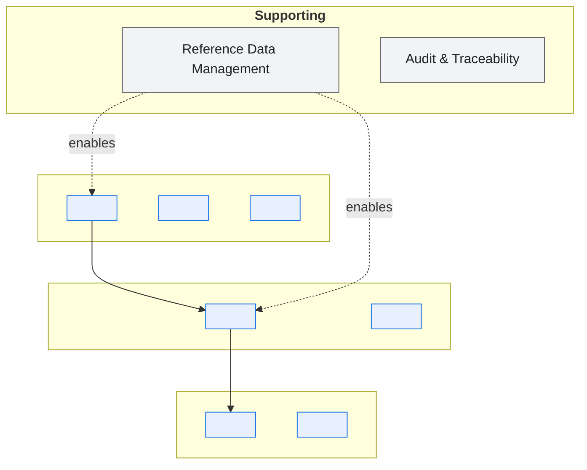
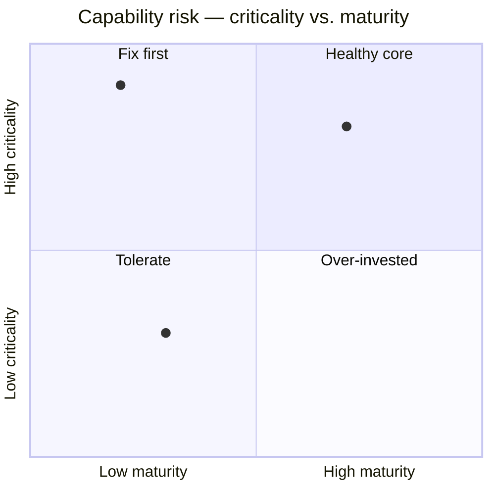

# \<System Name\> — Capability Model

> **Purpose.** Describe *what* the system does in business terms, decomposed to a level a
> business stakeholder recognises and an engineer can map to components. Capabilities are
> stable; implementations are not. That stability is what makes this document the right
> place to hang ownership, criticality, and modernization decisions.
>
> **Rule:** a capability is a noun phrase describing an ability ("Order Line Decoding"),
> never a system, team, or process step.

---

## 1. Capability map

---

## 2. Capability register

> One row per capability. `Maturity` and `Disposition` are what make this document useful
> for planning rather than merely descriptive.

| ID | Capability | Area | Description | Owning domain | Primary components | Criticality | Maturity | Disposition |
| --- | --- | --- | --- | --- | --- | --- | --- | --- |
| CAP-01 | | | | | | Tier 1/2/3 | 1–5 | Invest / Sustain / Contain / Retire |
| CAP-02 | | | | | | | | |

**Maturity scale**

| Level | Meaning |
| --- | --- |
| 1 | Manual or heavily workaround-dependent |
| 2 | Automated but fragile; frequent exceptions requiring human intervention |
| 3 | Automated and stable; poor observability or slow to change |
| 4 | Automated, observable, changeable within a normal release cycle |
| 5 | Automated, observable, self-service configurable by the business |

> Maturity 1–2 capabilities are where operational cost hides. Quantify it: "≈ 2.5 FTE of
> manual correction per month" is an argument; "needs improvement" is not.

---

## 3. Capability → component mapping

> The bridge between business language and the TAD. Keeps modernization conversations
> honest: it shows which capabilities are entangled in the same component and therefore
> cannot be moved independently.

| Capability | Components | Shared with | Separable? | Notes |
| --- | --- | --- | --- | --- |
| CAP-01 | | | Yes / No / Partial | |

---

## 4. Capability heat map

> Plot criticality against maturity. The top-left quadrant — critical and immature — is the
> risk register for this system, and the modernization roadmap should open with it.

| Capability | Criticality (1–5) | Maturity (1–5) | Change frequency | Risk score | Priority |
| --- | --- | --- | --- | --- | --- |
| | | | High/Med/Low | *(criticality × (6 − maturity))* | |

---

## 5. Cross-domain capabilities

> Capabilities used by more than one domain are the most contentious things in a
> disaggregated system: everyone depends on them, nobody funds them. Name the accountable
> owner explicitly.

| Capability | Consuming domains | Accountable owner | Funding model | Contention notes |
| --- | --- | --- | --- | --- |
| | | | | |

---

## 6. Gaps and duplication

| Finding | Type | Evidence | Impact | Owner |
| --- | --- | --- | --- | --- |
| | Gap / Duplication / Shadow IT | | | |

> "Shadow IT" here means a capability the business has built outside the system — the
> spreadsheet that reconciles two reports, the Access database that tracks exceptions. These
> are capability gaps with a workaround attached, and they belong in this document rather
> than being ignored because they are not "the system".

---

## Change log

| Version | Date | Author | Change |
| --- | --- | --- | --- |
| 0.1.0 | | | Initial draft |
