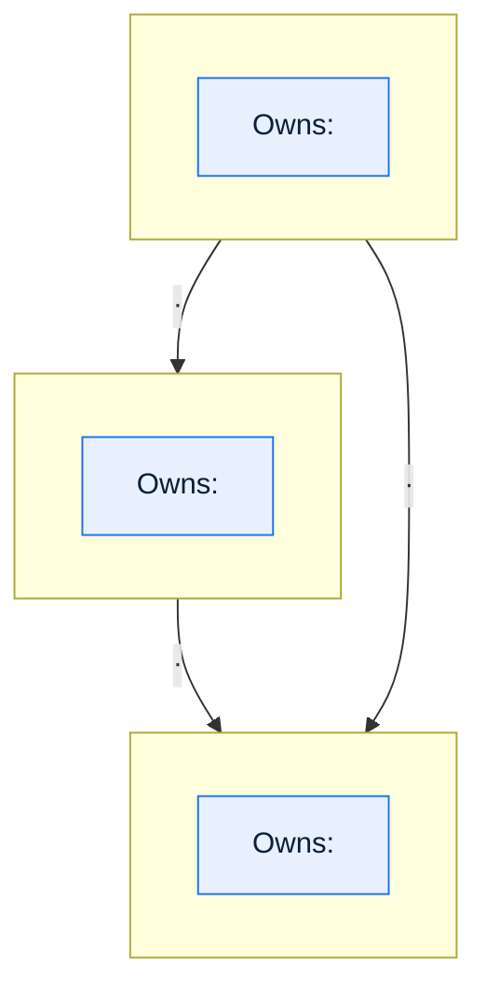
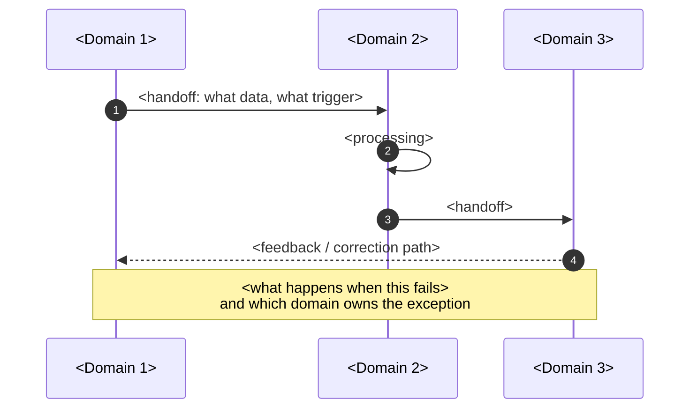

# \<System Name\> — Domain Map

> **Purpose.** Define the bounded contexts inside this system, what each owns, and how they
> translate between each other. In a legacy platform where several domains share one
> database and one codebase, the boundaries are conceptual rather than physical — which
> makes writing them down more important, not less.
>
> **Prerequisite:** the [Glossary](glossary-and-taxonomy.md). You cannot draw a boundary
> before you know which terms mean different things on either side of it.

---

## Contents

| Section | Summary |
| --- | --- |
| [1. Domains](#1-domains) | Domain, code, purpose, business and technical owner, entities owned |
| [2. Domain map](#2-domain-map) | Context diagram with a typed relationship on every edge |
| [3. Context boundaries and translation](#3-context-boundaries-and-translation) | Translation rules for terms whose meaning changes at a boundary |
| [4. Shared data](#4-shared-data) | Shared entities: writers, readers, coupling risk, cross-domain write violations |
| [5. Domain interaction sequence](#5-domain-interaction-sequence) | One end-to-end scenario showing where ownership changes hands |
| [6. Domain boundary health](#6-domain-boundary-health) | Symptoms of a bad boundary, tested per domain pair |
| [7. Domain pack index](#7-domain-pack-index) | Links to the six domain-pack documents per domain |
| [Change log](#change-log) | Version, date, author, change |

---

## 1. Domains

| Domain | Code | Purpose | Business owner | Technical owner | Core entities owned |
| --- | --- | --- | --- | --- | --- |
| | | | | | |

---

## 2. Domain map

**Relationship types** (label every edge with one):

| Type | Meaning | Implication |
| --- | --- | --- |
| **Upstream/Downstream** | One domain's output is another's input | Downstream must absorb upstream change |
| **Customer/Supplier** | Downstream has negotiating power over upstream's contract | Change requires agreement |
| **Conformist** | Downstream accepts upstream's model as-is | Upstream change propagates directly; no protection |
| **Anti-corruption layer** | Downstream translates upstream's model into its own | Insulated, at the cost of maintaining the translation |
| **Shared kernel** | Two domains share a model and must change it together | Highest coupling — justify explicitly |
| **Partnership** | Two domains succeed or fail together; coordinated releases | Requires joint planning |

> In legacy platforms the honest answer is usually **shared kernel** whether anyone intended
> it or not, because the domains share tables. Record what is true, then record what you
> intend, in the [Modernization Roadmap](../01-architecture/modernization-roadmap.md).

---

## 3. Context boundaries and translation

> For every term that means different things in different domains, record the translation
> rule. This table prevents the most expensive class of defect in a multi-domain platform:
> a field crossing a boundary and silently changing meaning.

| Term | Domain A meaning | Domain B meaning | Translation rule | Where implemented | Confidence |
| --- | --- | --- | --- | --- | --- |
| | | | | | ✅/🟡/🔴 |

---

## 4. Shared data

| Entity / table | Owning domain | Written by | Read by | Coupling risk | Notes |
| --- | --- | --- | --- | --- | --- |
| | | | | High/Med/Low | |

### Cross-domain write violations

> Where a domain writes to another domain's data. List them — do not omit them because they
> are long-standing. This list is the coupling backlog.

| Writer | Target (domain / table / column) | Why it happens | Risk | Remediation owner | Confidence |
| --- | --- | --- | --- | --- | --- |
| | | | | | ✅/🟡/🔴 |

---

## 5. Domain interaction sequence

> One end-to-end scenario that crosses every domain. More instructive than any static
> diagram, because it shows the order in which ownership changes hands.

---

## 6. Domain boundary health

| Boundary | Symptom of a bad boundary | Present? | Evidence |
| --- | --- | --- | --- |
| A ↔ B | Changes in one domain routinely require changes in the other | | |
| A ↔ B | The same concept is stored in both with divergent values | | |
| A ↔ B | Neither team can explain the other's use of a shared field | | |
| A ↔ B | Incidents in one domain are first detected by the other | | |
| A ↔ B | A single release train is required across both | | |

> These symptoms are observable from incident and change history. Use them to argue for
> boundary changes with evidence rather than aesthetics.

---

## 7. Domain pack index

| Domain | Overview | Process | Rules | States | Entities | Interfaces |
| --- | --- | --- | --- | --- | --- | --- |
| | | | | | | |

---

## Change log

| Version | Date | Author | Change |
| --- | --- | --- | --- |
| 0.1.0 | | | Initial draft |
