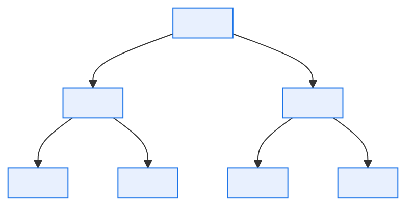

# \<System Name\> — Glossary and Taxonomy

> **Purpose.** The controlled vocabulary for this system. In a multi-domain platform this is
> the single highest-value document you will produce, because almost every expensive
> misunderstanding traces back to two people using one word for two things.
>
> **Method:** collect terms from screen labels, report headers, file layouts, table names,
> and interface specs. Ask at least two domains what each means. Record disagreement rather
> than resolving it prematurely — disagreement is where your bounded contexts are.

---

## Contents

| Section | Summary |
| --- | --- |
| [1. How to read this glossary](#1-how-to-read-this-glossary) | Unqualified versus context-qualified terms; where the bare term is banned |
| [2. Taxonomy](#2-taxonomy) | How the system's concepts nest |
| [3. Terms (system-wide)](#3-terms-system-wide) | Definition, aliases, physical representation, owner — with the definition quality bar |
| [4. Context-qualified terms ⚠️](#4-context-qualified-terms-) | One block per contested term, defined separately per context |
| [5. Code sets referenced](#5-code-sets-referenced) | Pointers into the Reference Data Registry |
| [6. Abbreviations and acronyms](#6-abbreviations-and-acronyms) | Expansions, including abbreviations that collide |
| [7. Deprecated and legacy terms](#7-deprecated-and-legacy-terms) | Legacy term, where it still appears, current term, rename safety |
| [8. Terms under dispute](#8-terms-under-dispute) | Competing positions, impact of ambiguity, owner, target resolution |
| [Change log](#change-log) | Version, date, author, change |

---

## 1. How to read this glossary

- **Unqualified terms** (§3) mean the same thing everywhere in the system.
- **Context-qualified terms** (§4) mean different things in different domains and must
  **always** be written with their qualifier. The bare term is banned from all other
  documents.
- **Deprecated terms** (§7) still appear in code, screens, and older documents. They are
  listed so readers can translate, not so they can be used.

| Notation | Meaning |
| --- | --- |
| `plr.package` | The term *package* as used in the Product Launch Readiness context |
| *Package* (unqualified) | Banned — ambiguous, use a qualified form |
| → | "See instead" |

---

## 2. Taxonomy

> How the system's concepts nest. Helps readers place an unfamiliar term.

---

## 3. Terms (system-wide)

| Term | Definition | Also known as | Physical representation | Owner | Notes |
| --- | --- | --- | --- | --- | --- |
| | *(one sentence, no circularity — a definition that uses the term being defined is not a definition)* | | *(table.column, file field, screen label)* | | |

> **Definition quality bar:** a definition must let a reader decide, for any given instance,
> whether it is or is not an example of the term. "An order is a request from a dealer" fails
> that test — is a quotation an order? Is a cancelled order still an order? Write the
> boundary cases in.

---

## 4. Context-qualified terms ⚠️

> The most important section. One block per contested term.

### 4.1 *\<term\>*

| Context | Qualified form | Definition | Physical representation | Owner |
| --- | --- | --- | --- | --- |
| \<Domain A\> | `a.<term>` | | | |
| \<Domain B\> | `b.<term>` | | | |
| \<Domain C\> | `c.<term>` | | | |

**Translation rules**

| From → To | Rule | Implemented in | Lossy? | Confidence |
| --- | --- | --- | --- | --- |
| `a.<term>` → `b.<term>` | | | Yes/No — *if yes, state what is lost* | ✅/🟡/🔴 |

**Why the difference exists:** *(usually historical. Record it — it prevents someone
"harmonising" the definitions and breaking a downstream report.)*

**Known defects caused by this ambiguity:** *(incident IDs. Concrete evidence that the
qualifier matters.)*

---

## 5. Code sets referenced

> Short pointers only; full definitions belong in the
> [Reference Data Registry](../02-data/reference-data-and-code-set-registry.md).

| Code set | Purpose | Values | Authority | Registry entry |
| --- | --- | --- | --- | --- |
| | | *(count, or list if short)* | | |

---

## 6. Abbreviations and acronyms

| Abbreviation | Expansion | Context | Notes |
| --- | --- | --- | --- |
| | | | |

> Include the ones that collide. In an order-to-cash platform `PO` can be purchase order or
> product option, and `ASN` can be advance shipping notice or an internal account number.
> Collisions are worth an explicit row each.

---

## 7. Deprecated and legacy terms

| Legacy term | Where it still appears | Current term | Safe to rename? | Notes |
| --- | --- | --- | --- | --- |
| | *(screens, columns, file layouts, reports)* | | Yes/No | |

> "Safe to rename" is almost always **No** for anything in an external interface or a
> database column. Record the mapping and leave the name alone; renaming a column that a
> partner's file layout depends on is a change to an external contract.

---

## 8. Terms under dispute

| Term | Position A (who, what) | Position B (who, what) | Impact of ambiguity | Owner | Target resolution |
| --- | --- | --- | --- | --- | --- |
| | | | | | |

> Unresolved disputes belong in the glossary, visibly. A term quietly left undefined
> re-emerges as a production defect.

---

## Change log

| Version | Date | Author | Change |
| --- | --- | --- | --- |
| 0.1.0 | | | Initial draft |
