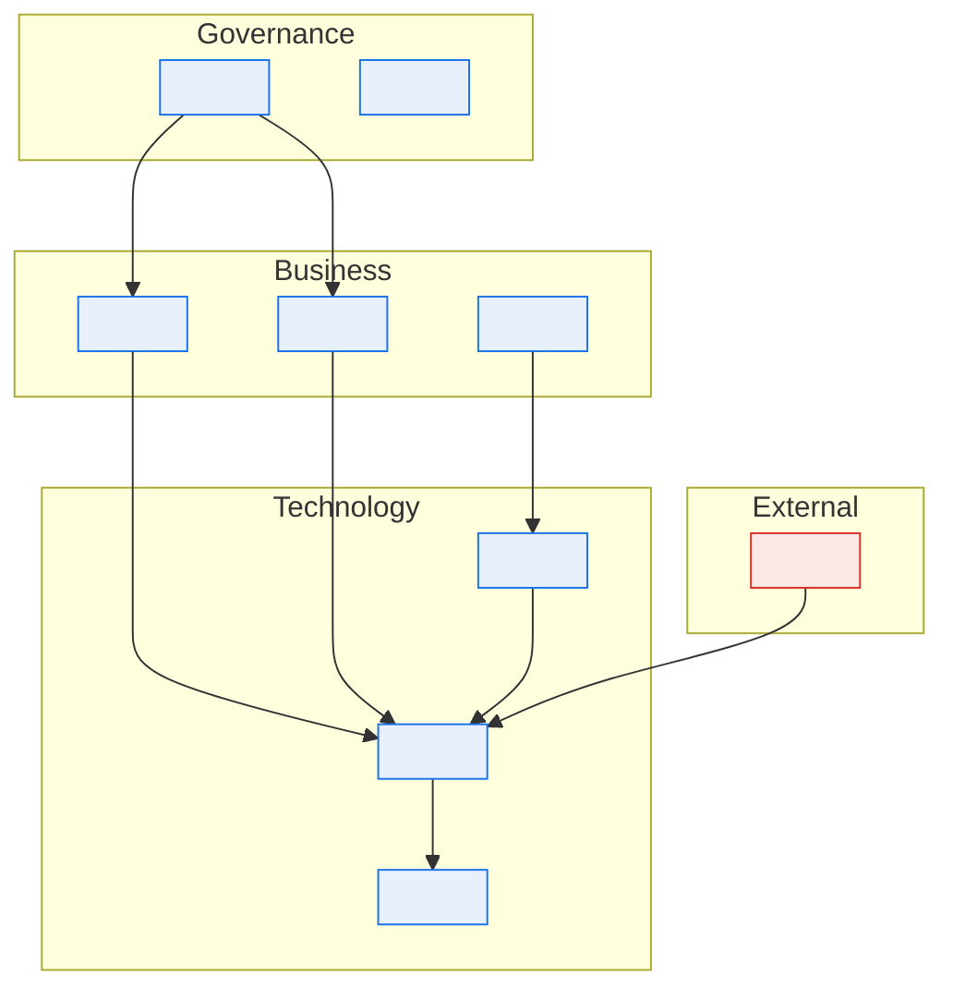

# \<System Name\> — Stakeholder and RACI Matrix

> **Purpose.** Resolve roles to people in exactly one place, and make decision rights
> explicit for the activities where they are routinely contested. Every other document
> refers to roles; this document is the only place a person's name appears.

---

## Contents

| Section | Summary |
| --- | --- |
| [1. Role register](#1-role-register) | Role → holder, deputy, channel, escalation; vacant and contested roles |
| [2. Stakeholder map](#2-stakeholder-map) | Stakeholder map with interest and influence |
| [3. RACI — system activities](#3-raci--system-activities) | R/A/C/I per system activity, exactly one Accountable per row |
| [4. RACI — documentation](#4-raci--documentation) | Author, reviewer, approver, and informed parties per document type |
| [5. Decision rights for contested areas](#5-decision-rights-for-contested-areas) | Decision rights where accountability is genuinely ambiguous |
| [6. Communication and forums](#6-communication-and-forums) | Forums, cadence, decision rights, and event communication plans |
| [7. External stakeholders](#7-external-stakeholders) | External parties, contacts, notice periods, criticality |
| [Change log](#change-log) | Version, date, author, change |

---

## 1. Role register

> The indirection that keeps the rest of the corpus stable when people change jobs.

| Role | Holder | Deputy | Reports to | Channel | Escalation |
| --- | --- | --- | --- | --- | --- |
| | | | | | |

**Vacant or contested roles:**

| Role | Status | Interim holder | Risk of the gap | Resolution owner | Target |
| --- | --- | --- | --- | --- | --- |
| | Vacant / Contested / Retiring | | | | |

> A vacant owner role is a live risk, not an administrative gap. In a legacy platform the
> most common cause of documentation decay is a role that quietly stopped being held.

---

## 2. Stakeholder map

### Interest and influence

> Determines who must be consulted before a decision and who merely needs telling. Getting
> this wrong is how changes get reversed late.

| Stakeholder | Interest | Influence | Engagement approach |
| --- | --- | --- | --- |
| | High/Med/Low | High/Med/Low | Manage closely / Keep satisfied / Keep informed / Monitor |

---

## 3. RACI — system activities

> **R** Responsible · **A** Accountable (exactly one per row) · **C** Consulted · **I** Informed

| Activity | \<Role 1\> | \<Role 2\> | \<Role 3\> | \<Role 4\> | \<Role 5\> |
| --- | --- | --- | --- | --- | --- |
| Set system roadmap and priorities | | | | | |
| Approve architectural change | | | | | |
| Approve a new external interface | | | | | |
| Approve a business rule change | | | | | |
| Approve a reference-data code set change | | | | | |
| Approve a data access request | | | | | |
| Approve production deployment | | | | | |
| Declare a major incident | | | | | |
| Approve an emergency change | | | | | |
| Sign off UAT | | | | | |
| Accept a data quality exception | | | | | |
| Approve retention or purge of production data | | | | | |
| Approve a vendor/partner onboarding | | | | | |
| Approve a change to an SLA commitment | | | | | |

> Check before publishing: no row has two **A**s; no row has an **A** without an **R**; no
> role is **A** for more than it can plausibly hold.

---

## 4. RACI — documentation

| Document type | Author | Reviewer | Approver | Informed |
| --- | --- | --- | --- | --- |
| TAD | | | | |
| ADR | | | | |
| ICD | | | | |
| Data lineage | | | | |
| Business rules catalog | | | | |
| Runbook | | | | |

---

## 5. Decision rights for contested areas

> The rows above cover normal operation. These are the areas where accountability is
> genuinely ambiguous in a cross-functional platform, and where an incident will find the
> ambiguity if this table does not.

| Decision | Accountable | Must consult | Tie-break | Notes |
| --- | --- | --- | --- | --- |
| Meaning of a field shared by two domains | | | | |
| Priority when two domains' batch jobs contend for the same window | | | | |
| Whether to reprocess or restate after a data defect | | | | |
| Whether to hold a release for a partner's readiness | | | | |
| Accepting a known defect into production | | | | |
| Whose SLA wins when two are in conflict | | | | |

---

## 6. Communication and forums

| Forum | Cadence | Chair | Attendees | Decisions it may take | Record kept in |
| --- | --- | --- | --- | --- | --- |
| | | | | | |

| Event | Audience | Channel | Timing | Owner |
| --- | --- | --- | --- | --- |
| Planned outage | | | | |
| Major incident | | | | |
| Interface change affecting a partner | | | | |
| Business rule change | | | | |
| Data quality incident affecting a report | | | | |

---

## 7. External stakeholders

| Party | Relationship | Our contact role | Their contact | Contractual notice period | Criticality |
| --- | --- | --- | --- | --- | --- |
| | Vendor / Partner / Regulator / Customer | | | | |

Full detail in the [External Dependency Register](../03-interfaces/external-dependency-register.md).

---

## Change log

| Version | Date | Author | Change |
| --- | --- | --- | --- |
| 0.1.0 | | | Initial draft |
