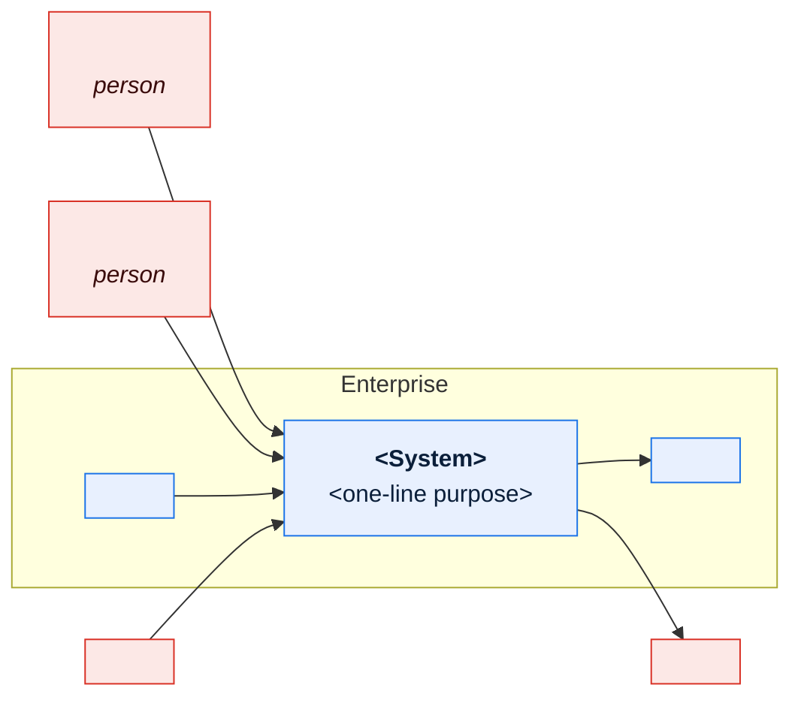
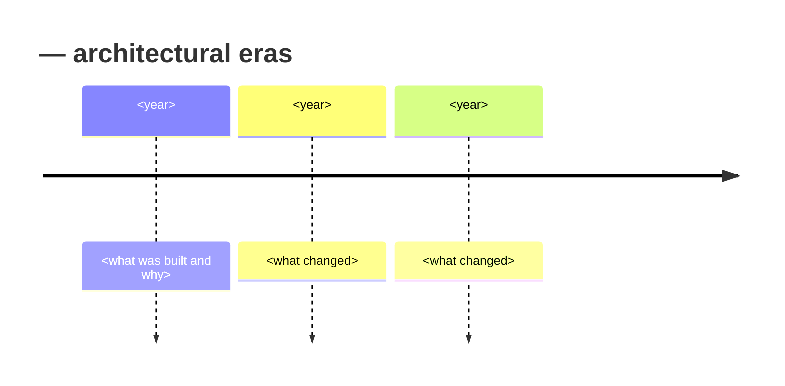

# \<System Name\> — System Profile

> **Purpose.** The one-page answer to "what is this thing?". Every other document about this
> system links back here. Target length: two pages. If it is longer, move detail into the
> layer that owns it.
>
> **Delete this block and all `>` guidance blocks when you fill the template in.**

---

## Contents

| Section | Summary |
| --- | --- |
| [1. At a glance](#1-at-a-glance) | Identity block: name, short code, owner, lifecycle status |
| [2. Criticality and business impact](#2-criticality-and-business-impact) | Consequence of failure by outage duration, with financial exposure |
| [3. Context](#3-context) | Context diagram and the conclusion the reader should draw |
| [4. What it does](#4-what-it-does) | Capabilities with domain, volume, and criticality |
| [5. Users and stakeholders](#5-users-and-stakeholders) | User groups, size, interaction mode, peak usage pattern |
| [6. Scale](#6-scale) | Volumetrics: normal, peak, peak driver, growth trend |
| [7. Technology summary](#7-technology-summary) | Technology per layer, with version and support status |
| [8. Architectural eras](#8-architectural-eras) | Chronology of architectural eras and what each left behind |
| [9. Known characteristics](#9-known-characteristics) | Load-bearing characteristics with impact and confidence level |
| [10. Document map](#10-document-map) | Which documents exist for this system, by layer, with status |
| [11. Open questions](#11-open-questions) | Open questions with owner and target date |
| [Change log](#change-log) | Version, date, author, change |

---

## 1. At a glance

| Attribute | Value |
| --- | --- |
| System name | |
| Short code | *(used as the scope code in every `doc_id` for this system)* |
| Aliases / former names | *(legacy systems accumulate these; readers will search for them)* |
| Business criticality | Tier 1 / 2 / 3 — *see §2* |
| Primary business purpose | *(one sentence)* |
| Domains supported | |
| First in production | |
| Current major version / release train | |
| Owning business function | |
| Owning engineering team | |
| Operating model | 24×7 / business hours / batch-window |
| Annual run cost (indicative) | |
| Strategic disposition | Invest / Sustain / Contain / Retire *(with target date)* |

---

## 2. Criticality and business impact

> State the consequence of failure in business terms. This drives RTO/RPO, on-call posture,
> and the order in which you document things.

| Outage duration | Business consequence | Financial exposure (indicative) |
| --- | --- | --- |
| 1 hour | | |
| 4 hours | | |
| 1 business day | | |
| 1 week | | |

**Seasonal or cyclical sensitivity:** *(model-year changeover, month-end close, quarter-end
incentive settlement, launch windows — state the dates and why they matter.)*

**Regulatory / audit relevance:** *(SOX-relevant financial reporting, tax, trade compliance,
privacy regimes. Name the specific obligation, not "compliance".)*

---

## 3. Context

> **Caption:** state what the reader should conclude — e.g. "the system sits between field
> sales capture and three downstream financial systems, with 40 fulfilment partners on the
> outbound side."

---

## 4. What it does

| # | Capability | Domain | Volume (typical / peak) | Criticality |
| --- | --- | --- | --- | --- |
| C1 | | | | |
| C2 | | | | |

> Keep to 8–15 capabilities. Detail belongs in the
> [Capability Model](capability-model.md) and the domain packs.

### What it explicitly does **not** do

> More useful than the previous table, and almost always omitted. Name the things people
> reasonably assume it does, and say which system does them instead.

| Commonly assumed capability | Actually provided by |
| --- | --- |
| | |

---

## 5. Users and stakeholders

| Group | Size | How they interact | Peak usage pattern |
| --- | --- | --- | --- |
| | | | |

Full RACI in [Stakeholder & RACI Matrix](stakeholder-and-raci-matrix.md).

---

## 6. Scale

| Dimension | Normal | Peak | Peak driver | Growth trend |
| --- | --- | --- | --- | --- |
| Transactions/day | | | | |
| Concurrent users | | | | |
| Database size | | | | |
| Batch jobs/night | | | | |
| External file transfers/day | | | | |
| Interfaces (live) | | | | |
| External parties | | | | |

---

## 7. Technology summary

| Layer | Technology | Version | Support status | Notes |
| --- | --- | --- | --- | --- |
| Presentation | | | | |
| Application | | | | |
| Integration | | | | |
| Data | | | | |
| Batch/scheduling | | | | |
| Infrastructure | | | | |

**End-of-support exposure:** *(list any component past or approaching vendor EOL, with date
and mitigation owner. This is the item executives ask about first.)*

---

## 8. Architectural eras

> For a system older than ~10 years, chronology explains more than any diagram. Each era
> left a layer behind, and knowing which era a component came from predicts how it behaves.

---

## 9. Known characteristics

> Honest, blunt, and load-bearing. This section is why people read a system profile.

| Characteristic | Impact | Confidence |
| --- | --- | --- |
| *(e.g. business rules encoded in COBOL, not configuration)* | *(rule changes require a release; 6-week lead time)* | ✅ / 🟡 / 🔴 |
| | | |

**Top 5 operational pain points:** *(from incident history, not opinion.)*

1.
2.

---

## 10. Document map

| Layer | Documents | Status |
| --- | --- | --- |
| 0 · Foundations | [Capability Model](capability-model.md) · [Domain Map](domain-map.md) · [Glossary](glossary-and-taxonomy.md) · [RACI](stakeholder-and-raci-matrix.md) | |
| 1 · Architecture | TAD · ADRs · NFRs · Batch architecture | |
| 2 · Data | Governance charter · Dictionary · Lineage · Quality | |
| 3 · Interfaces | Interface catalog · ICDs · Dependency register | |
| 4 · Domain | *(one pack per domain)* | |
| 5 · Operations | Runbooks · Job catalog · Monitoring · DR | |
| 6 · Change | *(per initiative)* | |

---

## 11. Open questions

| ID | Question | Owner | Target date |
| --- | --- | --- | --- |
| Q-001 | | | |

---

## Change log

| Version | Date | Author | Change |
| --- | --- | --- | --- |
| 0.1.0 | | | Initial draft |
