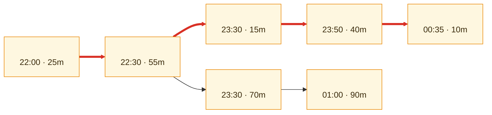
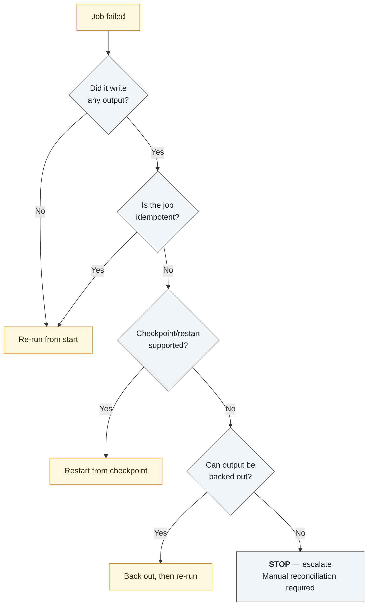

# \<System Name\> — Batch and Scheduling Architecture

> **Purpose.** In a legacy data-intensive platform, the batch schedule *is* a large part of
> the architecture. The job graph encodes business sequencing, data dependencies, and
> cutoff commitments that appear in no other artefact — and it is usually understood by two
> people.
>
> This document makes that graph explicit: what runs, in what order, within what window,
> and what happens when it does not.

---

## Contents

| Section | Summary |
| --- | --- |
| [1. Overview](#1-overview) | Scheduler product, job counts, critical-path size |
| [2. Processing windows](#2-processing-windows) | Windows, hard cutoffs, cutoff driver, consequence of breach |
| [3. Job dependency graph](#3-job-dependency-graph) | Dependency graph with the critical path, its duration, and slack |
| [4. Job register](#4-job-register) | Per-job summary: trigger, duration, predecessors, successors, criticality |
| [5. Restart, recovery, and re-run semantics](#5-restart-recovery-and-re-run-semantics) | Per-job re-run safety: restart point, idempotency, consequence of double-run |
| [6. Failure handling](#6-failure-handling) | Abend, overrun, and upstream-delay handling with escalation |
| [7. Data dependencies](#7-data-dependencies) | Reads, writes, locks, concurrency safety, online/batch contention |
| [8. Scheduling patterns](#8-scheduling-patterns) | Time-, file-, and event-triggered patterns and where each is used |
| [9. Capacity and growth](#9-capacity-and-growth) | Critical-path duration and volume against 12-month projections |
| [10. Modernization considerations](#10-modernization-considerations) | Which chains are batch for a real constraint versus historical reasons |
| [11. Known issues](#11-known-issues) | Known issues with impact, frequency, workaround, remediation |
| [Change log](#change-log) | Version, date, author, change |

---

## 1. Overview

| | |
| --- | --- |
| Scheduler product & version | |
| Total scheduled jobs | |
| Jobs in the nightly critical path | |
| Longest window | |
| Tightest slack | *(the number that predicts your next incident)* |
| Timezone of the schedule | |
| Daylight-saving handling | |
| Calendar source (business days, holidays) | |
| Owner of the schedule definition | |

---

## 2. Processing windows

| Window | Opens | Closes | Hard cutoff | Cutoff driver | Consequence of breach |
| --- | --- | --- | --- | --- | --- |
| | | | | *(partner SLA, market open, regulatory filing, business start)* | |

```mermaid
gantt
    dateFormat HH:mm
    axisFormat %H:%M
    title Nightly processing windows (all times UTC)
    section Extract
    Source extracts       :e1, 22:00, 45m
    section Core
    Decode                :c1, after e1, 55m
    Holds &amp; validation  :c2, after c1, 20m
    section Distribute
    Dispatch extract      :d1, after c2, 40m
    Partner transmission  :d2, after d1, 15m
    section Finance
    Invoicing             :f1, after c2, 60m
    GL interface          :f2, after f1, 30m
    section Reporting
    Warehouse load        :r1, after f2, 90m
```

**Window contention:** *(which chains compete for the same resources, and what the
prioritisation rule is when they do.)*

---

## 3. Job dependency graph

> **Caption:** name the critical path, its total duration, the cutoff it runs against, and
> the slack. Slack is the single most useful number in this document.

### 3.1 Critical path analysis

| Step | Job | Duration | Cumulative | Variance (p95) | Notes |
| --- | --- | --- | --- | --- | --- |
| 1 | | | | | |

| | |
| --- | --- |
| Critical path duration (typical) | |
| Critical path duration (p95) | |
| Window available | |
| Slack (typical / p95) | |
| **Job most likely to break the window** | |

> Use p95 durations, not averages. Batch jobs have long tails driven by volume, and the
> night you exceed the window is by definition not an average night.

### 3.2 Implicit business sequencing

> The most valuable section. Job order often encodes business rules that exist nowhere else
> — "invoicing must run after the hold release job because releasing a hold after invoicing
> produces an unbilled shipment". Excavate and record these; they are the constraints that a
> re-platforming effort will otherwise break.

| Sequence constraint | Business reason | Consequence if violated | Confidence |
| --- | --- | --- | --- |
| \<JOB-X\> before \<JOB-Y\> | | | ✅/🟡/🔴 |

---

## 4. Job register

> Summary; full operational detail in the
> [Job Schedule Catalog](../05-operations/job-schedule-catalog.md).

| Job ID | Name | Purpose | Trigger | Typical duration | Predecessors | Successors | Criticality |
| --- | --- | --- | --- | --- | --- | --- | --- |
| | | | Time / Event / File arrival / Manual | | | | |

---

## 5. Restart, recovery, and re-run semantics

> The section that gets read at 02:00. Be precise per job — "should be fine to re-run" is
> not an answer when the job posts to a general ledger.

| Job | Re-runnable | Restart point | Idempotent | Pre-restart cleanup | Consequence of double-run | Confidence |
| --- | --- | --- | --- | --- | --- | --- |
| | Yes / No / Conditional | From start / Checkpoint / Manual position | Yes/No | | | ✅/🟡/🔴 |

**Restart decision procedure**

**Jobs that must never be blindly re-run**

| Job | Why | Correct procedure |
| --- | --- | --- |
| | *(financial posting, external transmission, sequence-number consumption, payment file)* | |

---

## 6. Failure handling

| Failure | Detection | Automatic action | Manual action | Escalation | Downstream impact |
| --- | --- | --- | --- | --- | --- |
| Job abend | | | | | |
| Job overruns window | | | | | |
| Input file missing | | | | | |
| Input file malformed | | | | | |
| Input file arrives late | | | | | |
| Zero-record input | | | | | |
| Volume anomaly (high/low) | | | | | |
| Dependency job failed | | | | | |
| Scheduler unavailable | | | | | |
| Database unavailable mid-run | | | | | |

> **Zero-record input deserves its own row.** A file with a valid header and no detail
> records passes most validation and silently produces an empty downstream result. In an
> order-to-cash platform that can mean a night with no dispatch instructions sent and no
> alarm raised.

### Catch-up strategy

| Scenario | Strategy | Constraint |
| --- | --- | --- |
| Single job delayed | | |
| Whole chain delayed past cutoff | | |
| Full night missed | | |
| Multiple nights missed | | |

**Can the chain be run twice in one day to catch up?** *(Per chain. For anything touching
sequence numbers, financial periods, or partner transmissions, the answer is usually no —
say so here rather than discovering it during recovery.)*

---

## 7. Data dependencies

| Job | Reads | Writes | Locks held | Conflicts with | Concurrency safe |
| --- | --- | --- | --- | --- | --- |
| | | | | | |

**Online/batch contention**

| Aspect | Detail |
| --- | --- |
| Can online users transact during the batch window? | |
| Which functions are disabled and how | |
| Locking/blocking behaviour | |
| Read-consistency approach for extracts | |
| Cut-off mechanism (how "today's data" is bounded) | |

> The cut-off mechanism matters and is routinely undocumented. If an extract selects
> `WHERE created_dt < CURRENT DATE` while online entry continues, records created during the
> run are either included or missed depending on timing — and that is a reconciliation break
> that recurs forever.

---

## 8. Scheduling patterns

| Pattern | Where used | Rationale |
| --- | --- | --- |
| Time-triggered | | |
| File-arrival triggered | | |
| Event/message triggered | | |
| Predecessor-completion triggered | | |
| Calendar-conditional (business day, month-end) | | |
| Manual/on-request | | |

**Calendar rules**

| Rule | Definition | Source | Jobs affected |
| --- | --- | --- | --- |
| Business day | | | |
| Month-end | *(last calendar day? last business day? accounting period close?)* | | |
| Quarter/year-end | | | |
| Holiday calendar | | | |

> Ambiguity in "month-end" is a classic source of financial-reporting defects in
> multi-domain platforms, because finance, sales, and operations each mean something
> slightly different by it. Define it once here and reference it.

---

## 9. Capacity and growth

| Metric | Current | 12-month projection | Headroom | Action trigger |
| --- | --- | --- | --- | --- |
| Critical path duration | | | | |
| Peak-night volume | | | | |
| Largest job duration | | | | |
| Window utilisation | | | | |

**Seasonal peaks**

| Period | Volume multiplier | Duration impact | Mitigation |
| --- | --- | --- | --- |
| | | | |

---

## 10. Modernization considerations

| Job/chain | Batch because | Could be event-driven? | Blockers | Value if changed |
| --- | --- | --- | --- | --- |
| | *(genuine constraint, or historical)* | | | |

> Distinguish jobs that are batch for a real reason — a partner who only accepts a daily
> file, a nightly reference-data refresh, a financial period boundary — from jobs that are
> batch because everything was batch in 1998. The second group is where latency improvement
> is cheap.

---

## 11. Known issues

| ID | Issue | Impact | Frequency | Workaround | Remediation | Owner |
| --- | --- | --- | --- | --- | --- | --- |
| | | | | | | |

---

## Change log

| Version | Date | Author | Change |
| --- | --- | --- | --- |
| 0.1.0 | | | Initial draft |
