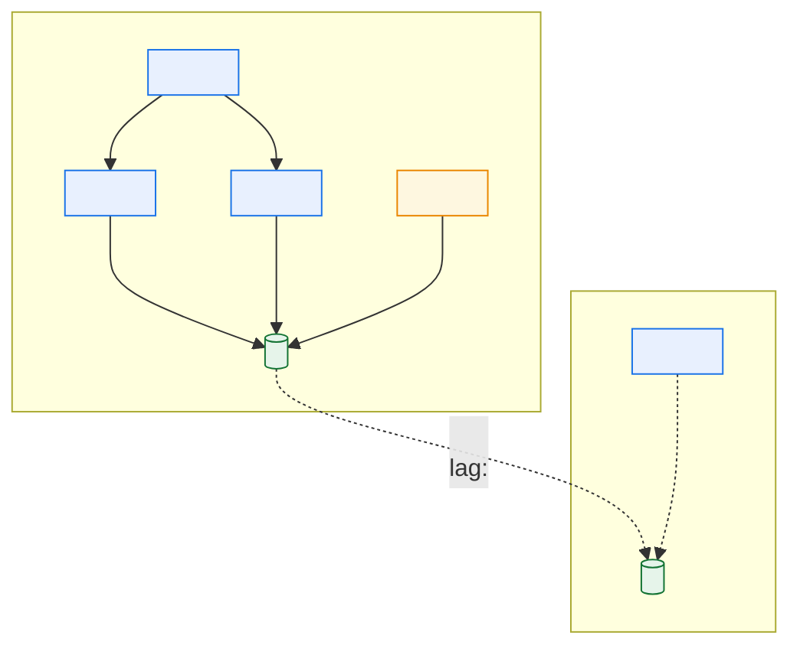

# \<System Name\> — Deployment and Environments

> **Purpose.** Where the system runs, how code and configuration get there, and how the
> environments differ. Environment divergence is a leading cause of "it worked in test", and
> the divergences are knowable — this document is where they are written down.

---

## Contents

| Section | Summary |
| --- | --- |
| [1. Environment inventory](#1-environment-inventory) | Environments, purpose, data, refresh, availability, access, cost |
| [2. Environment parity](#2-environment-parity) | Divergence from production, dimension by dimension, with the risk each carries |
| [3. Production topology](#3-production-topology) | Nodes, roles, specs, sites, failover posture |
| [4. Deployment pipeline](#4-deployment-pipeline) | Pipeline stages, tooling, gates, approvers, artefact management |
| [5. Deployment procedures](#5-deployment-procedures) | Per-component method, downtime, rollback and its window; database changes |
| [6. Configuration management](#6-configuration-management) | Configuration store, version control, promotion, drift detection |
| [7. Release calendar and windows](#7-release-calendar-and-windows) | Permitted windows, change classes, approvals, freeze periods |
| [8. Non-production data](#8-non-production-data) | Non-production data sources, PII treatment, masking rules, refresh |
| [9. Infrastructure as code](#9-infrastructure-as-code) | What is codified, and the manual steps that remain as drift risk |
| [10. Access](#10-access) | Access per environment, approval, review cadence, break-glass |
| [11. Known issues](#11-known-issues) | Known issues with impact, workaround, remediation, owner |
| [Change log](#change-log) | Version, date, author, change |

---

## 1. Environment inventory

| Environment | Purpose | Data | Refresh | Availability target | Access | Cost |
| --- | --- | --- | --- | --- | --- | --- |
| Development | | | | | | |
| Integration/SIT | | | | | | |
| UAT | | | | | | |
| Performance | | | | | | |
| Pre-production | | | | | | |
| Production | | | | | | |
| DR | | | | | | |

---

## 2. Environment parity

> The gap analysis. Every divergence is a class of defect that can only be found in
> production.

| Dimension | Prod | Pre-prod | UAT | SIT | Dev | Risk from divergence |
| --- | --- | --- | --- | --- | --- | --- |
| Infrastructure sizing | | | | | | |
| Data volume | | | | | | |
| Data realism | | | | | | |
| External interfaces | | | | | | |
| Batch schedule | | | | | | |
| Reference data currency | | | | | | |
| Security controls | | | | | | |
| Monitoring | | | | | | |
| Concurrency/load | | | | | | |
| Timezone/locale settings | | | | | | |

**Known parity gaps**

| Gap | Consequence | Defects attributable | Mitigation | Cost to close |
| --- | --- | --- | --- | --- |
| | | | | |

> Populate "defects attributable" from incident history. It converts an argument about test
> environment investment into an evidence-based one.

**External interface substitution**

| Interface | Prod | Non-prod | Fidelity | What this misses |
| --- | --- | --- | --- | --- |
| | | Real / Sandbox / Stub / Mock / Absent | | |

---

## 3. Production topology

| Node/host | Role | Spec | Count | Site | Failover | Notes |
| --- | --- | --- | --- | --- | --- | --- |
| | | | | | Automatic / Manual / None | |

---

## 4. Deployment pipeline

```mermaid
flowchart LR
    C["Commit"] --> B["Build &amp; unit test"]
    B --> AR["Artefact published<br/><i>immutable, versioned</i>"]
    AR --> D1["Deploy → SIT"]
    D1 --> T1["Automated tests"]
    T1 --> D2["Deploy → UAT"]
    D2 --> T2["UAT sign-off"]
    T2 --> APP["Change approval"]
    APP --> D3["Deploy → Pre-prod"]
    D3 --> T3["Smoke + perf"]
    T3 --> D4["Deploy → Production"]
    D4 --> V["Post-deploy verification"]

    classDef internal fill:#E8F0FE,stroke:#1A73E8,color:#0B1F3A
    classDef manual fill:#F1F3F4,stroke:#5F6368,color:#202124
    class C,B,AR,D1,T1,D2,D3,T3,D4,V internal
    class T2,APP manual
```

| Stage | Tooling | Automated | Duration | Gate | Approver |
| --- | --- | --- | --- | --- | --- |
| | | | | | |

**Artefact management**

| Aspect | Approach |
| --- | --- |
| Artefact repository | |
| Versioning scheme | |
| Immutability | |
| Promotion model | *(same artefact promoted, or rebuilt per environment — rebuilding per environment is a parity risk)* |
| Retention | |

---

## 5. Deployment procedures

| Component | Method | Downtime | Duration | Rollback | Rollback window |
| --- | --- | --- | --- | --- | --- |
| | Rolling / Blue-green / In-place / Batch-window | | | | |

### Database changes

| Aspect | Approach |
| --- | --- |
| Migration tool | |
| Forward-only or reversible | |
| Backwards-compatibility requirement | |
| Large-table strategy | *(online DDL, shadow table, chunked backfill)* |
| Coupling to application release | |
| Rollback approach | |

> **Expand/contract is the only safe pattern for a shared legacy schema.** Add the new
> structure, dual-write, migrate readers, then remove the old — across three releases. A
> single-release rename to a column that six batch jobs and two partners read is an outage.

### Batch and schedule changes

| Aspect | Approach |
| --- | --- |
| Where schedule definitions live | |
| Version controlled | |
| Promotion path | |
| Testing approach | |
| Rollback | |

> Schedule definitions that live only in the scheduler's own database are unversioned
> production configuration. If that is the case here, record it as a finding.

---

## 6. Configuration management

| Aspect | Approach |
| --- | --- |
| Configuration store | |
| Version controlled | |
| Environment-specific values | |
| Secrets management | |
| Change process | |
| Audit trail | |
| Hot-reload support | |
| Drift detection | |

**Environment-varying configuration**

| Key | Dev | SIT | UAT | Prod | Risk if wrong |
| --- | --- | --- | --- | --- | --- |
| | | | | | |

---

## 7. Release calendar and windows

| Window | Day/time | Duration | Change classes permitted | Approval |
| --- | --- | --- | --- | --- |
| | | | | |

**Freeze periods**

| Period | Dates | Reason | Exceptions |
| --- | --- | --- | --- |
| | | *(month-end close, quarter-end incentive settlement, model-year changeover, peak season)* | |

---

## 8. Non-production data

| Environment | Data source | Volume vs. prod | PII treatment | Refresh method | Duration | Owner |
| --- | --- | --- | --- | --- | --- | --- |
| | | | Masked / Synthetic / Subset / Real | | | |

**Masking rules**

| Data element | Rule | Referential integrity preserved | Notes |
| --- | --- | --- | --- |
| | | | |

> Masking must preserve referential integrity and format characteristics, or the environment
> stops being useful for the defects you most need to catch — a masked account number that
> no longer passes a check-digit rule will fail validation in test for reasons unrelated to
> the change being tested.

---

## 9. Infrastructure as code

| Component | Managed by | Repository | Manual steps remaining |
| --- | --- | --- | --- |
| | | | |

**Manual provisioning steps** *(everything not codified — this list is the drift risk)*

| Step | Why manual | Documented in | Owner |
| --- | --- | --- | --- |
| | | | |

---

## 10. Access

| Environment | Who has access | Level | Approval | Review cadence | Break-glass |
| --- | --- | --- | --- | --- | --- |
| Production | | | | | |
| Pre-production | | | | | |
| UAT | | | | | |

---

## 11. Known issues

| ID | Issue | Impact | Workaround | Remediation | Owner |
| --- | --- | --- | --- | --- | --- |
| | | | | | |

---

## Change log

| Version | Date | Author | Change |
| --- | --- | --- | --- |
| 0.1.0 | | | Initial draft |
