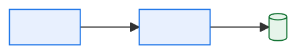
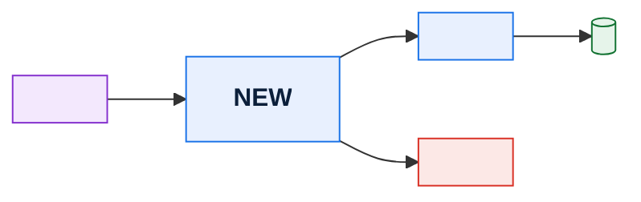
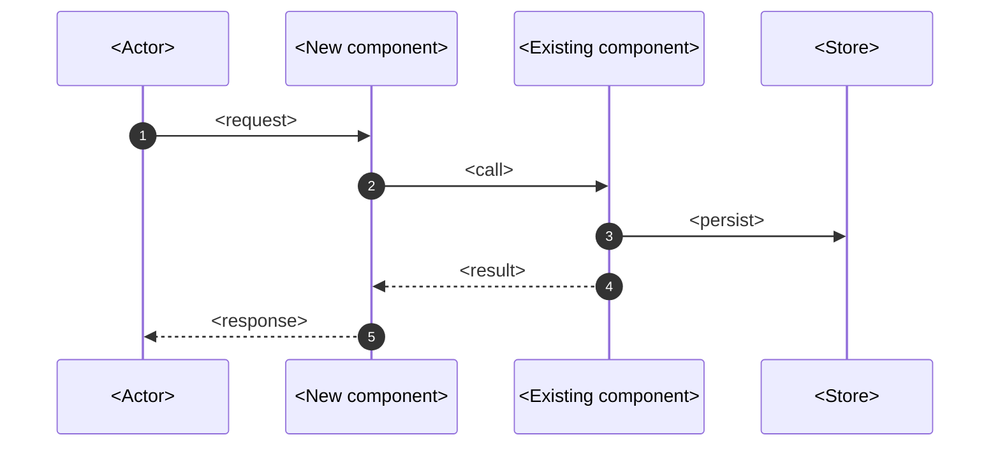

# \<Initiative Name\> — High-Level Design

> **Purpose.** The solution shape for one initiative. A TAD describes a system; an HLD
> describes a change to it. Answers: what are we building, which existing parts does it
> touch, and what decisions does it commit us to?

---

## Contents

| Section | Summary |
| --- | --- |
| [1. Summary](#1-summary) | Initiative, business driver, source requirements, scope in one block |
| [2. Requirements addressed](#2-requirements-addressed) | Requirement → design response, with what is explicitly not addressed |
| [3. Current state](#3-current-state) | What exists today in the area being changed |
| [4. Target state](#4-target-state) | Target architecture and a component-level change summary |
| [5. Solution detail](#5-solution-detail) | Processing flow and the key design elements |
| [6. Data design](#6-data-design) | New and modified entities, migration, retention, ownership |
| [7. Interface design](#7-interface-design) | New and changed interfaces, ICD status, partner notice periods |
| [8. Non-functional impact](#8-non-functional-impact) | Effect on latency, throughput, availability, and other attributes |
| [9. Design decisions](#9-design-decisions) | Decisions taken, options weighed, and which need an ADR |
| [10. Alternatives considered](#10-alternatives-considered) | Alternatives rejected, with reasons |
| [11. Risks, assumptions, dependencies](#11-risks-assumptions-dependencies) | Risks, assumptions, and dependencies with owners and mitigations |
| [12. Delivery approach](#12-delivery-approach) | Phasing, exit criteria, rollback points |
| [13. Testing approach](#13-testing-approach) | Test levels, environments, data, owners |
| [14. Operational readiness](#14-operational-readiness) | Runbook, monitoring, alerting, and support readiness |
| [15. Open questions](#15-open-questions) | Open questions, whether blocking, owner, needed-by date |
| [Change log](#change-log) | Version, date, author, change |

---

## 1. Summary

| | |
| --- | --- |
| Initiative | |
| Business driver | |
| Source requirements | [BRD-…](../06-change/business-requirements-document.md) |
| Target release / timeline | |
| Estimated effort | |
| Delivery team(s) | |

**One-paragraph summary of the solution:**

---

## 2. Requirements addressed

| Req ID | Requirement | How this design addresses it | Priority |
| --- | --- | --- | --- |
| | | | Must / Should / Could |

**Explicitly not addressed in this design:**

| Req ID | Why deferred | Where it will be handled |
| --- | --- | --- |
| | | |

---

## 3. Current state

> What exists today in the area being changed. Keep it to what the change touches — link to
> the TAD for anything wider.



**Limitations of the current state that this initiative must resolve:**

| Limitation | Evidence | Consequence |
| --- | --- | --- |
| | | |

---

## 4. Target state



### 4.1 Change summary

| Component | Change | Reason | Owner |
| --- | --- | --- | --- |
| | New / Modified / Retired / Unchanged-but-affected | | |

---

## 5. Solution detail

### 5.1 Processing flow



### 5.2 Key design elements

| Element | Approach | Rationale |
| --- | --- | --- |
| | | |

### 5.3 Business rules implemented or changed

| Rule ID | New / Changed / Retired | Description | Catalog entry |
| --- | --- | --- | --- |
| | | | |

---

## 6. Data design

| Aspect | Detail |
| --- | --- |
| New entities/tables | |
| Modified entities/tables | |
| New/changed fields | |
| Data migration required | |
| Historical data treatment | *(does this change the meaning of existing rows? If so, say how history is preserved)* |
| Retention | |
| Lineage impact | |

**Data dictionary and lineage updates required:**

| Document | Change needed | Owner |
| --- | --- | --- |
| | | |

---

## 7. Interface design

| IF ID | New/Changed | Counterparty | Direction | Transport | ICD status | Partner notice required |
| --- | --- | --- | --- | --- | --- | --- |
| | | | | | | |

> Any change to an external interface requires the counterparty's notice period to be
> reflected in the delivery plan. Discovering a 90-day notice clause during UAT is a
> schedule failure that this row exists to prevent.

---

## 8. Non-functional impact

| Attribute | Current | Target | Design response | Risk |
| --- | --- | --- | --- | --- |
| Latency | | | | |
| Throughput | | | | |
| Availability | | | | |
| Batch window consumption | | | | |
| Storage growth | | | | |
| Cost | | | | |

> **Batch window consumption** is the NFR most often forgotten in a legacy platform. A new
> job that takes 40 minutes inside a window with 25 minutes of slack is an outage waiting
> for a busy night.

---

## 9. Design decisions

| ID | Decision | Options considered | Rationale | ADR needed? |
| --- | --- | --- | --- | --- |
| D-01 | | | | Yes/No |

---

## 10. Alternatives considered

| Alternative | Summary | Why not chosen |
| --- | --- | --- |
| | | |

---

## 11. Risks, assumptions, dependencies

| ID | Type | Description | Impact | Likelihood | Mitigation | Owner |
| --- | --- | --- | --- | --- | --- | --- |
| R-01 | Risk | | | | | |
| A-01 | Assumption | | | | *(verification)* | |
| D-01 | Dependency | | | | | |

---

## 12. Delivery approach

```mermaid
gantt
    dateFormat YYYY-MM-DD
    title Delivery phases
    section Build
    <Phase 1>        :a1, <start>, <N>d
    <Phase 2>        :a2, after a1, <N>d
    section Test
    System test      :t1, after a2, <N>d
    UAT              :t2, after t1, <N>d
    section Release
    Cutover          :milestone, after t2, 0d
```

| Phase | Scope | Exit criteria | Rollback point |
| --- | --- | --- | --- |
| | | | |

---

## 13. Testing approach

| Level | Scope | Environment | Data | Owner |
| --- | --- | --- | --- | --- |
| Unit | | | | |
| Integration | | | | |
| Interface / partner | | | | |
| Performance | | | | |
| UAT | | | | |
| Regression | | | | |

---

## 14. Operational readiness

| Item | Required | Owner | Status |
| --- | --- | --- | --- |
| Runbook created/updated | | | |
| Monitoring and alerts defined | | | |
| Job schedule updated | | | |
| DR plan updated | | | |
| Support team briefed | | | |
| Documentation updated (list) | | | |

---

## 15. Open questions

| ID | Question | Blocking? | Owner | Needed by |
| --- | --- | --- | --- | --- |
| Q-001 | | | | |

---

## Change log

| Version | Date | Author | Change |
| --- | --- | --- | --- |
| 0.1.0 | | | Initial draft |
