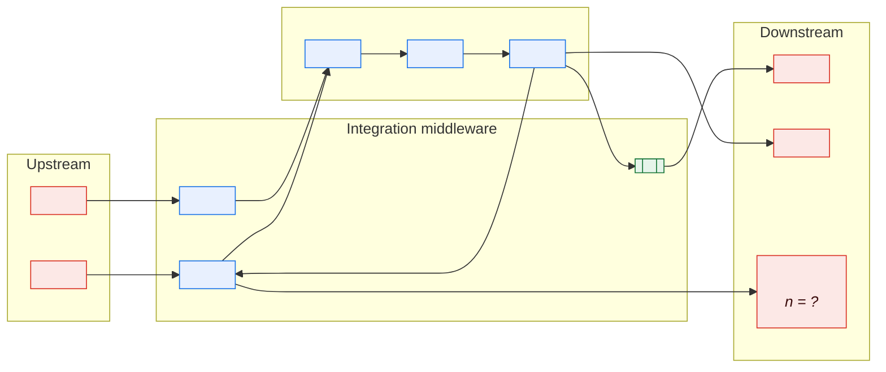
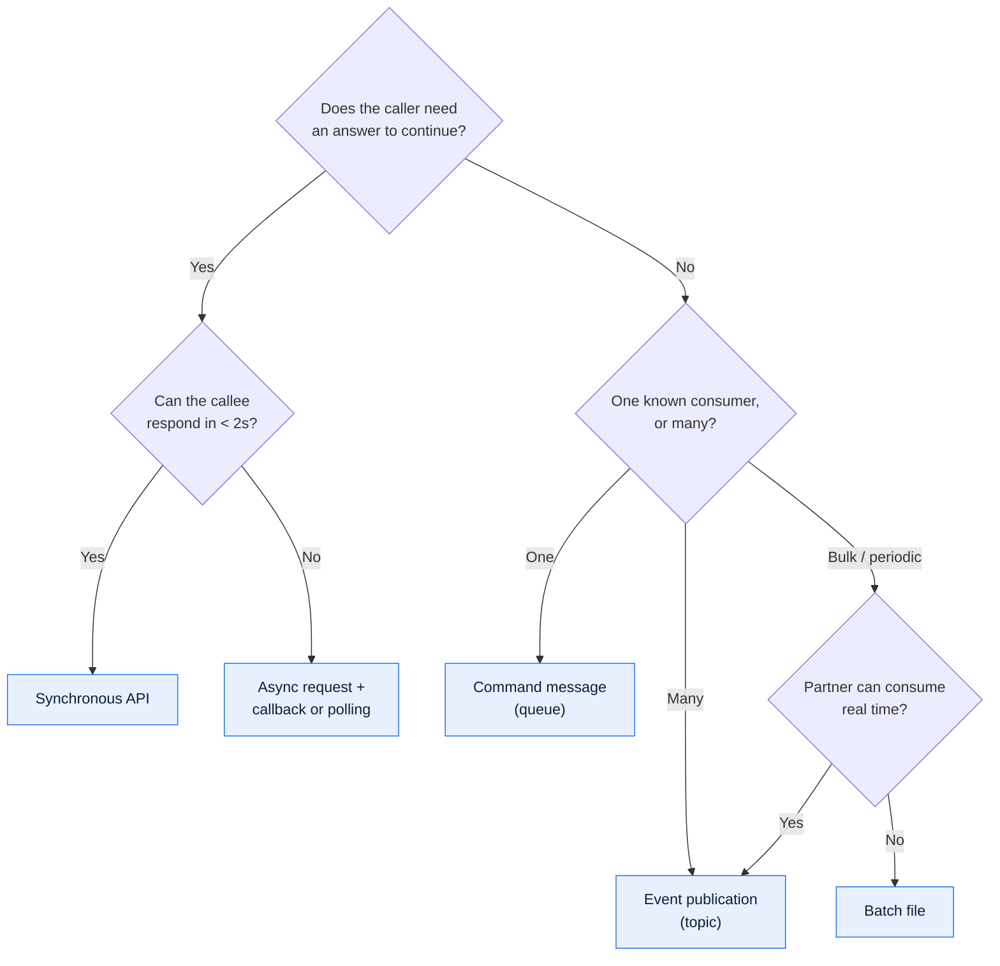

# \<System Name\> — Integration Architecture

> **Purpose.** How this system exchanges data with everything else: the patterns, the
> middleware, the topology, and the rules that govern adding a new interface. Individual
> interface contracts live in ICDs; this document is what makes forty ICDs comprehensible
> as a set.

---

## Contents

| Section | Summary |
| --- | --- |
| [1. Integration landscape](#1-integration-landscape) | Landscape diagram and the integration profile by count |
| [2. Integration patterns](#2-integration-patterns) | Pattern, when to use it, when not to, and current usage |
| [3. Middleware and infrastructure](#3-middleware-and-infrastructure) | Middleware products, ownership, support status, capacity headroom |
| [4. Cross-cutting integration concerns](#4-cross-cutting-integration-concerns) | Delivery semantics, ordering, idempotency, error handling, replay |
| [5. Data transformation and canonical model](#5-data-transformation-and-canonical-model) | Canonical model usage and where transformation happens |
| [6. Versioning and change](#6-versioning-and-change) | Versioning scheme, compatibility policy, notice period, parallel run |
| [7. Monitoring](#7-monitoring) | Signals, thresholds, routes, runbooks per interface class |
| [8. Adding a new interface](#8-adding-a-new-interface) | The path from proposal to production, with gate criteria |
| [9. Interface inventory](#9-interface-inventory) | Summary inventory; the Interface Catalog remains authoritative |
| [10. Known issues and debt](#10-known-issues-and-debt) | Integration debt with risk, remediation, and owner |
| [Change log](#change-log) | Version, date, author, change |

---

## 1. Integration landscape

### Integration profile

| Metric | Count | Notes |
| --- | --- | --- |
| Total live interfaces | | |
| Inbound / Outbound / Bidirectional | | |
| Synchronous / Asynchronous / Batch | | |
| External counterparties | | |
| Interfaces with a signed ICD | | *(the gap here is the backlog)* |
| Interfaces with automated monitoring | | |
| Interfaces with reconciliation controls | | |
| Interfaces with no identified owner | | *(should be zero; rarely is)* |

---

## 2. Integration patterns

| Pattern | Use when | Do not use when | Current usage | Governance |
| --- | --- | --- | --- | --- |
| **Synchronous request/response** | Caller needs an answer to proceed; sub-second; low volume | Long-running work; the callee may be unavailable | | |
| **Asynchronous messaging** | Fire-and-forget; decoupling; buffering bursts | Caller needs an immediate answer | | |
| **Batch file transfer** | High volume; periodic; partner cannot support real time | Latency matters; per-record error handling needed | | |
| **Event notification** | Multiple consumers care about a state change | A single known consumer needs a command executed | | |
| **Shared database** | — | Essentially always | | Prohibited for new integrations |
| **ETL / replication** | Analytics and reporting consumption | Operational read paths | | |

### Pattern selection

---

## 3. Middleware and infrastructure

| Component | Product & version | Purpose | Owner | Support status | Capacity headroom |
| --- | --- | --- | --- | --- | --- |
| | | | | | |

| Concern | Approach |
| --- | --- |
| Transport security | |
| Message persistence & durability | |
| Queue depth limits & overflow behaviour | |
| Dead-letter handling | |
| Poison-message quarantine | |
| File transfer protocol & encryption | |
| Certificate/key management & rotation | |
| Connectivity (VPN, leased line, internet) | |

---

## 4. Cross-cutting integration concerns

### 4.1 Delivery semantics

| Interface class | Guarantee | Duplicate handling | Ordering |
| --- | --- | --- | --- |
| | At-most-once / At-least-once / Exactly-once* | | Ordered / Unordered / Per-key |

\* *Exactly-once end-to-end is achieved by at-least-once delivery plus consumer-side
idempotency, not by the transport. If a row claims exactly-once, it must name the
idempotency key and where it is de-duplicated.*

### 4.2 Idempotency

| Interface | Idempotency key | De-duplication window | Store | Behaviour on duplicate |
| --- | --- | --- | --- | --- |
| | | | | |

### 4.3 Error handling

| Error class | Detection | Retry | Escalation | Data disposition |
| --- | --- | --- | --- | --- |
| Transport failure | | | | |
| Authentication failure | | | | |
| Schema/format violation | | | | |
| Business rejection | | | | |
| Partial batch failure | | | | |
| Duplicate | | | | |
| Late arrival (past cutoff) | | | | |

### 4.4 Reconciliation

> The control that catches silent loss. Without it, an interface can drop 2% of records
> indefinitely and nobody will know until a partner disputes an invoice.

| Interface | Control | Frequency | Tolerance | Owner | Break procedure |
| --- | --- | --- | --- | --- | --- |
| | *(control totals, record counts, checksum, sum of amounts, three-way match)* | | | | |

### 4.5 Backpressure and throttling

| Interface | Rate limit | Behaviour when exceeded | Buffer depth | Buffer full behaviour |
| --- | --- | --- | --- | --- |
| | | | | |

---

## 5. Data transformation and canonical model

| Aspect | Approach |
| --- | --- |
| Canonical model in use | Yes / No / Partial — *link to [CDM](../02-data/canonical-data-model.md)* |
| Where transformation happens | |
| Code set mapping | |
| Unit and currency conversion | |
| Date/time normalisation | |
| Character encoding normalisation | |
| Rounding policy on conversion | |

**Transformation map**

| Interface | Source model | Target model | Mapping document | Lossy? | What is lost |
| --- | --- | --- | --- | --- | --- |
| | | | | Yes/No | |

> Every lossy transformation is a future defect report. Name what is lost so that when
> someone asks "why doesn't the partner see the sub-line detail?", the answer exists.

---

## 6. Versioning and change

| Interface class | Versioning scheme | Compatibility policy | Notice period | Parallel-run support |
| --- | --- | --- | --- | --- |
| Internal API | | | | |
| External API | | | | |
| Event | | | | |
| File | | | | |
| EDI | | | | |

**Breaking vs. non-breaking**

| Change | Breaking? |
| --- | --- |
| Add optional field | No |
| Add mandatory field | **Yes** |
| Remove field | **Yes** |
| Widen a field's length | Usually — **yes** for fixed-width files and fixed-length consumers |
| Narrow a field's length | **Yes** |
| Add an enum value | **Yes** if consumers switch exhaustively on it |
| Change a field's meaning without changing its name | **Yes** — and the most dangerous kind, because it passes every schema check |
| Change cardinality (1 → many) | **Yes** |
| Tighten a validation rule | **Yes** for producers |

---

## 7. Monitoring

| Signal | Interfaces covered | Alert threshold | Route | Runbook |
| --- | --- | --- | --- | --- |
| Interface availability | | | | |
| Message/file latency | | | | |
| Error rate | | | | |
| Queue depth | | | | |
| Dead-letter arrivals | | | | |
| Missing expected file | | | | |
| Volume anomaly | | | | |
| Reconciliation break | | | | |

> **"Missing expected file" is the alert most often absent from legacy platforms.** Nothing
> arriving produces no error anywhere; the failure is silent until a downstream process
> produces an incomplete result. Every scheduled inbound interface needs an expectation with
> a deadline.

---

## 8. Adding a new interface

**Gate criteria**

| Gate | Criteria | Approver |
| --- | --- | --- |
| Pattern selection | Consistent with §2; deviation justified | Integration Lead |
| ICD complete | Passes the [ICD checklist](../../guides/08-review-checklists.md#icd--interface-control-document) | Integration Lead + counterparty |
| Security | Classification assessed, transport approved, credentials provisioned | Security |
| Certification | Test transmissions pass in both directions, including error cases | Both parties |
| Ops readiness | Monitoring, reconciliation, runbook, escalation contacts in place | SRE Lead |
| Catalog | Registered with an owner and review date | Integration Lead |

---

## 9. Interface inventory

> Summary; authoritative list in the [Interface Catalog](../03-interfaces/interface-catalog.md).

| IF ID | Name | Direction | Counterparty | Pattern | Criticality | ICD | Recon | Monitored |
| --- | --- | --- | --- | --- | --- | --- | --- | --- |
| | | | | | | ✅/❌ | ✅/❌ | ✅/❌ |

---

## 10. Known issues and debt

| ID | Issue | Interfaces affected | Risk | Remediation | Owner |
| --- | --- | --- | --- | --- | --- |
| | | | | | |

---

## Change log

| Version | Date | Author | Change |
| --- | --- | --- | --- |
| 0.1.0 | | | Initial draft |
