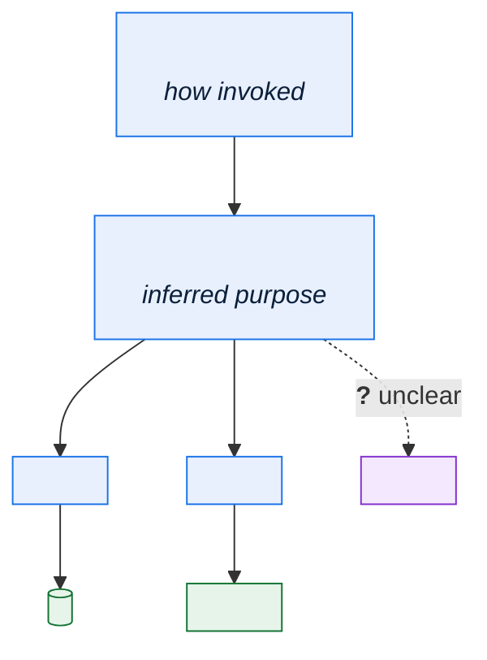
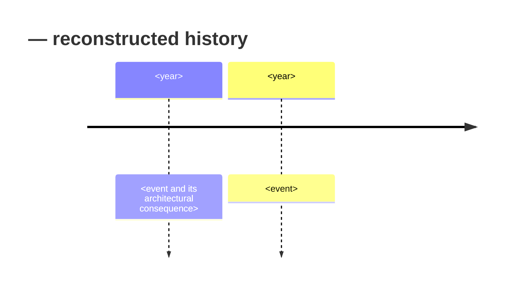

# \<Component or Subsystem\> — Legacy System Archaeology

> **Purpose.** Record what was recovered about an undocumented component, how it was
> recovered, and how confident you are in each finding. This is a **research record**, not a
> specification: it captures method and evidence so a later reader can judge the findings
> and extend the work rather than repeating it.
>
> **Output.** Findings here graduate into permanent documents — business rules into the
> Rules Catalog, structure into the TAD, fields into the Data Dictionary. This document
> remains as the evidence trail.

---

## 1. Subject

| | |
| --- | --- |
| Component | |
| Location | *(repository/path, library, load module, schema)* |
| Size | *(lines of code, programs, objects)* |
| Language / platform | |
| Age | *(first version, last significant change)* |
| Change frequency (last 24 months) | |
| Current maintainers | *(count; zero is a common and important answer)* |
| Existing documentation | |
| Why this excavation was commissioned | |

---

## 2. Investigation record

| Session | Date | Investigator | Method | Time spent | Findings | Artefacts |
| --- | --- | --- | --- | --- | --- | --- |
| | | | | | | |

**Methods used**

| Method | Applied to | Yield | Notes |
| --- | --- | --- | --- |
| Reference data mining | | | |
| Production data profiling | | | |
| Log and trace analysis | | | |
| Structured code reading | | | |
| Test-case construction | | | |
| SME interview | | | |
| Change-history mining | | | |
| Schema and constraint inspection | | | |
| Scheduler/job definition analysis | | | |

---

## 3. Recovered structure



| Module | Inferred purpose | Evidence | Lines | Last changed | Confidence |
| --- | --- | --- | --- | --- | --- |
| | | | | | ✅/🟡/🔴 |

**Entry points**

| Entry point | Invoked by | Frequency | Confidence |
| --- | --- | --- | --- |
| | *(online transaction, batch job, API, another program)* | | |

---

## 4. Recovered behaviour

### 4.1 Business rules discovered

> Graduate these into the [Business Rules Catalog](../04-domain/business-rules-catalog.md)
> once verified. Keep the evidence here.

| Rule ID | Condition | Outcome | Evidence | Confidence | Verified by | Catalogued |
| --- | --- | --- | --- | --- | --- | --- |
| BR-…-001 | | | *(file:lines @ release, query result, trace)* | ✅/🟡/🔴 | | ✅/❌ |

### 4.2 Processing logic

```
<Pseudocode reconstruction of the core logic.>
<Mark uncertain sections with (?) and explain in the notes below.>
```

**Uncertainties in the reconstruction**

| Location | Uncertainty | Why unresolved | How to resolve |
| --- | --- | --- | --- |
| | | | |

### 4.3 Edge cases and special handling

> Legacy code accumulates one-off handling for specific customers, partners, products, or
> historical periods. These are the highest-value findings: they are invisible from the
> outside, they are load-bearing, and a rewrite that omits them fails in production for
> reasons nobody can explain.

| Case | Trigger | Special handling | Why it exists | Still needed? | Confidence |
| --- | --- | --- | --- | --- | --- |
| | *(specific dealer code, date range, product family, region)* | | | Yes / No / Unknown | |

**Hard-coded values found**

| Value | Location | Apparent meaning | Impact if changed | Confidence |
| --- | --- | --- | --- | --- |
| | | | | |

---

## 5. Data usage

| Object | Access | Fields used | Fields written | Purpose | Confidence |
| --- | --- | --- | --- | --- | --- |
| | R / W / RW | | | | |

**Undocumented data dependencies**

| Dependency | Nature | Risk | Confidence |
| --- | --- | --- | --- |
| | *(implicit ordering, assumed presence, shared temp file, column used for two purposes)* | | |

> "Column used for two purposes" is worth looking for explicitly. A field repurposed in 2004
> for a second meaning, distinguished by a flag elsewhere, is common and is invisible to
> schema inspection.

---

## 6. Data profiling results

> Evidence from the data itself. Often the fastest route to understanding what code is
> actually reachable.

| Column | Distinct values | Null % | Top values | Values seen since \<date\> | Inference |
| --- | --- | --- | --- | --- | --- |
| | | | | | |

**Dead code candidates**

| Code path | Condition to reach | Last observed | Evidence | Recommendation |
| --- | --- | --- | --- | --- |
| | | | | |

> A status value last written in 2014 means the branch handling it is almost certainly dead.
> "Almost certainly" matters: check for annual or period-end paths before deleting anything.
> A code path that runs once a year at financial close looks dead for 364 days.

---

## 7. External touchpoints

| Touchpoint | Direction | Format | Frequency | Counterparty | In interface catalog? | Confidence |
| --- | --- | --- | --- | --- | --- | --- |
| | | | | | ✅/❌ | |

> Interfaces discovered here that are absent from the catalog are the point of the exercise.
> Add them.

---

## 8. Historical context

> Why is it like this? Reconstruct from change history, surviving notes, and interviews.
> Understanding the original constraint is what allows a later team to judge whether it
> still applies.

| Aspect | Finding | Evidence | Confidence |
| --- | --- | --- | --- |
| Original purpose | | | |
| Original constraints | | | |
| Major changes and why | | | |
| Constraints that have since lapsed | | | |



---

## 9. Open questions

| ID | Question | Why it matters | Investigation | Owner | Target |
| --- | --- | --- | --- | --- | --- |
| Q-001 | | | | | |

---

## 10. Confidence summary

| Area | ✅ Verified | 🟡 Inferred | 🔴 Assumed | Coverage |
| --- | --- | --- | --- | --- |
| Structure | | | | |
| Business rules | | | | |
| Data usage | | | | |
| External touchpoints | | | | |
| Historical context | | | | |

**Overall assessment**

| | |
| --- | --- |
| Understanding level | Comprehensive / Working / Partial / Superficial |
| Safe to modify? | Yes / With care / Not without further work |
| Safe to replace? | Yes / No — *what must be understood first* |
| Remaining effort to reach "working" understanding | |

---

## 11. Risks in current understanding

| Risk | If we are wrong | Likelihood | Mitigation |
| --- | --- | --- | --- |
| | | | |

---

## 12. Recommendations

| ID | Recommendation | Rationale | Effort | Priority | Owner |
| --- | --- | --- | --- | --- | --- |
| | | | | | |

**Documents to create or update from these findings**

| Document | Content to add | Owner | Status |
| --- | --- | --- | --- |
| Business Rules Catalog | | | |
| Data Dictionary | | | |
| Interface Catalog | | | |
| TAD | | | |
| Retrospective ADRs | | | |

---

## Change log

| Version | Date | Author | Change |
| --- | --- | --- | --- |
| 0.1.0 | | | Initial draft |
