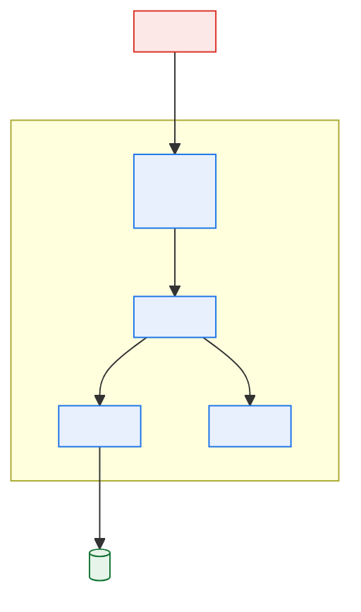

# \<Component or Feature Name\> — Low-Level Design

> **Purpose.** Implementation-grade detail: enough that a competent engineer who did not
> attend the design discussions can build it, and a reviewer can find a defect before it is
> written.
>
> **Boundary with the HLD.** The HLD says *what* and *why*; the LLD says *how*. If you are
> arguing about the approach here, the HLD is not finished.
>
> **Boundary with the code.** Do not restate what the code will say clearly. Document the
> things code cannot express: why an algorithm was chosen, what invariants must hold, what
> happens at the boundaries, and what the failure semantics are.

---

## Contents

| Section | Summary |
| --- | --- |
| [1. Scope](#1-scope) | Components, repository paths, parent HLD, boundaries |
| [2. Module structure](#2-module-structure) | Modules, responsibilities, and dependencies |
| [3. Interfaces (internal)](#3-interfaces-internal) | Internal operations: signatures, synchrony, pre- and post-conditions |
| [4. Data design](#4-data-design) | Schema changes in DDL, backfill requirements, index impact |
| [5. Algorithms and logic](#5-algorithms-and-logic) | Algorithms, decision logic, complexity, worked edge cases |
| [6. Error handling](#6-error-handling) | Error classes, detection, handling, logging, what the caller sees |
| [7. Configuration](#7-configuration) | Configuration keys with ranges and hot-reload behaviour; secret references |
| [8. Observability](#8-observability) | Metrics, log events, traces, and alert thresholds |
| [9. Performance](#9-performance) | Per-operation volume, percentile targets, resource profile, load-test plan |
| [10. Security](#10-security) | Authentication, authorisation enforcement points, input handling |
| [11. Testing](#11-testing) | Test levels, cases, coverage targets |
| [12. Rollout](#12-rollout) | Feature flags, phased rollout, backout |
| [Change log](#change-log) | Version, date, author, change |

---

## 1. Scope

| | |
| --- | --- |
| Component(s) | |
| Repository / path | |
| Parent HLD | |
| Requirements covered | |

---

## 2. Module structure



| Module | Responsibility | Depends on | Notes |
| --- | --- | --- | --- |
| | | | |

---

## 3. Interfaces (internal)

### 3.1 \<Operation name\>

| | |
| --- | --- |
| Signature | |
| Synchronous? | |
| Idempotent? | |
| Transactional boundary | |
| Timeout | |

**Inputs**

| Parameter | Type | Required | Constraints | Notes |
| --- | --- | --- | --- | --- |
| | | | | |

**Outputs**

| Field | Type | Notes |
| --- | --- | --- |
| | | |

**Errors**

| Condition | Error | Caller action | Retryable |
| --- | --- | --- | --- |
| | | | |

**Preconditions / postconditions / invariants**

| Kind | Statement |
| --- | --- |
| Precondition | |
| Postcondition | |
| Invariant | |

> Invariants are the highest-value lines in an LLD and the most often omitted. "The sum of
> allocated quantities never exceeds the ordered quantity" is a statement a reviewer can
> check the design against and a tester can assert.

---

## 4. Data design

### 4.1 Schema changes

```sql
-- New/altered objects, exactly as they will be applied.
```

| Table | Change | Nullable | Default | Backfill required | Index impact |
| --- | --- | --- | --- | --- | --- |
| | Add/Alter/Drop column, Add table, Add index | | | | |

**Migration**

| Step | Action | Duration estimate | Locking | Reversible | Rollback |
| --- | --- | --- | --- | --- | --- |
| 1 | | | | | |

> State locking behaviour for every DDL statement against a large legacy table. An `ALTER
> TABLE` that takes an exclusive lock on a 400M-row table during a batch window is an
> outage, and it is entirely predictable at design time.

### 4.2 Access patterns

| Pattern | Frequency | Expected rows | Index used | Est. cost |
| --- | --- | --- | --- | --- |
| | | | | |

### 4.3 Transactions and concurrency

| Aspect | Design |
| --- | --- |
| Transaction boundaries | |
| Isolation level | |
| Locking strategy | |
| Optimistic vs. pessimistic | |
| Deadlock avoidance (lock ordering) | |
| Expected contention points | |

---

## 5. Algorithms and logic

### 5.1 \<Algorithm name\>

**Purpose:**

**Approach:**

```
<Pseudocode — precise about ordering, rounding, tie-breaking, and boundary conditions.>
```

| Aspect | Detail |
| --- | --- |
| Complexity | |
| Rounding / precision rules | *(for monetary or quantity calculations — state the rule and the unit of rounding)* |
| Tie-breaking | |
| Boundary conditions | |
| Determinism | *(same input ⇒ same output? if not, why not)* |

**Worked example**

| Input | Intermediate | Output |
| --- | --- | --- |
| | | |

> Include at least one worked example for any calculation with financial effect. It is the
> cheapest possible defence against a rounding defect and the best possible test fixture.

---

## 6. Error handling

| Error class | Detection | Handling | Logged as | Alert | User/caller sees |
| --- | --- | --- | --- | --- | --- |
| Validation | | | | | |
| Business rule rejection | | | | | |
| Transient dependency failure | | | | | |
| Permanent dependency failure | | | | | |
| Data integrity violation | | | | | |
| Unexpected | | | | | |

**Retry policy**

| Dependency | Retryable errors | Attempts | Backoff | Total budget | Terminal action |
| --- | --- | --- | --- | --- | --- |
| | | | | | |

**Partial failure semantics**

> What is the state of the world if this fails halfway through? If the answer is "depends",
> that is a design defect, not a documentation gap.

| Failure point | State left behind | Recovery |
| --- | --- | --- |
| | | |

---

## 7. Configuration

| Key | Type | Default | Range | Environment-specific | Hot-reloadable | Effect of change |
| --- | --- | --- | --- | --- | --- | --- |
| | | | | | | |

**Secrets referenced** *(names and store only — never values)*

| Secret | Store | Rotation |
| --- | --- | --- |
| | | |

---

## 8. Observability

| Signal | Type | Name | Labels/dimensions | Purpose | Alert threshold |
| --- | --- | --- | --- | --- | --- |
| | Metric / Log / Trace / Event | | | | |

**Log events**

| Event | Level | Fields | Contains sensitive data? |
| --- | --- | --- | --- |
| | | | |

---

## 9. Performance

| Operation | Expected volume | Target | Design basis | Load-test plan |
| --- | --- | --- | --- | --- |
| | | *(p50 / p95 / p99)* | | |

**Resource profile**

| Resource | Expected | Peak | Limit |
| --- | --- | --- | --- |
| | | | |

---

## 10. Security

| Aspect | Design |
| --- | --- |
| Authentication | |
| Authorisation checks | *(where enforced, and what happens on failure)* |
| Input validation | |
| Output encoding | |
| Sensitive data handling | |
| Audit events emitted | |

---

## 11. Testing

| Level | Cases | Coverage target | Notes |
| --- | --- | --- | --- |
| Unit | | | |
| Integration | | | |
| Contract | | | |
| Performance | | | |

**Test data requirements**

| Scenario | Data needed | Source | PII treatment |
| --- | --- | --- | --- |
| | | | |

**Edge cases to cover explicitly**

| Case | Expected behaviour |
| --- | --- |
| Empty input | |
| Maximum size input | |
| Duplicate submission | |
| Concurrent modification | |
| Dependency timeout | |
| Boundary values (zero, negative, max precision) | |

---

## 12. Rollout

| Aspect | Approach |
| --- | --- |
| Feature flag | |
| Phased rollout | |
| Backwards compatibility window | |
| Rollback procedure | |
| Data written during rollout — safe to roll back? | |

---

## Change log

| Version | Date | Author | Change |
| --- | --- | --- | --- |
| 0.1.0 | | | Initial draft |
