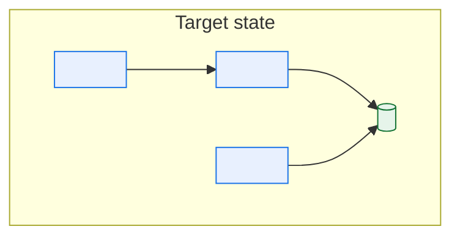
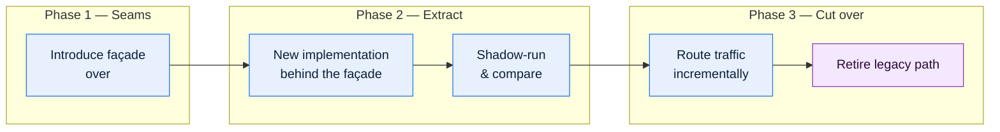

# \<System Name\> — Modernization Roadmap

> **Purpose.** The target state and the sequenced path to it. Kept separate from the TAD on
> purpose: the TAD describes what *is*, this describes what is *intended*. Merging them
> produces a document readers act on and are wrong.

---

## 1. Case for change

| Driver | Evidence | Business impact | Urgency |
| --- | --- | --- | --- |
| | *(incident counts, cycle times, cost figures, EOL dates, attrition of skills)* | | |

**Cost of inaction**

| Horizon | Consequence | Estimated cost |
| --- | --- | --- |
| 12 months | | |
| 3 years | | |
| 5 years | | |

**Non-drivers** *(reasons that are not sufficient on their own — state them to keep the
conversation honest)*

| Non-driver | Why it is not sufficient |
| --- | --- |
| The technology is old | Age alone is not a business problem; name the consequence |
| Engineers dislike working on it | Real, but frame as attrition and hiring cost with evidence |
| A newer pattern exists | |

---

## 2. Target architecture



**Target-state principles**

| Principle | Rationale | Implication |
| --- | --- | --- |
| | | |

**What deliberately stays as it is**

| Component | Why retained | Review trigger |
| --- | --- | --- |
| | | |

> This table matters as much as the target diagram. "We are keeping the mainframe order
> decoder for now, and here is what would change our minds" is a decision; silence about it
> is a vacuum that gets filled by whoever argues loudest.

---

## 3. Gap analysis

| Capability | Current | Target | Gap | Effort | Business value | Priority |
| --- | --- | --- | --- | --- | --- | --- |
| | | | | | | |

---

## 4. Approach

| Approach | Definition | Use when | Where applied here |
| --- | --- | --- | --- |
| **Retain** | Leave as is | Stable, low change, acceptable cost | |
| **Rehost** | Move platform, no code change | Infrastructure EOL, no functional issue | |
| **Replatform** | Minor changes to fit a new platform | Moderate benefit, low risk appetite | |
| **Refactor** | Restructure internally, same behaviour | Change is too slow or too risky | |
| **Rearchitect** | Significant structural change | Fundamental constraint must be removed | |
| **Rebuild** | New implementation, same capability | Existing implementation is beyond repair | |
| **Replace** | Package or SaaS | Capability is non-differentiating | |
| **Retire** | Remove | No longer needed | |

### Decomposition strategy



**Seams identified**

> A seam is a place where behaviour can be intercepted without editing the surrounding code.
> Seams determine what is extractable and in what order — without them, every slice is a
> rewrite.

| Seam | Type | Enables extraction of | Cost to create | Risk |
| --- | --- | --- | --- | --- |
| | API / Event / Table / File / Scheduler / Config | | | |

**Shadow-run comparison** is the control that makes incremental extraction safe: run both
implementations, compare outputs on real traffic, and cut over only when divergence is zero
or explained. Budget for it explicitly — it is typically 20–30% of a slice's effort and it
is the first thing cut under schedule pressure, to everyone's later regret.

---

## 5. Roadmap

```mermaid
gantt
    dateFormat YYYY-MM
    title Modernization phases
    section Foundations
    Observability &amp; test harness  :f1, <YYYY-MM>, 6M
    Seam creation                     :f2, after f1, 4M
    section Slice 1
    <Capability> extraction           :s1, after f2, 8M
    Shadow run &amp; cutover           :s2, after s1, 3M
    section Slice 2
    <Capability> extraction           :s3, after s2, 8M
    section Retire
    Legacy path decommission          :r1, after s3, 3M
```

| Phase | Scope | Duration | Dependencies | Exit criteria | Value delivered | Reversible |
| --- | --- | --- | --- | --- | --- | --- |
| | | | | | | |

> **Sequencing rule:** invest in observability, test coverage, and reconciliation **before**
> the first extraction. Without a way to prove the new implementation matches the old, every
> cutover is an act of faith, and the first bad one stops the programme.

---

## 6. Slice definition

> One block per slice. A slice must deliver standalone value — a programme whose value
> arrives only at the end will be cancelled before it gets there.

### Slice \<N\> — \<name\>

| | |
| --- | --- |
| Capability extracted | |
| Approach | |
| Seam used | |
| Duration | |
| Team | |
| Standalone value | |
| Rollback approach | |
| Coexistence period | |
| Data ownership during coexistence | |
| Reconciliation during coexistence | |
| Exit criteria | |

**Coexistence risks**

| Risk | Mitigation |
| --- | --- |
| Dual writes diverge | |
| Reference data drifts between implementations | |
| Reporting spans both, double-counting | |
| Rules changed in one and not the other | |

> The last row is the one that bites. During an 18-month coexistence, the business will
> request rule changes, and every change must be made twice. Budget for it, and set a
> deliberate rule-freeze policy or an explicit dual-implementation cost.

---

## 7. Data migration strategy

| Aspect | Approach |
| --- | --- |
| Migration pattern | Big bang / Phased / Trickle / Dual-run |
| Historical data | Migrate all / Migrate N years / Archive / Leave in place |
| Data quality remediation | Before / During / After |
| Reconciliation approach | |
| Cutover window | |
| Rollback approach | |
| Archive access after retirement | |

> **Historical data is where migrations overrun.** Thirty years of orders decoded with
> superseded reference data may not be re-decodable under current rules. Decide early whether
> history is migrated, transformed, or left accessible in place — and if the answer is "left
> in place", the legacy system is not fully retired and the business case must say so.

---

## 8. Risks

| ID | Risk | Likelihood | Impact | Mitigation | Owner | Trigger |
| --- | --- | --- | --- | --- | --- | --- |
| | | | | | | |

**Programme-level risks to address explicitly**

| Risk | Why it recurs in this class of programme |
| --- | --- |
| Behaviour not in any specification is discovered late | Legacy behaviour lives in code and in exception handling, not in documents |
| Key-person dependency on the legacy side | The people who understand it are also the people needed to build the replacement |
| Business change continues during the programme | An 18-month freeze is never granted; plan for parallel change |
| Value arrives only at the end | Slice so that each delivers on its own |
| The old system cannot be switched off | Long-tail consumers, archives, and regulatory access |

---

## 9. Success measures

| Measure | Baseline | Target | Measurement | Review |
| --- | --- | --- | --- | --- |
| Change lead time | | | | |
| Incident frequency | | | | |
| Run cost | | | | |
| Batch window utilisation | | | | |
| Onboarding time for a new engineer | | | | |
| Capability maturity score | | | | |
| % of traffic on the new path | | | | |

---

## 10. Decision log

| Decision | Date | Rationale | ADR |
| --- | --- | --- | --- |
| | | | |

---

## Change log

| Version | Date | Author | Change |
| --- | --- | --- | --- |
| 0.1.0 | | | Initial draft |
