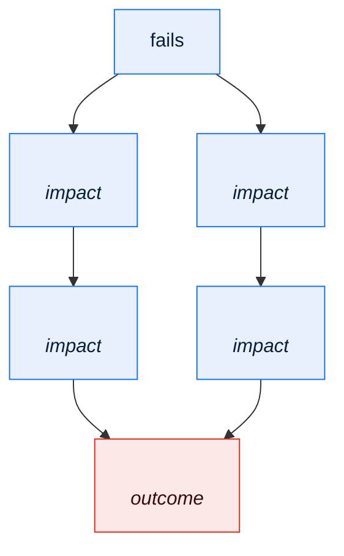

# \<System Name\> — Resilience and Failure Mode Analysis

> **Purpose.** Enumerate how this system fails, how quickly anyone finds out, and what
> happens next. An FMEA adapted for data-intensive batch and integration platforms, where
> the dangerous failures are rarely crashes — they are silent wrong answers.

---

## Contents

| Section | Summary |
| --- | --- |
| [1. Method](#1-method) | FMEA scoring: severity, occurrence, detection, and RPN |
| [2. Failure mode register](#2-failure-mode-register) | One row per failure mode with cause, effect, scores, mitigation, owner |
| [3. Failure categories to cover](#3-failure-categories-to-cover) | Availability, data, processing, capacity, and dependency categories to work through |
| [4. Silent failure analysis](#4-silent-failure-analysis) | Ways the system produces a wrong answer without erroring, and time to notice |
| [5. Blast radius](#5-blast-radius) | Impact propagation, business processes stopped, external parties affected |
| [6. Single points of failure](#6-single-points-of-failure) | Component, data, vendor, knowledge, and person SPOFs, with acceptance |
| [7. Resilience patterns in use](#7-resilience-patterns-in-use) | Retry, circuit breaker, bulkhead, fallback — where used and whether tested |
| [8. Degraded modes](#8-degraded-modes) | Degraded modes, entry and exit decisions, and backlog recovery capability |
| [9. Detection and alerting coverage](#9-detection-and-alerting-coverage) | Alert coverage per failure mode, with detection time and gaps |
| [10. Failure injection and testing](#10-failure-injection-and-testing) | Failure injection tests, results, and untested assumptions |
| [11. Incident history](#11-incident-history) | Real incidents mapped to failure modes, with detection time and root cause |
| [12. Improvement backlog](#12-improvement-backlog) | Improvements with RPN reduction, effort, priority, owner, target |
| [Change log](#change-log) | Version, date, author, change |

---

## 1. Method

Each failure mode is scored:

| Factor | Scale | Meaning |
| --- | --- | --- |
| **Severity (S)** | 1–5 | Business impact if it occurs |
| **Occurrence (O)** | 1–5 | How often, based on incident history |
| **Detection (D)** | 1–5 | **5 = we would not detect it**, 1 = detected automatically within minutes |

**Risk Priority Number = S × O × D.** Address anything ≥ 40, and anything with D ≥ 4
regardless of RPN.

> The detection factor is what makes this analysis worth doing for a data platform. A
> moderate-severity failure that goes undetected for a month is worse than a severe one that
> pages someone in ninety seconds, because by the time it surfaces it has propagated into
> invoices, reports, and partner systems.

### Severity scale

| S | Business impact |
| --- | --- |
| 5 | Financial loss or regulatory breach; customer-visible incorrect data at scale |
| 4 | Material business process stopped; SLA breach with a partner |
| 3 | Degraded service; manual workaround available |
| 2 | Internal inconvenience; no external effect |
| 1 | Negligible |

---

## 2. Failure mode register

| ID | Component | Failure mode | Cause | Local effect | Business effect | S | O | D | RPN | Detection | Mitigation | Owner |
| --- | --- | --- | --- | --- | --- | --- | --- | --- | --- | --- | --- | --- |
| FM-01 | | | | | | | | | | | | |

---

## 3. Failure categories to cover

> Work through every category. Omission is the usual failure of an FMEA, not
> mis-scoring.

### 3.1 Availability failures

| Failure | Covered by |
| --- | --- |
| Component crash / process death | FM- |
| Infrastructure loss (node, site) | FM- |
| Database unavailable | FM- |
| Network partition | FM- |
| Scheduler unavailable | FM- |
| Upstream dependency unavailable | FM- |
| Downstream consumer unavailable | FM- |
| External partner unavailable | FM- |

### 3.2 Data failures — the silent ones

| Failure | Covered by |
| --- | --- |
| Duplicate inbound delivery | FM- |
| Missing inbound delivery (nothing arrives) | FM- |
| Partial inbound delivery (truncated file) | FM- |
| Malformed payload | FM- |
| Semantically valid but wrong data | FM- |
| Late arrival past cutoff | FM- |
| Out-of-order delivery | FM- |
| Reference data missing or stale | FM- |
| Reference data changed without notice | FM- |
| Silent record loss in a transformation | FM- |
| Precision or rounding loss | FM- |
| Character encoding corruption | FM- |
| Timezone or DST misinterpretation | FM- |
| Truncation on a fixed-width boundary | FM- |

### 3.3 Processing failures

| Failure | Covered by |
| --- | --- |
| Job abend mid-run | FM- |
| Job runs twice | FM- |
| Job does not run at all | FM- |
| Batch window overrun | FM- |
| Deadlock or lock timeout | FM- |
| Resource exhaustion (disk, memory, connections) | FM- |
| Poison message blocking a queue | FM- |
| Infinite retry loop | FM- |
| Cascading failure through dependent jobs | FM- |

### 3.4 Capacity and performance failures

| Failure | Covered by |
| --- | --- |
| Volume spike beyond design | FM- |
| Gradual growth crossing a threshold | FM- |
| Queue depth exceeding retention | FM- |
| Storage exhaustion | FM- |

---

## 4. Silent failure analysis

> The most valuable section in this document. For each way the system can produce a wrong
> answer without raising an error, state how long it would take to notice today.

| Silent failure | How it happens | Currently detected by | Time to detect | Consequence in that time | Proposed control |
| --- | --- | --- | --- | --- | --- |
| Records dropped in a transformation | | | | | |
| An interface stops delivering | | | | | |
| A derived field calculates incorrectly | | | | | |
| Reference data drifts from its source | | | | | |
| A filter excludes more than intended | | | | | |
| A join silently multiplies rows | | | | | |
| Rounding accumulates in a financial total | | | | | |

> "Time to detect" of "when a partner complains" or "at month-end close" is a finding. Write
> it down in those words — it makes the argument for the control more effectively than any
> risk score.

---

## 5. Blast radius

| Component | Direct impact | Indirect impact | Business processes stopped | External parties affected | Degraded-mode options |
| --- | --- | --- | --- | --- | --- |
| | | | | | |

---

## 6. Single points of failure

| SPOF | Type | Why single | Failure impact | Mitigation | Cost to remove | Accepted by | Review |
| --- | --- | --- | --- | --- | --- | --- | --- |
| | Component / Data / Knowledge / Vendor / Person | | | | | | |

> Include **knowledge** and **person** SPOFs. A batch chain that only one engineer can
> recover is as much a single point of failure as an unreplicated database, and it is
> usually cheaper to fix.

---

## 7. Resilience patterns in use

| Pattern | Where used | Configuration | Tested | Gaps |
| --- | --- | --- | --- | --- |
| Retry with backoff | | | | |
| Circuit breaker | | | | |
| Timeout | | | | |
| Bulkhead / resource isolation | | | | |
| Dead-letter queue | | | | |
| Idempotency key | | | | |
| Checkpoint/restart | | | | |
| Graceful degradation | | | | |
| Fallback to cached/last-known-good | | | | |
| Reconciliation and repair | | | | |
| Manual override | | | | |

**Retry configuration**

| Dependency | Retryable conditions | Attempts | Backoff | Jitter | Total budget | Terminal action |
| --- | --- | --- | --- | --- | --- | --- |
| | | | | | | |

> Check for **retry storms**: if three layers each retry three times, a single downstream
> failure becomes 27 requests. State the total budget end to end, not per layer.

---

## 8. Degraded modes

| Scenario | Degraded capability | What still works | What stops | Who decides to enter | Exit criteria | Backlog recovery |
| --- | --- | --- | --- | --- | --- | --- |
| | | | | | | |

**Backlog recovery** is the column people forget. When a partner is unavailable for six
hours, the work accumulates — and the question of whether the system can clear a 6-hour
backlog within the remaining window is answerable in advance.

---

## 9. Detection and alerting coverage

| Failure mode | Alert exists | Signal | Threshold | Time to detect | Route | Runbook | Gap |
| --- | --- | --- | --- | --- | --- | --- | --- |
| FM-01 | ✅/❌ | | | | | | |

**Coverage summary**

| | Count | % |
| --- | --- | --- |
| Failure modes with automated detection | | |
| Failure modes detected only by a human noticing | | |
| Failure modes with no known detection | | |

---

## 10. Failure injection and testing

| Test | Failure simulated | Environment | Frequency | Last run | Result |
| --- | --- | --- | --- | --- | --- |
| | | | | | |

**Untested assumptions**

| Assumption | Risk if wrong | Test to run | Owner |
| --- | --- | --- | --- |
| | | | |

---

## 11. Incident history

> Ground the analysis in what has actually happened. A failure mode with three incidents in
> twelve months is not a hypothetical.

| Incident | Date | Failure mode | Duration | Impact | Time to detect | Root cause | Action taken | FM ID |
| --- | --- | --- | --- | --- | --- | --- | --- | --- |
| | | | | | | | | |

**Patterns**

| Pattern | Occurrences | Systemic cause | Action |
| --- | --- | --- | --- |
| | | | |

---

## 12. Improvement backlog

| ID | Improvement | Addresses | RPN reduction | Effort | Priority | Owner | Target |
| --- | --- | --- | --- | --- | --- | --- | --- |
| | | FM- | → | | | | |

---

## Change log

| Version | Date | Author | Change |
| --- | --- | --- | --- |
| 0.1.0 | | | Initial draft |
