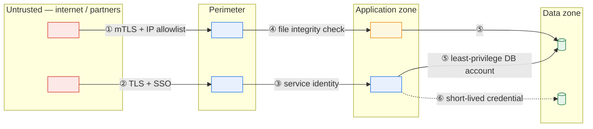

# \<System Name\> — Security and Privacy Architecture

> **Purpose.** Trust boundaries, controls, threat model, and data protection. Describes
> *what* controls exist and *where*; never how to defeat them, and never any secret value.
>
> **Classification.** Usually `confidential`. Control detail is itself sensitive. Never
> record credentials, keys, tokens, or exploit detail here — name the secret and its store.

---

## 1. Security posture

| | |
| --- | --- |
| Data classification (highest handled) | |
| Regulatory scope | *(name the specific obligations)* |
| Last security assessment | |
| Last penetration test | |
| Open findings (critical / high / medium) | |
| Compensating controls in force | |

---

## 2. Trust boundaries

| # | Boundary | Crossing | Data classification | Controls | Gaps |
| --- | --- | --- | --- | --- | --- |
| ① | | | | | |

---

## 3. Identity and access

### 3.1 Identity types

| Identity type | Source | Authentication | Lifecycle | Count |
| --- | --- | --- | --- | --- |
| Internal user | | | | |
| External/partner user | | | | |
| Service account | | | | |
| Batch/scheduler account | | | | |
| Emergency/break-glass | | | | |

### 3.2 Authorisation model

| Aspect | Design |
| --- | --- |
| Model | RBAC / ABAC / ACL / hybrid |
| Where enforced | |
| Granularity | |
| Data-level restrictions | *(e.g. a dealer sees only their own orders — state how this is enforced and where it could be bypassed)* |
| Segregation of duties rules | |
| Privileged access process | |
| Access review cadence | |

**Roles**

| Role | Capabilities | Data access | Holders | SoD conflicts |
| --- | --- | --- | --- | --- |
| | | | | |

### 3.3 Service and batch credentials

| Account | Purpose | Privilege | Store | Rotation | Last rotated |
| --- | --- | --- | --- | --- | --- |
| | | | | | |

> Legacy platforms routinely run batch under a single highly-privileged account whose
> password has not changed in years. If that is true, record it as a finding in §8 with an
> owner rather than omitting it — an undocumented known weakness is worse than a documented
> one.

---

## 4. Data protection

| Data element | Classification | At rest | In transit | In use | Non-prod treatment | Retention |
| --- | --- | --- | --- | --- | --- | --- |
| | | | | | Masked / Synthetic / Real *(if real, justify)* | |

**Key management**

| Key | Purpose | Algorithm/strength | Store | Rotation | Owner |
| --- | --- | --- | --- | --- | --- |
| | | | | | |

**Certificates**

| Certificate | Purpose | Issuer | Expiry | Renewal process | Owner | Alerting |
| --- | --- | --- | --- | --- | --- | --- |
| | | | | | | |

> Certificate expiry is among the most common causes of partner-interface outages, and it is
> entirely preventable. Every row needs an owner and an expiry alert — not a calendar
> reminder in one person's inbox.

---

## 5. Privacy

| | |
| --- | --- |
| Personal data processed | |
| Lawful basis / justification | |
| Data subjects | |
| Cross-border transfers | |
| Processors / sub-processors | |
| Privacy assessment status | |

**Personal data inventory**

| Element | Category | Purpose | Source | Retention | Subject rights supported | Location |
| --- | --- | --- | --- | --- | --- | --- |
| | | | | | Access / Erasure / Portability / Rectification | |

**Subject rights**

| Right | Supported | Process | SLA | Systems involved | Gaps |
| --- | --- | --- | --- | --- | --- |
| | | | | | |

> In a disaggregated platform, erasure is usually the hardest right to satisfy because
> personal data has propagated to extracts, archives, backups, and partner systems. Be
> honest about the gaps — the lineage documents are what let you close them.

---

## 6. Threat model

> Threats to this system specifically, not a generic list. Use STRIDE or attack trees.

| ID | Threat | STRIDE | Asset | Vector | Likelihood | Impact | Controls | Residual |
| --- | --- | --- | --- | --- | --- | --- | --- | --- |
| T-01 | | | | | | | | |

**Priority threats for this system class**

| Threat | Relevance |
| --- | --- |
| Compromised partner credentials used to inject transactions | |
| Insider modification of reference data to alter pricing or eligibility | |
| Interception or tampering of file transfers | |
| Privilege escalation via a shared batch account | |
| Data exfiltration through a reporting extract | |
| Repudiation of a submitted order or shipment confirmation | |
| Denial of service against a partner-facing endpoint | |

> The second row is the one legacy order-to-cash platforms under-control. Reference data
> changes behaviour system-wide, is often editable outside change control, and is frequently
> not audited. Check it explicitly.

---

## 7. Controls

| Control | Type | Implementation | Coverage | Tested | Owner |
| --- | --- | --- | --- | --- | --- |
| | Preventive / Detective / Corrective | | | | |

**Audit logging**

| Event class | Logged | Fields | Retention | Tamper-evident | Reviewed |
| --- | --- | --- | --- | --- | --- |
| Authentication | | | | | |
| Authorisation failure | | | | | |
| Privileged action | | | | | |
| Data modification (transactional) | | | | | |
| Reference data change | | | | | |
| Data export/extract | | | | | |
| Configuration change | | | | | |

---

## 8. Findings and debt

| ID | Finding | Severity | Discovered | Risk | Compensating control | Remediation | Owner | Target |
| --- | --- | --- | --- | --- | --- | --- | --- | --- |
| | | | | | | | | |

**Accepted risks**

| Risk | Rationale | Accepted by | Review date |
| --- | --- | --- | --- |
| | | | |

---

## 9. Incident response

| Scenario | Detection | Immediate action | Notification | Owner |
| --- | --- | --- | --- | --- |
| Credential compromise | | | | |
| Data breach | | | | |
| Partner account misuse | | | | |
| Malicious insider activity | | | | |
| Ransomware | | | | |

**Notification obligations**

| Trigger | Notify | Deadline | Owner |
| --- | --- | --- | --- |
| | | | |

---

## Change log

| Version | Date | Author | Change |
| --- | --- | --- | --- |
| 0.1.0 | | | Initial draft |
