# \<System or Subsystem Name\> — Technical Architecture Document

> **Purpose.** The anchor architecture artefact. It describes the system **as it is**, not as
> anyone wishes it were. Target state belongs in the
> [Modernization Roadmap](modernization-roadmap.md); mixing the two produces a document that
> readers act on and are wrong.
>
> **Scope guidance.** One TAD per system, or per major subsystem in a large platform. A TAD
> covering three unrelated domains satisfies nobody. Split by bounded context, and use a
> system-level TAD to cover only what is genuinely shared.
>
> **Confidence.** For a legacy system, tag assertions `✅ Verified` / `🟡 Inferred` /
> `🔴 Assumed` per [documentation standards §3](../../guides/01-documentation-standards.md#3-confidence-levels).
> A TAD without confidence tags is making claims it cannot support.

---

## Contents

1. [Scope and audience](#1-scope-and-audience)
2. [Architectural drivers](#2-architectural-drivers)
3. [Architecture principles and constraints](#3-architecture-principles-and-constraints)
4. [Context — C4 Level 1](#4-context--c4-level-1)
5. [Container view — C4 Level 2](#5-container-view--c4-level-2)
6. [Component views — C4 Level 3](#6-component-views--c4-level-3)
7. [Runtime views](#7-runtime-views)
8. [Data architecture](#8-data-architecture)
9. [Integration architecture](#9-integration-architecture)
10. [Batch and scheduling architecture](#10-batch-and-scheduling-architecture)
11. [Cross-cutting concerns](#11-cross-cutting-concerns)
12. [Non-functional requirements](#12-non-functional-requirements)
13. [Failure modes and resilience](#13-failure-modes-and-resilience)
14. [Deployment and environments](#14-deployment-and-environments)
15. [Security architecture](#15-security-architecture)
16. [Architecture decisions](#16-architecture-decisions)
17. [Technical debt and known weaknesses](#17-technical-debt-and-known-weaknesses)
18. [Evolution and open questions](#18-evolution-and-open-questions)

---

## 1. Scope and audience

### 1.1 In scope

| Element | Included because |
| --- | --- |
| | |

### 1.2 Out of scope

> Be explicit and generous here. The commonest TAD failure is a reader assuming coverage
> that was never intended. Name the neighbouring things and say where they are documented.

| Element | Why excluded | Documented in |
| --- | --- | --- |
| | | |

### 1.3 Audience and how to read

| Audience | Read | Skip |
| --- | --- | --- |
| Engineer joining the team | §4, §5, §6, §7, §17 | §2, §12 detail |
| Integration engineer | §4, §9, §13 | §6 |
| Data engineer / analyst | §8, §10, then the lineage documents | §6, §15 |
| SRE / on-call | §5, §10, §13, §14, then runbooks | §2, §3 |
| Reviewer / ARB | All, especially §2, §12, §16, §17 | — |

---

## 2. Architectural drivers

> Why the architecture is shaped the way it is. For a legacy system, most drivers are
> historical — record them anyway, because a driver nobody can name is a constraint nobody
> can safely remove.

### 2.1 Business drivers

| ID | Driver | Source | Architectural consequence | Still valid? |
| --- | --- | --- | --- | --- |
| BD-01 | | | | Yes / No — *if No, note it in §17* |

### 2.2 Technical drivers and historical constraints

| ID | Driver | Era | Consequence today | Reversible? |
| --- | --- | --- | --- | --- |
| TD-01 | *(e.g. mainframe MIPS cost drove batch-first design)* | | | |

### 2.3 Quality attribute priorities

> Ranked, because architecture is the discipline of choosing which qualities lose. An
> unranked list is not a decision.

| Rank | Attribute | Rationale | Trade-off accepted |
| --- | --- | --- | --- |
| 1 | | | |
| 2 | | | |
| 3 | | | |

---

## 3. Architecture principles and constraints

### 3.1 Principles

| ID | Principle | Rationale | Implication | Compliance |
| --- | --- | --- | --- | --- |
| P-01 | | | | Full / Partial / Breached — *breaches go to §17* |

### 3.2 Constraints

> Distinguish **hard** constraints (genuinely cannot change: regulation, vendor platform,
> physics) from **soft** ones (have not changed yet: budget, skills, appetite). Conflating
> them is how "we can't" becomes permanent.

| ID | Constraint | Type | Source | Impact | Challengeable? |
| --- | --- | --- | --- | --- | --- |
| C-01 | | Hard / Soft | | | |

---

## 4. Context — C4 Level 1

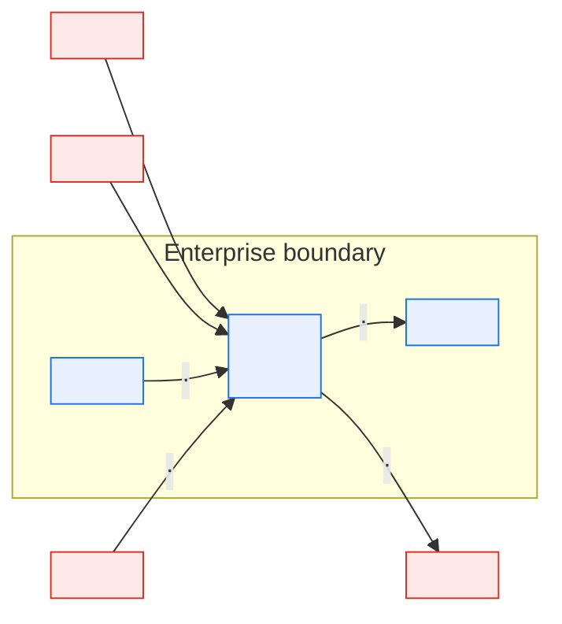

> **Caption:** *(what the reader should conclude)*

### 4.1 External entities

| Entity | Type | Relationship | Data exchanged | Interface ID | Criticality |
| --- | --- | --- | --- | --- | --- |
| | Person / Internal system / External party | Producer / Consumer / Both | | IF-NNN | |

> This table must reconcile with the [Interface Catalog](../03-interfaces/interface-catalog.md).
> A mismatch means one of the two is wrong, and it is usually this one.

---

## 5. Container view — C4 Level 2

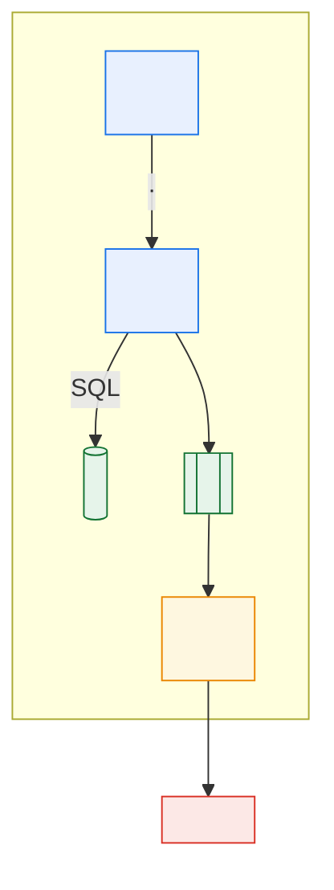

### 5.1 Container register

| ID | Container | Responsibility | Technology | Owning team | Criticality | Deployment unit | Spec |
| --- | --- | --- | --- | --- | --- | --- | --- |
| CT-01 | | | | | | | [CMP-…](component-specification.md) |

### 5.2 Container interactions

| From | To | Protocol | Payload | Sync/Async | Volume/day | Failure behaviour |
| --- | --- | --- | --- | --- | --- | --- |
| | | | | | | |

> **Failure behaviour** is the column reviewers should insist on. "What does the caller do
> when this is unavailable?" is unanswered in most architecture documents, and it is the
> question every incident asks.

---

## 6. Component views — C4 Level 3

> Only for containers with non-obvious internals — a decoding engine, a rules evaluator, a
> pricing calculator. For each container you skip, say why in one line: "CT-03 is a thin
> transport adapter; internal structure is not architecturally significant."

### 6.1 \<Container name\>

**Responsibility:** *(one sentence)*

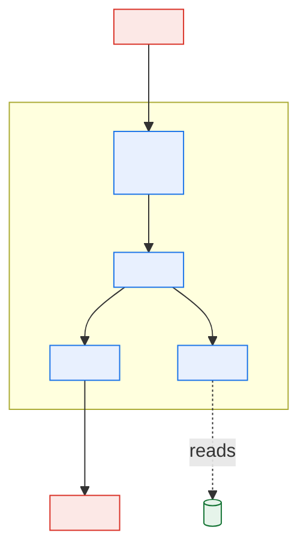

| Component | Responsibility | Implementation | Key rules implemented | Confidence |
| --- | --- | --- | --- | --- |
| | | *(module/program/class + path)* | BR-… | ✅/🟡/🔴 |

**Extension points / seams:** *(where behaviour can be intercepted without editing this
component — critical input to the modernization roadmap.)*

---

## 7. Runtime views

> Two or three scenarios that carry most of the system's behaviour. Include at least one
> failure scenario. Static structure does not tell a reader how the system behaves; these
> do.

### 7.1 \<Primary scenario — happy path\>

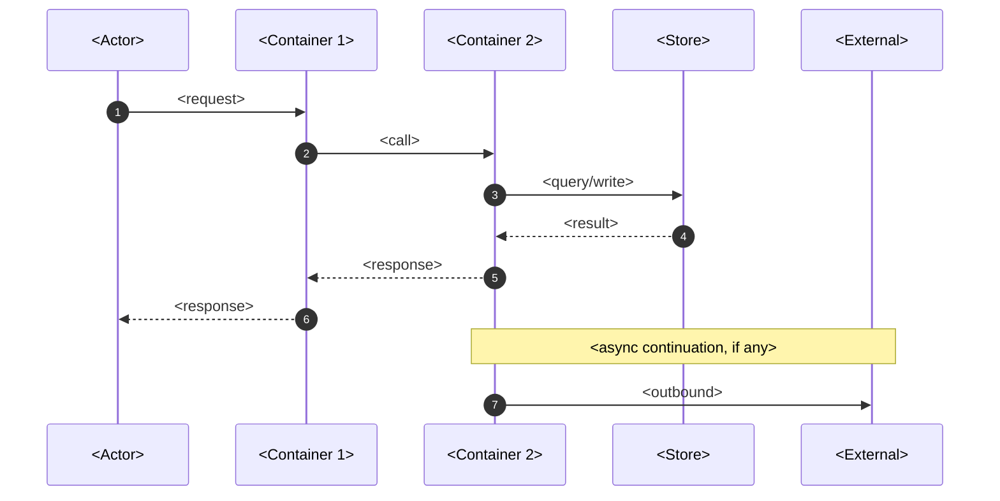

| Step | Action | Latency budget | Failure mode | Handling |
| --- | --- | --- | --- | --- |
| 1 | | | | |

### 7.2 \<Failure scenario\>

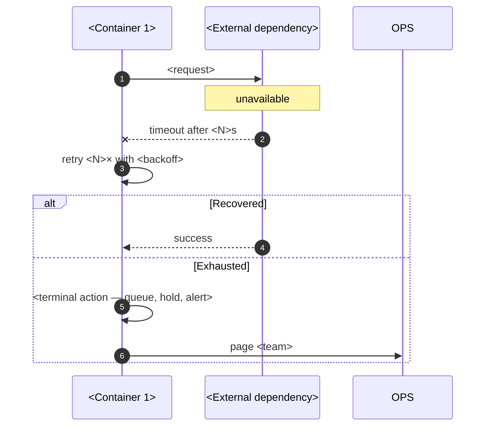

**Business consequence while degraded:** *(what stops, what queues, what silently produces
wrong answers. The third is the dangerous one — call it out.)*

---

## 8. Data architecture

> Structure and ownership here; meaning, lineage, and governance in Layer 2. Link, do not
> duplicate.

### 8.1 Data stores

| Store | Technology | Purpose | Owning domain | Size | Growth | Retention | Backup/RPO |
| --- | --- | --- | --- | --- | --- | --- | --- |
| | | | | | | | |

### 8.2 Core entities

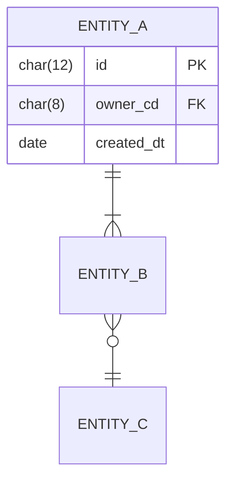

| Entity | Owning domain | Physical table(s) | Volume | Authoritative source | Consumers |
| --- | --- | --- | --- | --- | --- |
| | | | | | |

### 8.3 Data ownership across domains

> In a shared-schema legacy platform this is the section that prevents the most damage.

| Table / column | Owning domain | Writers | Readers | Cross-domain writes | Risk |
| --- | --- | --- | --- | --- | --- |
| | | | | Yes/No — *if Yes, justify or log as debt* | |

### 8.4 Reference data

| Code set | Volatility | Change process | Effective-dated? | Impact of change |
| --- | --- | --- | --- | --- |
| | | | Yes/No | |

> **Effective dating matters more than it looks.** Without it, reprocessing a historical
> order applies today's codes to yesterday's transaction, and historical reports stop being
> reproducible. If a code set is not effective-dated, that is a finding for §17.

### 8.5 Data flow overview

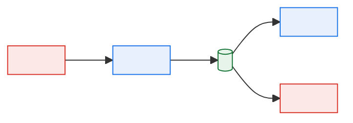

Field-level detail: [Data Lineage](../02-data/data-lineage-document.md).

---

## 9. Integration architecture

### 9.1 Integration patterns in use

| Pattern | Where used | Rationale | Constraints |
| --- | --- | --- | --- |
| Request/response | | | |
| File batch | | | |
| Message queue | | | |
| Shared database | | *(if this appears, it is usually debt — note it in §17)* | |
| ETL / replication | | | |

### 9.2 Interface summary

| IF ID | Name | Direction | Counterparty | Transport | Format | Frequency | Criticality | ICD |
| --- | --- | --- | --- | --- | --- | --- | --- | --- |
| IF-001 | | In/Out/Bi | | | | | | |

### 9.3 Integration topology

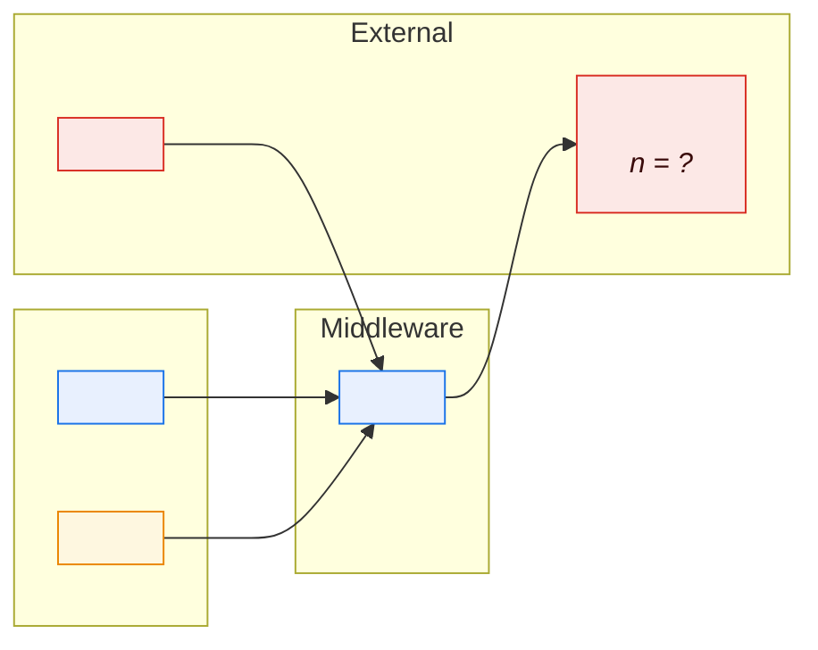

### 9.4 Coupling assessment

| Interface | Coupling type | Change propagation | Mitigation |
| --- | --- | --- | --- |
| | Schema / temporal / semantic / operational | *(what breaks downstream if this changes)* | |

---

## 10. Batch and scheduling architecture

> Mandatory for any system with scheduled processing. In a legacy platform the job graph
> encodes business sequencing that appears nowhere else. Full detail in
> [Batch & Scheduling Architecture](batch-and-scheduling-architecture.md); summarise here.

### 10.1 Processing windows

| Window | Start | End | Contents | Hard cutoff | Cutoff driver |
| --- | --- | --- | --- | --- | --- |
| | *(state the timezone and DST behaviour)* | | | | |

### 10.2 Critical path

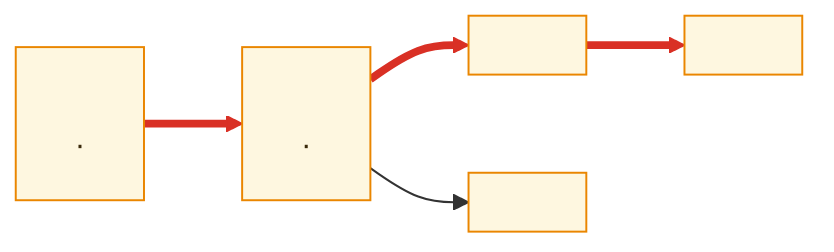

**Critical path total:** \<duration\> against a \<time\> cutoff — **\<slack\>** of slack.

### 10.3 Restart and recovery

| Job | Restartable? | Restart point | Idempotent? | Manual cleanup required | Consequence of double-run |
| --- | --- | --- | --- | --- | --- |
| | | | | | |

> The last column is not theoretical. In an order-to-cash system a double-run of an
> invoicing or payment job creates duplicate financial postings. State it per job, and state
> it before someone needs it at 02:00.

---

## 11. Cross-cutting concerns

| Concern | Approach | Implementation | Gaps |
| --- | --- | --- | --- |
| Authentication | | | |
| Authorisation | | | |
| Audit logging | | | |
| Error handling | | | |
| Configuration management | | | |
| Observability | | | |
| Internationalisation / localisation | | | |
| Time and timezone handling | | | |
| Idempotency / duplicate suppression | | | |
| Reference data caching and refresh | | | |

> **Time handling deserves a real answer.** Legacy platforms routinely mix server local
> time, UTC, and business-day calendars. State which is used where, and how daylight saving
> is handled in the batch schedule.

---

## 12. Non-functional requirements

> Summary only; full scenarios in [NFRs & Quality Attributes](nfr-and-quality-attributes.md).
> Every entry needs a number and a measurement method. "Fast", "highly available", and
> "scalable" are not requirements.

| ID | Attribute | Requirement | Current measured | Met? | Measurement method |
| --- | --- | --- | --- | --- | --- |
| NFR-PERF-01 | Latency | *(p99 ≤ N ms for operation X under load Y)* | | | |
| NFR-AVAIL-01 | Availability | *(N% during window W, excluding planned maintenance)* | | | |
| NFR-CAP-01 | Throughput | | | | |
| NFR-DATA-01 | Recovery | *(RPO ≤ N minutes, RTO ≤ N hours)* | | | |

---

## 13. Failure modes and resilience

> Summary; full analysis in [Resilience & Failure Mode Analysis](resilience-and-failure-mode-analysis.md).

| ID | Failure | Likelihood | Business impact | Detection | Time to detect | Response | Residual risk |
| --- | --- | --- | --- | --- | --- | --- | --- |
| FM-01 | Upstream source unavailable | | | | | | |
| FM-02 | Downstream consumer unavailable | | | | | | |
| FM-03 | Partial batch failure mid-chain | | | | | | |
| FM-04 | Duplicate inbound delivery | | | | | | |
| FM-05 | Silent data corruption | | | | | | |
| FM-06 | Capacity exhaustion at peak | | | | | | |
| FM-07 | External partner sends malformed data | | | | | | |
| FM-08 | Batch window overrun | | | | | | |

**Single points of failure:**

| SPOF | Why it is one | Blast radius | Mitigation | Accepted by |
| --- | --- | --- | --- | --- |
| | | | | |

---

## 14. Deployment and environments

> Summary; detail in [Deployment & Environments](deployment-and-environments.md).

| Environment | Purpose | Data | Parity with production | Refresh cadence |
| --- | --- | --- | --- | --- |
| | | | | |

**Deployment topology**

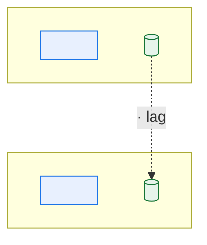

---

## 15. Security architecture

> Summary; detail in [Security & Privacy Architecture](security-and-privacy-architecture.md).

### 15.1 Trust boundaries

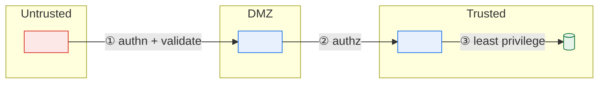

| # | Boundary | Controls | Data classification crossing | Gaps |
| --- | --- | --- | --- | --- |
| ① | | | | |

### 15.2 Sensitive data

| Data element | Classification | At rest | In transit | Masked in non-prod | Retention |
| --- | --- | --- | --- | --- | --- |
| | | | | | |

---

## 16. Architecture decisions

| ADR | Title | Status | Date | Still valid? |
| --- | --- | --- | --- | --- |
| ADR-0001 | | | | |

**Decisions with no ADR** *(reconstruct retrospectively where the rationale is still
load-bearing — see [documenting legacy systems §6](../../guides/06-documenting-legacy-systems.md#6-phase-4--structure-46-weeks))*:

| Decision | Era | Reconstructed rationale | Confidence | ADR to write? |
| --- | --- | --- | --- | --- |
| | | | 🟡/🔴 | |

---

## 17. Technical debt and known weaknesses

> The section that earns a TAD its credibility. A TAD with an empty debt register describing
> a 25-year-old platform is not believed, and should not be.

| ID | Debt | Category | Business impact | Incident history | Remediation | Effort | Owner | Priority |
| --- | --- | --- | --- | --- | --- | --- | --- | --- |
| TD-01 | | Architecture / Code / Data / Ops / Security / Knowledge | | *(incident IDs — evidence beats opinion)* | | | | |

**Knowledge debt** *(components with a single expert, or none)*:

| Component | People who understand it | Bus factor | Mitigation |
| --- | --- | --- | --- |
| | | | |

**Principle and constraint breaches:**

| Principle/constraint | How breached | Where | Accepted by | Review date |
| --- | --- | --- | --- | --- |
| | | | | |

---

## 18. Evolution and open questions

### 18.1 Known upcoming change

| Change | Driver | Timeframe | Architectural impact |
| --- | --- | --- | --- |
| | | | |

### 18.2 Open questions

| ID | Question | Why it matters | Owner | Target date |
| --- | --- | --- | --- | --- |
| Q-001 | | | | |

### 18.3 Assumptions to verify

| ID | Assumption | Verification method | Owner | Target date |
| --- | --- | --- | --- | --- |
| ASM-001 | | | | |

---

## Appendix A — Confidence summary

> Publish the honest state of knowledge. A falling `🔴` count over successive versions is
> the best evidence that the documentation effort is working.

| Section | ✅ Verified | 🟡 Inferred | 🔴 Assumed |
| --- | --- | --- | --- |
| | | | |

## Appendix B — References

| Reference | Location |
| --- | --- |
| | |

---

## Change log

| Version | Date | Author | Change | Approved by |
| --- | --- | --- | --- | --- |
| 0.1.0 | | | Initial draft | |
