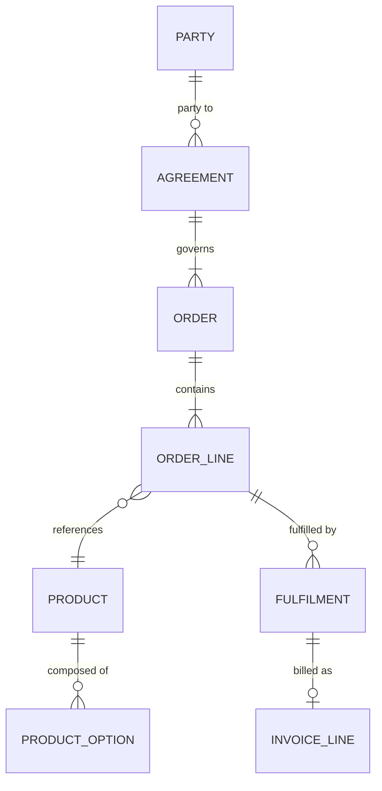

# \<Scope\> — Canonical Data Model

> **Purpose.** A shared conceptual and logical model that mediates between systems, each of
> which keeps its own physical model. In a disaggregated platform the canonical model is
> what stops N systems needing N² point-to-point mappings.
>
> **Honesty requirement.** Say which systems actually conform. A canonical model that exists
> only in a document, while integrations continue to map point to point, is worse than none:
> it creates a false belief that the mapping problem is solved.

---

## Contents

| Section | Summary |
| --- | --- |
| [1. Purpose and adoption](#1-purpose-and-adoption) | What the model is used for, and what it is explicitly not used for |
| [2. Conceptual model](#2-conceptual-model) | Concepts in business language, with owners and physical realisations |
| [3. Logical model](#3-logical-model) | Entity definitions, identity criteria, attributes, relationships |
| [4. Standard types](#4-standard-types) | Shared value types defined once — the usual source of mapping defects |
| [5. Code sets](#5-code-sets) | Code sets referenced, with authority and registry entry |
| [6. Mappings](#6-mappings) | Per-system field mappings, with lossy transformations flagged |
| [7. Model governance](#7-model-governance) | Change process, versioning, compatibility, conformance checking |
| [8. Known limitations](#8-known-limitations) | Where the model does not fit, with impact and workaround |
| [Change log](#change-log) | Version, date, author, change |

---

## 1. Purpose and adoption

| | |
| --- | --- |
| Scope | |
| Used for | *(integration payloads / warehouse model / API contracts / MDM)* |
| Not used for | |
| Adoption status | Aspirational / Partial / Enforced for new / Fully adopted |
| Systems conforming | |
| Systems not conforming | |

**Adoption by interface**

| Interface | Conforms | Mapping maintained | Notes |
| --- | --- | --- | --- |
| | ✅/⚠️/❌ | | |

---

## 2. Conceptual model

| Concept | Definition | Business owner | Physical realisations |
| --- | --- | --- | --- |
| | | | |

> Concepts are named in business language, taken from the
> [Glossary](../00-foundations/glossary-and-taxonomy.md). Where the glossary shows a term is
> contested between domains, the canonical model must pick one meaning and name the others
> as mappings — not silently adopt one domain's usage.

---

## 3. Logical model

### 3.1 `<ENTITY>`

| | |
| --- | --- |
| Definition | |
| Identity | *(what makes two instances the same thing)* |
| Lifecycle | |
| Owning domain | |

| Attribute | Type | Required | Cardinality | Definition | Code set | Notes |
| --- | --- | --- | --- | --- | --- | --- |
| | | | 1 / 0..1 / 1..* / 0..* | | | |

**Identity and matching**

| Aspect | Rule |
| --- | --- |
| Canonical identifier | |
| Alternate identifiers accepted | |
| Matching rule across systems | |
| Identifier lifetime / reuse | *(is an identifier ever reused? If yes, history is ambiguous — say so)* |

---

## 4. Standard types

> Shared value types, defined once. Half the mapping defects in a distributed platform come
> from these being handled differently in each system.

| Type | Definition | Format | Example | Notes |
| --- | --- | --- | --- | --- |
| `Money` | Amount with currency | `{amount: decimal(15,4), currency: ISO-4217}` | `{1250.0000, "USD"}` | Never a bare number; never a float |
| `Quantity` | Amount with unit | `{value: decimal(15,4), uom: <code set>}` | | |
| `Date` | Calendar date, no time | ISO-8601 `YYYY-MM-DD` | `2026-09-12` | |
| `Timestamp` | Instant | ISO-8601 with offset | `2026-09-12T02:30:00Z` | Always with offset |
| `Period` | Inclusive-exclusive range | `{from, to}` | | State the convention and hold to it |
| `Code` | Value from a registered set | `{codeSet, value, effectiveDate}` | | |
| `Identifier` | Scoped identifier | `{scheme, value}` | | |
| `Address` | | | | |
| `PartyRef` | | | | |

**Conventions**

| Aspect | Rule |
| --- | --- |
| Monetary precision | |
| Rounding | |
| Quantity precision | |
| Date range convention | Inclusive-inclusive / inclusive-exclusive — *pick one, state it, never mix* |
| Timezone | |
| Null vs. absent vs. empty | *(three distinct states — define each)* |
| Character encoding | |
| Identifier case sensitivity | |

---

## 5. Code sets

| Code set | Definition | Values | Authority | Registry |
| --- | --- | --- | --- | --- |
| | | | | |

---

## 6. Mappings

### 6.1 `<System>` → canonical

| Canonical | Source field | Transformation | Lossy | Notes |
| --- | --- | --- | --- | --- |
| | | | Yes/No | |

**Unmappable elements**

| Direction | Element | Problem | Handling |
| --- | --- | --- | --- |
| | | *(no equivalent / different grain / different semantics / precision loss)* | |

> Record every lossy and unmappable case. These are permanent limitations of the
> integration, and they will be rediscovered as defects if they are not written down.

**Semantic mismatches** ⚠️

| Canonical | Source | Mismatch | Resolution |
| --- | --- | --- | --- |
| | | *(same name, different meaning — the most dangerous category, because it passes every schema check)* | |

---

## 7. Model governance

| Aspect | Approach |
| --- | --- |
| Change process | |
| Versioning | |
| Backwards compatibility | |
| Deprecation notice period | |
| Approval | |
| Conformance testing | |

**Extension rules**

| Situation | Rule |
| --- | --- |
| A system needs a field the model lacks | |
| A system uses a subset | |
| A system needs different cardinality | |
| A domain-specific extension is needed | |

---

## 8. Known limitations

| Limitation | Impact | Workaround | Remediation |
| --- | --- | --- | --- |
| | | | |

---

## Change log

| Version | Date | Author | Change |
| --- | --- | --- | --- |
| 0.1.0 | | | Initial draft |
