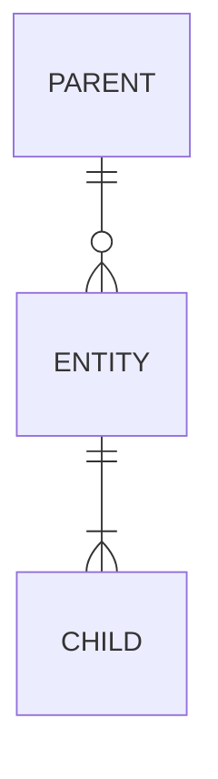

# \<Domain or Entity\> — Data Dictionary

> **Purpose.** Attribute-level definitions: what each field means, what values it may hold,
> who owns it, and where it comes from.
>
> **Scope discipline.** Do not attempt to document every column in a legacy schema. Cover
> Critical Data Elements first, then fields that appear in an external interface, feed a
> financial or regulatory report, are derived, or appear in a metric definition. In a
> 1,400-table platform, that is typically 150–400 fields and it answers the large majority
> of questions anyone will ever ask.
>
> **This is not a schema dump.** A generated column listing has no meaning in it. Document
> semantics, not types — the types are already in the catalog.

---

## 1. Scope

| | |
| --- | --- |
| Entities covered | |
| Physical objects | |
| Fields documented / total fields | |
| Selection basis | |
| Excluded | *(and why)* |

---

## 2. Entity: `<ENTITY_NAME>`

| | |
| --- | --- |
| Business name | |
| Physical object(s) | |
| Description | |
| Grain | *(what one row represents — state it precisely)* |
| Primary key | |
| Natural/business key | |
| Owning domain | |
| Data Owner | |
| Data Steward | |
| Authoritative source | |
| Row count (current) | |
| Growth rate | |
| Retention | |
| Classification | |

**Relationships**

| Related entity | Cardinality | Key | Enforced by | Orphans exist? |
| --- | --- | --- | --- | --- |
| | | | FK constraint / Application / Nothing | |

> "Enforced by: Nothing" is common in legacy schemas and important to record — it tells a
> consumer that referential integrity must be defended in their own query.

---

### 2.1 Attributes

| ID | Field | Business name | Type | Null | Default | Description | Valid values | Source | Owner | Class | CDE |
| --- | --- | --- | --- | --- | --- | --- | --- | --- | --- | --- | --- |
| DE-001 | `COL_NM` | | `char(12)` | N | — | | | Captured / Derived / Referenced | | Internal | ✅/❌ |

**Column meanings**

| Column | Meaning |
| --- | --- |
| Type | Physical type as implemented, not as intended |
| Null | Whether null is permitted **and what null means** — see below |
| Valid values | Enumeration, range, format, or a link to a registered code set |
| Source | `Captured` (entered/received), `Derived` (calculated), `Referenced` (copied from a source of truth) |
| Class | Data classification |
| CDE | Designated Critical Data Element |

> **Null semantics must be stated, not implied.** "Null" can mean not applicable, not yet
> known, not supplied by the source, or zero recorded as null by a system that could not
> represent zero. These are four different facts and consumers handle them differently.
> Legacy systems frequently carry all four in one column.

---

### 2.2 Derived attributes

> Derived fields are where meaning is lost. Give each its own block — a row in a table is
> never enough.

#### `<FIELD_NAME>`

| | |
| --- | --- |
| Business definition | |
| Formula | |
| Inputs | |
| Calculated by | *(job/process, and when)* |
| Calculation frequency | |
| Recalculated on change? | |
| Rounding | |
| Null/zero handling | |
| Historical behaviour | *(does the value change if inputs are corrected later?)* |
| Business rule | BR-… |
| Lineage | *(link)* |
| Confidence | ✅/🟡/🔴 |

**Worked example**

| Input | Value | Step | Result |
| --- | --- | --- | --- |
| | | | |

---

### 2.3 Fields with non-obvious semantics ⚠️

> Legacy schemas accumulate fields whose name does not describe their content: repurposed
> columns, overloaded flags, values that mean different things depending on another column.
> These are the fields that cause defects, and they are invisible in a schema listing.

| Field | Apparent meaning | Actual meaning | Why | Confidence | Evidence |
| --- | --- | --- | --- | --- | --- |
| | | | | | |

**Overloaded fields**

| Field | Meaning A | When | Meaning B | When | Discriminator |
| --- | --- | --- | --- | --- | --- |
| | | | | | |

**Fields no longer populated**

| Field | Last populated | Why stopped | Still read by | Safe to drop? |
| --- | --- | --- | --- | --- |
| | | | | |

**Fields populated but unused**

| Field | Populated by | Last consumer removed | Safe to stop populating? |
| --- | --- | --- | --- |
| | | | |

---

### 2.4 Cross-domain fields

> Fields physically in this entity but defined or maintained by another domain. Dual
> approval applies to any change.

| Field | Defining domain | Populated by | Change approval | Notes |
| --- | --- | --- | --- | --- |
| | | | | |

---

## 3. Data quality

| Field | Rule | Dimension | Threshold | Current | Rule ID |
| --- | --- | --- | --- | --- | --- |
| | | Completeness / Validity / Accuracy / Consistency / Timeliness / Uniqueness | | | DQ-… |

**Known quality issues**

| Field | Issue | Extent | Since | Root cause | Consumer impact | Issue ID |
| --- | --- | --- | --- | --- | --- | --- |
| | | | | | | |

---

## 4. Physical profile

> Evidence from the data. Profiling results make the dictionary checkable and frequently
> contradict what the schema implies.

| Field | Distinct | Null % | Min | Max | Most frequent | Values since \<date\> | Notes |
| --- | --- | --- | --- | --- | --- | --- | --- |
| | | | | | | | |

Profile date: \<YYYY-MM-DD\> · Source: \<environment\> · Sample: \<full / N rows\>

---

## 5. Usage

| Field | Read by | Written by | In external interfaces | In reports/metrics | In business rules |
| --- | --- | --- | --- | --- | --- |
| | | | IF-… | | BR-… |

---

## 6. History

| Field | Change | Date | Reason | Backfilled | Impact on historical data |
| --- | --- | --- | --- | --- | --- |
| | | | | | |

> Where a field's **meaning** changed without its name changing, historical data before and
> after the change is not comparable. This is the most dangerous entry in the dictionary and
> deserves a prominent note on the field itself, not just a row here.

---

## Change log

| Version | Date | Author | Change |
| --- | --- | --- | --- |
| 0.1.0 | | | Initial draft |
