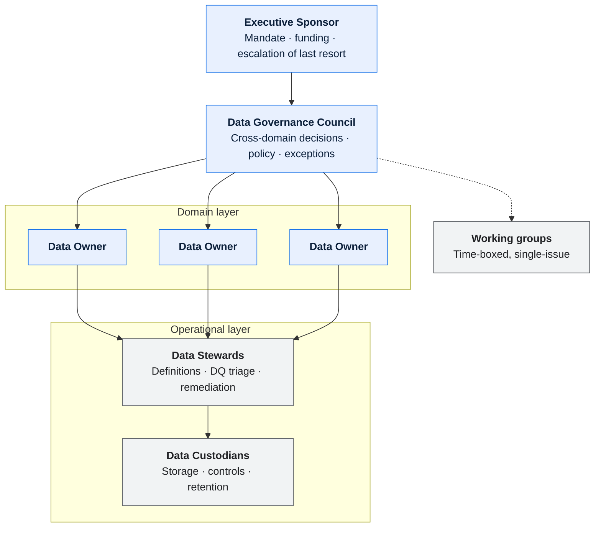
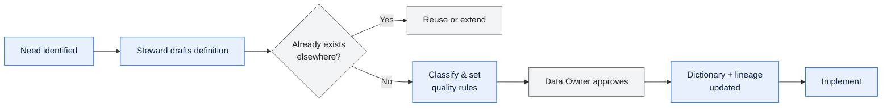
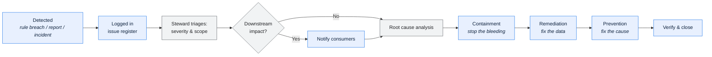

# \<System or Organisation\> — Data Governance Charter

> **Purpose.** The operating model for data: who decides what, through which forum, under
> which policies, and how compliance is evidenced.
>
> **The test of a governance charter** is whether it resolves a real dispute. If two domains
> disagree about the definition of a shared field, this document must name who decides and
> by when. If it cannot, it is a statement of intent rather than an operating model — and
> the disputes will continue to be settled by whoever is most persistent.

---

## 1. Scope and mandate

| | |
| --- | --- |
| Scope | *(systems, domains, and data in scope)* |
| Explicitly out of scope | |
| Mandate source | *(executive sponsor, policy, regulatory obligation)* |
| Effective date | |
| Sponsor | |
| Authority to compel | *(what this body can actually require, and of whom)* |

**Regulatory and policy drivers**

| Driver | Obligation | Data affected | Control | Evidence |
| --- | --- | --- | --- | --- |
| | | | | |

---

## 2. Objectives

| # | Objective | Measure | Target | Baseline |
| --- | --- | --- | --- | --- |
| 1 | | | | |

> Objectives must be measurable and few. "Improve data quality" is not an objective;
> "reduce incentive-payout restatements caused by data defects from 9 per quarter to under 2"
> is.

---

## 3. Operating model

### 3.1 Roles

| Role | Accountable for | Decision rights | Time commitment | Held by |
| --- | --- | --- | --- | --- |
| Executive Sponsor | | | | |
| Data Governance Lead | | | | |
| Data Owner (per domain) | Meaning, access, quality targets | Approves definitions, access, exceptions in their domain | | |
| Data Steward (per domain) | Definitions maintained, DQ triaged, remediation driven | Proposes; escalates | | |
| Data Custodian | Storage, controls, retention execution | Implements; reports compliance | | |
| Data Architect | Canonical model, lineage standards | Approves model changes | | |

Role definitions and the Owner/Steward/Custodian split:
[ownership guide §4](../../guides/05-ownership-and-raci.md#4-data-ownership-specifically).

### 3.2 Domain assignments

| Domain | Data Owner | Data Steward | Data Custodian | Core entities | Systems |
| --- | --- | --- | --- | --- | --- |
| | | | | | |

### 3.3 Cross-domain data

> The section that does the real work. Data that lives in one domain's store but is defined
> by another is where governance either functions or visibly fails.

| Data element | Physical home | Defining domain | Populated by | Consumed by | Decision owner | Change process |
| --- | --- | --- | --- | --- | --- | --- |
| | | | | | | |

**Rule:** where physical home and defining domain differ, a change requires approval from
**both** Data Owners. Single-sided changes to shared fields are the most common cause of
silent downstream breakage in a multi-domain platform.

---

## 4. Decision rights

| Decision | Proposer | Consulted | Decider | Escalation | SLA |
| --- | --- | --- | --- | --- | --- |
| Define or change a data element's meaning | Steward | Affected consumers | Data Owner | Council | 10 business days |
| Change a shared/cross-domain element | Steward | Both owners | Both Data Owners jointly | Council | 15 business days |
| Add a reference data code value | Steward | Consumers | Data Owner | Council | 5 business days |
| Retire a reference data code value | Steward | All consumers | Data Owner | Council | 20 business days |
| Grant access to confidential data | Requester | Steward | Data Owner | Council | 5 business days |
| Accept a data quality exception | Steward | Consumers | Data Owner | Council | 5 business days |
| Approve a new data contract | Producer | Consumers | Both parties | Council | 15 business days |
| Change a metric definition | Steward | All report consumers | Data Owner + Finance | Council | 15 business days |
| Approve a purge or retention change | Custodian | Legal, Risk | Data Owner | Sponsor | 20 business days |
| Resolve a definition dispute between domains | Either party | Both stewards | Council | Sponsor | 20 business days |

**Deadlock rule.** If a joint decision is not reached within its SLA, it escalates
automatically to the Council; if the Council cannot decide within one cycle, the Sponsor
decides. State this explicitly — an escalation path that stops at a committee is not a path.

---

## 5. Policies

> Each policy needs an owner, an enforcement mechanism, and a measure. A policy with no
> enforcement mechanism is guidance; label it as such rather than pretending.

### P-01 Data ownership

| | |
| --- | --- |
| Statement | Every data element has exactly one accountable Data Owner. |
| Rationale | |
| Applies to | |
| Enforcement | Data Dictionary requires an owner; validator rejects entries without one |
| Measure | % of catalogued elements with a resolvable owner |
| Exceptions | |

### P-02 Authoritative source

| | |
| --- | --- |
| Statement | Every data element has one designated authoritative source. Consumers read from it or from an approved derivative. |
| Enforcement | |
| Measure | |
| Exceptions | |

### P-03 Definitions before use

| | |
| --- | --- |
| Statement | A data element used in a report, external interface, or financial calculation must have an approved definition in the Data Dictionary. |
| Enforcement | |
| Measure | |

### P-04 Lineage for critical data

| | |
| --- | --- |
| Statement | Every Critical Data Element has documented field-level lineage from origin to each consumption point. |
| Enforcement | |
| Measure | % of CDEs with current lineage |

### P-05 Reference data change control

| | |
| --- | --- |
| Statement | Changes to controlled code sets follow the registry's change process and are effective-dated. |
| Rationale | Reference data changes system behaviour; uncontrolled changes are undeclared production releases. |
| Enforcement | |
| Measure | |

### P-06 Data quality measurement

| | |
| --- | --- |
| Statement | Every CDE has at least one automated quality rule with a threshold and an owner. |
| Enforcement | |
| Measure | |

### P-07 Classification and protection

| | |
| --- | --- |
| Statement | Data is classified at creation; controls match classification through every hop of its lineage. |
| Enforcement | |
| Measure | |

### P-08 Retention and disposal

| | |
| --- | --- |
| Statement | Data is retained per the retention schedule and disposed of with evidence. |
| Enforcement | |
| Measure | |

### P-09 Change notification

| | |
| --- | --- |
| Statement | Producers notify registered consumers before a breaking change, respecting contracted notice periods. |
| Enforcement | |
| Measure | |

### P-10 Metric definitions

| | |
| --- | --- |
| Statement | A metric published to more than one audience has a single approved definition in the Metric Catalog. |
| Rationale | Prevents two reports disagreeing about the same named figure. |
| Enforcement | |
| Measure | |

---

## 6. Critical Data Elements (CDEs)

> Governance effort concentrates here. Trying to govern every field governs nothing.

**Designation criteria** — an element is a CDE if it meets any of:

| # | Criterion |
| --- | --- |
| 1 | Used in external financial or regulatory reporting |
| 2 | Transmitted to an external party under contract |
| 3 | Used to calculate a payment, incentive, credit, or invoice |
| 4 | Used to make an automated business decision (eligibility, hold, routing) |
| 5 | Personal or otherwise regulated data |
| 6 | Recurrently implicated in data quality incidents |

| CDE ID | Element | Domain | Criteria met | Owner | Dictionary | Lineage | DQ rules |
| --- | --- | --- | --- | --- | --- | --- | --- |
| | | | | | ✅/❌ | ✅/❌ | ✅/❌ |

---

## 7. Forums

| Forum | Cadence | Chair | Members | Quorum | Decisions it may take | Minutes held in |
| --- | --- | --- | --- | --- | --- | --- |
| Data Governance Council | | | | | | |
| Domain steward working session | | | | | | |
| Data quality review | | | | | | |
| Change advisory (data changes) | | | | | | |

**Standing agenda — Council**

1. Open decisions and their SLAs
2. Escalations from domains
3. Data quality dashboard and breaches
4. Data issue log: new, ageing, closed
5. Exceptions requested and expiring
6. Policy compliance metrics
7. Upcoming changes affecting shared data

---

## 8. Processes

### 8.1 New data element

### 8.2 Data quality issue

Containment, remediation, and prevention are three distinct steps. Issues closed after
remediation without prevention recur — and a register full of recurring issues is how a
governance function loses credibility.

### 8.3 Access request

| Step | Action | Owner | SLA |
| --- | --- | --- | --- |
| 1 | Request with purpose and elements | Requester | — |
| 2 | Classification check | Steward | 2 days |
| 3 | Approve/deny with conditions | Data Owner | 5 days |
| 4 | Provision with least privilege | Custodian | 3 days |
| 5 | Record in access register | Custodian | — |
| 6 | Periodic recertification | Data Owner | Semi-annual |

### 8.4 Exception

| Step | Detail |
| --- | --- |
| Request | Policy, reason, scope, duration, compensating control |
| Assessment | Risk, affected consumers, precedent |
| Approval | Data Owner; Council if cross-domain or > 90 days |
| Expiry | Maximum 12 months; renewal requires re-approval |
| Register | All exceptions logged, reviewed at each Council |

> Exceptions must expire. A permanent exception is a policy change, and should be made as
> one so that it is visible.

---

## 9. Compliance measurement

| Metric | Definition | Target | Current | Trend | Owner |
| --- | --- | --- | --- | --- | --- |
| CDEs with an approved definition | | 100% | | | |
| CDEs with current lineage | | ≥ 95% | | | |
| CDEs with active DQ rules | | 100% | | | |
| DQ rules passing | | ≥ 98% | | | |
| Open data issues > 90 days | | 0 | | | |
| Elements with a resolvable owner | | 100% | | | |
| Access reviews completed on schedule | | 100% | | | |
| Active exceptions | | Trending down | | | |
| Reference data changes following process | | 100% | | | |
| Metric definitions with a single authority | | 100% | | | |

**Reporting**

| Report | Audience | Cadence | Owner |
| --- | --- | --- | --- |
| | | | |

---

## 10. Maturity assessment

| Dimension | Level (1–5) | Evidence | Target | Gap |
| --- | --- | --- | --- | --- |
| Ownership clarity | | | | |
| Definition coverage | | | | |
| Lineage coverage | | | | |
| Quality measurement | | | | |
| Issue management | | | | |
| Reference data control | | | | |
| Access management | | | | |
| Retention compliance | | | | |

| Level | Description |
| --- | --- |
| 1 — Initial | Ad hoc; knowledge is tribal |
| 2 — Repeatable | Some documentation; inconsistently maintained |
| 3 — Defined | Standards exist and are followed for critical data |
| 4 — Managed | Measured, monitored, enforced |
| 5 — Optimised | Continuously improved; prevention over remediation |

---

## 11. Roadmap

| Phase | Objectives | Deliverables | Duration | Success criteria |
| --- | --- | --- | --- | --- |
| | | | | |

---

## Change log

| Version | Date | Author | Change |
| --- | --- | --- | --- |
| 0.1.0 | | | Initial draft |
