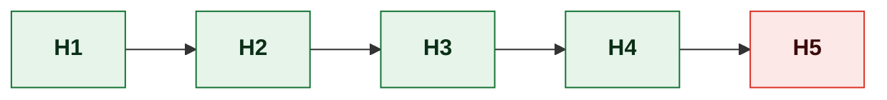

# \<Data Flow Name\> — Data Lineage

> **Purpose.** Trace data from origin to consumption at **field level**, naming every
> transformation, the job that performs it, and the control that proves it worked. This is
> the document that answers "where did this number come from?" — the question that arrives
> from auditors, from finance during a dispute, and from an engineer at 02:00.
>
> **Scope one lineage document to one flow**, not one system. "Order to cash", "incentive
> payout", "inventory position" — each is its own document. A lineage document attempting to
> cover a whole platform is unmaintainable and therefore unmaintained.
>
> **Method.** Trace *backwards from consumption*. Start at the number someone queried and
> work back hop by hop. Forward tracing produces exhaustive graphs of things nobody uses.

---

## 1. Summary

| | |
| --- | --- |
| Flow name | |
| Business purpose | |
| Origin system | |
| Terminal consumers | |
| Number of hops | |
| End-to-end latency | *(origin to final consumption)* |
| Criticality | |
| Regulatory relevance | |
| Data Owner | |
| Data Steward | |
| Critical Data Elements covered | |
| Overall confidence | ✅ / 🟡 / 🔴 |

---

## 2. Lineage overview



> **Caption:** state the end-to-end path in one sentence, and name the hop where the
> greatest transformation or greatest risk sits.

### Hop index

| Hop | System | Object | Grain | Owner | Latency from origin | Retention | Confidence |
| --- | --- | --- | --- | --- | --- | --- | --- |
| H1 | | | *(what one row represents)* | | 0 | | |
| H2 | | | | | | | |

> **Grain is stated at every hop, and every grain change is called out.** A hop that
> aggregates order lines to order level, or that fans one row into many by joining to a
> package's options, changes what a row means. Undeclared grain changes are the primary
> cause of double counting, and they are invisible in a system-level lineage diagram.

---

## 3. Field-level lineage

> The core of the document. One block per hop, or one consolidated table for simple flows.
> Every Critical Data Element must appear in every hop it passes through.

### 3.1 Hop H1 → H2: \<description\>

| | |
| --- | --- |
| Performed by | *(job ID / process / job schedule entry)* |
| Trigger | |
| Schedule | |
| Typical duration | |
| Typical volume | |
| Source object | |
| Target object | |
| Grain change | None / *(describe)* |
| Load type | Full / Incremental / CDC / Append / Upsert |
| Restart semantics | |

**Field mappings**

| # | Source field | Source type | Target field | Target type | Transformation | Rule | Confidence |
| --- | --- | --- | --- | --- | --- | --- | --- |
| 1 | `SRC.COL` | `char(12)` | `TGT.COL` | `varchar(12)` | Direct copy; trailing spaces trimmed | — | ✅ |
| 2 | | | | | | BR-… | |
| 3 | *(derived — no source)* | — | `TGT.COL` | | *(state the full formula)* | BR-… | |

**Transformation detail** *(for anything not a direct copy)*

> Precise enough that a reader could reproduce the value. Name the rounding rule, the
> tie-break, the null handling, and the timezone.

```
<Formula or pseudocode.>
```

| Aspect | Rule |
| --- | --- |
| Null handling | *(source null → what?)* |
| Empty vs. absent | |
| Rounding | *(to what precision, which direction, at which step)* |
| Currency conversion | *(rate source, rate date, rounding)* |
| Date/timezone conversion | |
| Character encoding | |
| Truncation | *(what happens if the value is too long — silent truncation is a defect worth naming)* |

**Filters and exclusions** ⚠️

| Filter | Condition | Rows excluded (typical) | Business reason | Confidence |
| --- | --- | --- | --- | --- |
| | | | | |

> **Exclusions are the single most common cause of reconciliation breaks**, and the most
> commonly undocumented part of a lineage. "Why is the warehouse count 3% lower than the
> source?" is nearly always an exclusion nobody wrote down. Enumerate every one, with the
> typical row count it removes.

**Joins**

| Join | To | Type | Key | Cardinality | Rows if key missing | Fan-out risk |
| --- | --- | --- | --- | --- | --- | --- |
| | | Inner / Left / Lookup | | 1:1 / 1:N / N:1 | Dropped / Defaulted / Error | |

> An inner join that silently drops rows when a reference key is missing is a data-loss
> path. State it here, and give it a data quality rule.

**Reference data used**

| Code set | Purpose | Effective-dated | Version used | What happens on a missing code |
| --- | --- | --- | --- | --- |
| | | Yes/No | *(current / as-at transaction date)* | |

> If reference data is **not** effective-dated, historical reprocessing applies today's
> codes to yesterday's transactions and historical figures stop being reproducible. Record
> it as a finding in §8.

---

## 4. Critical Data Element trace

> For each CDE, a single row showing its full journey. This is the table an auditor reads.

### CDE: `<element name>`

| Hop | System.Object.Field | Type | Transformation applied at this hop | Confidence |
| --- | --- | --- | --- | --- |
| H1 | | | Origin — *(how it is captured, by whom, validated how)* | |
| H2 | | | | |
| H3 | | | | |

| | |
| --- | --- |
| Business definition | *(link to Data Dictionary)* |
| Authoritative source | |
| Permitted values | |
| Known quality issues | |
| Consumers | |
| Restatement history | |

---

## 5. Controls and reconciliation

> Per hop: what proves the data arrived intact. A lineage without controls documents a hope.

| Hop | Control | Type | Frequency | Tolerance | Owner | Break procedure | Evidence |
| --- | --- | --- | --- | --- | --- | --- | --- |
| H1→H2 | | Record count / Control total / Checksum / Balance / Reconciliation query | | | | | |

**Control coverage**

| Hop | Row count | Amount total | Key integrity | Value distribution | Timeliness |
| --- | --- | --- | --- | --- | --- |
| H1→H2 | ✅/❌ | ✅/❌ | ✅/❌ | ✅/❌ | ✅/❌ |

**Uncontrolled hops** *(where loss would not be detected)*

| Hop | Risk | Detection today | Time to detect | Proposed control |
| --- | --- | --- | --- | --- |
| | | | | |

---

## 6. Timing and dependencies

```mermaid
gantt
    dateFormat HH:mm
    axisFormat %H:%M
    title End-to-end timing (UTC)
    section Extract
    H1 → H2 (<job>)     :h1, 22:00, 45m
    section Transform
    H2 → H3 (<job>)     :h2, after h1, 55m
    H3 → H4 (<job>)     :h3, after h2, 30m
    section Publish
    H4 → H5 (<job>)     :h4, after h3, 20m
```



| Hop | Job | Window | Depends on | Cutoff | Consequence of missing the cutoff |
| --- | --- | --- | --- | --- | --- |
| | | | | | |

**Data availability commitments**

| Consumer | Needs data by | Currently available by | Margin | Risk |
| --- | --- | --- | --- | --- |
| | | | | |

---

## 7. Temporal behaviour

> How this flow handles the passage of time. Usually the most under-documented aspect of
> lineage, and the source of the hardest-to-explain discrepancies.

| Aspect | Behaviour |
| --- | --- |
| Late-arriving data | *(accepted into which period? Restated or reported in the current period?)* |
| Restatement | *(when a prior period's figure changes, what is republished and who is told?)* |
| Back-dated corrections | |
| Period boundary definition | *(calendar month? accounting period? business day cutoff and timezone?)* |
| Reprocessing | *(can a day be re-run? Does it produce identical output?)* |
| Historical reference data | *(as-at codes, or current codes?)* |
| Slowly changing dimensions | Type 0/1/2/3, per dimension |
| Idempotency | *(does re-running produce the same result, or duplicates?)* |

**Restatement history**

| Period restated | Date | Reason | Magnitude | Consumers notified | Issue ID |
| --- | --- | --- | --- | --- | --- |
| | | | | | |

---

## 8. Known gaps and issues

| ID | Gap/issue | Hop | Impact | Detected by | Workaround | Remediation | Owner |
| --- | --- | --- | --- | --- | --- | --- | --- |
| | | | | | | | |

**Known reconciliation differences**

> Persistent, explained differences between hops. Documenting them prevents each new analyst
> re-investigating the same 0.4% variance.

| Between | Typical difference | Explanation | Accepted | Threshold for investigation |
| --- | --- | --- | --- | --- |
| | | | | |

---

## 9. Consumers

> Enables impact assessment. A change at H2 needs this list to know who to tell.

| Consumer | Hop consumed | Fields used | Purpose | Criticality | Notice required | Contact |
| --- | --- | --- | --- | --- | --- | --- |
| | | | | | | |

**Downstream of downstream** *(consumers of your consumers, where known — the second-order
list is where surprises live)*

| Consumer | Via | Fields | Known? |
| --- | --- | --- | --- |
| | | | ✅/🔴 |

---

## 10. Retention

| Hop | Object | Retention | Basis | Purge process | Purge verified |
| --- | --- | --- | --- | --- | --- |
| | | | *(policy, regulation, business need)* | | |

> Where retention shortens along the flow — source keeps 7 years, warehouse keeps 13 months
> — historical reconstruction becomes impossible after the shorter period. Note where that
> boundary falls; it constrains what can ever be audited or restated.

---

## 11. Verification

| Verification | Method | Date | Performed by | Result |
| --- | --- | --- | --- | --- |
| Field mappings match implementation | *(code review, query comparison)* | | | |
| Volumes reconcile end to end | | | | |
| Sample records traced end to end | | | | |
| Transformation logic reproduced independently | | | | |

**Sample trace** *(one real record — synthetic or anonymised — followed through every hop.
The single most convincing evidence a lineage document can carry.)*

| Hop | Key | Value of `<CDE>` | Notes |
| --- | --- | --- | --- |
| H1 | | | |
| H2 | | | |

---

## Change log

| Version | Date | Author | Change |
| --- | --- | --- | --- |
| 0.1.0 | | | Initial draft |
