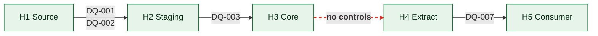
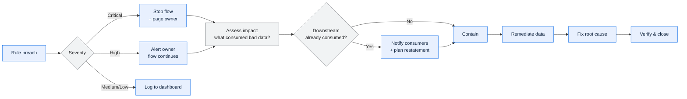

# \<Domain or Flow\> — Data Quality Rules and Controls

> **Purpose.** Executable quality rules with thresholds, owners, and defined actions on
> breach. A rule with no threshold is an opinion; a rule with no owner produces an alert
> nobody acts on; a rule with no defined action produces a dashboard nobody looks at.

---

## Contents

| Section | Summary |
| --- | --- |
| [1. Coverage](#1-coverage) | CDE coverage, rule counts, automation ratio |
| [2. Dimensions](#2-dimensions) | The six dimensions, the question each asks, and its typical rule shape |
| [3. Rule register](#3-rule-register) | Rule register with threshold, severity, frequency, owner, breach action |
| [4. Rule definitions](#4-rule-definitions) | Per-rule definition: logic, scope, exclusions, expected result |
| [5. Control points](#5-control-points) | Where each rule executes against the lineage hops, and coverage gaps |
| [6. Breach handling](#6-breach-handling) | Breach severity ladder with notification, containment, and root-cause deadlines |
| [7. Quality scorecard](#7-quality-scorecard) | Scorecard by element and dimension, with period trend |
| [8. Gaps](#8-gaps) | CDEs with no rule, and dimensions that cannot be measured |
| [9. Known issues](#9-known-issues) | Standing accepted defects, so consumers stop rediscovering them |
| [Change log](#change-log) | Version, date, author, change |

---

## 1. Coverage

| | |
| --- | --- |
| Scope | |
| CDEs covered / total CDEs | |
| Rules defined | |
| Rules automated | |
| Execution frequency | |
| Results published to | |

---

## 2. Dimensions

| Dimension | Question | Typical rule shape |
| --- | --- | --- |
| Completeness | Are required values present? | `% non-null ≥ threshold` |
| Validity | Do values conform to their domain? | `% in code set ≥ threshold` |
| Accuracy | Do values reflect reality? | `% matching an independent source ≥ threshold` |
| Consistency | Do related values agree across stores? | `|A − B| ≤ tolerance` |
| Timeliness | Is data available when needed? | `% arriving before cutoff ≥ threshold` |
| Uniqueness | Are there unintended duplicates? | `duplicate count = 0` |
| Integrity | Do relationships hold? | `orphan count = 0` |

> **Accuracy is the hardest and most valuable.** It requires an independent source of truth —
> a carrier's records against your ship dates, a partner's invoice against your dispatch
> count. Where no independent source exists, say so: an unmeasurable dimension recorded as
> unmeasured is honest; one silently omitted implies coverage you do not have.

---

## 3. Rule register

| Rule ID | Element | Dimension | Rule | Threshold | Severity | Frequency | Owner | Automated | On breach |
| --- | --- | --- | --- | --- | --- | --- | --- | --- | --- |
| DQ-001 | | | | | Critical / High / Medium / Low | | | ✅/❌ | |

**Severity**

| Severity | Definition | Response |
| --- | --- | --- |
| Critical | Financial, regulatory, or external-party impact | Stop the flow; page the owner |
| High | Material downstream impact | Alert; remediate same day |
| Medium | Degraded quality; workaround exists | Alert; remediate within the sprint |
| Low | Cosmetic or low-volume | Track; batch remediation |

---

## 4. Rule definitions

### DQ-\<NNN\>: \<name\>

| | |
| --- | --- |
| Element(s) | |
| Dimension | |
| Business rationale | *(what goes wrong downstream if this fails — not "data should be clean")* |
| Rule statement | |
| Threshold | |
| Measurement point | *(which hop in the lineage)* |
| Frequency | |
| Severity | |
| Owner | |
| Breach action | |
| Notification | |

**Implementation**

```sql
-- Executable form. Returns the measured value and the row count breaching.
```

**Exclusions** *(rows legitimately outside the rule, and why)*

| Exclusion | Condition | Rationale |
| --- | --- | --- |
| | | |

**History**

| Period | Measured | Threshold | Status | Notes |
| --- | --- | --- | --- | --- |
| | | | Pass / Breach | |

---

## 5. Control points

> Where in the flow each rule executes. Map rules to lineage hops so gaps are visible.



| Hop | Rules | Blocking | Coverage gap |
| --- | --- | --- | --- |
| | | *(does a breach stop processing, or only alert?)* | |

**Preventive vs. detective**

| Rule | Type | Notes |
| --- | --- | --- |
| | Preventive *(rejects bad data at entry)* / Detective *(finds it afterwards)* | |

> Preventive controls at the point of capture are worth far more than detective controls
> downstream, because bad data that enters a system propagates into extracts, reports, and
> partner transmissions before any detective control fires. Where a preventive control is
> impossible — data arriving from an external party you cannot constrain — say so and
> compensate with early detection.

---

## 6. Breach handling



| Severity | Notify | Within | Contain by | Remediate by | Root cause by |
| --- | --- | --- | --- | --- | --- |
| Critical | | | | | |
| High | | | | | |
| Medium | | | | | |
| Low | | | | | |

---

## 7. Quality scorecard

| Element | Completeness | Validity | Accuracy | Consistency | Timeliness | Uniqueness | Overall |
| --- | --- | --- | --- | --- | --- | --- | --- |
| | | | | | | | |

| Period | Rules passing | Breaches | Critical breaches | Open issues | Trend |
| --- | --- | --- | --- | --- | --- |
| | | | | | |

---

## 8. Gaps

| CDE | Dimensions with no rule | Risk | Reason | Planned |
| --- | --- | --- | --- | --- |
| | | | | |

**Unmeasurable dimensions**

| Element | Dimension | Why unmeasurable | Compensating control |
| --- | --- | --- | --- |
| | | | |

---

## 9. Known issues

> Standing quality defects that are accepted rather than fixed. Recording them stops each
> new consumer rediscovering them and building their own workaround.

| Issue ID | Element | Description | Extent | Since | Root cause | Workaround | Remediation | Owner |
| --- | --- | --- | --- | --- | --- | --- | --- | --- |
| | | | | | | | | |

---

## Change log

| Version | Date | Author | Change |
| --- | --- | --- | --- |
| 0.1.0 | | | Initial draft |
