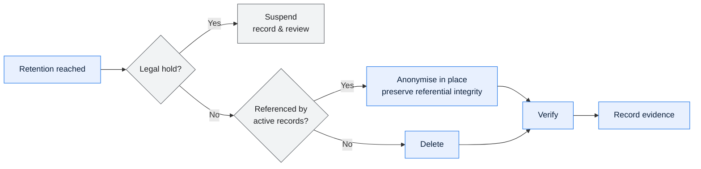

# \<System Name\> — Data Retention, Classification and Privacy

> **Purpose.** The classification scheme, the retention schedule, and how privacy
> obligations are met across a system whose data has propagated into extracts, warehouses,
> archives, and partner systems.
>
> **Hard part.** In a disaggregated platform, data does not live in one place. Retention and
> erasure must be satisfied at every hop of every lineage — which is why this document
> depends on the lineage documents being current.

---

## Contents

| Section | Summary |
| --- | --- |
| [1. Classification scheme](#1-classification-scheme) | Classification levels with storage, transmission, non-production, and access rules |
| [2. Data inventory](#2-data-inventory) | Data categories, classification, personal and special-category flags |
| [3. Retention schedule](#3-retention-schedule) | Retention periods with cited basis, trigger, disposal method, owner |
| [4. Retention across the lineage](#4-retention-across-the-lineage) | Retention satisfied at every hop, including extracts, warehouses, partners, backups |
| [5. Disposal](#5-disposal) | Disposal methods, verification, certificates, cadence |
| [6. Privacy](#6-privacy) | Applicable regimes, controller role, lawful basis, subject rights |
| [7. Access control](#7-access-control) | Default access per classification, grant process, recertification, logging |
| [8. Non-production data](#8-non-production-data) | Non-production treatment, masking rules, approval, expiry |
| [9. Compliance](#9-compliance) | Requirement status, evidence, gaps, remediation |
| [10. Legal holds](#10-legal-holds) | Legal holds and the disposal they suspend |
| [Change log](#change-log) | Version, date, author, change |

---

## 1. Classification scheme

| Level | Definition | Examples | Storage | Transmission | Non-prod | Access |
| --- | --- | --- | --- | --- | --- | --- |
| Public | | | | | | |
| Internal | | | | | | |
| Confidential | | | | | | |
| Restricted | | | | | | |

**Classification rules**

| Rule | Detail |
| --- | --- |
| Classify at creation | |
| Inheritance | An aggregate inherits the highest classification of its inputs |
| Derived data | *(does aggregation reduce classification? Define the threshold — k-anonymity, minimum group size)* |
| Declassification | Requires Data Owner approval; recorded |
| Propagation | Classification travels with the data through every hop |
| Mixed datasets | Classified at the highest level present |

---

## 2. Data inventory

| Data category | Elements | Classification | Personal data | Special category | Systems | Retention |
| --- | --- | --- | --- | --- | --- | --- |
| | | | ✅/❌ | ✅/❌ | | |

---

## 3. Retention schedule

| Data category | Active | Archive | Total | Basis | Trigger | Disposal | Owner |
| --- | --- | --- | --- | --- | --- | --- | --- |
| | | | | *(regulation, contract, business need — cite the specific clause)* | *(what starts the clock)* | | |

**Retention basis**

| Basis | Authority | Categories | Minimum | Maximum |
| --- | --- | --- | --- | --- |
| Regulatory | | | | |
| Tax | | | | |
| Contractual | | | | |
| Legal hold | | | | |
| Business | | | | |

> Where bases conflict — tax requires seven years, privacy requires deletion after three —
> record how the conflict is resolved and by whom. Usually the longer legal obligation wins
> and the personal elements are minimised rather than the record deleted; state the actual
> rule rather than leaving it to interpretation at purge time.

---

## 4. Retention across the lineage

> Retention must be satisfied at every hop, not only in the system of record. Copies in
> extracts, warehouses, partner systems, and backups are the usual source of non-compliance.

| Data | Hop | System | Retention | Aligned with policy | Purge mechanism | Evidence |
| --- | --- | --- | --- | --- | --- | --- |
| | | | | ✅/⚠️/❌ | | |

**Copies and derivatives**

| Copy | Location | Created by | Classification | Retention | Purge | Known? |
| --- | --- | --- | --- | --- | --- | --- |
| | | | | | | ✅/🔴 |

> Include backups, DR replicas, test environment refreshes, analyst extracts, and files sent
> to partners. The "known? 🔴" rows — copies you suspect exist but cannot enumerate — are
> the real finding, and they belong in §9.

---

## 5. Disposal

| Data category | Method | Verification | Certificate | Frequency | Owner |
| --- | --- | --- | --- | --- | --- |
| | Hard delete / Anonymise / Pseudonymise / Archive then delete / Crypto-shred | | | | |

**Disposal process**

**Anonymisation**

| Element | Technique | Reversible | Utility preserved | Verified |
| --- | --- | --- | --- | --- |
| | Suppression / Generalisation / Pseudonymisation / Tokenisation | | | |

> Pseudonymisation is not anonymisation: if a re-identification key exists anywhere, the
> data remains personal data. State where each key lives and who controls it.

---

## 6. Privacy

| | |
| --- | --- |
| Applicable regimes | |
| Role | Controller / Processor / Joint controller |
| Lawful basis | |
| Privacy assessment | |
| Cross-border transfers | |
| Transfer mechanism | |

**Personal data inventory**

| Element | Category | Subjects | Purpose | Lawful basis | Source | Recipients | Retention |
| --- | --- | --- | --- | --- | --- | --- | --- |
| | | | | | | | |

**Subject rights**

| Right | Supported | Process | SLA | Systems in scope | Gaps |
| --- | --- | --- | --- | --- | --- |
| Access | | | | | |
| Rectification | | | | | |
| Erasure | | | | | |
| Restriction | | | | | |
| Portability | | | | | |
| Objection | | | | | |

**Erasure feasibility**

> The honest assessment. In a system with 30 years of history, extracts, and partner
> transmissions, full erasure is rarely straightforward.

| Location | Erasable | Method | Constraint |
| --- | --- | --- | --- |
| Operational store | | | |
| Historical archive | | | |
| Warehouse | | | |
| Backups | | | *(usually: not selectively — document the backup expiry window as the effective deletion horizon)* |
| Partner systems | | | |
| Extracts and reports | | | |
| Audit logs | | | *(usually retained under a legal obligation that overrides erasure — state the basis)* |

---

## 7. Access control

| Classification | Default access | Grant process | Recertification | Logging |
| --- | --- | --- | --- | --- |
| | | | | |

**Standing access to confidential or restricted data**

| Grantee | Data | Basis | Granted | Last recertified | Expires |
| --- | --- | --- | --- | --- | --- |
| | | | | | |

---

## 8. Non-production data

| Environment | Source | Treatment | PII present | Approval | Refresh | Expiry |
| --- | --- | --- | --- | --- | --- | --- |
| | | Masked / Synthetic / Subset / Real | | | | |

**Masking rules**

| Element | Rule | Format preserved | Referential integrity | Deterministic |
| --- | --- | --- | --- | --- |
| | | | | *(same input → same masked output, so joins still work across tables)* |

---

## 9. Compliance

| Requirement | Status | Evidence | Gap | Remediation | Owner | Target |
| --- | --- | --- | --- | --- | --- | --- |
| | Compliant / Partial / Non-compliant | | | | | |

**Known gaps**

| Gap | Risk | Interim control | Remediation | Owner | Target |
| --- | --- | --- | --- | --- | --- |
| | | | | | |

---

## 10. Legal holds

| Hold | Scope | Imposed | Imposed by | Released | Disposal suspended |
| --- | --- | --- | --- | --- | --- |
| | | | | | |

---

## Change log

| Version | Date | Author | Change |
| --- | --- | --- | --- |
| 0.1.0 | | | Initial draft |
