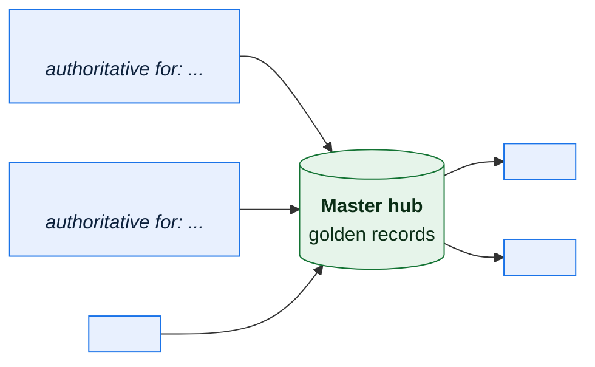
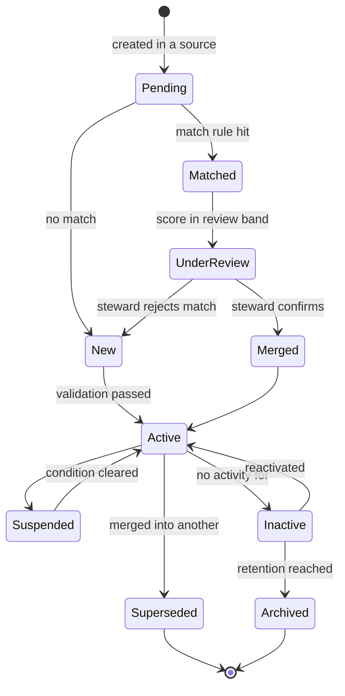

# \<Master Entity\> — Master Data Management

> **Purpose.** How one master entity — dealer, product, vendor, customer, location — is
> created, matched, merged, and distributed across systems that each hold their own copy.
>
> One document per master entity. The rules for products and for trading partners are
> different enough that combining them produces a document that fits neither.

---

## 1. Entity

| | |
| --- | --- |
| Master entity | |
| Business definition | |
| Identity criterion | *(what makes two records the same real-world thing)* |
| Record count | |
| Create/change rate | |
| Business criticality | |
| Data Owner | |
| Data Steward | |

---

## 2. Source landscape

| Source | Records | Authoritative for | Sync | Latency | Quality | Notes |
| --- | --- | --- | --- | --- | --- | --- |
| | | *(which attributes)* | | | | |

**Style**

| | |
| --- | --- |
| MDM style | Registry / Consolidation / Coexistence / Centralised |
| Rationale | |
| Where records are created | |
| Where records are edited | |
| Propagation model | Push / Pull / Both |
| Propagation latency | |

---

## 3. Identity and matching

| Aspect | Approach |
| --- | --- |
| Master identifier | |
| Identifier format | |
| Identifier assignment | |
| Identifier reuse | **Prohibited** / *(if permitted, document the historical ambiguity it creates)* |
| Cross-reference storage | |

**Match rules**

| Rule | Attributes | Type | Threshold | Action | Confidence |
| --- | --- | --- | --- | --- | --- |
| M-01 | | Exact / Fuzzy / Probabilistic | | Auto-merge / Queue for review / No match | |

**Match outcomes**

| Score band | Action | Volume/month | Review SLA |
| --- | --- | --- | --- |
| ≥ \<auto\> | Auto-merge | | — |
| \<review\>–\<auto\> | Steward review | | |
| < \<review\> | Treat as distinct | | — |

> Set the auto-merge threshold conservatively. A false merge is far more expensive than a
> false non-merge: merging two real dealers combines their orders, credit limits, and
> incentive attainment, and unpicking it after downstream consumption may be impossible.

---

## 4. Survivorship

> Which source's value wins, per attribute. Do not apply one global rule — recency is right
> for contact details and wrong for a legally registered name.

| Attribute | Rule | Priority order | Rationale |
| --- | --- | --- | --- |
| | Source priority / Most recent / Most complete / Most trusted / Manual | | |

**Conflict handling**

| Situation | Handling |
| --- | --- |
| Two sources disagree, both trusted | |
| Authoritative source has a null | |
| Source provides an invalid value | |
| A manual override exists | *(state whether a later source update overwrites it — the answer must be "no" or overrides are pointless)* |

---

## 5. Golden record

| Attribute | Type | Source | Survivorship | Required | Validation |
| --- | --- | --- | --- | --- | --- |
| | | | | | |

**Lineage of a golden record** — every attribute retains its contributing source and
timestamp, so a consumer can ask "where did this value come from?" without re-running the
match.

| Metadata | Purpose |
| --- | --- |
| `source_system` | Contributing source per attribute |
| `source_record_id` | |
| `last_updated` / `updated_by` | |
| `match_confidence` | |
| `merge_history` | Records previously merged into this one |
| `manual_override_flag` | Per attribute |

---

## 6. Lifecycle

| State | Meaning | Who may change | Downstream effect |
| --- | --- | --- | --- |
| | | | |

**Deactivation and deletion**

| Aspect | Rule |
| --- | --- |
| Deactivation criteria | |
| Effect on historical transactions | *(must remain resolvable — never hard-delete a master record referenced by history)* |
| Hard deletion permitted | |
| Regulatory erasure handling | |

---

## 7. Stewardship

| Task | Trigger | Owner | SLA | Volume/month |
| --- | --- | --- | --- | --- |
| Review a probable match | | | | |
| Resolve a survivorship conflict | | | | |
| Investigate a duplicate report | | | | |
| Unmerge an incorrect merge | | | | |
| Approve a new record | | | | |
| Recertify inactive records | | | | |

**Unmerge**

| Aspect | Approach |
| --- | --- |
| Supported | Yes/No |
| Procedure | |
| Effect on downstream transactions created against the merged ID | |
| Approval required | |

> If unmerge is not supported, say so prominently — it makes the auto-merge threshold a
> one-way decision and should push it higher.

---

## 8. Distribution

| Consumer | Method | Frequency | Latency | Subset | Behaviour on unknown ID |
| --- | --- | --- | --- | --- | --- |
| | | | | | |

**Change notification**

| Change | Consumers notified | Method | Latency |
| --- | --- | --- | --- |
| New record | | | |
| Attribute change | | | |
| Merge | | | |
| Deactivation | | | |

> **Merges must be notified explicitly.** A consumer holding transactions against a
> superseded identifier needs to know it has been merged, or their reporting silently loses
> the merged entity's history.

---

## 9. Quality

| Metric | Definition | Target | Current |
| --- | --- | --- | --- |
| Duplicate rate | | | |
| Match precision | | | |
| Match recall | | | |
| Completeness of required attributes | | | |
| Records pending review | | | |
| Average age of pending review | | | |
| Manual override rate | | | |

---

## 10. Known issues

| ID | Issue | Impact | Workaround | Remediation | Owner |
| --- | --- | --- | --- | --- | --- |
| | | | | | |

---

## Change log

| Version | Date | Author | Change |
| --- | --- | --- | --- |
| 0.1.0 | | | Initial draft |
