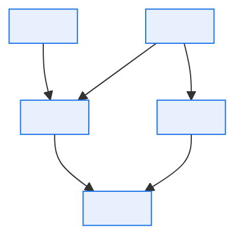

# \<Domain\> — Metric and KPI Definition Catalog

> **Purpose.** One authoritative definition per published metric, so that two reports cannot
> disagree about the same named figure.
>
> **The problem this solves.** In a multi-domain platform, "units sold" is calculated four
> times by four teams with four slightly different filters. Each is defensible; none matches
> the others; and every month-end produces a reconciliation meeting. The fix is not better
> tooling — it is a single definition with a named owner, and a rule that a metric with more
> than one audience must appear here before it is published.

---

## Contents

| Section | Summary |
| --- | --- |
| [1. Catalog](#1-catalog) | Metric register with owner, grain, refresh, certification level |
| [2. Metric: `<Metric name>`](#2-metric-metric-name) | Per-metric definition: formula, filters, grain, exclusions, worked example |
| [3. Metric relationships](#3-metric-relationships) | How metrics derive from one another |
| [4. Uncertified metrics in use](#4-uncertified-metrics-in-use) | Metrics circulating without an approved definition — the remediation backlog |
| [5. Conflicting implementations](#5-conflicting-implementations) | The same metric implemented differently, with observed variance and resolution |
| [Change log](#change-log) | Version, date, author, change |

---

## 1. Catalog

| ID | Metric | Domain | Owner | Grain | Refresh | Certified | Systems |
| --- | --- | --- | --- | --- | --- | --- | --- |
| MET-001 | | | | | | ✅/❌ | |

**Certification levels**

| Level | Meaning | Use |
| --- | --- | --- |
| ✅ Certified | Approved definition, tested implementation, monitored | External and executive reporting |
| 🟡 Managed | Defined and owned; implementation not independently verified | Internal operational reporting |
| 🔴 Uncertified | In use but undefined here | Do not use for decisions; remediate or retire |

---

## 2. Metric: `<Metric name>`

| | |
| --- | --- |
| ID | MET-… |
| Business definition | *(one sentence a business stakeholder would agree with)* |
| Owner | |
| Certification | |
| Unit | |
| Grain | *(what one value represents — entity, period, and dimensions)* |
| Aggregation | Sum / Average / Count / Distinct count / Ratio / Point-in-time |
| Additivity | Fully additive / Semi-additive *(across which dimensions)* / Non-additive |

> **Additivity is what stops people summing something that cannot be summed.** Inventory
> position is not additive across time; a conversion rate is not additive at all. State it,
> and a dashboard builder will not produce a meaningless total.

### 2.1 Calculation

```
<Precise formula with named inputs.>
```

| Input | Source | Field | Notes |
| --- | --- | --- | --- |
| | | | |

| Aspect | Rule |
| --- | --- |
| Inclusions | |
| **Exclusions** | *(the part that differs between competing versions of a metric — enumerate exhaustively)* |
| Null handling | |
| Zero/negative handling | |
| Rounding | |
| Currency and conversion | |
| Period definition | *(calendar month / accounting period / rolling N days — and the timezone of the boundary)* |
| Timing basis | *(which date drives period assignment: order date, ship date, invoice date, recognition date)* |

**Worked example**

| Step | Detail | Value |
| --- | --- | --- |
| Base population | | |
| After exclusions | | |
| Calculation | | |
| Result | | |

### 2.2 Dimensions

| Dimension | Values | Hierarchy | Notes |
| --- | --- | --- | --- |
| | | | |

**Valid slicing** — dimensions the metric may be broken down by without becoming
meaningless:

| Dimension | Valid | Reason |
| --- | --- | --- |
| | ✅/❌ | |

### 2.3 Temporal behaviour

| Aspect | Behaviour |
| --- | --- |
| Restatement | *(does a published figure change? Under what conditions?)* |
| Restatement window | |
| Late-arriving data | |
| Back-dated corrections | |
| Comparability across periods | *(has the definition changed? From when?)* |
| Point-in-time reconstruction | *(can a prior period's figure be reproduced exactly today?)* |

> "Can this figure be reproduced exactly today?" is the question an auditor asks. If the
> answer is no — because reference data is not effective-dated, or source retention is
> shorter than the reporting horizon — record it here rather than discovering it during an
> audit.

### 2.4 Targets and thresholds

| Context | Target | Set by | Period | Notes |
| --- | --- | --- | --- | --- |
| | | | | |

### 2.5 Consumers

| Report / dashboard | Audience | Frequency | Implementation | Verified matching |
| --- | --- | --- | --- | --- |
| | | | *(where the calculation lives)* | ✅/❌ |

> Where the same metric is implemented in more than one place, the implementations must be
> tested against each other. "Verified matching ❌" against two implementations is a defect
> waiting to surface at the worst moment.

### 2.6 Related metrics

| Metric | Relationship | Expected consistency |
| --- | --- | --- |
| | *(component of / derived from / commonly confused with)* | |

**Commonly confused with**

| Similar metric | Difference | Why the confusion arises |
| --- | --- | --- |
| | | |

### 2.7 Known issues

| Issue | Impact | Since | Workaround | Remediation |
| --- | --- | --- | --- | --- |
| | | | | |

### 2.8 Definition history

| Version | Effective from | Change | Reason | Comparability with prior |
| --- | --- | --- | --- | --- |
| | | | | Comparable / Restated / Break in series |

> A **break in series** must be flagged on every report showing data across the boundary.
> Silent redefinition is how a metric loses its audience's trust permanently.

---

## 3. Metric relationships



---

## 4. Uncertified metrics in use

> Metrics circulating without an approved definition. This list is the remediation backlog,
> and it should shrink each quarter.

| Metric | Used in | Owner | Risk | Action | Target |
| --- | --- | --- | --- | --- | --- |
| | | | | Define / Retire / Merge with MET-… | |

---

## 5. Conflicting implementations

| Metric | Implementations | Difference | Variance observed | Resolution | Owner |
| --- | --- | --- | --- | --- | --- |
| | | | | | |

---

## Change log

| Version | Date | Author | Change |
| --- | --- | --- | --- |
| 0.1.0 | | | Initial draft |
