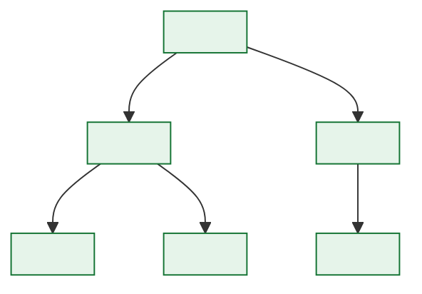

# \<System Name\> — Reference Data and Code Set Registry

> **Purpose.** The register of controlled code sets: who owns each, how values change, and
> what breaks when they do.
>
> **Why this document matters more than it looks.** In a decoding-centric platform, the code
> sets *are* the business logic. A new option code changes what orders can be placed; a
> changed hold code changes what blocks dispatch; a retired product code changes what can be
> ordered. These are production behaviour changes — and in most legacy platforms they are
> made by a business user through a maintenance screen, entirely outside change control.
> Saying so is often the most useful finding in a documentation effort.

---

## 1. Registry

| ID | Code set | Purpose | Values | Volatility | Owner | Effective-dated | Change process | Consumers |
| --- | --- | --- | --- | --- | --- | --- | --- | --- |
| CS-001 | | | | Static / Low / Medium / High | | ✅/❌ | | |

**Volatility**

| Level | Change frequency | Governance implied |
| --- | --- | --- |
| Static | Effectively never | Change is a project |
| Low | A few per year | Standard change process |
| Medium | Monthly | Streamlined process with notification |
| High | Weekly or more | Self-service with controls and audit |

---

## 2. Code set: `<CODE_SET_NAME>`

| | |
| --- | --- |
| ID | CS-… |
| Purpose | |
| Physical location | |
| Value count (active / total) | |
| Owner | |
| Steward | |
| Maintained via | *(screen, file load, API, direct SQL — be honest)* |
| Effective-dated | ✅/❌ |
| Versioned | ✅/❌ |
| Audited | ✅/❌ |
| Distribution | *(how consumers receive updates)* |
| Refresh latency | *(how long until a change is visible everywhere)* |

### 2.1 Values

| Code | Description | Meaning / behaviour | Effective from | Effective to | Status | Added by |
| --- | --- | --- | --- | --- | --- | --- |
| | | *(what the system does differently because of this value)* | | | Active / Retired | |

> The "meaning / behaviour" column is the point. A hold code table listing `CR01 — Credit
> Hold` tells a reader nothing; `CR01 — Credit Hold: blocks dispatch extract, does not block
> invoicing, auto-releases when dealer credit status returns to A` is a business rule.

### 2.2 Structure

| Attribute | Type | Required | Description | Constraints |
| --- | --- | --- | --- | --- |
| | | | | |

**Hierarchy or grouping**



### 2.3 Behaviour driven by this code set

| Code(s) | Behaviour triggered | Implemented in | Rule | Confidence |
| --- | --- | --- | --- | --- |
| | | | BR-… | ✅/🟡/🔴 |

### 2.4 Consumers

| Consumer | How consumed | Cached | Cache TTL | Behaviour on unknown code | Notice required |
| --- | --- | --- | --- | --- | --- |
| | | | | Reject / Default / Pass through / Abend | |

> **Behaviour on unknown code** is the field that predicts what happens the day a new value
> is added. A consumer that abends on an unrecognised code turns a routine reference data
> addition into a production incident, and its owner needs to be on the notification list.

### 2.5 Change process

| Change | Approval | Notice | Lead time | Testing | Effective-dating |
| --- | --- | --- | --- | --- | --- |
| Add a value | | | | | |
| Change a description | | | | | |
| Change behaviour of a value | | | | | |
| Retire a value | | | | | |
| Reuse a retired code | **Prohibited** | — | — | — | — |

> **Code reuse must be prohibited.** Reusing a retired code makes historical data ambiguous
> forever: rows written under the old meaning are indistinguishable from rows written under
> the new one. If it has happened historically, record the dates in §2.6.

### 2.6 Change history

| Date | Change | Code(s) | Reason | Approved by | Backfill | Historical impact |
| --- | --- | --- | --- | --- | --- | --- |
| | | | | | | |

---

## 3. Effective dating

> Determines whether historical processing is reproducible. Without effective dating,
> reprocessing a 2019 order applies 2026 rules, and historical reports cannot be
> regenerated.

| Code set | Effective-dated | Historical values retained | Point-in-time lookup supported | Reprocessing accurate |
| --- | --- | --- | --- | --- |
| | | | | |

**Non-effective-dated sets carrying historical risk**

| Code set | Risk | Affected processes | Remediation |
| --- | --- | --- | --- |
| | | | |

**Point-in-time lookup pattern**

```sql
-- Decode using the rules in force at the transaction date, not today's rules.
SELECT c.code, c.description
FROM   code_set c
WHERE  c.code_set_id = :code_set
AND    c.code        = :code
AND    :as_at_date  >= c.effective_from
AND    (:as_at_date  < c.effective_to OR c.effective_to IS NULL);
```

---

## 4. External code sets

| Code set | Standard | Source | Version in use | Latest | Update process | Owner |
| --- | --- | --- | --- | --- | --- | --- |
| | *(ISO-3166, ISO-4217, UN/CEFACT, X12, industry code list)* | | | | | |

**Local extensions to external standards**

| Standard | Extension | Reason | Risk | Notes |
| --- | --- | --- | --- | --- |
| | | | *(collides with future official values)* | |

---

## 5. Mapping between code sets

| From | To | Mapping | Cardinality | Maintained by | Unmapped handling |
| --- | --- | --- | --- | --- | --- |
| | | | 1:1 / 1:N / N:1 / partial | | |

---

## 6. Governance findings

| ID | Finding | Code set | Risk | Remediation | Owner |
| --- | --- | --- | --- | --- | --- |
| | | | | | |

**Checks to run**

| Check | Finding if failed |
| --- | --- |
| Every code set has a named owner | Unowned reference data changes without approval |
| Every code set's changes are audited | No way to explain when behaviour changed |
| Every code set used in a calculation is effective-dated | Historical figures not reproducible |
| No consumer abends on an unknown code | Routine additions cause outages |
| Retired codes are never reused | Historical data permanently ambiguous |
| Values in use match values registered | Undocumented codes in production data |
| Consumer caches have a bounded refresh | Stale decoding after a change |

> Run the last check as a query — `SELECT DISTINCT code FROM transaction_table` minus the
> registered set. Undocumented values appearing in production is common and is immediate,
> concrete evidence that the governance process is being bypassed.

---

## Change log

| Version | Date | Author | Change |
| --- | --- | --- | --- |
| 0.1.0 | | | Initial draft |
