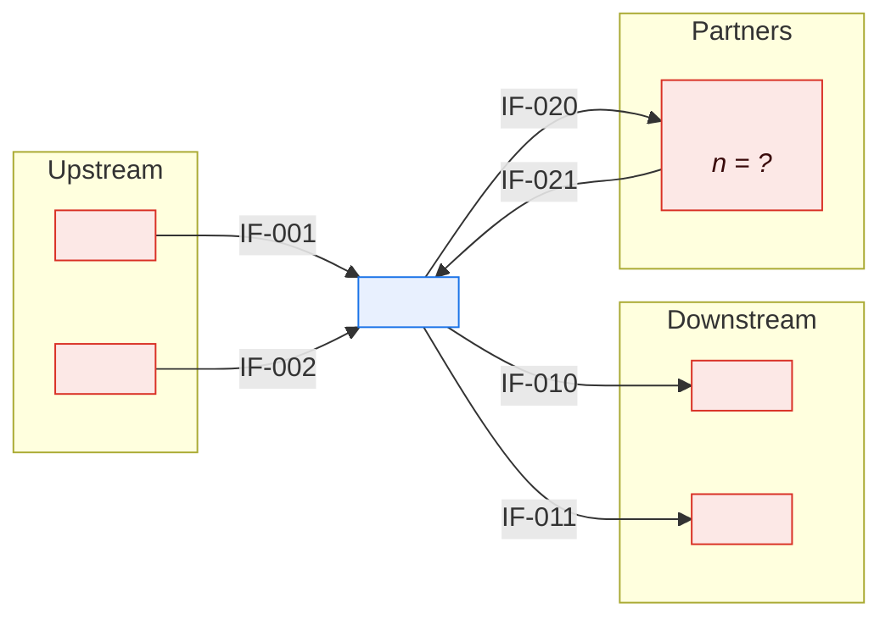

# \<System Name\> — Interface Catalog

> **Purpose.** The register of every boundary crossing. One row per interface, complete
> before it is deep. A complete catalog of thin rows beats a partial catalog of thick ones:
> you cannot assess the impact of a change against interfaces you do not know exist.
>
> **Completeness expectation.** The real count will be 2–4× what anyone estimates. The
> overage is concentrated in file transfers created for one project and never
> decommissioned, and in manual processes that nobody thinks of as interfaces.

---

## 1. Summary

| | Count |
| --- | --- |
| Total live interfaces | |
| Inbound / Outbound / Bidirectional | |
| Synchronous / Asynchronous / Batch file | |
| External counterparties | |
| Tier 1 (critical) | |
| With a current ICD | |
| With reconciliation controls | |
| With monitoring | |
| **With no identified owner** | |
| Deprecated but still live | |
| Discovered but not yet assessed | |

---

## 2. Catalog

| IF ID | Name | Dir | Counterparty | Type | Pattern | Transport | Format | Frequency | Volume/day | Crit | Owner (ours) | Owner (theirs) | ICD | Recon | Mon | Status |
| --- | --- | --- | --- | --- | --- | --- | --- | --- | --- | --- | --- | --- | --- | --- | --- | --- |
| IF-001 | | In/Out/Bi | | Internal / External | Sync / Async / Batch / Event | | | | | 1/2/3 | | | ✅/❌ | ✅/❌ | ✅/❌ | Live / Deprecated / Planned |

**Criticality**

| Tier | Definition |
| --- | --- |
| 1 | Business process stops within hours; external or financial impact |
| 2 | Degraded operation; workaround exists for up to a day |
| 3 | Tolerable interruption for days |

---

## 3. By counterparty

| Counterparty | Type | Interfaces | Criticality | Relationship owner | Contract | Notice period | Dependency register |
| --- | --- | --- | --- | --- | --- | --- | --- |
| | | | | | | | |

---

## 4. By domain

| Domain | Inbound | Outbound | Tier 1 | Notes |
| --- | --- | --- | --- | --- |
| | | | | |

---

## 5. Data crossing the boundary

| IF ID | Entities | CDEs | Classification | Personal data | Volume | Retention at counterparty |
| --- | --- | --- | --- | --- | --- | --- |
| | | | | ✅/❌ | | |

> This table is what makes a privacy or classification review tractable. Every external
> interface carrying personal data needs a lawful basis and a retention commitment from the
> counterparty.

---

## 6. Timing map

```mermaid
gantt
    dateFormat HH:mm
    axisFormat %H:%M
    title Daily interface timing (UTC)
    section Inbound
    IF-001 <name>   :i1, 21:00, 30m
    IF-002 <name>   :i2, 22:00, 15m
    section Processing
    <core batch>    :p1, after i2, 120m
    section Outbound
    IF-020 <name>   :o1, after p1, 20m
    IF-021 <name>   :o2, after o1, 15m
```

| IF ID | Window | Cutoff | Depends on | Blocks | Slack |
| --- | --- | --- | --- | --- | --- |
| | | | | | |

---

## 7. Manual interfaces ⚠️

> Interfaces that involve a human step: an email attachment, a portal upload, a re-keyed
> report. They are real interfaces with real SLAs and real failure modes, and they are
> absent from every automated discovery method.

| ID | Description | Counterparty | Frequency | Who performs it | Time taken | Failure mode | Automation candidate |
| --- | --- | --- | --- | --- | --- | --- | --- |
| | | | | | | | |

---

## 8. Undocumented and discovered interfaces

> Found during discovery but not yet assessed. This list should trend to zero.

| Discovered | How found | Description | Counterparty | Active | Owner (to assign) | Action |
| --- | --- | --- | --- | --- | --- | --- |
| | *(firewall rule, SFTP account, scheduler entry, MQ definition, gateway log, invoice)* | | | | | |

**Discovery sources checked**

| Source | Checked | Date | Interfaces found | Notes |
| --- | --- | --- | --- | --- |
| Firewall rules / network flows | | | | |
| SFTP / MFT account list | | | | |
| Scheduler job definitions | | | | |
| Queue / topic definitions | | | | |
| API gateway logs | | | | |
| Database links / replication | | | | |
| ETL job catalog | | | | |
| Vendor contracts and invoices | | | | |
| Service account inventory | | | | |
| SME interviews | | | | |

---

## 9. Deprecated and retired

| IF ID | Name | Counterparty | Deprecated | Retire by | Still in use | Consumers to migrate | Blocker |
| --- | --- | --- | --- | --- | --- | --- | --- |
| | | | | | | | |

---

## 10. Gaps

| IF ID | Gap | Risk | Remediation | Owner | Target |
| --- | --- | --- | --- | --- | --- |
| | No ICD / No owner / No monitoring / No reconciliation / No error handling / Untested | | | | |

**Gap summary**

| Gap | Tier 1 | Tier 2 | Tier 3 | Total |
| --- | --- | --- | --- | --- |
| No ICD | | | | |
| No identified owner | | | | |
| No monitoring | | | | |
| No reconciliation | | | | |
| Not in scope of DR plan | | | | |

> Prioritise by tier. A tier-1 interface with no owner and no monitoring is the highest
> operational risk in the catalog, and this table makes it visible in one place.

---

## Change log

| Version | Date | Author | Change |
| --- | --- | --- | --- |
| 0.1.0 | | | Initial draft |
