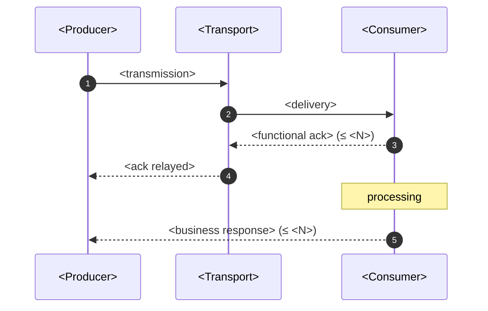
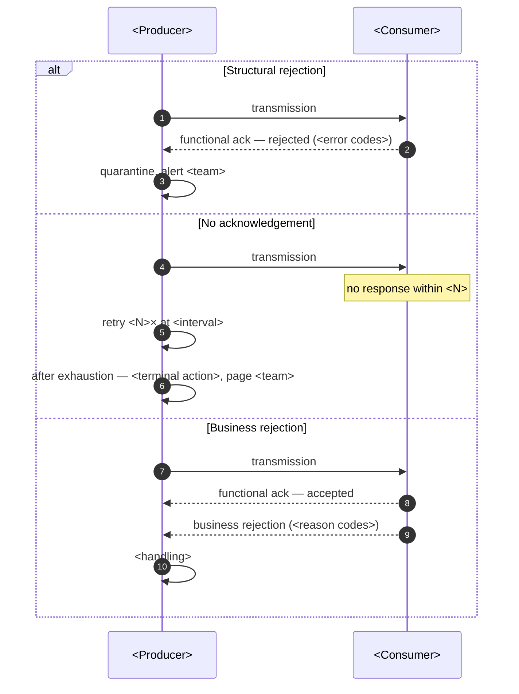

# \<Interface Name\> — Interface Control Document

> **Purpose.** The definitive contract for one interface. Both sides build against this
> document; disagreements are resolved against it.
>
> **Two versions, not one.** The front matter `version` is the **document** version. The
> **interface** version in §1 has its own lifecycle. Conflating them makes partners believe
> the interface changed when only the prose did.
>
> **Rule of two.** An ICD needs a named accountable owner on each side. An interface
> documented by one party only is a description, not a contract.

---

## 1. Identification

| | |
| --- | --- |
| Interface ID | IF-… |
| Interface name | |
| **Interface version** | |
| Status | Draft / Certifying / Live / Deprecated / Retired |
| Direction | Outbound / Inbound / Bidirectional |
| Pattern | Request-response / Message / File / EDI / Event |
| Criticality | Tier 1 / 2 / 3 |
| Live since | |
| Sunset date | |

### Parties

| | Producer | Consumer |
| --- | --- | --- |
| Organisation | | |
| System | | |
| Accountable role | | |
| Technical contact | | |
| Support contact | | |
| Escalation | | |
| Change approval | | |

### Business purpose

*(What business process this interface serves, and what stops if it fails.)*

| | |
| --- | --- |
| Business process | |
| Impact if unavailable for 1 hour | |
| Impact if unavailable for 1 day | |
| Impact of bad data transmitted | |

---

## 2. Transport

| | |
| --- | --- |
| Protocol | |
| Endpoint / location | *(logical name; environment-specific values in the deployment document)* |
| Authentication | |
| Authorisation | |
| Encryption in transit | |
| Encryption at rest | |
| IP allowlisting | |
| Certificate | *(subject, issuer, expiry, renewal owner)* |
| Network path | |
| Firewall rules | |

**Environments**

| Environment | Endpoint | Credentials | Available | Notes |
| --- | --- | --- | --- | --- |
| Production | | | | |
| Pre-production | | | | |
| Test / certification | | | | |

---

## 3. Timing and volume

| | |
| --- | --- |
| Frequency | |
| Schedule | *(with timezone and DST behaviour)* |
| Trigger | |
| Cutoff time | |
| Cutoff driver | |
| Processing window | |

| Volume | Records | Size | Notes |
| --- | --- | --- | --- |
| Typical | | | |
| Peak | | | |
| Peak driver | | | *(month-end, model-year changeover, promotion period)* |
| Maximum supported | | | |
| Zero-volume expected? | | | *(and how a legitimate empty transmission is distinguished from a failure)* |

**Calendar**

| Aspect | Detail |
| --- | --- |
| Business days | |
| Holidays | *(whose calendar — yours or the counterparty's?)* |
| Exceptions | |

---

## 4. Payload

### 4.1 Structure

| | |
| --- | --- |
| Format | *(fixed-width / delimited / XML / JSON / X12 / EDIFACT)* |
| Character encoding | |
| Line terminator | |
| Decimal separator | |
| Thousands separator | |
| Date format | |
| Timestamp format and timezone | |
| Negative number representation | *(leading minus, trailing minus, signed overpunch)* |
| Padding | *(left/right, with what character)* |
| Maximum size | |
| Compression | |

### 4.2 Record structure

```
<Layout diagram or schema.>
```

| Record type | Occurrence | Purpose |
| --- | --- | --- |
| Header | 1 | |
| Detail | 1..N | |
| Trailer | 1 | Control totals |

### 4.3 Field specification

> Every field: name, position/path, type, length, optionality, valid values, and an example.
> A field without an example is a field two teams will implement differently.

**Header**

| # | Field | Pos | Type | Len | Req | Valid values | Example | Notes |
| --- | --- | --- | --- | --- | --- | --- | --- | --- |
| 1 | | | | | M/O/C | | | |

**Detail**

| # | Field | Pos | Type | Len | Req | Valid values | Example | Notes |
| --- | --- | --- | --- | --- | --- | --- | --- | --- |
| 1 | | | | | | | | |

**Trailer**

| # | Field | Pos | Type | Len | Req | Valid values | Example | Notes |
| --- | --- | --- | --- | --- | --- | --- | --- | --- |
| 1 | Record count | | | | M | | | Detail records only |
| 2 | Control total | | | | M | | | Sum of `<field>` |

**Optionality**

| Code | Meaning |
| --- | --- |
| M | Mandatory — always present with a value |
| O | Optional — may be absent or empty |
| C | Conditional — required when a stated condition holds; state the condition |

**Null, empty, and absent**

| State | Representation | Meaning |
| --- | --- | --- |
| Not applicable | | |
| Not known | | |
| Zero | | |
| Absent | | |

> Three distinct states routinely collapsed into one. In a fixed-width file, a field of
> spaces might mean any of them. Define each explicitly — it is the commonest source of
> partner-integration defects.

### 4.4 Semantics

> What a schema cannot say. Fill this in for every field whose meaning is not obvious from
> its name.

| Field | Semantic definition |
| --- | --- |
| | *(e.g. `ship_dt` is the date the carrier took possession at the origin warehouse, in that warehouse's local date, not the date the label was created)* |

### 4.5 Code sets

| Field | Code set | Source | Effective-dated | Behaviour on unknown value | Registry |
| --- | --- | --- | --- | --- | --- |
| | | | | Reject / Default / Pass through | |

### 4.6 Keys and identity

| Aspect | Detail |
| --- | --- |
| Business key | |
| Uniqueness scope | |
| Idempotency key | |
| Correlation to a prior message | |
| Sequence number | *(range, reset policy, gap handling)* |

### 4.7 Example payload

```
<Complete, valid example with realistic synthetic values.>
```

**Edge-case examples**

| Case | Example |
| --- | --- |
| Minimum populated record | |
| Maximum length values | |
| Special characters | |
| Zero/negative amounts | |
| Empty transmission (header + trailer only) | |

---

## 5. Processing semantics

| Aspect | Behaviour |
| --- | --- |
| Delivery guarantee | At-most-once / At-least-once / Exactly-once-with-idempotency |
| Ordering | Guaranteed / Per key / None |
| Duplicate handling | |
| Out-of-order handling | |
| Partial processing | *(all-or-nothing per transmission, or per record?)* |
| Replay supported | |
| Replay window | |
| Late arrival handling | |
| Acknowledgement | *(what, when, and whether it means "received" or "accepted")* |

**Acknowledgement semantics**

| Ack type | Means | Timing | Absence means |
| --- | --- | --- | --- |
| Transport ack | Bytes received | | |
| Functional ack | Parsed and structurally valid | | |
| Business ack | Accepted for processing | | |

> These are three different statements, and treating a transport ack as a business
> acceptance is the classic cause of "we sent it, they say they never got it" disputes.
> State which acks exist and what each does and does not promise.

---

## 6. Interaction



**Error interactions**



---

## 7. Validation and errors

### 7.1 Validation

| Level | Check | On failure | Scope |
| --- | --- | --- | --- |
| Transport | | | Whole transmission |
| Structural | | | Whole transmission |
| Field-level | | | Record |
| Referential | | | Record |
| Business rule | | | Record |

### 7.2 Error catalog

| Code | Severity | Meaning | Cause | Consumer action | Producer action | Retryable |
| --- | --- | --- | --- | --- | --- | --- |
| | Reject transmission / Reject record / Warning | | | | | |

### 7.3 Retry

| Aspect | Policy |
| --- | --- |
| Retryable conditions | |
| Non-retryable conditions | |
| Attempts | |
| Interval / backoff | |
| Total budget | |
| Terminal action | |
| Notification on exhaustion | |
| Manual resubmission procedure | |

---

## 8. Reconciliation

| | |
| --- | --- |
| Control totals in the payload | |
| Independent reconciliation | |
| Frequency | |
| Tolerance | |
| Break investigation owner | |
| Break procedure | |
| Evidence retained | |

**Reconciliation query**

```sql
-- The comparison that proves nothing was lost between the two sides.
```

> Without reconciliation, an interface can silently drop a small percentage of records
> indefinitely. The failure surfaces months later as a partner dispute, by which time the
> evidence has aged out.

---

## 9. Service levels

| Metric | Commitment | Measured by | Measurement point | Reporting |
| --- | --- | --- | --- | --- |
| Availability | | | | |
| Transmission by | | | | |
| Acknowledgement within | | | | |
| Processing completed within | | | | |
| Error rate | | | | |
| Support response | | | | |

**Escalation**

| Level | Trigger | Contact | Response |
| --- | --- | --- | --- |
| 1 | | | |
| 2 | | | |
| 3 | | | |

---

## 10. Monitoring

| Signal | Threshold | Alert to | Runbook |
| --- | --- | --- | --- |
| Transmission failure | | | |
| **Expected transmission not received** | | | |
| Volume anomaly (high/low) | | | |
| Error rate | | | |
| Acknowledgement overdue | | | |
| Reconciliation break | | | |
| Certificate expiring | | | |

> The second row is the one most often missing. Nothing arriving generates no error — the
> interface simply goes quiet, and the failure surfaces when a downstream process produces
> an incomplete result. Every scheduled inbound interface needs an expectation with a
> deadline.

---

## 11. Versioning and change

| Aspect | Policy |
| --- | --- |
| Versioning scheme | |
| Version communicated via | |
| Backwards compatibility | |
| Parallel version support | |
| Notice — non-breaking | |
| Notice — breaking | |
| Deprecation period | |
| Testing required before a change | |
| Approval required | Both parties |

**Version history**

| Interface version | Effective | Change | Breaking | Notice given |
| --- | --- | --- | --- | --- |
| | | | | |

---

## 12. Testing and certification

| Test | Scenario | Expected | Required for certification |
| --- | --- | --- | --- |
| T-01 | Valid transmission, typical volume | | ✅ |
| T-02 | Maximum volume | | ✅ |
| T-03 | Empty transmission | | ✅ |
| T-04 | Structurally invalid | | ✅ |
| T-05 | Invalid field values | | ✅ |
| T-06 | Duplicate transmission | | ✅ |
| T-07 | Out-of-sequence | | |
| T-08 | Special characters / maximum lengths | | ✅ |
| T-09 | Acknowledgement timeout | | ✅ |
| T-10 | Reconciliation break | | ✅ |

**Certification record**

| Environment | Date | Tests passed | Signed — producer | Signed — consumer |
| --- | --- | --- | --- | --- |
| | | | | |

---

## 13. Operations

| Aspect | Detail |
| --- | --- |
| Runbook | |
| Manual resubmission | |
| Data correction procedure | |
| Planned outage notification | |
| Emergency contact — us | |
| Emergency contact — counterparty | |
| Support hours (both sides) | |

---

## 14. Open items

| ID | Item | Owner | Target |
| --- | --- | --- | --- |
| | | | |

---

## Change log

| Doc version | Date | Author | Change | Interface version |
| --- | --- | --- | --- | --- |
| 0.1.0 | | | Initial draft | |
